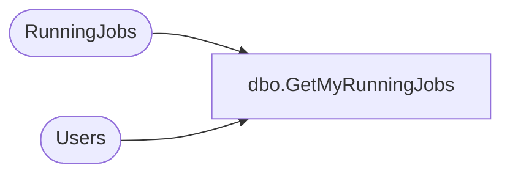

# dbo.GetMyRunningJobs

**Database:** ReportServerWebIM  
**Server:** bedrockdb01  

## Architecture Diagram



## Table Dependencies

| Referenced Table |
|---|
| RunningJobs |
| Users |

## Stored Procedure Code

```sql
CREATE PROCEDURE [dbo].[GetMyRunningJobs]
@ComputerName as nvarchar(32),
@JobType as smallint
AS
SELECT JobID, StartDate, ComputerName, RequestName, RequestPath, SUSER_SNAME(Users.[Sid]), Users.[UserName], Description, 
    Timeout, JobAction, JobType, JobStatus, Users.[AuthType]
FROM RunningJobs INNER JOIN Users 
ON RunningJobs.UserID = Users.UserID
WHERE ComputerName = @ComputerName
AND JobType = @JobType
```

