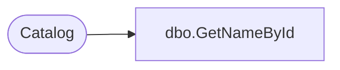

# dbo.GetNameById

**Database:** ReportServerWebIM  
**Server:** bedrockdb01  

## Architecture Diagram



## Table Dependencies

| Referenced Table |
|---|
| Catalog |

## Stored Procedure Code

```sql
CREATE PROCEDURE [dbo].[GetNameById]
@ItemID uniqueidentifier
AS
SELECT Path
FROM Catalog
WHERE ItemID = @ItemID
```

