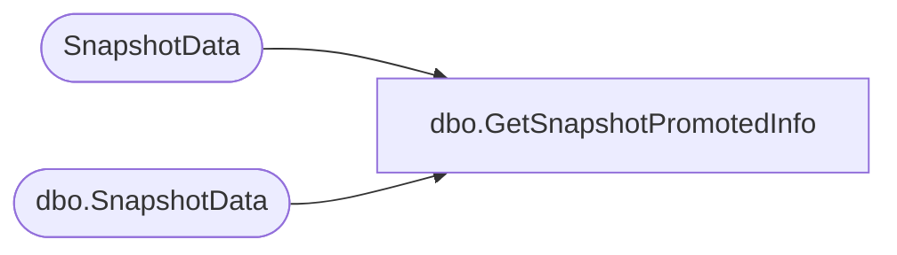

# dbo.GetSnapshotPromotedInfo

**Database:** ReportServerWebIM  
**Server:** bedrockdb01  

## Architecture Diagram



## Table Dependencies

| Referenced Table |
|---|
| SnapshotData |
| dbo.SnapshotData |

## Stored Procedure Code

```sql
CREATE PROCEDURE [dbo].[GetSnapshotPromotedInfo]
@SnapshotDataID as uniqueidentifier,
@IsPermanentSnapshot as bit
AS

-- We don't want to hold shared locks if even if we are in a repeatable
-- read transaction, so explicitly use READCOMMITTED lock hint
IF @IsPermanentSnapshot = 1
BEGIN
   SELECT PageCount, HasDocMap, PaginationMode, ProcessingFlags
   FROM SnapshotData WITH (READCOMMITTED)
   WHERE SnapshotDataID = @SnapshotDataID
END ELSE BEGIN
   SELECT PageCount, HasDocMap, PaginationMode, ProcessingFlags
   FROM [ReportServerWebIMTempDB].dbo.SnapshotData WITH (READCOMMITTED)
   WHERE SnapshotDataID = @SnapshotDataID
END
```

