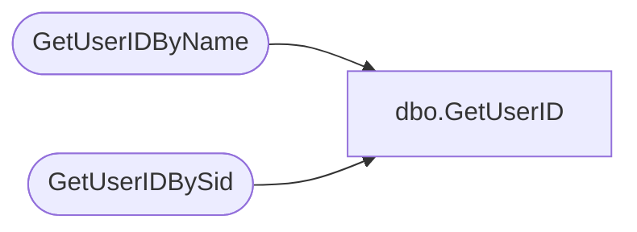

# dbo.GetUserID

**Database:** ReportServerWebIM  
**Server:** bedrockdb01  

## Architecture Diagram



## Table Dependencies

| Referenced Table |
|---|
| GetUserIDByName |
| GetUserIDBySid |

## Stored Procedure Code

```sql
-- looks up any user name, if not it creates a regular user - uses Sid
CREATE PROCEDURE [dbo].[GetUserID]
@UserSid varbinary(85) = NULL,
@UserName nvarchar(260),
@AuthType int,
@UserID uniqueidentifier OUTPUT
AS
    IF @AuthType = 1 -- Windows
    BEGIN
        EXEC GetUserIDBySid @UserSid, @UserName, @AuthType, @UserID OUTPUT
    END
    ELSE
    BEGIN
        EXEC GetUserIDByName @UserName, @AuthType, @UserID OUTPUT
    END
```

