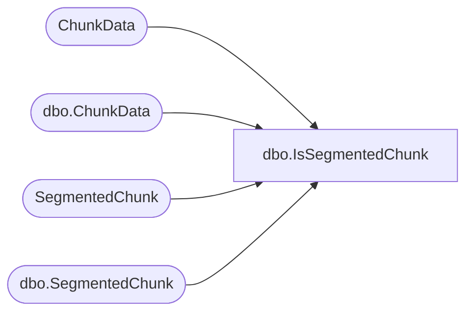

# dbo.IsSegmentedChunk

**Database:** ReportServerWebIM  
**Server:** bedrockdb01  

## Architecture Diagram



## Table Dependencies

| Referenced Table |
|---|
| ChunkData |
| dbo.ChunkData |
| SegmentedChunk |
| dbo.SegmentedChunk |

## Stored Procedure Code

```sql
create proc [dbo].[IsSegmentedChunk]
	@SnapshotId			uniqueidentifier,
	@IsPermanent		bit, 
	@ChunkName			nvarchar(260), 
	@ChunkType			int, 
	@IsSegmented		bit out
as begin
	-- segmented chunks are read w/nolock
	-- we don't really care about locking in this scenario
	-- we just need to get some metadata which never changes (if it is segmented or not)
	if (@IsPermanent = 1) begin
		select top 1 @IsSegmented = IsSegmented
		from 
		(
			select convert(bit, 0)
			from [ChunkData] c
			where c.ChunkName = @ChunkName and c.ChunkType = @ChunkType and c.SnapshotDataId = @SnapshotId
			union all
			select convert(bit, 1)
			from [SegmentedChunk] c WITH(NOLOCK)			
			where c.ChunkName = @ChunkName and c.ChunkType = @ChunkType and c.SnapshotDataId = @SnapshotId
		) A(IsSegmented)
	end
	else begin
		select top 1 @IsSegmented = IsSegmented
		from 
		(
			select convert(bit, 0)
			from [ReportServerWebIMTempDB].dbo.[ChunkData] c
			where c.ChunkName = @ChunkName and c.ChunkType = @ChunkType and c.SnapshotDataId = @SnapshotId
			union all
			select convert(bit, 1)
			from [ReportServerWebIMTempDB].dbo.[SegmentedChunk] c WITH(NOLOCK)
			where c.ChunkName = @ChunkName and c.ChunkType = @ChunkType and c.SnapshotDataId = @SnapshotId
		) A(IsSegmented)
	end
end
```

