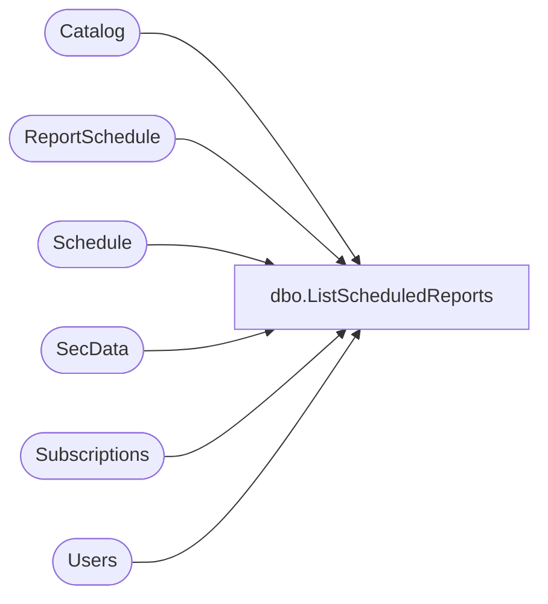

# dbo.ListScheduledReports

**Database:** ReportServerWebIM  
**Server:** bedrockdb01  

## Architecture Diagram



## Table Dependencies

| Referenced Table |
|---|
| Catalog |
| ReportSchedule |
| Schedule |
| SecData |
| Subscriptions |
| Users |

## Stored Procedure Code

```sql
CREATE PROCEDURE [dbo].[ListScheduledReports]
@ScheduleID uniqueidentifier
AS
-- List all reports for a schedule
select 
        RS.[ReportAction],
        RS.[ScheduleID],
        RS.[ReportID],
        RS.[SubscriptionID],
        C.[Path],
        C.[Type],
        C.[Name],
        C.[Description],
        C.[ModifiedDate],
        SUSER_SNAME(U.[Sid]),
        U.[UserName],
        DATALENGTH( C.Content ),
        C.ExecutionTime,
        S.[Type],
        SD.[NtSecDescPrimary],
        SU.[ReportZone]

from
    [ReportSchedule] RS Inner join [Catalog] C on RS.[ReportID] = C.[ItemID]
    Inner join [Schedule] S on RS.[ScheduleID] = S.[ScheduleID]
    Inner join [Users] U on C.[ModifiedByID] = U.UserID
    left outer join [SecData] SD on SD.[PolicyID] = C.[PolicyID] AND SD.AuthType = U.AuthType    
    left outer join [Subscriptions] SU on SU.[SubscriptionID] = RS.[SubscriptionID]
where
    RS.[ScheduleID] = @ScheduleID
```

