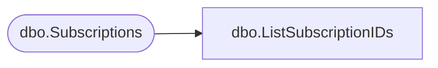

# dbo.ListSubscriptionIDs

**Database:** ReportServerWebIM  
**Server:** bedrockdb01  

## Architecture Diagram



## Table Dependencies

| Referenced Table |
|---|
| dbo.Subscriptions |

## Stored Procedure Code

```sql
CREATE PROCEDURE [dbo].[ListSubscriptionIDs]
AS

SELECT [SubscriptionID]
FROM [dbo].[Subscriptions] WITH (XLOCK, TABLOCK)
```

