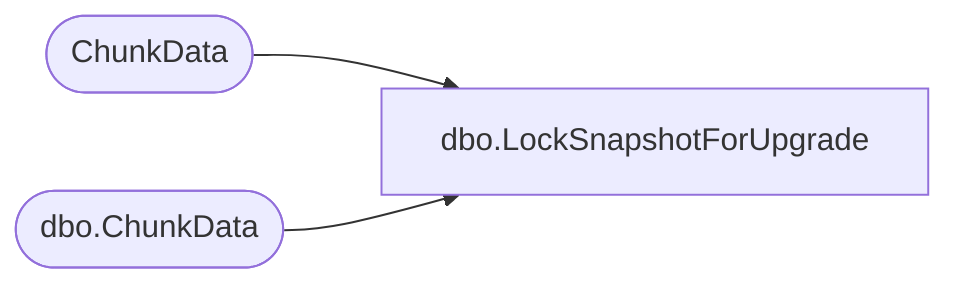

# dbo.LockSnapshotForUpgrade

**Database:** ReportServerWebIM  
**Server:** bedrockdb01  

## Architecture Diagram



## Table Dependencies

| Referenced Table |
|---|
| ChunkData |
| dbo.ChunkData |

## Stored Procedure Code

```sql
CREATE PROCEDURE [dbo].[LockSnapshotForUpgrade]
@SnapshotDataID as uniqueidentifier,
@IsPermanentSnapshot as bit
AS
if @IsPermanentSnapshot = 1
BEGIN
   SELECT ChunkName from ChunkData with (XLOCK)
   WHERE SnapshotDataID = @SnapshotDataID
END ELSE BEGIN
   SELECT ChunkName from [ReportServerWebIMTempDB].dbo.ChunkData with (XLOCK)
   WHERE SnapshotDataID = @SnapshotDataID
END
```

