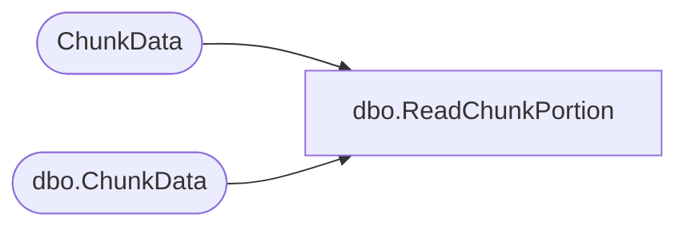

# dbo.ReadChunkPortion

**Database:** ReportServerWebIM  
**Server:** bedrockdb01  

## Architecture Diagram



## Table Dependencies

| Referenced Table |
|---|
| ChunkData |
| dbo.ChunkData |

## Stored Procedure Code

```sql
CREATE PROCEDURE [dbo].[ReadChunkPortion]
@ChunkPointer binary(16),
@IsPermanentSnapshot bit,
@DataIndex int,
@Length int
AS

IF @IsPermanentSnapshot != 0 BEGIN
    READTEXT ChunkData.Content @ChunkPointer @DataIndex @Length
END ELSE BEGIN
    READTEXT [ReportServerWebIMTempDB].dbo.ChunkData.Content @ChunkPointer @DataIndex @Length
END
```

