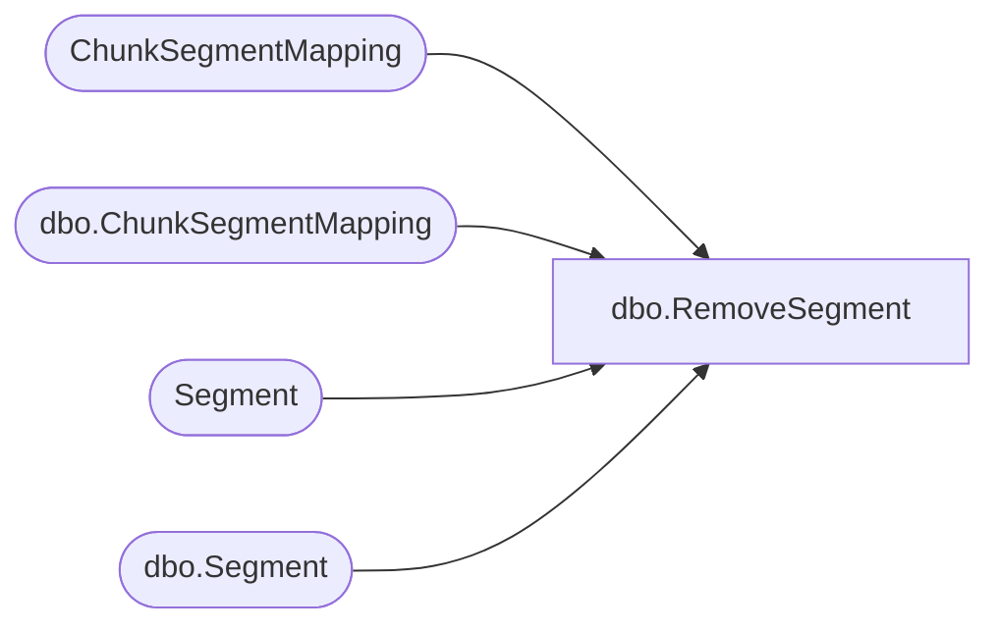

# dbo.RemoveSegment

**Database:** ReportServerWebIM  
**Server:** bedrockdb01  

## Architecture Diagram



## Table Dependencies

| Referenced Table |
|---|
| ChunkSegmentMapping |
| dbo.ChunkSegmentMapping |
| Segment |
| dbo.Segment |

## Stored Procedure Code

```sql
create proc [dbo].[RemoveSegment]
	@DeleteCountPermanent int, 
	@DeleteCountTemp int
as
begin
	SET DEADLOCK_PRIORITY LOW
	
	-- Locking:
	-- Similar idea as in RemovedSegmentedMapping.  Readpast
	-- any Segments which are currently locked and run the 
	-- inner scan with nolock.	
	declare @numDeleted int;
	declare @toDeleteMapping table (
		SegmentId uniqueidentifier );
	
	insert into @toDeleteMapping (SegmentId)	
	select top (@DeleteCountPermanent) SegmentId 
	from Segment with (readpast)	
	where not exists (
		select 1 from ChunkSegmentMapping CSM with (nolock)
		where CSM.SegmentId = Segment.SegmentId
		) ;
		
	delete from Segment with (readpast)
	where Segment.SegmentId in (
		select td.SegmentId from @toDeleteMapping td
		where not exists (
			select 1 from ChunkSegmentMapping CSM
			where CSM.SegmentId = td.SegmentId ));
			
	select @numDeleted = @@rowcount ;
	
	declare @toDeleteTempSegment table (
		SegmentId uniqueidentifier );
	
	insert into @toDeleteTempSegment (SegmentId)		
	select top (@DeleteCountTemp) SegmentId
	from [ReportServerWebIMTempDB].dbo.Segment with (readpast)	
	where not exists (
		select 1 from [ReportServerWebIMTempDB].dbo.ChunkSegmentMapping CSM with (nolock)
		where CSM.SegmentId = [ReportServerWebIMTempDB].dbo.Segment.SegmentId
		) ;
		
	delete from [ReportServerWebIMTempDB].dbo.Segment with (readpast)
	where [ReportServerWebIMTempDB].dbo.Segment.SegmentId in (
		select td.SegmentId from @toDeleteTempSegment td 
		where not exists (
			select 1 from [ReportServerWebIMTempDB].dbo.ChunkSegmentMapping CSM
			where CSM.SegmentId = td.SegmentId
			)) ;
	select @numDeleted = @numDeleted + @@rowcount ;
	
	select @numDeleted;
end
```

