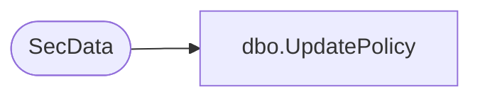

# dbo.UpdatePolicy

**Database:** ReportServerWebIM  
**Server:** bedrockdb01  

## Architecture Diagram



## Table Dependencies

| Referenced Table |
|---|
| SecData |

## Stored Procedure Code

```sql
CREATE PROCEDURE [dbo].[UpdatePolicy]
@PolicyID as uniqueidentifier,
@PrimarySecDesc as image,
@SecondarySecDesc as ntext = NULL,
@AuthType int
AS
UPDATE SecData SET NtSecDescPrimary = @PrimarySecDesc,
NtSecDescSecondary = @SecondarySecDesc 
WHERE SecData.PolicyID = @PolicyID
AND SecData.AuthType = @AuthType
```

