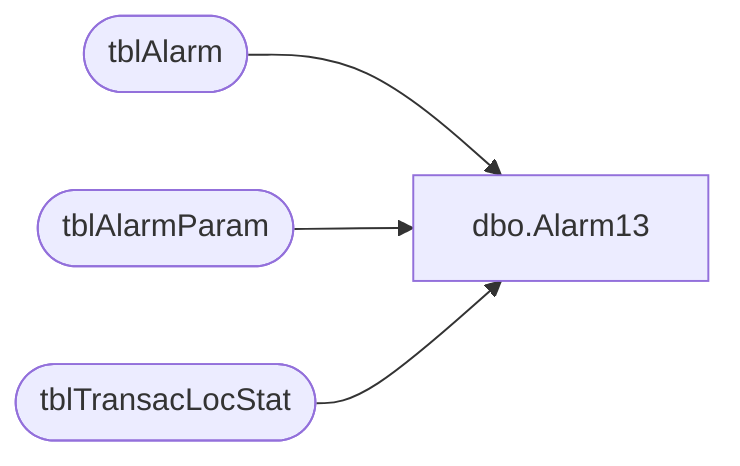

# dbo.Alarm13

**Database:** Tpview  
**Server:** bedrockdb01  

## Architecture Diagram



## Table Dependencies

| Referenced Table |
|---|
| tblAlarm |
| tblAlarmParam |
| tblTransacLocStat |

## Stored Procedure Code

```sql
create proc Alarm13 -- Excessive Host Response Time.
@CreditService 	VARCHAR(2),
@AvgType		INT
AS
DECLARE @HourlyAvg 		INT,
		@DailyAvg		INT,
		@WeeklyAvg		INT,
		@StoreNumber	INT,
		@HourlyLimit	INT,
		@DailyLimit		INT,
		@WeeklyLimit	INT,
		@EventDesc		VARCHAR,
		@EmailAddress	VARCHAR,
		@Active			INT
--looking for alarms per store
SELECT 	@HourlyAvg = HourlyRespAvg,
		@DailyAvg	= DailyRespAvg,
		@WeeklyAvg = WeeklyRespAvg
FROM tblTransacLocStat
WHERE Service = @CreditService
SELECT @Active = CAST(ParamValue AS INT) FROM tblAlarmParam WHERE AlarmRuleNo = 13 AND ParamName = 'ACTIVE' 
IF(@Active = 1)
BEGIN
	SELECT @EmailAddress = ParamValue FROM tblAlarmParam WHERE AlarmRuleNo = 13 AND ParamName = 'EMAIL' 
	-- Checking Alarm for Hourly avg for a specfic Average.
	IF(@AvgType = 1)
	BEGIN
		SELECT @HourlyLimit = ParamValue FROM tblAlarmParam WHERE AlarmRuleNo = 13 AND ParamName = 'THRESHOLDHOUR' 
		-- Check hourly totals against the hourly limit
		IF(@HourlyAvg>=@HourlyLimit)
		BEGIN
			SET @EventDesc = 'Host average response time exceeded '+STR(@HourlyLimit)+' in the last hour'
			INSERT INTO tblAlarm 
			(AlarmTime,Description,Severity,AckStatus,AckTime,AckPersonnelID,EMailStatus,EMailAttempts,EMailAddress,EMailTime,DirtyFlag)
			VALUES (GETDATE(),@EventDesc,0,0,'1900-01-01 12:01:00 AM',0,3,0,@EmailAddress,'1900-01-01 12:01:00 AM',0)
		END
	END
	--Checking Daily Limit
	IF(@AvgType = 2)
	BEGIN
		SELECT @DailyLimit = ParamValue FROM tblAlarmParam WHERE AlarmRuleNo = 13 AND ParamName = 'THRESHOLDDAY'
		IF(@DailyAvg>=@DailyLimit)
		BEGIN
			SET @EventDesc = 'Host average response time exceeded '+STR(@DailyLimit)+' in the last day'
			INSERT INTO tblAlarm 
			(AlarmTime,Description,Severity,AckStatus,AckTime,AckPersonnelID,EMailStatus,EMailAttempts,EMailAddress,EMailTime,DirtyFlag)
			VALUES (GETDATE(),@EventDesc,0,0,'1900-01-01 12:01:00 AM',0,3,0,@EmailAddress,'1900-01-01 12:01:00 AM',0)
		END
	END
	--Checking Weekly Limit
	IF(@AvgType = 3)
	BEGIN
		SELECT @WeeklyLimit = ParamValue FROM tblAlarmParam WHERE AlarmRuleNo = 13 AND ParamName = 'THRESHOLDWEEK'
		IF(@WeeklyAvg>=@WeeklyLimit)
		BEGIN
			SET @EventDesc = 'Host average response time exceeded '+STR(@WeeklyLimit)+' in the last Week'
			INSERT INTO tblAlarm 
			(AlarmTime,Description,Severity,AckStatus,AckTime,AckPersonnelID,EMailStatus,EMailAttempts,EMailAddress,EMailTime,DirtyFlag)
			VALUES(GETDATE(),@EventDesc,0,0,'1900-01-01 12:01:00 AM',0,3,0,@EmailAddress,'1900-01-01 12:01:00 AM',0)
		END
	END
END
```

