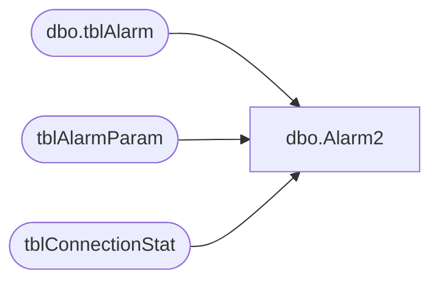

# dbo.Alarm2

**Database:** Tpview  
**Server:** bedrockdb01  

## Architecture Diagram



## Table Dependencies

| Referenced Table |
|---|
| dbo.tblAlarm |
| tblAlarmParam |
| tblConnectionStat |

## Stored Procedure Code

```sql
create proc Alarm2 -- Excessive disconnection per store.
		@StoreNumber		INT,
		@LastEventTime		DATETIME,
		@TimeFrame			INT
AS
DECLARE @TotalDisconnection INT,
		@ThreshHold			INT,
		@AlarmMsg			VARCHAR(260),
		@Active				INT,
		@Date				VARCHAR(20),
		@Interval			VARCHAR(20),
		@SendToEmail		VARCHAR(30)
		--Getting the index for the first service configured in the AlarmParam Table.
IF(EXISTS(SELECT ParamValue FROM	tblAlarmParam 
WHERE AlarmRuleNo = 2 AND ParamName = 'ACTIVE'))
BEGIN
	Set @TotalDisconnection = 0
	Set @TimeFrame = 0
	SELECT @Active = CAST(ParamValue AS INT) FROM	tblAlarmParam WHERE AlarmRuleNo = 2 AND ParamName = 'ACTIVE'
IF(@Active = 1)
BEGIN
BEGIN
	-- If checking for hourly
	IF(@TimeFrame=1)
	BEGIN
		Select @TotalDisconnection = HourlyNbrDisconnect 
		FROM tblConnectionStat 
		WHERE RemoteNumber = @StoreNumber AND ConnectType =1	
		--Getting the index for the first service configured in the AlarmParam Table.
		SELECT @ThreshHold = CAST(ParamValue AS INT) FROM	tblAlarmParam 
		WHERE AlarmRuleNo = 2 AND ParamName = 'THRESHOLDHOUR'
		
		SET @Date = LTRIM(STR(DATEPART(yyyy,@LastEventTime)))+'-'+
					LTRIM(STR(DATEPART(mm,@LastEventTime)))+'-'+
					LTRIM(STR(DATEPART(dd,@LastEventTime)))+' '+
					LTRIM(STR(DATEPART(hh,@LastEventTime)))+':59:59'
		SET @Interval = 'Hour'
	END
	-- If checking for hourly
	IF(@TimeFrame=2)
	BEGIN
		Select @TotalDisconnection = DailyNbrDisconnect 
		FROM tblConnectionStat 
		WHERE RemoteNumber = @StoreNumber AND ConnectType =1
		SELECT @ThreshHold = CAST(ParamValue AS INT) FROM	tblAlarmParam 
		WHERE AlarmRuleNo = 2 AND ParamName = 'THRESHOLDDAY'
		SET @Date = (LTRIM(STR(DATEPART(yyyy,@LastEventTime)))+'-'+
					LTRIM(STR(DATEPART(mm,@LastEventTime)))+'-'+
					LTRIM(STR(DATEPART(dd,@LastEventTime)))+' 11:59:59')
		SET @Interval = 'Day'
	END
	-- If checking for Weekly
	IF(@TimeFrame=3)
	BEGIN
		Select @TotalDisconnection = WeeklyNbrDisconnect 
		FROM tblConnectionStat 
		WHERE RemoteNumber = @StoreNumber AND ConnectType =1
		SELECT @ThreshHold = CAST(ParamValue AS INT) FROM	tblAlarmParam 
		WHERE AlarmRuleNo = 2 AND ParamName = 'THRESHOLDWEEK'
		SET @Date = LTRIM(STR(DATEPART(yyyy,@LastEventTime)))+'-'+
					LTRIM(STR(DATEPART(mm,@LastEventTime)))+'-'+
					LTRIM(STR(DATEPART(dd,@LastEventTime)))+' 11:59:59'
		SET @Interval = 'Week'
	END
	IF(@TotalDisconnection>=@ThreshHold AND @ThreshHold > 0)
	BEGIN
		SET @AlarmMsg = 'Permanently Connected Stores: Excessive Disconnections: store ' 
		+ LTRIM(STR(@StoreNumber))+
		' disconnedted from its primary connection  '+LTRIM(STR(@TotalDisconnection)) + 
		' times during the ' + 
		@Interval + ' ended on ' + RTRIM(@Date) +
		' . This exceeds or matches the alarm threshold value of '+LTRIM(STR(@ThreshHold)) + ' times' 
		SELECT @SendToEmail = ParamValue FROM	tblAlarmParam 
		WHERE AlarmRuleNo = 2 AND ParamName = 'EMAIL'
		
		INSERT INTO dbo.tblAlarm 
		(AlarmTime,Description,Severity,AckStatus,AckTime,AckPersonnelID,EMailStatus,EMailAttempts,EMailAddress,EMailTime,DirtyFlag,AlarmRuleNo,Summary)
		VALUES (GETDATE(),@AlarmMsg,0,0,'1900-01-01 12:01:00 AM',0,3,0,@SendToEmail,'1900-01-01 12:01:00 AM',0,2,'Permanently Connected Stores: Excessive Disconnections:store ' 
		+ LTRIM(STR(@StoreNumber)))
	END
	
END
END
END
```

