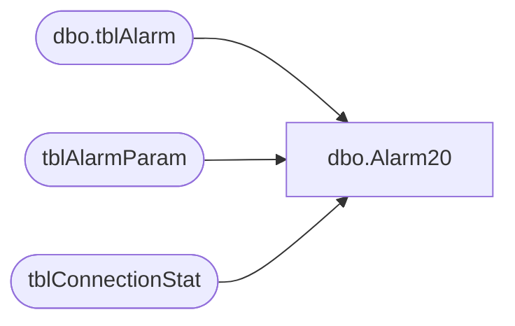

# dbo.Alarm20

**Database:** Tpview  
**Server:** bedrockdb01  

## Architecture Diagram



## Table Dependencies

| Referenced Table |
|---|
| dbo.tblAlarm |
| tblAlarmParam |
| tblConnectionStat |

## Stored Procedure Code

```sql
create proc Alarm20 -- Excessive disconnection duration per Register on a backupRoute.
	@StoreNumber	INT,
	@LastEventTime	DATETIME,
	@TimeFrame		INT,
	@regsiter		INT
AS
DECLARE @TotalDisconnection INT,
   	@ThreshHold 	INT,
	@AlarmMsg		VARCHAR(260),
	@IntervalName   VARCHAR(25),
	@Date			VARCHAR(20),
	@Active			INT,
	@EmailAdd		VARCHAR(40)
Set @TotalDisconnection = 0
-- Look if the Alarm is Active
SELECT @Active = CAST(ParamValue AS INT) FROM	tblAlarmParam 
WHERE AlarmRuleNo = 20 AND ParamName = 'ACTIVE'
IF(@Active=1)
BEGIN
SELECT @EmailAdd = ParamValue FROM	tblAlarmParam 
WHERE AlarmRuleNo = 20 AND ParamName = 'EMAIL'
-- If checking for hourly
	IF(@TimeFrame=1)
	BEGIN
		Select @TotalDisconnection = SUM(HourlyDuration) 
		FROM tblConnectionStat 
		WHERE ConnectType =3
		SELECT @ThreshHold = CAST(ParamValue AS INT) FROM	tblAlarmParam 
		WHERE AlarmRuleNo = 20 AND ParamName = 'THRESHOLDHOUR'
		SET @Date = LTRIM(STR(DATEPART(yyyy,@LastEventTime)))+'-'+
					LTRIM(STR(DATEPART(mm,@LastEventTime)))+'-'+
					LTRIM(STR(DATEPART(dd,@LastEventTime)))+' '+
					LTRIM(STR(DATEPART(hh,@LastEventTime)))+':59:59'
		SET @IntervalName = 'Hour'
	END
	-- If checking for hourly
	IF(@TimeFrame=2)
	BEGIN
		Select @TotalDisconnection = SUM(DailyDuration)
		FROM tblConnectionStat 
		WHERE  ConnectType =3 AND (DATEPART(dd,LastDurationTime) = DATEPART(dd,@LastEventTime))
		SELECT @ThreshHold = CAST(ParamValue AS INT) FROM	tblAlarmParam 
		WHERE AlarmRuleNo = 20 AND ParamName = 'THRESHOLDDAY'
		SET @Date = (LTRIM(STR(DATEPART(yyyy,@LastEventTime)))+'-'+
					LTRIM(STR(DATEPART(mm,@LastEventTime)))+'-'+
					LTRIM(STR(DATEPART(dd,@LastEventTime)))+' 11:59:59')
		SET @IntervalName = 'Day'
	END
	-- If checking for Weekly
	IF(@TimeFrame=3)
	BEGIN
		Select @TotalDisconnection = SUM(WeeklyDuration)
		FROM tblConnectionStat 
		WHERE  ConnectType =3 AND (DATEPART(ww,LastDurationTime) = DATEPART(ww,@LastEventTime))
		SELECT @ThreshHold = CAST(ParamValue AS INT) FROM	tblAlarmParam 
		WHERE AlarmRuleNo = 20 AND ParamName = 'THRESHOLDWEEK'
		SET @Date = LTRIM(STR(DATEPART(yyyy,@LastEventTime)))+'-'+
					LTRIM(STR(DATEPART(mm,@LastEventTime)))+'-'+
					LTRIM(STR(DATEPART(dd,@LastEventTime)))+' 11:59:59'
		SET @IntervalName = 'Week'
	END
	PRINT @ThreshHold*60
	-- If 
	IF(@TotalDisconnection >= (@ThreshHold*60))
	BEGIN
		SET @AlarmMsg = 'WAN Stores: Excessive Backup Connection Duration: stores spent '
		+ LTRIM(STR((@TotalDisconnection/60))) + ' minutes in last ' + @IntervalName + 
		' that ended on ' + RTRIM(@Date) + '. This exceeds the alarm threshold of ' + LTRIM(STR(@ThreshHold)) + ' minutes.' 
		INSERT INTO dbo.tblAlarm 
		(AlarmTime,Description,Severity,AckStatus,AckTime,AckPersonnelID,EMailStatus,EMailAttempts,EMailAddress,EMailTime,DirtyFlag,AlarmRuleNo,Summary)
		VALUES (GETDATE(),@AlarmMsg,0,0,'1900-01-01 12:01:00 AM',0,1,0,@EmailAdd,'1900-01-01 12:01:00 AM',0,4,'WAN Stores: Excessive Backup Connection Duration: stores spent '
		+ LTRIM(STR(@TotalDisconnection/60)) + ' minutes')
	END
END
```

