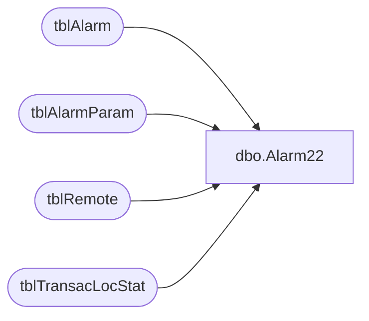

# dbo.Alarm22

**Database:** Tpview  
**Server:** bedrockdb01  

## Architecture Diagram



## Table Dependencies

| Referenced Table |
|---|
| tblAlarm |
| tblAlarmParam |
| tblRemote |
| tblTransacLocStat |

## Stored Procedure Code

```sql
create proc Alarm22 -- Excessive Store Response Time.
	@StoreNumber 	INT,
	@CreditService 	VARCHAR(2),
	@AvgType		INT,
	@register		INT
AS
DECLARE @HourlyAvg 		INT,
		@DailyAvg		INT,
		@WeeklyAvg		INT,
		@HourlyLimit	INT,
		@DailyLimit		INT,
		@WeeklyLimit	INT,
		@ParamIndex		INT,
		@StoreType		INT,
		@AlarmRule		INT,
		@Active			INT,
		@EventDesc		VARCHAR(400),
		@EmailAddress	VARCHAR(75),
		@TypeName		VARCHAR(30)
Select @StoreType = LocationType From tblRemote WHERE RemoteNumber = @StoreNumber
SET @AlarmRule = 22
SET @TypeName = 'WAN Stores'
SET @EmailAddress = ''
PRINT @CreditService
PRINT @StoreNumber
-- Getting Service Param Index
SELECT @ParamIndex = ParamIndex 
FROM tblAlarmParam 
WHERE AlarmRuleNo = @AlarmRule AND ParamName = 'SERVICE' AND ParamValue = @CreditService
PRINT @ParamIndex
-- Getting if the Alarm is Active
SELECT @Active = CAST(ParamValue AS INT)  
FROM tblAlarmParam 
WHERE AlarmRuleNo = @AlarmRule AND ParamName = 'SERVICE' AND 
ParamValue = @CreditService AND ParamIndex = @ParamIndex
-- Alarm is Active.
IF(@Active = 1)
BEGIN
	--looking for alarms per store
	SELECT 	@HourlyAvg 	= HourlyRespAvg,
			@DailyAvg	= DailyRespAvg,
			@WeeklyAvg 	= WeeklyRespAvg
	FROM tblTransacLocStat
	WHERE RemoteNumber = @StoreNumber AND Service = @CreditService AND RegisterNumber = @register
	--1 is alarm for hourly average.
	IF(@AvgType = 1)
	BEGIN
		PRINT 'Checking Hourly Alarms'
		SELECT @HourlyLimit = ParamValue FROM tblAlarmParam WHERE AlarmRuleNo = @AlarmRule AND ParamName = 'THRESHOLDHOUR' AND ParamIndex = @ParamIndex
		-- Check hourly totals against the hourly limit
		IF(@HourlyAvg>=@HourlyLimit)
		BEGIN
			SET @EventDesc = @StoreType +': Exessive Register Level Response Time: '+STR(@StoreNumber)+' Register ' +LTRIM(STR(@register)) + ' average response time exceeded '+STR(@HourlyLimit)+' in the last hour'
			INSERT INTO tblAlarm 
			(AlarmTime,Description,Severity,AckStatus,AckTime,AckPersonnelID,EMailStatus,EMailAttempts,EMailAddress,EMailTime,DirtyFlag,AlarmRuleNo,Summary)
			VALUES (GETDATE(),@EventDesc,0,0,'1900-01-01 12:01:00 AM',0,3,0,@EmailAddress,'1900-01-01 12:01:00 AM',1,8,@StoreType +': Exessive Reigster Level Response Time')
		END
	END
--2 is Alarm for daily average
	IF(@AvgType = 2)
	BEGIN
		PRINT 'Checking Daily Alarms'
		SELECT @DailyLimit = ParamValue FROM tblAlarmParam WHERE AlarmRuleNo = @AlarmRule AND ParamName = 'THRESHOLDDAY' AND ParamIndex = @ParamIndex
		--Checking Daily Limit
		IF(@DailyAvg>=@DailyLimit)
		BEGIN
			SET @EventDesc = @StoreType +': Exessive Store Level Response Time:'+
			STR(@StoreNumber)+' register ' +LTRIM(STR(@register))+' average response time exceeded '+STR(@DailyLimit)+' in the last day'
			INSERT INTO tblAlarm 
			(AlarmTime,Description,Severity,AckStatus,AckTime,AckPersonnelID,EMailStatus,EMailAttempts,EMailAddress,EMailTime,DirtyFlag,AlarmRuleNo,Summary)
			VALUES (GETDATE(),@EventDesc,0,0,'1900-01-01 12:01:00 AM',0,3,0,@EmailAddress,'1900-01-01 12:01:00 AM',1,8,@StoreType +': Exessive Register Level Response Time')
		END
	END
	--3 is alarm for weekly average
	IF(@AvgType = 3)
	BEGIN
		PRINT 'Checking Weekly Alarms'
		SELECT @WeeklyLimit = ParamValue FROM tblAlarmParam WHERE AlarmRuleNo = @AlarmRule AND ParamName = 'THRESHOLDWEEK' AND ParamIndex = @ParamIndex
		--Checking Weekly Limit
		IF(@WeeklyAvg>=@WeeklyLimit)
		BEGIN
			SET @EventDesc = @StoreType +': Exessive Store Level Response Time: '+STR(@StoreNumber) +' register ' +LTRIM(STR(@register))+
			' average response time exceeded '+STR(@WeeklyLimit)+' in the last week'
			INSERT INTO tblAlarm 
			(AlarmTime,Description,Severity,AckStatus,AckTime,AckPersonnelID,EMailStatus,EMailAttempts,EMailAddress,EMailTime,DirtyFlag,AlarmRuleNo,Summary)
			VALUES(GETDATE(),@EventDesc,0,0,'1900-01-01 12:01:00 AM',0,3,0,@EmailAddress,'1900-01-01 12:01:00 AM',1,8,@StoreType +': Exessive Store Level Response Time')
		END
	END
END
```

