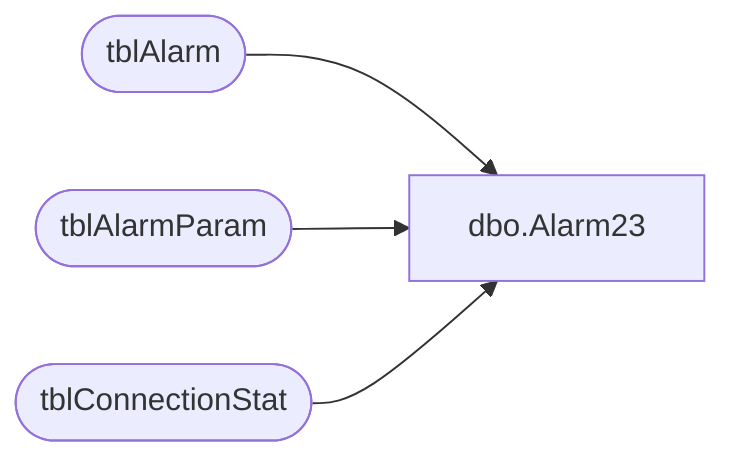

# dbo.Alarm23

**Database:** Tpview  
**Server:** bedrockdb01  

## Architecture Diagram



## Table Dependencies

| Referenced Table |
|---|
| tblAlarm |
| tblAlarmParam |
| tblConnectionStat |

## Stored Procedure Code

```sql
create proc Alarm23 @StoreNumber INT,
		@StoreType 		INT,
		@register		INT
AS
---------------------------------------------------------------------------------------------------
-- Implmentation for Monitoring tools phase 2. drilling down by register instead by stores.
-- This stored procedure checj Excessive Backup Connection Usage for permenant register.
-- This SP is resembles Alarm 6 the diffrence is 6 is higher level checking which goes by store.
-- Created On: 07.12.2002
-- Created By: Ayman El Dah Communication Dept,STS an NSB Company
---------------------------------------------------------------------------------------------------
DECLARE @HourlyTotal 	INT,
		@DailyTotal		INT,
		@WeeklyTotal	INT,
		@HourlyLimit	INT,
		@DailyLimit		INT,
		@WeeklyLimit	INT,
		@EventDesc		VARCHAR(400),
		@EmailAddress	VARCHAR(30),
		@Active			INT,
		@Date			VARCHAR(30),
		@LastEventTime	DATETIME
--Getting ThreshHolds
SELECT @HourlyLimit = CAST( ParamValue AS INT) FROM tblAlarmParam WHERE AlarmRuleNo = 23 AND ParamName = 'THRESHOLDHOUR'
SELECT @DailyLimit = CAST(ParamValue AS INT) FROM tblAlarmParam WHERE AlarmRuleNo = 23 AND ParamName = 'THRESHOLDDAY'
SELECT @WeeklyLimit = CAST(ParamValue AS INT) FROM tblAlarmParam WHERE AlarmRuleNo = 23 AND ParamName = 'THRESHOLDWEEK'
SELECT @EmailAddress = ParamValue FROM tblAlarmParam WHERE AlarmRuleNo = 23 AND ParamName = 'EMAIL'
SELECT @Active = CAST(ParamValue AS INT) FROM tblAlarmParam WHERE AlarmRuleNo = 23 AND ParamName = 'ACTIVE'
-- Checking if the alarm is active or not
IF(@Active = 1)
BEGIN
	--looking for alarms per store
	SELECT 	@HourlyTotal = HourlyNbrConnect,
			@DailyTotal	= DailyNbrConnect,
			@WeeklyTotal = WeeklyNbrConnect,
			@LastEventTime = LastConnectTime
	FROM tblConnectionStat
	WHERE RemoteNumber = @StoreNumber AND RegisterNumber = @register
	-- Check hourly totals against the hourly limit
	IF(@HourlyTotal>=@HourlyLimit AND (DATEPART(hh,GETDATE()) != DATEPART(hh,@LastEventTime)))
	BEGIN
		SET @Date = LTRIM(STR(DATEPART(yyyy,@LastEventTime)))+'-'+
					LTRIM(STR(DATEPART(mm,@LastEventTime)))+'-'+
					LTRIM(STR(DATEPART(dd,@LastEventTime)))+' '+
					LTRIM(STR(DATEPART(hh,@LastEventTime)))+':59:59'
		SET @EventDesc = 'Dailup Stores: Excessive Backup Connection Usage: Store '+LTRIM(STR(@StoreNumber))+
		' Register '+LTRIM(STR(@register)) +' connected on its backup route '+LTRIM(STR(@HourlyTotal)) +' times during the Hour Ended on ' + RTRIM(@Date) + 
		'. This exceeds the alarm threshold value of ' + LTRIM(STR(@HourlyLimit)) + ' times.'
		INSERT INTO tblAlarm 
		(AlarmTime,Description,Severity,AckStatus,AckTime,AckPersonnelID,EMailStatus,EMailAttempts,EMailAddress,EMailTime,DirtyFlag,AlarmRuleNo,Summary)
		VALUES (GETDATE(),@EventDesc,0,0,'1900-01-01 12:01:00 AM',0,1,0,@EmailAddress,'1900-01-01 12:01:00 AM',0,6,@EventDesc)
	END
	--Checking Daily Limit
	IF(@DailyTotal>=@DailyLimit AND (DATEPART(dd,GETDATE()) != DATEPART(dd,@LastEventTime)))
	BEGIN
		SET @Date = (LTRIM(STR(DATEPART(yyyy,@LastEventTime)))+'-'+
					LTRIM(STR(DATEPART(mm,@LastEventTime)))+'-'+
					LTRIM(STR(DATEPART(dd,@LastEventTime)))+' 11:59:59')
		SET @EventDesc = 'Dailup Stores: Excessive Backup Connection Usage: Store '+LTRIM(STR(@StoreNumber))+
		' Register '+LTRIM(STR(@register)) +' connected on its backup route '+LTRIM(STR(@DailyTotal)) +' times during the day ended on ' + RTRIM(@Date) + 
		'. This exceeds the alarm threshold value of ' + LTRIM(STR(@DailyLimit)) + ' times.'
		INSERT INTO tblAlarm 
		(AlarmTime,Description,Severity,AckStatus,AckTime,AckPersonnelID,EMailStatus,EMailAttempts,EMailAddress,EMailTime,DirtyFlag,AlarmRuleNo,Summary)
		VALUES (GETDATE(),@EventDesc,0,0,'1900-01-01 12:01:00 AM',0,1,0,@EmailAddress,'1900-01-01 12:01:00 AM',0,6,@EventDesc)
	END
	--Checking Weekly Limit
	IF(@WeeklyTotal>=@WeeklyLimit AND (DATEPART(ww,GETDATE()) != DATEPART(ww,@LastEventTime)))
	BEGIN
		SET @Date = (LTRIM(STR(DATEPART(yyyy,@LastEventTime)))+'-'+
					LTRIM(STR(DATEPART(mm,@LastEventTime)))+'-'+
					LTRIM(STR(DATEPART(dd,@LastEventTime)))+' 11:59:59')
		SET @EventDesc = 'Dailup Stores: Excessive Backup Connection Usage: Store '+LTRIM(STR(@StoreNumber))+
		' Register '+LTRIM(STR(@register)) + ' connected on its backup route '+LTRIM(STR(@DailyTotal)) +' times during the Week Ended on ' + RTRIM(@Date) + 
		'. This exceeds the alarm threshold value of ' + LTRIM(STR(@DailyLimit)) + ' times.'
		INSERT INTO tblAlarm 
		(AlarmTime,Description,Severity,AckStatus,AckTime,AckPersonnelID,EMailStatus,EMailAttempts,EMailAddress,EMailTime,DirtyFlag,AlarmRuleNo,Summary)
		VALUES(GETDATE(),@EventDesc,0,0,'1900-01-01 12:01:00 AM',0,1,0,@EmailAddress,'1900-01-01 12:01:00 AM',0,6,@EventDesc)
	END
END
```

