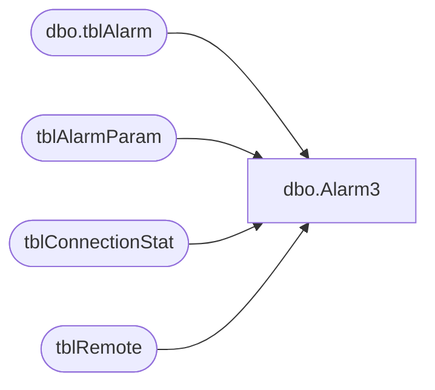

# dbo.Alarm3

**Database:** Tpview  
**Server:** bedrockdb01  

## Architecture Diagram



## Table Dependencies

| Referenced Table |
|---|
| dbo.tblAlarm |
| tblAlarmParam |
| tblConnectionStat |
| tblRemote |

## Stored Procedure Code

```sql
create proc Alarm3 -- Excessive disconnection duration per store on primary or backup route.
AS
DECLARE	@ThreshHold 			INT,
		@StoreNumber			INT,
		@TotalDisconnection 	INT,
		@TimeFrame				INT,
		@AlarmMsg				VARCHAR
--Getting the index for the first service configured in the AlarmParam Table.
SELECT @ThreshHold = CAST(ParamValue AS INT) FROM	tblAlarmParam 
WHERE AlarmRuleNo = 3 AND ParamName = 'THRESHOLD'
DECLARE store_cursor CURSOR FOR 
SELECT RemoteNumber
FROM tblRemote 
OPEN store_cursor
FETCH NEXT FROM store_cursor 
INTO @StoreNumber
WHILE @@FETCH_STATUS = 0
BEGIN
	Set @TotalDisconnection = 0
	Set @TimeFrame = 0
WHILE (@TimeFrame <4)
BEGIN
	-- If checking for hourly
	IF(@TimeFrame=1)
	BEGIN
		Select @TotalDisconnection = HourlyDuration 
		FROM tblConnectionStat 
		WHERE RemoteNumber = @StoreNumber AND ConnectType =1
		IF(@TotalDisconnection>=@ThreshHold)
		BEGIN
			SET @AlarmMsg = 'Excessive Hourly disconnection ('+ STR(@TotalDisconnection) + ') for store:' + STR(@StoreNumber) 
			INSERT INTO dbo.tblAlarm 
			(AlarmTime,Description,Severity,AckStatus,AckTime,AckPersonnelID,EMailStatus,EMailAttempts,EMailAddress,EMailTime,DirtyFlag)
			VALUES (GETDATE(),@AlarmMsg,0,0,'1900-01-01 12:01:00 AM',0,1,1,'',GETDATE(),0)
		END
	END
	
	-- If checking for hourly
	IF(@TimeFrame=2)
	BEGIN
		Select @TotalDisconnection = DailyDuration
		FROM tblConnectionStat 
		WHERE RemoteNumber = @StoreNumber AND ConnectType =1
	IF(@TotalDisconnection>=@ThreshHold)
	BEGIN
		SET @AlarmMsg = 'Excessive Daily disconnection ('+ STR(@TotalDisconnection) + ') for store:' + STR(@StoreNumber) 
		INSERT INTO dbo.tblAlarm 
		(AlarmTime,Description,Severity,AckStatus,AckTime,AckPersonnelID,EMailStatus,EMailAttempts,EMailAddress,EMailTime,DirtyFlag)
		VALUES (GETDATE(),@AlarmMsg,0,0,'1900-01-01 12:01:00 AM',0,1,0,'','1900-01-01 12:01:00 AM',0)
	END
	END
	-- If checking for Weekly
	IF(@TimeFrame=3)
	BEGIN
		Select @TotalDisconnection = WeeklyDuration
		FROM tblConnectionStat 
		WHERE RemoteNumber = @StoreNumber AND ConnectType =1
	IF(@TotalDisconnection>=@ThreshHold)
	BEGIN
		SET @AlarmMsg = 'Excessive Weekly disconnection ('+ STR(@TotalDisconnection) + ') for store:' + STR(@StoreNumber) 
		INSERT INTO dbo.tblAlarm 
		(AlarmTime,Description,Severity,AckStatus,AckTime,AckPersonnelID,EMailStatus,EMailAttempts,EMailAddress,EMailTime,DirtyFlag)
		VALUES (GETDATE(),@AlarmMsg,0,0,'1900-01-01 12:01:00 AM',0,1,1,'','1900-01-01 12:01:00 AM',0)
	END
	END
	SET @TimeFrame = @TimeFrame + 1
END
END
```

