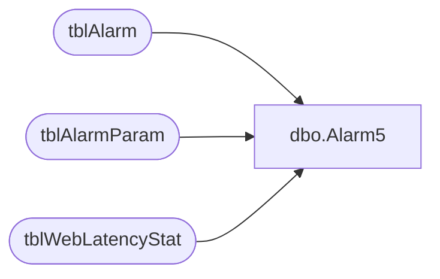

# dbo.Alarm5

**Database:** Tpview  
**Server:** bedrockdb01  

## Architecture Diagram



## Table Dependencies

| Referenced Table |
|---|
| tblAlarm |
| tblAlarmParam |
| tblWebLatencyStat |

## Stored Procedure Code

```sql
create proc Alarm5 -- Excessive disconnection per store.
@StoreNumber	INT,
@Interval		INT
AS
DECLARE @HourlyTotal 	INT,
		@DailyTotal		INT,
		@WeeklyTotal	INT,
		@HourlyLimit	INT,
		@DailyLimit		INT,
		@WeeklyLimit	INT,
		@EventDesc		VARCHAR(260),
		@EmailAddress	VARCHAR(260),
		@LastEventTime	DATETIME,
		@Date			VARCHAR(25),
		@Active			INT
--Getting ThreshHolds
SELECT @EmailAddress = ParamValue FROM tblAlarmParam WHERE AlarmRuleNo = 5 AND ParamName = 'EMAIL'
SELECT @Active = CAST(ParamValue AS INT) FROM tblAlarmParam WHERE AlarmRuleNo = 5 AND ParamName = 'ACTIVE'
-- Fetching a store Cursor
PRINT @EmailAddress
-- IF the Alarm is Active.
if(@Active = 1)
BEGIN
--Checking Hourly Internet Latency
SELECT 	@HourlyTotal = RTHourlyAvg,
		@DailyTotal	= RTDailyAvg,
		@WeeklyTotal = RTWeeklyAvg, 
		@LastEventTime = LastTimeEvent
FROM tblWebLatencyStat 
WHERE RemoteNumber = @StoreNumber
PRINT @HourlyTotal
PRINT @DailyTotal
PRINT @WeeklyTotal
--Hourly
IF(@Interval = 1)
BEGIN
	SELECT @HourlyLimit = CAST(ParamValue AS INT) FROM tblAlarmParam WHERE AlarmRuleNo = 5 AND ParamName = 'THRESHOLDHOUR'
	IF(@HourlyTotal>=@HourlyLimit)
	BEGIN
		SET @Date = LTRIM(STR(DATEPART(yyyy,@LastEventTime)))+'-'+
					LTRIM(STR(DATEPART(mm,@LastEventTime)))+'-'+
					LTRIM(STR(DATEPART(dd,@LastEventTime)))+' '+
					LTRIM(STR(DATEPART(hh,@LastEventTime)))+':59:59'
		SET @EventDesc = 'Permanently Connected Stores: Excessive Internet Latency: The average internet latency for store '
		+LTRIM(STR(@StoreNumber))+' is '+LTRIM(STR(@HourlyTotal))+' milliseconds for the hour ended on ' + RTRIM(@Date) +
		'. This exceeds or matches the alarm threshold value of ' + LTRIM(STR(@HourlyLimit)) + ' milliseconds.'
		INSERT INTO tblAlarm 
		(AlarmTime,Description,Severity,AckStatus,AckTime,AckPersonnelID,EMailStatus,EMailAttempts,EMailAddress,EMailTime,DirtyFlag,AlarmRuleNo,Summary)
		VALUES (GETDATE(),@EventDesc,0,0,'1900-01-01 12:01:00 AM',0,3,0,@EmailAddress,'1900-01-01 12:01:00 AM',0,5,'Permanently Connected Stores: Excessive Internet Latency: '+LTRIM(STR(@StoreNumber)))
	END
END
--Daily
IF(@Interval=2)
BEGIN
	SELECT @DailyLimit = CAST(ParamValue AS INT) FROM tblAlarmParam WHERE AlarmRuleNo = 5 AND ParamName = 'THRESHOLDDAY'
	IF(@DailyTotal>=@DailyLimit)
	BEGIN
		SET @Date = (LTRIM(STR(DATEPART(yyyy,@LastEventTime)))+'-'+
					LTRIM(STR(DATEPART(mm,@LastEventTime)))+'-'+
					LTRIM(STR(DATEPART(dd,@LastEventTime)))+' 11:59:59')
		SET @EventDesc = 'Permanently Connected Stores: Excessive Internet Latency: The average internet latency for store '
		+LTRIM(STR(@StoreNumber))+' is '+LTRIM(STR(@DailyTotal))+' milliseconds for the day ended on ' + RTRIM(@Date) +
		'. This exceeds or matches the alarm threshold value of ' + LTRIM(STR(@DailyLimit)) + ' milliseconds.'
		INSERT INTO tblAlarm 
		(AlarmTime,Description,Severity,AckStatus,AckTime,AckPersonnelID,EMailStatus,EMailAttempts,EMailAddress,EMailTime,DirtyFlag,AlarmRuleNo,Summary)
		VALUES (GETDATE(),@EventDesc,0,0,'1900-01-01 12:01:00 AM',0,3,0,@EmailAddress,'1900-01-01 12:01:00 AM',0,5,'Permanently Connected Stores: Excessive Internet Latency: '+LTRIM(STR(@StoreNumber)))
	END
END
--Weekly
IF(@Interval=3)
BEGIN
	SELECT @WeeklyLimit = CAST(ParamValue AS INT) FROM tblAlarmParam WHERE AlarmRuleNo = 5 AND ParamName = 'THRESHOLDWEEK'
	IF(@WeeklyTotal>=@WeeklyLimit)
	BEGIN
		SET @Date = LTRIM(STR(DATEPART(yyyy,@LastEventTime)))+'-'+
					LTRIM(STR(DATEPART(mm,@LastEventTime)))+'-'+
					LTRIM(STR(DATEPART(dd,@LastEventTime)))+' 11:59:59'
		
		SET @EventDesc = 'Permanently Connected Stores:Excessive Internet Latency: The average internet latency for store '
		+LTRIM(STR(@StoreNumber))+' is '+LTRIM(STR(@WeeklyTotal))+' milliseconds for the week ended on ' + RTRIM(@Date) +
		'. This exceeds or matches the alarm threshold value of ' + LTRIM(STR(@WeeklyLimit)) + ' milliseconds'
		INSERT INTO tblAlarm 
		(AlarmTime,Description,Severity,AckStatus,AckTime,AckPersonnelID,EMailStatus,EMailAttempts,EMailAddress,EMailTime,DirtyFlag,AlarmRuleNo,Summary)
		VALUES (GETDATE(),@EventDesc,0,0,'1900-01-01 12:01:00 AM',0,3,0,@EmailAddress,'1900-01-01 12:01:00 AM',0,5,'Permanently Connected Stores: Excessive Internet Latency: '+LTRIM(STR(@StoreNumber)))
	END
END
END
```

