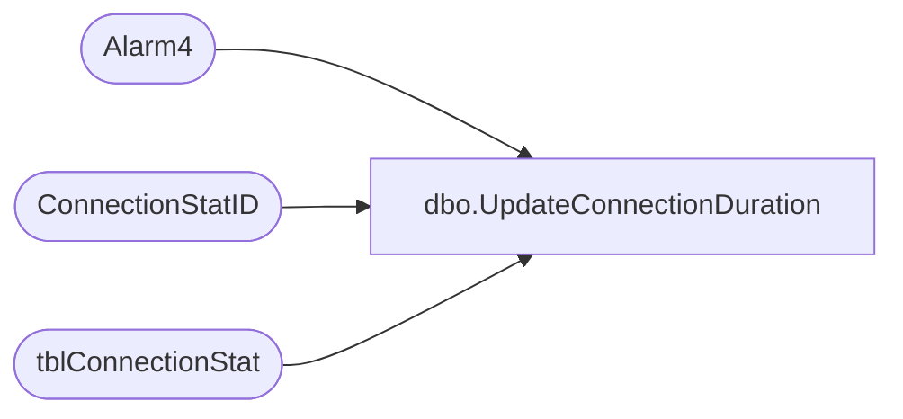

# dbo.UpdateConnectionDuration

**Database:** Tpview  
**Server:** bedrockdb01  

## Architecture Diagram



## Table Dependencies

| Referenced Table |
|---|
| Alarm4 |
| ConnectionStatID |
| tblConnectionStat |

## Stored Procedure Code

```sql
create proc UpdateConnectionDuration -- updating disconnections for a certain store.
	@storenumber 	INT,
	@duration 		INT,
	@connecttype 	INT,
	@storetype		INT  	
AS
DECLARE @hourlytotal INT
DECLARE @dailytotal INT
DECLARE @weeklytotal INT,
		@LastEventTime DATETIME,
		@TimeFrame INT
SET @hourlytotal = 0
SET @dailytotal = 0
SET @weeklytotal = 0
--Check if the record exists.
IF(NOT EXISTS(SELECT ConnectionStatID FROM tblConnectionStat 
WHERE RemoteNumber = @storenumber AND ConnectType = @connecttype ))
BEGIN
	INSERT INTO ConnectionStatID (	RemoteNumber,
									ConnectType,
									LastConnectTime,
									HourlyNbrConnect,
									DailyNbrConnect,
									WeeklyNbrConnect,
									LastDisconnectTime,
									HourlyNbrDisconnect,
									DailyNbrDisconnect,
									WeeklyNbrDisconnect,
									LastDurationTime,
									HourlyDuration,
									DailyDuration,
									WeeklyDuration)
	VALUES (@storenumber,@connecttype,GETDATE(),0,0,0,GETDATE(),0,0,0,GETDATE(),0,0,0)
END
--Getting the current hourlytotal.
SELECT @LastEventTime =LastDurationTime, @hourlytotal = HourlyDuration
FROM tblConnectionStat 
WHERE RemoteNumber = @storenumber AND ConnectType = @connecttype
--Getting the current dailytotal.
SELECT @dailytotal = DailyDuration 
FROM tblConnectionStat 
WHERE RemoteNumber = @storenumber AND ConnectType = @connecttype
--Getting the current weeklytotal
SELECT @weeklytotal = WeeklyDuration
FROM tblConnectionStat 
WHERE RemoteNumber = @storenumber AND ConnectType = @connecttype
--performing the update.
--daily total
IF(SELECT DATEPART(dd,LastDurationTime) FROM tblConnectionStat 
WHERE RemoteNumber = @storenumber AND ConnectType = @connecttype) = DATEPART(dd,GETDATE())
	BEGIN
		UPDATE tblConnectionStat 
		SET DailyDuration = (@dailytotal + @duration) 
		WHERE RemoteNumber = @storenumber AND ConnectType = @connecttype
	END
IF(SELECT DATEPART(dd,LastDurationTime) FROM tblConnectionStat 
WHERE RemoteNumber = @storenumber AND ConnectType = @connecttype) != DATEPART(dd,GETDATE())
	BEGIN
		--Connect Type is Backup and Store Type is permenant
		PRINT 	@connecttype 
		PRINT	@storetype
		IF(@connecttype=2 AND @storetype = 2)
		BEGIN
			PRINT 'Calling Alarm 4'
			SET @TimeFrame = 2
			EXEC Alarm4 @storenumber,@LastEventTime,@TimeFrame
		END
		UPDATE tblConnectionStat 
		SET DailyDuration = @duration
		WHERE RemoteNumber = @storenumber AND ConnectType = @connecttype
	END
--weekly total
IF(SELECT DATEPART(wk,LastDurationTime) FROM tblConnectionStat 
WHERE RemoteNumber = @storenumber AND ConnectType = @connecttype) = DATEPART(wk,GETDATE())
	BEGIN
		UPDATE tblConnectionStat 
		SET WeeklyDuration = (@weeklytotal + @duration) 
		WHERE RemoteNumber = @storenumber AND ConnectType = @connecttype
	END
IF(SELECT DATEPART(wk,LastDurationTime) FROM tblConnectionStat 
WHERE RemoteNumber = @storenumber AND ConnectType = @connecttype) != DATEPART(wk,GETDATE())
	BEGIN
		IF(@connecttype=2 AND @storetype = 2)
		BEGIN
			SET @TimeFrame = 3
			EXEC Alarm4 @storenumber,@LastEventTime,@TimeFrame
		END
		UPDATE tblConnectionStat 
		SET WeeklyDuration = @duration
		WHERE RemoteNumber = @storenumber AND ConnectType = @connecttype
	END
--hourly total
IF(SELECT DATEPART(hh,LastDurationTime) FROM tblConnectionStat 
WHERE RemoteNumber = @storenumber AND ConnectType = @connecttype) = DATEPART(hh,GETDATE())
	BEGIN
		UPDATE tblConnectionStat 
		SET HourlyDuration = (@hourlytotal + @duration)  
		WHERE RemoteNumber = @storenumber AND ConnectType = @connecttype
	END
IF(SELECT DATEPART(hh,LastDurationTime) FROM tblConnectionStat 
WHERE RemoteNumber = @storenumber AND ConnectType = @connecttype) != DATEPART(hh,GETDATE())
	BEGIN
		IF(@connecttype=2 AND @storetype = 2)
		BEGIN
			PRINT 'Check Hourly Threshold for hourly check'
			SET @TimeFrame = 1
			EXEC Alarm4 @storenumber,@LastEventTime,@TimeFrame
		END
		UPDATE tblConnectionStat 
		SET HourlyDuration = @duration
		WHERE RemoteNumber = @storenumber AND ConnectType = @connecttype
	END
--update last eventtime
UPDATE tblConnectionStat 
SET LastDurationTime = GETDATE()
WHERE RemoteNumber = @storenumber AND ConnectType = @connecttype
```

