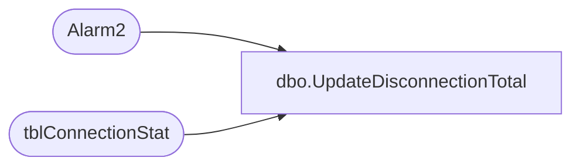

# dbo.UpdateDisconnectionTotal

**Database:** Tpview  
**Server:** bedrockdb01  

## Architecture Diagram



## Table Dependencies

| Referenced Table |
|---|
| Alarm2 |
| tblConnectionStat |

## Stored Procedure Code

```sql
create proc UpdateDisconnectionTotal 
-- updating disconnections for a certain store.
   	@storenumber int,
	@connecttype int,
	@storetype	 int  
AS
DECLARE @hourlytotal INT
DECLARE @dailytotal INT
DECLARE @weeklytotal INT,
		@LastEventTime DATETIME
SET @hourlytotal = 0
SET @dailytotal = 0
SET @weeklytotal = 0
--Check if the record exists.
IF(NOT EXISTS(SELECT ConnectionStatID FROM tblConnectionStat WHERE RemoteNumber = @storenumber AND ConnectType =@connecttype ))
BEGIN
	INSERT INTO tblConnectionStat (	RemoteNumber,
									ConnectType,
									LastConnectTime,
									HourlyNbrConnect,
									DailyNbrConnect,
									WeeklyNbrConnect,
									LastDisconnectTime,
									HourlyNbrDisconnect,
									DailyNbrDisconnect,
									WeeklyNbrDisconnect,
									LastDurationTime,
									HourlyDuration,
									DailyDuration,
									WeeklyDuration)
	VALUES (@storenumber,@connecttype,GETDATE(),0,0,0,GETDATE(),0,0,0,GETDATE(),0,0,0)
END
--Getting the current hourlytotal.
SELECT 	@LastEventTime =LastDisconnectTime 
FROM 	tblConnectionStat 
WHERE 	RemoteNumber = @storenumber AND ConnectType =@connecttype
--Getting the current hourlytotal.
SELECT 	@LastEventTime =LastDisconnectTime
FROM 	tblConnectionStat 
WHERE 	RemoteNumber = @storenumber AND ConnectType =@connecttype
--Getting the current dailytotal.
SELECT 	@dailytotal = DailyNbrDisconnect 
FROM 	tblConnectionStat 
WHERE 	RemoteNumber = @storenumber AND ConnectType =@connecttype
--Getting the current weeklytotal
SELECT @weeklytotal = WeeklyNbrDisconnect 
FROM tblConnectionStat 
WHERE RemoteNumber = @storenumber AND ConnectType =@connecttype
--performing the update.
--daily total
IF((SELECT DATEPART(dd,LastDisconnectTime) FROM tblConnectionStat WHERE RemoteNumber = @storenumber AND ConnectType =@connecttype) = (DATEPART(dd,GETDATE())))
BEGIN
	UPDATE tblConnectionStat 
	SET DailyNbrDisconnect = (@dailytotal + 1) 
	WHERE RemoteNumber = @storenumber
END
IF(SELECT DATEPART(dd,LastDisconnectTime) FROM tblConnectionStat WHERE RemoteNumber = @storenumber AND ConnectType =@connecttype) != DATEPART(dd,GETDATE())
	BEGIN
	--If store is permenant and its disconnection was from the primary check alarm 2
		IF(@connecttype=1 AND @storetype = 2)
		BEGIN
			EXEC Alarm2 @storenumber,@LastEventTime,2
		END	
		UPDATE tblConnectionStat 
		SET DailyNbrDisconnect = 1
		WHERE RemoteNumber = @storenumber
	END
--weekly total
IF(SELECT DATEPART(wk,LastDisconnectTime) FROM tblConnectionStat WHERE RemoteNumber = @storenumber AND ConnectType =@connecttype) = DATEPART(wk,GETDATE())
	BEGIN
		UPDATE tblConnectionStat 
		SET WeeklyNbrDisconnect = (@weeklytotal + 1) 
		WHERE RemoteNumber = @storenumber
	END
IF(SELECT DATEPART(wk,LastDisconnectTime) FROM tblConnectionStat WHERE RemoteNumber = @storenumber AND ConnectType =@connecttype) != DATEPART(wk,GETDATE())
	BEGIN
		--If store is permenant and its disconnection was from the primary check alarm 2
		IF(@connecttype=1 AND @storetype = 2)
		BEGIN
			EXEC Alarm2 @storenumber,@LastEventTime,3
		END	
		UPDATE tblConnectionStat 
		SET WeeklyNbrDisconnect = 1
		WHERE RemoteNumber = @storenumber
	END
--hourly total
IF(SELECT DATEPART(hh,LastDisconnectTime) FROM tblConnectionStat WHERE RemoteNumber = @storenumber AND ConnectType =@connecttype) = DATEPART(hh,GETDATE())
	BEGIN
		UPDATE tblConnectionStat 
		SET HourlyNbrDisconnect = (@hourlytotal + 1)  
		WHERE RemoteNumber = @storenumber
	END
IF(SELECT DATEPART(hh,LastDisconnectTime) FROM tblConnectionStat WHERE RemoteNumber = @storenumber AND ConnectType =@connecttype) != DATEPART(hh,GETDATE())
	BEGIN
		IF(@connecttype=1 AND @storetype = 2)
		BEGIN
			EXEC Alarm2 @storenumber,@LastEventTime,1
		END	
		UPDATE tblConnectionStat 
		SET HourlyNbrDisconnect = 1
		WHERE RemoteNumber = @storenumber
	END
--update last eventtime
UPDATE tblConnectionStat 
SET LastDisconnectTime = GETDATE()
WHERE RemoteNumber = @storenumber
```

