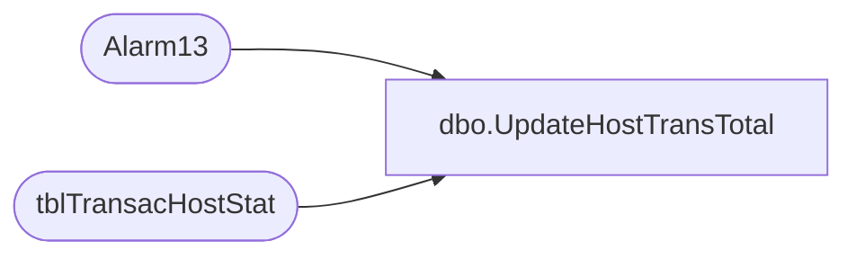

# dbo.UpdateHostTransTotal

**Database:** Tpview  
**Server:** bedrockdb01  

## Architecture Diagram



## Table Dependencies

| Referenced Table |
|---|
| Alarm13 |
| tblTransacHostStat |

## Stored Procedure Code

```sql
create proc UpdateHostTransTotal -- updating Transaction Host Totals.
	@response		DECIMAL,
	@servicetype	VARCHAR(2)
AS
DECLARE @HourlyTotal 		int
DECLARE @DailyTotal 		int
DECLARE @WeeklyTotal		int
DECLARE @HourlyRespTotal  	DECIMAL
DECLARE @DailyRespTotal 	DECIMAL
DECLARE @WeeklyRespTotal 	DECIMAL
--getting hourly total for store
IF(NOT EXISTS(SELECT TransacStatHostID FROM tblTransacHostStat WHERE Service = @servicetype))
BEGIN
	INSERT INTO tblTransacHostStat (	MsgType,
										Service,
										Card,
										HourlyNbrTransac,
										DailyNbrTransac,
										WeeklyNbrTransac,
										HourlyRespAvg,
										DailyRespAvg,
										WeeklyRespAvg,
										LastEventTime)
	VALUES(0,@servicetype,0,0,0,0,0,0,0,GETDATE())
END
SELECT 	@HourlyTotal = HourlyNbrTransac,
		@DailyTotal = DailyNbrTransac,
		@WeeklyTotal = WeeklyNbrTransac,
		@HourlyRespTotal = HourlyRespAvg,
		@DailyRespTotal = DailyRespAvg,
		@WeeklyRespTotal = WeeklyRespAvg	  
FROM tblTransacHostStat 
WHERE Service = @servicetype
--hourly calc for store totals	
	IF((SELECT DATEDIFF(hh,GETDATE(),LastEventTime) FROM tblTransacHostStat 	
			WHERE Service = @servicetype) = 0)
		BEGIN
			Update tblTransacHostStat 
			SET HourlyNbrTransac = (@HourlyTotal+1),
				HourlyRespAvg = (((@HourlyRespTotal*@HourlyTotal)+@response) / (@HourlyTotal+1)),
				LastEventTime = GETDATE()
			WHERE Service = @servicetype
		END
	IF((SELECT DATEDIFF(hh,GETDATE(),LastEventTime) FROM tblTransacHostStat 	
			WHERE Service = @servicetype) =1)
		BEGIN
			EXEC Alarm13 @servicetype,1
			Update tblTransacHostStat 
			SET HourlyNbrTransac = (1),
				HourlyRespAvg = @response,
				LastEventTime = GETDATE()
			WHERE Service = @servicetype
		END
--daily calc fot store totals
	IF((SELECT DATEDIFF(dd,GETDATE(),LastEventTime) FROM tblTransacHostStat 	
			WHERE Service = @servicetype) = 0)
		BEGIN
			Update tblTransacHostStat 
			SET DailyNbrTransac = (@DailyTotal+1),
				DailyRespAvg = (((@DailyRespTotal*@DailyTotal)+@response) / (@DailyTotal+1)),
				LastEventTime = GETDATE()
			WHERE Service = @servicetype
		END
	IF((SELECT DATEDIFF(dd,GETDATE(),LastEventTime) FROM tblTransacHostStat 	
			WHERE Service = @servicetype) = 1)
		BEGIN
			EXEC Alarm13 @servicetype,2
			Update tblTransacHostStat 
			SET DailyNbrTransac = (1),
				DailyRespAvg = (@response /(1)),
				LastEventTime = GETDATE()
			WHERE Service = @servicetype
		END
--weekly totals
	
	IF((SELECT DATEDIFF(ww,GETDATE(),LastEventTime) FROM tblTransacHostStat 	
			WHERE Service = @servicetype) = 0)
		BEGIN
			Update tblTransacHostStat 
			SET WeeklyNbrTransac = (@WeeklyTotal+1),
				WeeklyRespAvg = (((@WeeklyRespTotal*@WeeklyTotal)+@response) / (@WeeklyTotal+1)),
				LastEventTime = GETDATE()
			WHERE Service = @servicetype
		END
	IF((SELECT DATEDIFF(ww,GETDATE(),LastEventTime) FROM tblTransacHostStat 	
			WHERE Service = @servicetype) = 1)
		BEGIN
			EXEC Alarm13 @servicetype,3
			Update tblTransacHostStat 
			SET WeeklyNbrTransac = (1),
				WeeklyRespAvg = (@response),
				LastEventTime = GETDATE()
			WHERE Service = @servicetype
		END
```

