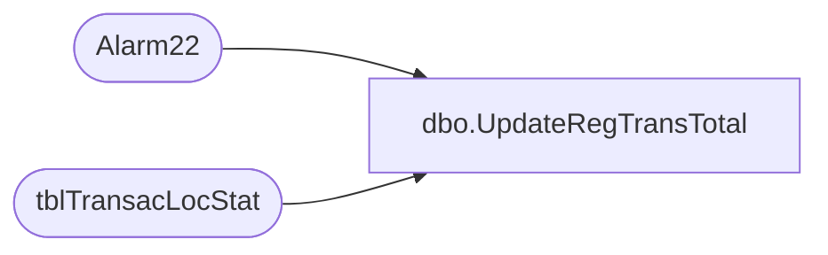

# dbo.UpdateRegTransTotal

**Database:** Tpview  
**Server:** bedrockdb01  

## Architecture Diagram



## Table Dependencies

| Referenced Table |
|---|
| Alarm22 |
| tblTransacLocStat |

## Stored Procedure Code

```sql
create proc UpdateRegTransTotal -- updating Transaction Store and Store Totals.
	@storenumber 	INT,  
	@response		DECIMAL,
	@servicetype	VARCHAR(2),
	@register		INT
AS
DECLARE @HourlyTotal 		int
DECLARE @DailyTotal 		int
DECLARE @WeeklyTotal		int
DECLARE @HourlyRespTotal  	DECIMAL(10,3)
DECLARE @DailyRespTotal 	DECIMAL(10,3)
DECLARE @WeeklyRespTotal 	DECIMAL(10,3)
--getting hourly total for store
IF(NOT EXISTS(SELECT TransacStatLocID FROM tblTransacLocStat WHERE RemoteNumber = @storenumber AND Service = @servicetype AND RegisterNumber = @register))
BEGIN
	INSERT INTO tblTransacLocStat(	RemoteNumber,
									MsgType,
									Service,
									Card,
									HourlyNbrTransac,
									DailyNbrTransac,
									WeeklyNbrTransac,
									HourlyRespAvg,
									DailyRespAvg,
									WeeklyRespAvg,
									LastEventTime,
									RegisterNumber)
	VALUES(	@storenumber,0,@servicetype,0,0,0,0,0,0,0,GETDATE(),@register)
END
SELECT 	@HourlyTotal = HourlyNbrTransac,
		@DailyTotal = DailyNbrTransac,
		@WeeklyTotal = WeeklyNbrTransac,
		@HourlyRespTotal = HourlyRespAvg ,
		@DailyRespTotal = DailyRespAvg ,
		@WeeklyRespTotal = WeeklyRespAvg 	  
FROM tblTransacLocStat 
WHERE 	RemoteNumber = @storenumber AND Service = @servicetype AND RegisterNumber = @register
--hourly calc for store totals
	IF((SELECT DATEPART(hh,LastEventTime) FROM tblTransacLocStat 	
			WHERE 	RemoteNumber = @storenumber 
					AND Service = @servicetype AND RegisterNumber = @register)) = DATEPART(hh,GETDATE())
		BEGIN
			PRINT 'UPDATE'
			Update tblTransacLocStat 
			SET HourlyNbrTransac = (@HourlyTotal+1),
				HourlyRespAvg = ((@HourlyRespTotal*@HourlyTotal)+@response) / (@HourlyTotal+1),
				LastEventTime = GETDATE()
			WHERE 	RemoteNumber = @storenumber 
					AND Service = @servicetype AND RegisterNumber = @register
		END
	IF((SELECT DATEPART(hh,LastEventTime) FROM tblTransacLocStat 	
			WHERE 	RemoteNumber = @storenumber 
					AND Service = @servicetype AND RegisterNumber = @register)) <> DATEPART(hh,GETDATE())
	--Check for hourly alarms only for a certain service
	BEGIN
		EXEC Alarm22 @storenumber,@servicetype,1,@register
			PRINT 'NEW'
			Update tblTransacLocStat 
			SET HourlyNbrTransac = (1),
				HourlyRespAvg = @response,
				LastEventTime = GETDATE()
			WHERE 	RemoteNumber = @storenumber 
					AND Service = @servicetype AND RegisterNumber = @register
	END
--daily calc fot store totals
							
	IF((SELECT DATEPART(dd,LastEventTime) FROM tblTransacLocStat 	
			WHERE 	RemoteNumber = @storenumber 
					AND Service = @servicetype AND RegisterNumber = @register) = DATEPART(dd,GETDATE()))
		BEGIN
			Update tblTransacLocStat 
			SET DailyNbrTransac = (@DailyTotal+1),
				DailyRespAvg = ((@DailyRespTotal*@DailyTotal)+@response) / (@DailyTotal+1),
				LastEventTime = GETDATE()
			WHERE 	RemoteNumber = @storenumber 
					AND Service = @servicetype AND RegisterNumber = @register
		END
	ELSE
		BEGIN
			-- 2 means check for daily alarms for this service.
			EXEC Alarm22 @storenumber,@servicetype,2,@register
			Update tblTransacLocStat 
			SET DailyNbrTransac = (1),
				DailyRespAvg = (@response /(1)),
				LastEventTime = GETDATE()
			WHERE 	RemoteNumber = @storenumber 
					AND Service = @servicetype AND RegisterNumber = @register
		END
--weekly totals
	
	IF((SELECT DATEPART(dd,LastEventTime) FROM tblTransacLocStat 	
			WHERE 	RemoteNumber = @storenumber 
					AND Service = @servicetype AND RegisterNumber = @register) = DATEPART(dd,GETDATE()))
		BEGIN
			Update tblTransacLocStat 
			SET WeeklyNbrTransac = (@WeeklyTotal+1),
				WeeklyRespAvg = (((@WeeklyRespTotal*@WeeklyTotal)+@response) / (@WeeklyTotal+1)),
				LastEventTime = GETDATE()
			WHERE 	RemoteNumber = @storenumber 
					AND Service = @servicetype AND RegisterNumber = @register
		END
	ELSE
		BEGIN
			-- 3 means check for weekly alarms for this service
			EXEC Alarm22 @storenumber,@servicetype,3,@register
			Update tblTransacLocStat 
			SET WeeklyNbrTransac = (1),
				WeeklyRespAvg = (@response),
				LastEventTime = GETDATE()
			WHERE 	RemoteNumber = @storenumber 
					AND Service = @servicetype AND RegisterNumber = @register
		END
```

