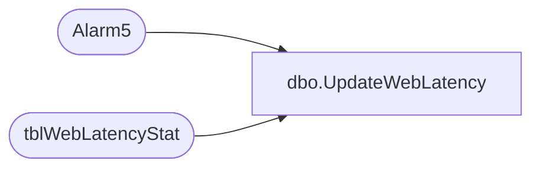

# dbo.UpdateWebLatency

**Database:** Tpview  
**Server:** bedrockdb01  

## Architecture Diagram



## Table Dependencies

| Referenced Table |
|---|
| Alarm5 |
| tblWebLatencyStat |

## Stored Procedure Code

```sql
create proc UpdateWebLatency 	@storenumber 	INT,  
	@avgtrip		DECIMAL,
	@nosamples		INT
AS
DECLARE @HourlyTotal 		int
DECLARE @DailyTotal 		int
DECLARE @WeeklyTotal		int
DECLARE @HourTripTotal  	DECIMAL(18,2)
DECLARE @DailyTripTotal 	DECIMAL(18,2)
DECLARE @WeeklyTripTotal 	DECIMAL(18,2)
SET  @DailyTripTotal = 0
SET  @WeeklyTripTotal = 0
SET	 @HourTripTotal = 0
------------------------------------------------------------------------------------------------
-------------------------------------------------------------------------------------------------
--Checking if a record exists for this store.
PRINT @storenumber
print @avgtrip
print @nosamples
IF(NOT EXISTS(SELECT WebLatencyStatID FROM tblWebLatencyStat WHERE RemoteNumber = @storenumber))
BEGIN
	PRINT 'INSERTING A NEW RECORD'
	INSERT INTO tblWebLatencyStat ( RemoteNumber,LastTimeEvent,
									HourlyNbrPing,RTHourlyAvg,
									DailyNbrPing,RTDailyAvg,
									WeeklyNbrPing,RTWeeklyAvg)
	VALUES (@storenumber,GETDATE(),0,0,0,0,0,0)
	COMMIT		
END
------------------------------------------------------------------------------------------------
------------------------------------------------------------------------------------------------
-- Getting Total number of pings (Hour,Day,Week)
SELECT 	@HourlyTotal = HourlyNbrPing,
		@DailyTotal = DailyNbrPing,
		@WeeklyTotal = WeeklyNbrPing,
		@HourTripTotal = RTHourlyAvg,
		@DailyTripTotal = RTDailyAvg,
		@WeeklyTripTotal = RTWeeklyAvg
FROM tblWebLatencyStat
WHERE RemoteNumber = @storenumber
PRINT @HourTripTotal
PRINT @DailyTripTotal
PRINT @WeeklyTripTotal
PRINT (@HourTripTotal+@avgtrip)/2
PRINT (@DailyTripTotal+@avgtrip)/2
PRINT (@WeeklyTripTotal+@avgtrip)/2
------------------------------------------------------------------------------------------------
------------------------------------------------------------------------------------------------
--Updating Hourly totals for Web Latency------------------------------------------------------
IF((SELECT DATEPART(hh,LastTimeEvent) FROM tblWebLatencyStat WHERE RemoteNumber = @storenumber)= DATEPART(hh,GETDATE()))
BEGIN
	UPDATE tblWebLatencyStat SET	HourlyNbrPing = (@HourlyTotal+@nosamples),
									RTHourlyAvg = (((@HourTripTotal*@HourlyTotal)+(@avgtrip*@nosamples))/(@HourlyTotal+@nosamples))
	WHERE RemoteNumber = @storenumber
END
IF((SELECT DATEPART(hh,LastTimeEvent) FROM tblWebLatencyStat WHERE RemoteNumber = @storenumber)<>DATEPART(hh,GETDATE()))
BEGIN
	--Check for hourly alarms.
	EXEC Alarm5	@storenumber,1
	--commit in case of alarm so the insertion of new alarm is saved for processing while the update
	UPDATE tblWebLatencyStat SET	HourlyNbrPing = (@nosamples),
									RTHourlyAvg = (@avgtrip)	
	WHERE RemoteNumber = @storenumber
END
--Updating Daily totals for Web Latency-------------------------------------------------------
IF((SELECT DATEPART(dd,LastTimeEvent) FROM tblWebLatencyStat WHERE RemoteNumber = @storenumber)=DATEPART(dd,GETDATE()))
BEGIN
	UPDATE tblWebLatencyStat SET	DailyNbrPing = (@DailyTotal+@nosamples),
									RTDailyAvg = ((@DailyTripTotal*@DailyTotal)+(@avgtrip*@nosamples))/(@DailyTotal+@nosamples)
	WHERE RemoteNumber = @storenumber
END
IF((SELECT DATEPART(dd,LastTimeEvent) FROM tblWebLatencyStat WHERE RemoteNumber = @storenumber)!= DATEPART(dd,GETDATE()))
BEGIN
	EXEC Alarm5 @storenumber,2
	UPDATE tblWebLatencyStat SET	DailyNbrPing = (@nosamples),
									RTDailyAvg = (@avgtrip)	
	WHERE RemoteNumber = @storenumber
END
--Updating Weekly totals for web latency-------------------------------------------------------
IF((SELECT DATEPART(ww,LastTimeEvent) FROM tblWebLatencyStat WHERE RemoteNumber = @storenumber)=DATEPART(ww,GETDATE()))
BEGIN
	UPDATE tblWebLatencyStat SET	WeeklyNbrPing = (@WeeklyTotal+@nosamples),
									RTWeeklyAvg = ((@WeeklyTotal *@WeeklyTripTotal)+(@avgtrip*@nosamples))/(@WeeklyTotal+@nosamples)
	WHERE RemoteNumber = @storenumber
END
IF((SELECT DATEPART(ww,LastTimeEvent) FROM tblWebLatencyStat WHERE RemoteNumber = @storenumber)!= DATEPART(ww,GETDATE()))
BEGIN
	EXEC Alarm5 @storenumber,3
	UPDATE tblWebLatencyStat SET	WeeklyNbrPing = (@nosamples),
									RTWeeklyAvg = (@avgtrip)	
	WHERE RemoteNumber = @storenumber
END
--Update LastEventTime--------------------------------------------------------------------------
	UPDATE tblWebLatencyStat SET LastTimeEvent = GETDATE()	
	WHERE RemoteNumber = @storenumber
------------------------------------------------------------------------------------------------------------------------


dbo,dt_generateansiname,/* 
**	Generate an ansi name that is unique in the dtproperties.value column 
*/ 
create procedure dbo.dt_generateansiname(@name varchar(255) output) 
as 
	declare @prologue varchar(20) 
	declare @indexstring varchar(20) 
	declare @index integer 
 
	set @prologue = 'MSDT-A-' 
	set @index = 1 
 
	while 1 = 1 
	begin 
		set @indexstring = cast(@index as varchar(20)) 
		set @name = @prologue + @indexstring 
		if not exists (select value from dtproperties where value = @name) 
			break 
		 
		set @index = @index + 1 
 
		if (@index = 10000) 
			goto TooMany 
	end 
 
Leave: 
 
	return 
 
TooMany: 
 
	set @name = 'DIAGRAM' 
	goto Leave 

dbo,dt_adduserobject,/*
**	Add an object to the dtproperties table
*/
create procedure dbo.dt_adduserobject
as
	set nocount on
	/*
	** Create the user object if it does not exist already
	*/
	begin transaction
		insert dbo.dtproperties (property) VALUES ('DtgSchemaOBJECT')
		update dbo.dtproperties set objectid=@@identity 
			where id=@@identity and property='DtgSchemaOBJECT'
	commit
	return @@identity

dbo,dt_setpropertybyid,/*
**	If the property already exists, reset the value; otherwise add property
**		id -- the id in sysobjects of the object
**		property -- the name of the property
**		value -- the text value of the property
**		lvalue -- the binary value of the property (image)
*/
create procedure dbo.dt_setpropertybyid
	@id int,
	@property varchar(64),
	@value varchar(255),
	@lvalue image
as
	set nocount on
	declare @uvalue nvarchar(255) 
	set @uvalue = convert(nvarchar(255), @value) 
	if exists (select * from dbo.dtproperties 
			where objectid=@id and property=@property)
	begin
		--
		-- bump the version count for this row as we update it
		--
		update dbo.dtproperties set value=@value, uvalue=@uvalue, lvalue=@lvalue, version=version+1
			where objectid=@id and property=@property
	end
	else
	begin
		--
		-- version count is auto-set to 0 on initial insert
		--
		insert dbo.dtproperties (property, objectid, value, uvalue, lvalue)
			values (@property, @id, @value, @uvalue, @lvalue)
	end


dbo,dt_getobjwithprop,/*
**	Retrieve the owner object(s) of a given property
*/
create procedure dbo.dt_getobjwithprop
	@property varchar(30),
	@value varchar(255)
as
	set nocount on

	if (@property is null) or (@property = '')
	begin
		raiserror('Must specify a property name.',-1,-1)
		return (1)
	end

	if (@value is null)
		select objectid id from dbo.dtproperties
			where property=@property

	else
		select objectid id from dbo.dtproperties
			where property=@property and value=@value

dbo,dt_getpropertiesbyid,/*
**	Retrieve properties by id's
**
**	dt_getproperties objid, null or '' -- retrieve all properties of the object itself
**	dt_getproperties objid, property -- retrieve the property specified
*/
create procedure dbo.dt_getpropertiesbyid
	@id int,
	@property varchar(64)
as
	set nocount on

	if (@property is null) or (@property = '')
		select property, version, value, lvalue
			from dbo.dtproperties
			where  @id=objectid
	else
		select property, version, value, lvalue
			from dbo.dtproperties
			where  @id=objectid and @property=property

dbo,dt_setpropertybyid_u,/*
**	If the property already exists, reset the value; otherwise add property
**		id -- the id in sysobjects of the object
**		property -- the name of the property
**		uvalue -- the text value of the property
**		lvalue -- the binary value of the property (image)
*/
create procedure dbo.dt_setpropertybyid_u
	@id int,
	@property varchar(64),
	@uvalue nvarchar(255),
	@lvalue image
as
	set nocount on
	-- 
	-- If we are writing the name property, find the ansi equivalent. 
	-- If there is no lossless translation, generate an ansi name. 
	-- 
	declare @avalue varchar(255) 
	set @avalue = null 
	if (@uvalue is not null) 
	begin 
		if (convert(nvarchar(255), convert(varchar(255), @uvalue)) = @uvalue) 
		begin 
			set @avalue = convert(varchar(255), @uvalue) 
		end 
		else 
		begin 
			if 'DtgSchemaNAME' = @property 
			begin 
				exec dbo.dt_generateansiname @avalue output 
			end 
		end 
	end 
	if exists (select * from dbo.dtproperties 
			where objectid=@id and property=@property)
	begin
		--
		-- bump the version count for this row as we update it
		--
		update dbo.dtproperties set value=@avalue, uvalue=@uvalue, lvalue=@lvalue, version=version+1
			where objectid=@id and property=@property
	end
	else
	begin
		--
		-- version count is auto-set to 0 on initial insert
		--
		insert dbo.dtproperties (property, objectid, value, uvalue, lvalue)
			values (@property, @id, @avalue, @uvalue, @lvalue)
	end

dbo,dt_getobjwithprop_u,/*
**	Retrieve the owner object(s) of a given property
*/
create procedure dbo.dt_getobjwithprop_u
	@property varchar(30),
	@uvalue nvarchar(255)
as
	set nocount on

	if (@property is null) or (@property = '')
	begin
		raiserror('Must specify a property name.',-1,-1)
		return (1)
	end

	if (@uvalue is null)
		select objectid id from dbo.dtproperties
			where property=@property

	else
		select objectid id from dbo.dtproperties
			where property=@property and uvalue=@uvalue

dbo,dt_getpropertiesbyid_u,/*
**	Retrieve properties by id's
**
**	dt_getproperties objid, null or '' -- retrieve all properties of the object itself
**	dt_getproperties objid, property -- retrieve the property specified
*/
create procedure dbo.dt_getpropertiesbyid_u
	@id int,
	@property varchar(64)
as
	set nocount on

	if (@property is null) or (@property = '')
		select property, version, uvalue, lvalue
			from dbo.dtproperties
			where  @id=objectid
	else
		select property, version, uvalue, lvalue
			from dbo.dtproperties
			where  @id=objectid and @property=property

dbo,dt_dropuserobjectbyid,/*
**	Drop an object from the dbo.dtproperties table
*/
create procedure dbo.dt_dropuserobjectbyid
	@id int
as
	set nocount on
	delete from dbo.dtproperties where objectid=@id

dbo,dt_droppropertiesbyid,/*
**	Drop one or all the associated properties of an object or an attribute 
**
**	dt_dropproperties objid, null or '' -- drop all properties of the object itself
**	dt_dropproperties objid, property -- drop the property
*/
create procedure dbo.dt_droppropertiesbyid
	@id int,
	@property varchar(64)
as
	set nocount on

	if (@property is null) or (@property = '')
		delete from dbo.dtproperties where objectid=@id
	else
		delete from dbo.dtproperties 
			where objectid=@id and property=@property


dbo,dt_verstamp006,/*
**	This procedure returns the version number of the stored
**    procedures used by the Microsoft Visual Database Tools.
**    Current version is 7.0.00.
*/
create procedure dbo.dt_verstamp006
as
	select 7000
```

