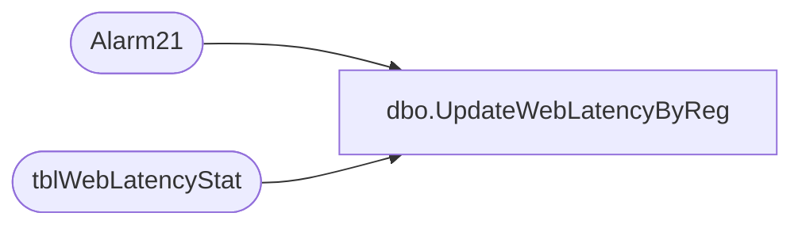

# dbo.UpdateWebLatencyByReg

**Database:** Tpview  
**Server:** bedrockdb01  

## Architecture Diagram



## Table Dependencies

| Referenced Table |
|---|
| Alarm21 |
| tblWebLatencyStat |

## Stored Procedure Code

```sql
create proc UpdateWebLatencyByReg 	@storenumber 	INT,  
	@avgtrip		DECIMAL,
	@nosamples		INT,
	@register		INT
AS
DECLARE @HourlyTotal 		int
DECLARE @DailyTotal 		int
DECLARE @WeeklyTotal		int
DECLARE @HourTripTotal  	DECIMAL(18,2)
DECLARE @DailyTripTotal 	DECIMAL(18,2)
DECLARE @WeeklyTripTotal 	DECIMAL(18,2)
SET  @DailyTripTotal = 0
SET  @WeeklyTripTotal = 0
SET	 @HourTripTotal = 0
------------------------------------------------------------------------------------------------
-------------------------------------------------------------------------------------------------
--Checking if a record exists for this store.
PRINT @storenumber
print @avgtrip
print @nosamples
IF(NOT EXISTS(SELECT WebLatencyStatID FROM tblWebLatencyStat WHERE RemoteNumber = @storenumber AND RegisterNumber = @register))
BEGIN
	PRINT 'INSERTING A NEW RECORD'
	INSERT INTO tblWebLatencyStat ( RemoteNumber,LastTimeEvent,
									HourlyNbrPing,RTHourlyAvg,
									DailyNbrPing,RTDailyAvg,
									WeeklyNbrPing,RTWeeklyAvg,RegisterNumber)
	VALUES (@storenumber,GETDATE(),0,0,0,0,0,0,@register)
	COMMIT		
END
------------------------------------------------------------------------------------------------
------------------------------------------------------------------------------------------------
-- Getting Total number of pings (Hour,Day,Week)
SELECT 	@HourlyTotal = HourlyNbrPing,
		@DailyTotal = DailyNbrPing,
		@WeeklyTotal = WeeklyNbrPing,
		@HourTripTotal = RTHourlyAvg,
		@DailyTripTotal = RTDailyAvg,
		@WeeklyTripTotal = RTWeeklyAvg
FROM tblWebLatencyStat
WHERE RemoteNumber = @storenumber AND RegisterNumber = @register
PRINT @HourTripTotal
PRINT @DailyTripTotal
PRINT @WeeklyTripTotal
PRINT (@HourTripTotal+@avgtrip)/2
PRINT (@DailyTripTotal+@avgtrip)/2
PRINT (@WeeklyTripTotal+@avgtrip)/2
------------------------------------------------------------------------------------------------
------------------------------------------------------------------------------------------------
--Updating Hourly totals for Web Latency------------------------------------------------------
IF((SELECT DATEPART(hh,LastTimeEvent) FROM tblWebLatencyStat WHERE RemoteNumber = @storenumber AND RegisterNumber = @register)= DATEPART(hh,GETDATE()))
BEGIN
	UPDATE tblWebLatencyStat SET	HourlyNbrPing = (@HourlyTotal+@nosamples),
									RTHourlyAvg = (((@HourTripTotal*@HourlyTotal)+(@avgtrip*@nosamples))/(@HourlyTotal+@nosamples))
	WHERE RemoteNumber = @storenumber AND RegisterNumber = @register
END
IF((SELECT DATEPART(hh,LastTimeEvent) FROM tblWebLatencyStat WHERE RemoteNumber = @storenumber AND RegisterNumber = @register)<>DATEPART(hh,GETDATE()))
BEGIN
	--Check for hourly alarms.
	EXEC Alarm21	@storenumber,1,@register
	--commit in case of alarm so the insertion of new alarm is saved for processing while the update
	UPDATE tblWebLatencyStat SET	HourlyNbrPing = (@nosamples),
									RTHourlyAvg = (@avgtrip)	
	WHERE RemoteNumber = @storenumber AND RegisterNumber = @register
END
--Updating Daily totals for Web Latency-------------------------------------------------------
IF((SELECT DATEPART(dd,LastTimeEvent) FROM tblWebLatencyStat WHERE RemoteNumber = @storenumber AND RegisterNumber = @register)=DATEPART(dd,GETDATE()))
BEGIN
	UPDATE tblWebLatencyStat SET	DailyNbrPing = (@DailyTotal+@nosamples),
									RTDailyAvg = ((@DailyTripTotal*@DailyTotal)+(@avgtrip*@nosamples))/(@DailyTotal+@nosamples)
	WHERE RemoteNumber = @storenumber AND RegisterNumber = @register
END
IF((SELECT DATEPART(dd,LastTimeEvent) FROM tblWebLatencyStat WHERE RemoteNumber = @storenumber AND RegisterNumber = @register)!= DATEPART(dd,GETDATE()))
BEGIN
	EXEC Alarm21 @storenumber,2,@register
	UPDATE tblWebLatencyStat SET	DailyNbrPing = (@nosamples),
									RTDailyAvg = (@avgtrip)	
	WHERE RemoteNumber = @storenumber AND RegisterNumber = @register
END
--Updating Weekly totals for web latency-------------------------------------------------------
IF((SELECT DATEPART(ww,LastTimeEvent) FROM tblWebLatencyStat WHERE RemoteNumber = @storenumber AND RegisterNumber = @register)=DATEPART(ww,GETDATE()))
BEGIN
	UPDATE tblWebLatencyStat SET	WeeklyNbrPing = (@WeeklyTotal+@nosamples),
									RTWeeklyAvg = ((@WeeklyTotal *@WeeklyTripTotal)+(@avgtrip*@nosamples))/(@WeeklyTotal+@nosamples)
	WHERE RemoteNumber = @storenumber AND RegisterNumber = @register
END
IF((SELECT DATEPART(ww,LastTimeEvent) FROM tblWebLatencyStat WHERE RemoteNumber = @storenumber AND RegisterNumber = @register)!= DATEPART(ww,GETDATE()))
BEGIN
	EXEC Alarm21 @storenumber,3,@register
	UPDATE tblWebLatencyStat SET	WeeklyNbrPing = (@nosamples),
									RTWeeklyAvg = (@avgtrip)	
	WHERE RemoteNumber = @storenumber AND RegisterNumber = @register
END
--Update LastEventTime--------------------------------------------------------------------------
	UPDATE tblWebLatencyStat SET LastTimeEvent = GETDATE()	
	WHERE RemoteNumber = @storenumber AND RegisterNumber = @register
------------------------------------------------------------------------------------------------------------------------
```

