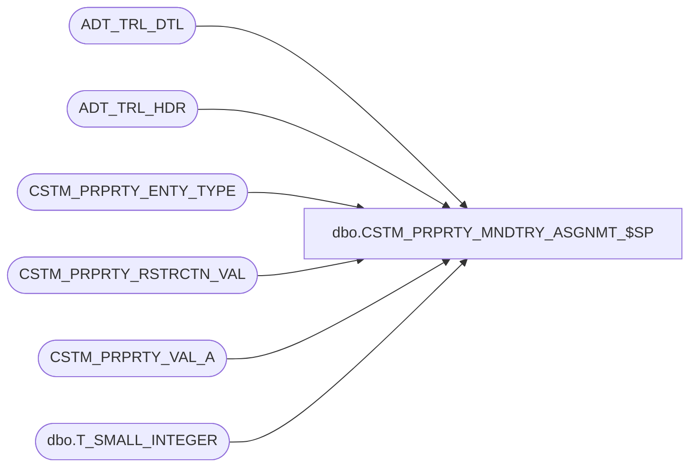

# dbo.CSTM_PRPRTY_MNDTRY_ASGNMT_$SP

**Database:** auditworks  
**Server:** bedrockdb01  

## Architecture Diagram



## Table Dependencies

| Referenced Table |
|---|
| ADT_TRL_DTL |
| ADT_TRL_HDR |
| CSTM_PRPRTY_ENTY_TYPE |
| CSTM_PRPRTY_RSTRCTN_VAL |
| CSTM_PRPRTY_VAL_A |
| dbo.T_SMALL_INTEGER |

## Stored Procedure Code

```sql
CREATE PROC [dbo].[CSTM_PRPRTY_MNDTRY_ASGNMT_$SP]
(
   @custom_property_type dbo.T_SMALL_INTEGER,
   @user_id AS smallint  = 0, 
   @now SMALLDATETIME 
)
AS
    
  /*
    Procedure : CSTM_PRPRTY_MNDTRY_ASGNMT_$SP
    Purpose   : Assign mandatory custom properties to all entities if not already assigned.

    HISTORY:
    Date         Name					Def# Desc
	Jun 19, 2015 Maria Van Geeteruyen   Initial Creation
	Jul 15, 2015 Maria Van Geeteruyen   Adding audit trail for the new assignments
	Aug  5, 2015 Maria Van Geeteruyen   Adding applicability (restrictions)
	Aug 17, 2015 Maria Van Geeteruyen   Remove duplicate code
 	Aug 25, 2015 Maria Van Geeteruyen   EMPLY and ORG_CHN audit trail
 	Sep  2, 2015 Maria Van Geeteruyen   adding type description to audit trail
	Oct 22, 2015 Maria Van Geeteruyen   145097 - adding custom property code to table key resource name in audit trail
	Aug 18, 2016 Yan Ding               DCRDM-99, optimize the proc to avoid timeout expiration
*/

DECLARE
   @custom_property_code        nvarchar(8),
   @element_cursor_open			int,
   @error_msg					nvarchar(1000),
   @restriction_column_name		nvarchar(50),
   @sql							nvarchar(max),
   @insert						varchar(1000);
 


CREATE TABLE #ASSGNED_ENTY (
	ASGND_ENTY_OBJCT_ID int NOT NULL,
	CSTM_PRPRTY_CODE    nvarchar(8) COLLATE DATABASE_DEFAULT NOT NULL ,
	DFLT_VAL            nvarchar(255) COLLATE DATABASE_DEFAULT);

SELECT @insert = 'INSERT INTO #ASSGNED_ENTY (ASGND_ENTY_OBJCT_ID, CSTM_PRPRTY_CODE, DFLT_VAL) ';

BEGIN
       


      
	-- assign mandatory custom property to employees if not already assigned
	IF @custom_property_type = 1
	BEGIN   
		SELECT @sql = @insert + 
			'SELECT e.EMPLY_NUM, c.CSTM_PRPRTY_CODE, c.DFLT_VAL
			 FROM EMPLY e WITH (NOLOCK)
			 JOIN CSTM_PRPRTY c WITH (NOLOCK)
				 ON  e.ACTV = 1
				 AND c.CSTM_PRPRTY_TYPE = 1
				 AND c.IS_MNDTRY = 1
				 AND c.ACTV = 1
			 WHERE NOT EXISTS (
				 SELECT *
				 FROM CSTM_PRPRTY_VAL_A a WITH (NOLOCK)
				 WHERE a.CSTM_PRPRTY_CODE = c.CSTM_PRPRTY_CODE
				 AND a.CSTM_PRPRTY_TYPE = c.CSTM_PRPRTY_TYPE
				 AND a.ASGND_ENTY_OBJCT_ID = e.EMPLY_NUM
				 AND a.CSTM_PRPRTY_TYPE = 1)'

	END 
	ELSE IF @custom_property_type = 2
	BEGIN
		SELECT @sql = @insert +
			'SELECT l.ORG_CHN_NUM, c.CSTM_PRPRTY_CODE, c.DFLT_VAL
			 FROM ORG_CHN l WITH (NOLOCK)
			 JOIN CSTM_PRPRTY c WITH (NOLOCK)
				 ON  l.ACTV = 1
				 AND c.CSTM_PRPRTY_TYPE = 2
				 AND c.IS_MNDTRY = 1
				 AND c.ACTV = 1
			 WHERE NOT EXISTS (
				 SELECT *
				 FROM CSTM_PRPRTY_VAL_A a WITH (NOLOCK)
				 WHERE a.CSTM_PRPRTY_CODE = c.CSTM_PRPRTY_CODE
				 AND a.CSTM_PRPRTY_TYPE = c.CSTM_PRPRTY_TYPE
				 AND a.ASGND_ENTY_OBJCT_ID = l.ORG_CHN_NUM
				 AND a.CSTM_PRPRTY_TYPE = 2)'
	END

	DECLARE applicable_element_list CURSOR FOR
		SELECT DISTINCT CSTM_PRPRTY_CODE, RSTRCTN_CLMN_NAME
		FROM CSTM_PRPRTY_RSTRCTN_VAL
		WHERE CSTM_PRPRTY_TYPE = @custom_property_type

	BEGIN TRY
		OPEN applicable_element_list;
	END TRY

	BEGIN CATCH
		SELECT @error_msg = 'Failed to open applicable element custom properties cursor - ' + ERROR_MESSAGE();
		GOTO error_handler;
	END CATCH

	SELECT @element_cursor_open = 1;

	WHILE 1 = 1
	BEGIN
		BEGIN TRY
			FETCH applicable_element_list INTO @custom_property_code, @restriction_column_name;
		END TRY
		BEGIN CATCH
			SELECT @error_msg = 'Failed to fetch next applicable element custom property record - ' + ERROR_MESSAGE();
			GOTO error_handler;
		END CATCH

		IF @@fetch_status <> 0
		BREAK

		BEGIN TRY
			SELECT @sql = @sql + 
				' AND ' + @restriction_column_name + ' IN (
				     SELECT ENTY_RSTRCTN_VAL
				     FROM CSTM_PRPRTY_RSTRCTN_VAL
				     WHERE CSTM_PRPRTY_TYPE = ' + CONVERT(varchar, @custom_property_type) +
				   ' AND CSTM_PRPRTY_CODE = ''' + @custom_property_code + '''
				     AND RSTRCTN_CLMN_NAME = ''' + @restriction_column_name + ''') ';
		END TRY
		BEGIN CATCH
			SELECT @error_msg = 'Failed to add applicability custom property ''' + @custom_property_code + ''' for column ''' + @restriction_column_name + ''' - ' + ERROR_MESSAGE();
			GOTO error_handler;
		END CATCH
	END
	  
	CLOSE applicable_element_list;
	DEALLOCATE applicable_element_list;
	SET @element_cursor_open = 0;
		
	BEGIN TRY
		-- Insert employees that need assignment into temp
		EXEC sp_executesql @sql;
        
		-- Assign property
		INSERT INTO CSTM_PRPRTY_VAL_A
			(ASGND_ENTY_OBJCT_ID, CSTM_PRPRTY_CODE,  CSTM_PRPRTY_TYPE, DATA_VAL)
		SELECT ASGND_ENTY_OBJCT_ID, CSTM_PRPRTY_CODE, @custom_property_type, DFLT_VAL
		FROM #ASSGNED_ENTY;
		
		-- Audit Trail Detail for assignment
		INSERT INTO ADT_TRL_DTL 
			(ENTRY_ID,
			TBL_NAME,
			TBL_KEY,
			TBL_KEY_RSRC_NAME,
			TBL_KEY_RSRC_PRMS,
			ACTN_CODE,
			CLMN_NAME,
			OLD_VAL,
			NEW_VAL)  
		SELECT ENTRY_ID,
			'CSTM_PRPRTY_VAL_A',
			a.CSTM_PRPRTY_CODE + '' + convert(varchar,  @custom_property_type) + '' + convert(varchar,  a.ASGND_ENTY_OBJCT_ID),
			CASE @custom_property_type WHEN 1 THEN 'TK_CUST_PROP_CODE_EMPL_NUMB' WHEN 2 THEN 'TK_CUST_PROP_CODE_LOCA_NUMB' END,
			a.CSTM_PRPRTY_CODE + '' + convert(varchar,  a.ASGND_ENTY_OBJCT_ID),
			'A',
			'CSTM_PRPRTY_TYPECSTM_PRPRTY_CODEASGND_ENTY_OBJCT_IDDATA_VAL',
			'',
			t.CSTM_PRPRTY_TYPE_DESC +'' + a.CSTM_PRPRTY_CODE + '' + convert(varchar,  a.ASGND_ENTY_OBJCT_ID) + '' + a.DFLT_VAL + ' '
		FROM #ASSGNED_ENTY a
		INNER JOIN ADT_TRL_HDR h WITH (NOLOCK)
		   ON  h.ROOT_TBL_KEY IN (a.CSTM_PRPRTY_CODE + '' + convert(varchar,  @custom_property_type) + '', convert(varchar,  a.ASGND_ENTY_OBJCT_ID) + '')
		   AND h.ENTRY_DATE_TIME > @now
		   AND h.USER_ID = @user_id
		   AND h.APP_ID = 1000
		   AND h.ROOT_TBL_NAME IN ('EMPLY', 'ORG_CHN', 'CSTM_PRPRTY')
		INNER JOIN CSTM_PRPRTY_ENTY_TYPE t WITH (NOLOCK)
		   ON t.CSTM_PRPRTY_TYPE = @custom_property_type;			    
		
		TRUNCATE TABLE #ASSGNED_ENTY;
	END TRY
	BEGIN CATCH
		SELECT @error_msg = 'Failed to assign mandatory custom properties to entities - ' + ERROR_MESSAGE();
		GOTO error_handler;
	END CATCH
	

   
   DROP TABLE #ASSGNED_ENTY;

   RETURN;
	
error_handler:


    IF @element_cursor_open = 1
    BEGIN
      CLOSE applicable_element_list;
      DEALLOCATE applicable_element_list;    
    END
    
    IF @@TRANCOUNT > 0 
       ROLLBACK;

    RAISERROR (@error_msg, 16, 1); /* System Errors will be reported with SQL error code = 50000 */


END
```

