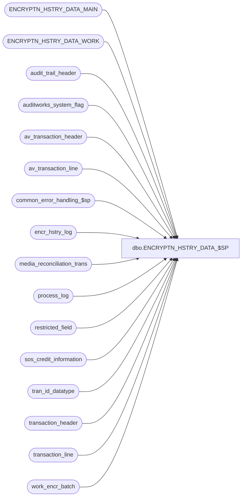

# dbo.ENCRYPTN_HSTRY_DATA_$SP

**Database:** auditworks  
**Server:** bedrockdb01  

## Architecture Diagram



## Table Dependencies

| Referenced Table |
|---|
| ENCRYPTN_HSTRY_DATA_MAIN |
| ENCRYPTN_HSTRY_DATA_WORK |
| audit_trail_header |
| auditworks_system_flag |
| av_transaction_header |
| av_transaction_line |
| common_error_handling_$sp |
| encr_hstry_log |
| media_reconciliation_trans |
| process_log |
| restricted_field |
| sos_credit_information |
| tran_id_datatype |
| transaction_header |
| transaction_line |
| work_encr_batch |

## Stored Procedure Code

```sql
create proc dbo.ENCRYPTN_HSTRY_DATA_$SP 
(
 @restart 	tinyint = 0, -- ( 0: continue, 1: restart)
 @action 	tinyint = 0  -- ( 0: encrypt, 1: re-encrypt (key rotation), 2: decrypt)
) 

 AS

/* 
  Name: ENCRYPTN_HSTRY_DATA_$SP
  Desc: [SA5 version] Called from C++/C# History Encryption utility repeatedly until there is no more work to do.
        This proc populates a batch of rows to be encrypted into a work table and then the calling C logic encrypts
        those rows and updates the actual table from the work table. The @batch_size must not not be set too large since that
        could adversely affect the query plan of the C# update statement.
        This proc will populate 2 tables and will drop and recreate those tables to get the correct number of columns:
        ENCRYPTN_HSTRY_DATA_MAIN - containing information about the table and columns that need to be encrypted; 
        ENCRYPTN_HSTRY_DATA_WORK - containing actual row values that require encryption and the keys to the table.
        The proc will return 0 if there is nothing to process, otherwise it will return the number of key columns.
        When encrypting, exclude ref numbers < 3 char to avoid non-numerics such as a dash that pass the isnumeric test.
        
        This proc will search tables in the following order and will return when as soon as any work to do is found : 
        employee, sos_credit_information,av_transaction_line, transaction_line, media_reconciliation_trans, audit_trail_detail
        This proc logs timings for each batch to process_log under process_no = 11.
        The @batch_size variable limits the max number of rows to be encrypted per batch.

        For SA5, the old audit trail table would still exist for inquiry purposes after upgrading to SA5, but would no
        longer be updated. After upgrade to SA5, the EMPLY table might need to be encrypted. To encrypt EMPLY, insert a
        row into restricted_field (field_name = 'HS_ACNT_NUM', active_flag = 1, restriction_level = 1). For new installs of
        SA5, the EMPLY table would be encrypted by CRDM tm and the old audit trail would never require encryption.

	**** Must script with ansi_warnings and ansi_nulls on to support scaleout

History:
Date     Name           Defect#  Desc
Jan18,13 Paul            141217  only encrypt av tables if running on consolidated server
Jul24,12 Paul            137171  handle sos_credit_info having more than 200000 rows by batching on tran date
Nov30,11 Paul            131532  When tokenizing and @action = 0 (first time), then avoid looping more than once for sos, EMPLY or audit trail
				because tokenizing for first time passes same input values as encrypting for first time.
Nov30,11 Paul          1-47N09X  update encr_hstry_log table to facilitate support/debugging for re-encryption and tokenization
Mar10,10 Paul            116446  Bypass audit trail encryption when restricted_field is not configured
Mar17,09 Vicci           107987  Redefine ENCRYPTN_HSTRY_DATA_WORK table for media_reconciliation_trans with wrong datatype to attempt to work around foundation defect not recognizing tinyint
Feb11,09 Vicci           107987  Include media_reconciliation_trans
Jan12,09 Paul            104990  uplift 106231 to SA5, added logic for scaleout
Oct24,07 Paul             93800  uplift 95091 to SA5
Dec18,06 Paul           DV-1347  port 80451 to SA5, use tran_id_datatype. Allow encryption of EMPLY table.
Dec02,05 David          DV-1319  Remove tables that do not exist in 5.0: employee.

Nov19,08 Paul            106231  Handle re-encryption. Improve performance of audit_trail encryption by building query.
Nov14,07 Paul             95091  When encrypting tran line or av tran line, reset @end_tran_id to @max_tran_id.
Dec15,06 Paul             80451  improve performance by adding range limits to the select from av_transaction_line and
					transaction_line. Also eliminate join to restricted_field for those tables.
					Avoided using set rowcount since it doesn't limit the numer of rows searched.
Sep15.06 Daphna           77300  Add 2nd index for each data work table with key cols
Jun16,06 Daphna 73655  Performance: add new index (re av tran line), reduce batch size
Dec20,05 David            65081  Modified audit trail section to use temp table.
Nov08,05 David            62921  Receive 2 parameters.
Oct17,05 David            61728  Allow alpha-numeric house_account_no to be encrypted.
Sep07,05 David            60076  Author.

*/

DECLARE @batch_size			int,
	@clause2				nvarchar(200),
	@continue			tinyint,
	@end_tran_id			tran_id_datatype,
	@end_tran_date			smalldatetime,
        @errmsg 				nvarchar(255),
	@errno				int,
	@exec_flag			tinyint,
	@file_name			nvarchar(255),
	@key_end			nvarchar(30),
	@key_start			nvarchar(30),
	@loop_counter			smallint,
	@max_tran_id			tran_id_datatype,
	@max_transaction_date		smalldatetime,
	@message_id			int,
	@object_name			nvarchar(255),
	@operation_name     		nvarchar(100),
	@process_name			nvarchar(100),
	@process_no 			smallint,
	@process_start_time 		datetime,
	@ref_type_list			nvarchar(80),
	@return_code			tinyint,
	@rows				int,
	@rows2				int,
	@scaleout_flag			int,
	@sql_command 			nvarchar(4000),
	@start_tran_id			tran_id_datatype,
	@start_tran_date		smalldatetime,
	@table_name			nvarchar(80),
	@updated_ref_type			smallint

-- required in a scaleout peripheral environment
SET ANSI_NULLS ON
SET ANSI_WARNINGS ON

SELECT @process_name = 'ENCRPTN_HSTRY_DATA_$SP',
       @file_name = 'History encryption in progress... ',
       @process_no = 11,
       @process_start_time = getdate(),
       @return_code = 0,
       @message_id = 201068,
       @rows = 0,
       @updated_ref_type = -1,
       @loop_counter = 0,
       @start_tran_id = 0,
       @ref_type_list = ' ',
       @batch_size = 20000

-- Only Encrypting or Re-encryting is supported.
IF @action >= 2
  RETURN 0

/* Since only the reference_no column can be encrypted in transaction_line, build a delimited list of reference types
   that are to be encrypted. This will be used as an in clause to avoid a join to table restricted_field on each line */

-- Use @updated_ref_type temporarily

WHILE @loop_counter < 256 -- should find only a few rows
BEGIN

  SELECT @updated_ref_type = MIN(field_value)
    FROM restricted_field
   WHERE field_name = 'reference_type'
   AND restriction_level = 1
   AND active_flag = 1
   AND field_value > @updated_ref_type

  IF @updated_ref_type IS NULL --then
    SELECT @loop_counter = 999
  ELSE
    BEGIN
     IF @loop_counter = 0
       SELECT @ref_type_list = CONVERT(nvarchar,@updated_ref_type)
     ELSE
       SELECT @ref_type_list = @ref_type_list + ',' + CONVERT(nvarchar,@updated_ref_type)

     SELECT @loop_counter = @loop_counter + 1
    END

END -- While @loop_counter < 256	    

IF  @ref_type_list = ' '
  BEGIN
   SELECT @errno = 201613,
	  @errmsg = 'WARNING: SA Encryption Utility did not find any active rows in master table restricted_field.',
	  @object_name = 'restricted_field',
	  @operation_name = 'SELECT',
	  @message_id = 201571

	EXEC common_error_handling_$sp @process_no, @errno, @errmsg, 0, @message_id, 
		@process_name, @object_name, @operation_name, 0, 1, 0, null, 0, null,
		null, null, null, null, null, 0, 0, null
  END

SET ROWCOUNT @batch_size

INSERT INTO process_log 
VALUES (@process_start_time, @process_no, 0, @process_start_time, @rows, 0, @file_name, NULL, 1)
  
  SELECT @errno = @@error
  IF @errno != 0
  BEGIN
    SELECT @errmsg = ' failed to insert process_log.',
           @object_name = 'process_log',
           @operation_name = 'INSERT'
    GOTO error
  END

SELECT @scaleout_flag = CONVERT(int,flag_numeric_value)
  FROM auditworks_system_flag
 WHERE flag_name = 'scaleout_flag'
SELECT @rows = @@rowcount, @errno = @@error
IF @errno != 0 OR @rows = 0
BEGIN
  SELECT @errmsg = 'Failed to select scaleout_flag from auditworks_system_flag',
         @object_name = 'auditworks_system_flag',
         @operation_name = 'SELECT'
  GOTO error
END

-- Check for data that needs to be encrypted
-- The existence of rows in ENCRYPTN_HSTRY_DATA_MAIN that was inserted by subsequent code blocks
-- means that the following code block has already been executed
-- Table ENCRYPTN_HSTRY_DATA_MAIN will be truncated when there is no encryption work left to do for any table

-- **** Start of EMPLOYEE logic ****

IF @action > 0
  SET ROWCOUNT 0 -- one batch to avoid batching logic problems when re-encrypting

-- Determine whether employee needs to be done 
SELECT @exec_flag = 0
IF NOT EXISTS (SELECT 1
             FROM ENCRYPTN_HSTRY_DATA_MAIN
               WHERE TBL_NAME IN ('sos_credit_information','av_transaction_line','transaction_line','audit_trail_detail','media_reconciliation_trans'))
  BEGIN
   IF EXISTS (SELECT 1 
             FROM restricted_field
            WHERE field_name = 'HS_ACNT_NUM'  --Note:  this row does not exist for new 5.0 implementations, only for clients upgrading from pre-4.1 where EMPLY was populated from employee since CRDM enforces encryption with no option to deactivate it.
              AND active_flag = 1
              AND restriction_level = 1) 
      SELECT @exec_flag = 1

     -- only execute a single batch
   IF EXISTS (SELECT 1 FROM work_encr_batch
		WHERE tbl_name = 'EMPLY')
	  SELECT @exec_flag = 0 -- already done
	ELSE
	  INSERT INTO work_encr_batch (tbl_name,transaction_id)
	  VALUES ('EMPLY',0) -- set flag when first batch
  END

IF @exec_flag = 1 -- employee
BEGIN
  SELECT @table_name = 'EMPLY',
	@key_start = NULL, -- all
	@key_end = NULL

  IF EXISTS (SELECT 1
               FROM ENCRYPTN_HSTRY_DATA_MAIN
              WHERE TBL_NAME = 'EMPLY')   
  BEGIN -- not first pass on employee
    IF EXISTS (select 1 from sysindexes where id = object_id('ENCRYPTN_HSTRY_DATA_WORK')  and name ='ENCRYPTN_HSTRY_DATA_WORK_X1')
    BEGIN
      DROP INDEX dbo.ENCRYPTN_HSTRY_DATA_WORK.ENCRYPTN_HSTRY_DATA_WORK_X1
    END
    
    IF EXISTS (select 1 from sysindexes where id = object_id('ENCRYPTN_HSTRY_DATA_WORK')  and name ='ENCRYPTN_HSTRY_DATA_WORK_X2')
    BEGIN
      DROP INDEX dbo.ENCRYPTN_HSTRY_DATA_WORK.ENCRYPTN_HSTRY_DATA_WORK_X2
    END

    TRUNCATE TABLE ENCRYPTN_HSTRY_DATA_WORK
    
      SELECT @errno = @@error
      IF @errno != 0
      BEGIN
        SELECT @errmsg = 'Failed to truncate work table (EMPLY).',
               @object_name = 'ENCRYPTN_HSTRY_DATA_WORK',
               @operation_name = 'TRUNCATE'
        GOTO error
      END
  END
  ELSE
  BEGIN -- first pass on employee
    DROP TABLE dbo.ENCRYPTN_HSTRY_DATA_MAIN
    
    CREATE TABLE dbo.ENCRYPTN_HSTRY_DATA_MAIN
    (TBL_NAME  nvarchar(30) NOT NULL
    ,CLMN_NAME nvarchar(30) NOT NULL
    ,KEY_CLMN_1 nvarchar(30) NOT NULL)

    SELECT @errno = @@error
    IF @errno != 0
    BEGIN
      SELECT @errmsg = 'Failed to create ENCRYPTN_HSTRY_DATA_MAIN (EMPLY).',
             @object_name = 'ENCRYPTN_HSTRY_DATA_MAIN',
             @operation_name = 'CREATE'
      GOTO error
    END

    SELECT @sql_command = 'INSERT INTO ENCRYPTN_HSTRY_DATA_MAIN 
			   VALUES (''EMPLY'', ''HS_ACNT_NUM'', ''EMPLY_NUM'')'
    EXEC sp_executesql @sql_command

      SELECT @errno = @@error
      IF @errno != 0
      BEGIN
        SELECT @errmsg = 'Failed to populate ENCRYPTN_HSTRY_DATA_MAIN (EMPLY).',
               @object_name = 'ENCRYPTN_HSTRY_DATA_MAIN',
               @operation_name = 'INSERT'
        GOTO error
      END

    DROP TABLE dbo.ENCRYPTN_HSTRY_DATA_WORK

    CREATE TABLE dbo.ENCRYPTN_HSTRY_DATA_WORK
    (KEY_VAL nvarchar(500) NOT NULL
    ,ENCRYPTD_KEY_VAL nvarchar(500) NULL
    ,EMPLY_NUM nvarchar(80) NOT NULL)

    SELECT @errno = @@error
    IF @errno != 0
    BEGIN
      SELECT @errmsg = 'Failed to create ENCRYPTN_HSTRY_DATA_WORK (EMPLY).',
             @object_name = 'ENCRYPTN_HSTRY_DATA_WORK',
             @operation_name = 'CREATE'
      GOTO error
    END

  END -- IF tables are properly defined.

  SELECT @sql_command = 'INSERT INTO ENCRYPTN_HSTRY_DATA_WORK (KEY_VAL, EMPLY_NUM)
			SELECT HS_ACNT_NUM, EMPLY_NUM
			  FROM EMPLY 
			 WHERE HS_ACNT_NUM IS NOT NULL '

  IF @action = 0 -- only check for already processed if encrypting/tokenizing for the first time
	SELECT @sql_command = @sql_command + 
	  ' AND LEN(HS_ACNT_NUM) <= 20 '
  ELSE
	SELECT @sql_command = @sql_command + 
	  ' AND LEN(HS_ACNT_NUM) > 20 '

  SELECT @sql_command = @sql_command + '	 SELECT @rows = @@rowcount'

  EXEC sp_executesql @sql_command, N'@rows int OUT', @rows OUT

      SELECT @errno = @@error
      IF @errno != 0
      BEGIN
        SELECT @errmsg = 'Failed to populate ENCRYPTN_HSTRY_DATA_WORK (EMPLY).',
	  @object_name = 'ENCRYPTN_HSTRY_DATA_WORK',
               @operation_name = 'INSERT'
        GOTO error
      END

  IF @rows > 0 -- work to do
  BEGIN
    SELECT @sql_command = 'create index ENCRYPTN_HSTRY_DATA_WORK_X1 on dbo.ENCRYPTN_HSTRY_DATA_WORK(KEY_VAL)' 
    
    EXEC sp_executesql @sql_command

    SELECT @errno = @@error
    IF @errno != 0
    BEGIN
      SELECT @errmsg = 'Failed to create index (EMPLY).',
             @object_name = 'ENCRYPTN_HSTRY_DATA_WORK_X1',
             @operation_name = 'CREATE'
      GOTO error
    END
      
    SELECT @sql_command = 'create index ENCRYPTN_HSTRY_DATA_WORK_X2 on dbo.ENCRYPTN_HSTRY_DATA_WORK(EMPLY_NUM)' 
    
    EXEC sp_executesql @sql_command
    

    SELECT @errno = @@error
    IF @errno != 0
    BEGIN
      SELECT @errmsg = 'Failed to create 2nd index (EMPLY).',
             @object_name = 'ENCRYPTN_HSTRY_DATA_WORK_X2',
             @operation_name = 'CREATE'
      GOTO error
    END
      

    SELECT @file_name = 'EMPLY',
           @return_code = 1
    GOTO return_code
  END -- IF @rows > 0 
END -- IF @exec_flag = 1 for employee

-- **** End of EMPLOYEE logic ****


-- **** Start of SOS_CREDIT_INFORMATION logic ****

-- Determine whether sos needs to be done 
SELECT @exec_flag = 0
IF NOT EXISTS (SELECT 1
               FROM ENCRYPTN_HSTRY_DATA_MAIN
               WHERE TBL_NAME IN ('av_transaction_line','transaction_line','audit_trail_detail', 'media_reconciliation_trans'))
  BEGIN
   IF EXISTS( SELECT 1
		FROM restricted_field
		WHERE field_name = 'reference_type'
		  AND active_flag = 1 
		  AND restriction_level = 1 )
	SELECT @exec_flag = 1
  END

IF @exec_flag = 1 -- sos
BEGIN
  SET ROWCOUNT 0 /* not using batch row limit */

  SELECT @table_name = 'sos_credit_information',
	@key_start = NULL, -- all
	@key_end = NULL,
	@rows2 = 0

  IF EXISTS (SELECT 1
               FROM ENCRYPTN_HSTRY_DATA_MAIN
              WHERE TBL_NAME = 'sos_credit_information')   
  BEGIN
    IF EXISTS (select 1 from sysindexes where id = object_id('ENCRYPTN_HSTRY_DATA_WORK')  and name ='ENCRYPTN_HSTRY_DATA_WORK_X1')
    BEGIN
      DROP INDEX dbo.ENCRYPTN_HSTRY_DATA_WORK.ENCRYPTN_HSTRY_DATA_WORK_X1
    END

    IF EXISTS (select 1 from sysindexes where id = object_id('ENCRYPTN_HSTRY_DATA_WORK')  and name ='ENCRYPTN_HSTRY_DATA_WORK_X2')
    BEGIN
      DROP INDEX dbo.ENCRYPTN_HSTRY_DATA_WORK.ENCRYPTN_HSTRY_DATA_WORK_X2
    END
    
    TRUNCATE TABLE ENCRYPTN_HSTRY_DATA_WORK
    
      SELECT @errno = @@error
      IF @errno != 0
      BEGIN
        SELECT @errmsg = 'Failed to truncate work table (sos_credit_information).',
               @object_name = 'ENCRYPTN_HSTRY_DATA_WORK',
               @operation_name = 'TRUNCATE'
        GOTO error
      END
  END
  ELSE -- re-create tables
  BEGIN
    DROP TABLE dbo.ENCRYPTN_HSTRY_DATA_MAIN
    
    CREATE TABLE dbo.ENCRYPTN_HSTRY_DATA_MAIN
    (TBL_NAME  nvarchar(30) NOT NULL
    ,CLMN_NAME nvarchar(30) NOT NULL
    ,KEY_CLMN_1 nvarchar(30) NOT NULL
    ,KEY_CLMN_2 nvarchar(30) NOT NULL
    ,KEY_CLMN_3 nvarchar(30) NOT NULL
    ,KEY_CLMN_4 nvarchar(30) NOT NULL
    ,KEY_CLMN_5 nvarchar(30) NOT NULL
    ,KEY_CLMN_6 nvarchar(30) NOT NULL
    ,KEY_CLMN_7 nvarchar(30) NOT NULL)

    SELECT @errno = @@error
    IF @errno != 0
    BEGIN
      SELECT @errmsg = 'Failed to create ENCRYPTN_HSTRY_DATA_MAIN (sos_credit_information).',
             @object_name = 'ENCRYPTN_HSTRY_DATA_MAIN',
             @operation_name = 'CREATE'
      GOTO error
END

    SELECT @sql_command = 'INSERT INTO ENCRYPTN_HSTRY_DATA_MAIN 
			   VALUES (''sos_credit_information'',''account_no'',''transaction_date'',''account_no'',
			           ''cashier_no'',''store_no'',''register_no'',''transaction_no'',''entry_date_time'' )'

    EXEC sp_executesql @sql_command

      SELECT @errno = @@error
      IF @errno != 0
      BEGIN
        SELECT @errmsg = 'Failed to populate ENCRYPTN_HSTRY_DATA_MAIN (sos_credit_information).',
               @object_name = 'ENCRYPTN_HSTRY_DATA_MAIN',
               @operation_name = 'INSERT'
        GOTO error
      END

    DROP TABLE dbo.ENCRYPTN_HSTRY_DATA_WORK

    CREATE TABLE dbo.ENCRYPTN_HSTRY_DATA_WORK
    (KEY_VAL nvarchar(500) NOT NULL
    ,ENCRYPTD_KEY_VAL nvarchar(500) NULL
    ,transaction_date smalldatetime NOT NULL
    ,account_no nvarchar(80) NOT NULL
    ,cashier_no int NOT NULL
    ,store_no int NOT NULL
    ,register_no smallint NOT NULL
    ,transaction_no int NOT NULL
    ,entry_date_time datetime NOT NULL)

    SELECT @errno = @@error
    IF @errno != 0
    BEGIN
      SELECT @errmsg = 'Failed to create ENCRYPTN_HSTRY_DATA_WORK (sos_credit_information).',
             @object_name = 'ENCRYPTN_HSTRY_DATA_WORK',
             @operation_name = 'CREATE'
      GOTO error
    END
  END -- IF tables are properly defined.

-- check for last transaction_date that was processed

  SELECT @start_tran_date = transaction_date
    FROM work_encr_batch
   WHERE tbl_name = 'sos_credit_information'
   
  SELECT @errno = @@error, @rows = @@rowcount
  IF @errno != 0
    BEGIN
      SELECT @errmsg = 'Failed to select from work_encr_batch (sos_credit_information).',
             @object_name = 'work_encr_batch',
             @operation_name = 'SELECT'
      GOTO error
    END 

  IF @rows = 0 OR @start_tran_date IS NULL
    BEGIN
     SELECT @start_tran_date
      = MIN(transaction_date)
        FROM sos_credit_information

     IF @start_tran_date IS NULL
       SELECT @start_tran_date = getdate()
     ELSE
       SELECT @start_tran_date = DATEADD(dd,-1,@start_tran_date)

     IF @rows = 0
	     INSERT work_encr_batch (tbl_name, transaction_id, transaction_date)
	     VALUES ('sos_credit_information', 0, @start_tran_date)
    END

  SELECT @continue = 3
  
  -- Search using a range query of 14 days for performance
  
  WHILE @continue = 3
  BEGIN

  SELECT @end_tran_date = DATEADD(dd,14,@start_tran_date)

  SELECT @sql_command = 'INSERT INTO ENCRYPTN_HSTRY_DATA_WORK (KEY_VAL, transaction_date, account_no, cashier_no, store_no, register_no, transaction_no, entry_date_time)
			 SELECT account_no, transaction_date, account_no, cashier_no, store_no, register_no, transaction_no, entry_date_time
			   FROM sos_credit_information
			  WHERE account_no IS NOT NULL AND transaction_date > ''' + CONVERT(nvarchar, @start_tran_date,112) +
			  '''' + ' AND transaction_date <= ''' + CONVERT(nvarchar, @end_tran_date,112) + ''''
  IF @action = 0 -- only check for already encrypted if encrypting for the first time
	SELECT @sql_command = @sql_command + 
	  ' AND LEN(account_no) BETWEEN 3 AND 20 AND IsNumeric(SUBSTRING(account_no,1,20)) = 1 '
  ELSE
	SELECT @sql_command = @sql_command + 
	  ' AND LEN(account_no) > 20 ' -- already encrypted

  SELECT @sql_command = @sql_command +			     
		' SELECT @rows = @@rowcount'

  EXEC sp_executesql @sql_command, N'@rows int OUT', @rows OUT

      SELECT @errno = @@error
      IF @errno != 0
      BEGIN
        SELECT @errmsg = 'Failed to populate ENCRYPTN_HSTRY_DATA_WORK (sos_credit_information).',
               @object_name = 'ENCRYPTN_HSTRY_DATA_WORK',
               @operation_name = 'INSERT'
        GOTO error
      END

  SELECT @continue = 0
  
  IF @rows = 0
    BEGIN -- check whether end of table has been reached
	SELECT @max_transaction_date = NULL

	SELECT @max_transaction_date = MAX(transaction_date)
	FROM sos_credit_information

	IF @end_tran_date < @max_transaction_date
	  SELECT @start_tran_date = @end_tran_date,
		@continue = 3
	ELSE
	  SELECT @end_tran_date = COALESCE(@max_transaction_date,getdate())
    END
  ELSE
    BEGIN
	SELECT @rows2 = @rows2 + @rows
	IF @rows2 < @batch_size
	      SELECT @continue = 3
    END  
    -- If rows found then will bump next search range to start at > @end_tran_date since not using set rowcount

  END -- While @continue = 3

  UPDATE work_encr_batch -- bump start of next search
    SET transaction_date = @end_tran_date
   WHERE tbl_name = 'sos_credit_information'

  SELECT @errno = @@error
  IF @errno != 0
    BEGIN
	SELECT @errmsg = 'Failed to update work_encr_batch (sos_credit_information).',
		@object_name = 'work_encr_batch',
		@operation_name = 'UPDATE'
	GOTO error
    END

  -- if @rows = 0 then no matching rows were found in search range and end of table was reached

  IF @rows > 0 
  BEGIN
    SELECT @sql_command = 'create index ENCRYPTN_HSTRY_DATA_WORK_X1 on dbo.ENCRYPTN_HSTRY_DATA_WORK(KEY_VAL)'

    EXEC sp_executesql @sql_command

    SELECT @errno = @@error
    IF @errno != 0
    BEGIN
      SELECT @errmsg = 'Failed to create index (sos_credit_information).',
             @object_name = 'ENCRYPTN_HSTRY_DATA_WORK_X1',
             @operation_name = 'CREATE'
      GOTO error
    END

    SELECT @sql_command = 'create index ENCRYPTN_HSTRY_DATA_WORK_X2 on dbo.ENCRYPTN_HSTRY_DATA_WORK
                      (transaction_date, account_no, cashier_no, store_no, register_no, transaction_no, entry_date_time)'

    EXEC sp_executesql @sql_command

    SELECT @errno = @@error
    IF @errno != 0
    BEGIN
      SELECT @errmsg = 'Failed to create 2nd index (sos_credit_information).',
             @object_name = 'ENCRYPTN_HSTRY_DATA_WORK_X2',
             @operation_name = 'CREATE'
      GOTO error
    END
      
    SELECT @file_name = 'sos_credit_information',
           @return_code = 2
    GOTO return_code
  END -- IF @rows > 0 
END -- If @exec_flag = 1 for sos

-- **** end of SOS_CREDIT_INFORMATION logic ****


-- **** start of AV_TRANSACTION_LINE ****

SET ROWCOUNT 0

-- Determine whether av_transaction_line needs to be done. If running on peripheral, then don't execute.
SELECT @exec_flag = 0
IF NOT EXISTS (SELECT 1
                 FROM ENCRYPTN_HSTRY_DATA_MAIN
		 WHERE TBL_NAME IN ('transaction_line','audit_trail_detail','media_reconciliation_trans'))
  SELECT @exec_flag = 1

-- do not execute in a scaleout peripheral environment (view exists)
IF EXISTS(SELECT 1 FROM dbo.sysobjects WHERE id = Object_id('dbo.av_transaction_line') AND type = 'V') OR @scaleout_flag = 1
  SELECT @exec_flag = 0

IF @exec_flag = 1 AND @ref_type_list <> ' ' -- av_transaction_line
BEGIN
  SELECT @table_name = 'av_transaction_line',
	@key_start = NULL, -- all
	@key_end = NULL

  IF EXISTS (SELECT 1
               FROM ENCRYPTN_HSTRY_DATA_MAIN
              WHERE TBL_NAME = 'av_transaction_line')   
  BEGIN
    IF EXISTS (select 1 from sysindexes where id = object_id('ENCRYPTN_HSTRY_DATA_WORK')  and name ='ENCRYPTN_HSTRY_DATA_WORK_X1')
    BEGIN
      DROP INDEX dbo.ENCRYPTN_HSTRY_DATA_WORK.ENCRYPTN_HSTRY_DATA_WORK_X1
    END   
  
    IF EXISTS (select 1 from sysindexes where id = object_id('ENCRYPTN_HSTRY_DATA_WORK')  and name ='ENCRYPTN_HSTRY_DATA_WORK_X2')
    BEGIN
      DROP INDEX dbo.ENCRYPTN_HSTRY_DATA_WORK.ENCRYPTN_HSTRY_DATA_WORK_X2
    END

    TRUNCATE TABLE ENCRYPTN_HSTRY_DATA_WORK
    
      SELECT @errno = @@error
      IF @errno != 0
      BEGIN
        SELECT @errmsg = 'Failed to truncate work table (av_transaction_line).',
               @object_name = 'ENCRYPTN_HSTRY_DATA_WORK',
               @operation_name = 'TRUNCATE'
        GOTO error
      END
  END
  ELSE -- re-create tables
  BEGIN
    DROP TABLE dbo.ENCRYPTN_HSTRY_DATA_MAIN
    
    CREATE TABLE dbo.ENCRYPTN_HSTRY_DATA_MAIN
    (TBL_NAME  nvarchar(30) NOT NULL
    ,CLMN_NAME nvarchar(30) NOT NULL
    ,KEY_CLMN_1 nvarchar(30) NOT NULL
    ,KEY_CLMN_2 nvarchar(30) NOT NULL)

    SELECT @errno = @@error
    IF @errno != 0
    BEGIN
      SELECT @errmsg = 'Failed to create ENCRYPTN_HSTRY_DATA_MAIN (av_transaction_line).',
             @object_name = 'ENCRYPTN_HSTRY_DATA_MAIN',
             @operation_name = 'CREATE'
      GOTO error
    END

    SELECT @sql_command = 'INSERT INTO ENCRYPTN_HSTRY_DATA_MAIN 
			   VALUES (''av_transaction_line'', ''reference_no'', ''av_transaction_id'', ''line_id'')'

    EXEC sp_executesql @sql_command

    SELECT @errno = @@error
    IF @errno != 0
    BEGIN
      SELECT @errmsg = 'Failed to populate ENCRYPTN_HSTRY_DATA_MAIN (av_transaction_line).',
             @object_name = 'ENCRYPTN_HSTRY_DATA_MAIN',
             @operation_name = 'INSERT'
      GOTO error
    END

    DROP TABLE dbo.ENCRYPTN_HSTRY_DATA_WORK

    CREATE TABLE dbo.ENCRYPTN_HSTRY_DATA_WORK
    (KEY_VAL nvarchar(500) NOT NULL
    ,ENCRYPTD_KEY_VAL nvarchar(500) NULL
    ,av_transaction_id tran_id_datatype NOT NULL
    ,line_id numeric(12,0) NOT NULL)

    SELECT @errno = @@error
    IF @errno != 0
    BEGIN
      SELECT @errmsg = 'Failed to create ENCRYPTN_HSTRY_DATA_WORK (av_transaction_line).',
             @object_name = 'ENCRYPTN_HSTRY_DATA_WORK',
             @operation_name = 'CREATE'
      GOTO error
    END
  END -- IF tables are properly defined.

  -- check for last av_tran_id that was processed

  SELECT @start_tran_id = transaction_id
    FROM work_encr_batch
   WHERE tbl_name = 'av_transaction_line'
   
  SELECT @errno = @@error, @rows = @@rowcount
  IF @errno != 0
    BEGIN
      SELECT @errmsg = 'Failed to select from work_encr_batch (av_transaction_line).',
             @object_name = 'work_encr_batch',
             @operation_name = 'SELECT'
      GOTO error
    END 

  IF @rows = 0
    BEGIN
     SELECT @start_tran_id
      = MIN(av_transaction_id)
        FROM av_transaction_line

     IF @start_tran_id IS NULL
       SELECT @start_tran_id = 0

     INSERT work_encr_batch (tbl_name, transaction_id)
     VALUES ('av_transaction_line',@start_tran_id)
    END

  SELECT @key_start = CONVERT(nvarchar,@start_tran_id)
  SELECT @continue = 1
  
  -- Search using a range query for performance
  -- set search end value to a high number since many lines will not require encryption

  WHILE @continue = 1
  BEGIN

  SELECT @end_tran_id = @start_tran_id + @batch_size * 3

  SELECT @sql_command =
  'INSERT INTO ENCRYPTN_HSTRY_DATA_WORK (KEY_VAL, av_transaction_id, line_id)
   SELECT l.reference_no, l.av_transaction_id, l.line_id
	   FROM av_transaction_line l
	  WHERE l.av_transaction_id >= ' + CONVERT(nvarchar,@start_tran_id) +
	  ' AND l.av_transaction_id <= ' + CONVERT(nvarchar,@end_tran_id) +
	  ' AND l.reference_no IS NOT NULL
	    AND l.reference_type IN (' + @ref_type_list +
	 ') '
  
  IF @action = 0 -- only check for numeric if encrypting for the first time
	SELECT @sql_command = @sql_command + 
	  'AND LEN(l.reference_no) BETWEEN 3 AND 20 AND IsNumeric(SUBSTRING(l.reference_no,1,20)) = 1 '
  ELSE
	SELECT @sql_command = @sql_command + 
	  'AND LEN(l.reference_no) > 20 ' -- already encrypted

  SELECT @sql_command = @sql_command + '	 
   SELECT @rows = @@rowcount'


  EXEC sp_executesql @sql_command, N'@rows int OUT', @rows OUT

  SELECT @errno = @@error
  IF @errno != 0
  BEGIN
    SELECT @errmsg = 'Failed to populate ENCRYPTN_HSTRY_DATA_WORK (av_transaction_line).',
           @object_name = 'ENCRYPTN_HSTRY_DATA_WORK',
           @operation_name = 'INSERT'
    GOTO error
  END

  SELECT @key_end = CONVERT(nvarchar,@end_tran_id)
  SELECT @continue = 0
  
  IF @rows = 0
    BEGIN -- check whether end of table has been reached
	SELECT @max_tran_id = NULL

	SELECT @max_tran_id = MAX(av_transaction_id)
	FROM av_transaction_line

	IF @end_tran_id < @max_tran_id
	  SELECT @start_tran_id = @end_tran_id + 1,
		@continue = 1
	ELSE
	  SELECT @end_tran_id = COALESCE(@max_tran_id,0)
    END
  
  -- If rows found then will bump next search range to start at @end_tran_id + 1 since not using set rowcount

  END -- While @continue = 1

  UPDATE work_encr_batch -- bump start of next search
    SET transaction_id = @end_tran_id + 1
   WHERE tbl_name = 'av_transaction_line'

  SELECT @errno = @@error
  IF @errno != 0
    BEGIN
	SELECT @errmsg = 'Failed to update work_encr_batch (av_transaction_line).',
		@object_name = 'work_encr_batch',
		@operation_name = 'UPDATE'
	GOTO error
    END

  -- if @rows = 0 then no matching rows were found in search range and end of table was reached

  IF @rows > 0 
  BEGIN
    SELECT @sql_command = 'create index ENCRYPTN_HSTRY_DATA_WORK_X1 on dbo.ENCRYPTN_HSTRY_DATA_WORK(KEY_VAL)'

    EXEC sp_executesql @sql_command

      SELECT @errno = @@error
      IF @errno != 0
      BEGIN
        SELECT @errmsg = 'Failed to create index 1 (av_transaction_line).',
               @object_name = 'ENCRYPTN_HSTRY_DATA_WORK_X1',
               @operation_name = 'CREATE'
        GOTO error
      END

    SELECT @sql_command = 'create index ENCRYPTN_HSTRY_DATA_WORK_X2 on dbo.ENCRYPTN_HSTRY_DATA_WORK(av_transaction_id, line_id)'

    EXEC sp_executesql @sql_command

      SELECT @errno = @@error
      IF @errno != 0
      BEGIN
        SELECT @errmsg = 'Failed to create index 2 (av_transaction_line).',
               @object_name = 'ENCRYPTN_HSTRY_DATA_WORK_X2',
               @operation_name = 'CREATE'
        GOTO error
      END      

    SELECT @file_name = 'av_transaction_line',
           @return_code = 2
    GOTO return_code
  END -- IF @rows > 0 
END -- IF @exec_flag = 1 for av_transaction_line

-- **** end of AV_TRANSACTION_LINE ****


-- **** start of TRANSACTION_LINE ****

SET ROWCOUNT 0

-- Determine whether transaction_line needs to be done
SELECT @exec_flag = 0
IF NOT EXISTS (SELECT 1
                 FROM ENCRYPTN_HSTRY_DATA_MAIN
		 WHERE TBL_NAME in ('audit_trail_detail', 'media_reconciliation_trans'))
  SELECT @exec_flag = 1

IF @exec_flag = 1 AND @ref_type_list <> ' ' -- transaction_line
BEGIN
  SELECT @table_name = 'transaction_line',
	@key_start = NULL, -- all
	@key_end = NULL

  IF EXISTS (SELECT 1
 FROM ENCRYPTN_HSTRY_DATA_MAIN
              WHERE TBL_NAME = 'transaction_line')   
  BEGIN
    IF EXISTS (select 1 from sysindexes where id = object_id('ENCRYPTN_HSTRY_DATA_WORK')  and name ='ENCRYPTN_HSTRY_DATA_WORK_X1')
    BEGIN
    DROP INDEX dbo.ENCRYPTN_HSTRY_DATA_WORK.ENCRYPTN_HSTRY_DATA_WORK_X1
    END
    
    IF EXISTS (select 1 from sysindexes where id = object_id('ENCRYPTN_HSTRY_DATA_WORK')  and name ='ENCRYPTN_HSTRY_DATA_WORK_X2')
    BEGIN
    DROP INDEX dbo.ENCRYPTN_HSTRY_DATA_WORK.ENCRYPTN_HSTRY_DATA_WORK_X2
    END
    
    TRUNCATE TABLE ENCRYPTN_HSTRY_DATA_WORK
    
    SELECT @errno = @@error
    IF @errno != 0
    BEGIN
      SELECT @errmsg = 'Failed to truncate work table (transaction_line).',
             @object_name = 'ENCRYPTN_HSTRY_DATA_WORK',
             @operation_name = 'TRUNCATE'
      GOTO error
    END
  END
  ELSE -- re-create tables
  BEGIN
    DROP TABLE dbo.ENCRYPTN_HSTRY_DATA_MAIN
    
    CREATE TABLE dbo.ENCRYPTN_HSTRY_DATA_MAIN
    (TBL_NAME  nvarchar(30) NOT NULL
    ,CLMN_NAME nvarchar(30) NOT NULL
    ,KEY_CLMN_1 nvarchar(30) NOT NULL
    ,KEY_CLMN_2 nvarchar(30) NOT NULL)

    SELECT @errno = @@error
    IF @errno != 0
    BEGIN
      SELECT @errmsg = 'Failed to create ENCRYPTN_HSTRY_DATA_MAIN (transaction_line).',
             @object_name = 'ENCRYPTN_HSTRY_DATA_MAIN',
             @operation_name = 'CREATE'
      GOTO error
    END

    SELECT @sql_command = 'INSERT INTO ENCRYPTN_HSTRY_DATA_MAIN 
			   VALUES (''transaction_line'', ''reference_no'', ''transaction_id'', ''line_id'')'

   EXEC sp_executesql @sql_command

    SELECT @errno = @@error
    IF @errno != 0
    BEGIN
      SELECT @errmsg = 'Failed to populate ENCRYPTN_HSTRY_DATA_MAIN (transaction_line).',
             @object_name = 'ENCRYPTN_HSTRY_DATA_MAIN',
             @operation_name = 'INSERT'
      GOTO error
    END

    DROP TABLE dbo.ENCRYPTN_HSTRY_DATA_WORK

    CREATE TABLE dbo.ENCRYPTN_HSTRY_DATA_WORK
    (KEY_VAL nvarchar(500) NOT NULL
    ,ENCRYPTD_KEY_VAL nvarchar(500) NULL
    ,transaction_id tran_id_datatype NOT NULL
    ,line_id numeric(12,0) NOT NULL)

    SELECT @errno = @@error
    IF @errno != 0
    BEGIN
      SELECT @errmsg = 'Failed to create ENCRYPTN_HSTRY_DATA_WORK (transaction_line).',
	   @object_name = 'ENCRYPTN_HSTRY_DATA_WORK',
             @operation_name = 'CREATE'
      GOTO error
    END
  END -- IF tables are properly defined.

  -- check for last tran_id that was processed

  SELECT @start_tran_id = transaction_id
    FROM work_encr_batch
   WHERE tbl_name = 'transaction_line'
   
  SELECT @errno = @@error, @rows = @@rowcount
  IF @errno != 0
    BEGIN
      SELECT @errmsg = 'Failed to select from work_encr_batch (transaction_line).',
             @object_name = 'work_encr_batch',
             @operation_name = 'SELECT'
      GOTO error
    END 

  IF @rows = 0
    BEGIN
     SELECT @start_tran_id
      = MIN(transaction_id)
        FROM transaction_line

     IF @start_tran_id IS NULL
       SELECT @start_tran_id = 0

     INSERT work_encr_batch (tbl_name, transaction_id)
     VALUES ('transaction_line',@start_tran_id)
    END

  SELECT @key_start = CONVERT(nvarchar,@start_tran_id)
  SELECT @continue = 2
  
  -- Search using a range query for performance
  -- set search end value to a high number since many lines will not require encryption

  WHILE @continue = 2
  BEGIN

  SELECT @end_tran_id = @start_tran_id + @batch_size * 3

  SELECT @sql_command =
  'INSERT INTO ENCRYPTN_HSTRY_DATA_WORK (KEY_VAL, transaction_id, line_id)
   SELECT l.reference_no, l.transaction_id, l.line_id
	   FROM transaction_line l
	  WHERE l.transaction_id >= ' + CONVERT(nvarchar,@start_tran_id) +
	  ' AND l.transaction_id <= ' + CONVERT(nvarchar,@end_tran_id) +
	  ' AND l.reference_no IS NOT NULL
	    AND l.reference_type IN (' + @ref_type_list + ') ' 

  IF @action = 0 -- only check for numeric if encrypting for the first time
	SELECT @sql_command = @sql_command + 
	  'AND LEN(l.reference_no) BETWEEN 3 AND 20 AND IsNumeric(SUBSTRING(l.reference_no,1,20)) = 1 '
  ELSE
	SELECT @sql_command = @sql_command + 'AND LEN(l.reference_no) > 20 ' -- already encrypted 

  SELECT @sql_command = @sql_command + ' 
   SELECT @rows = @@rowcount'

  EXEC sp_executesql @sql_command, N'@rows int OUT', @rows OUT

  SELECT @errno = @@error
  IF @errno != 0
  BEGIN
    SELECT @errmsg = 'Failed to populate ENCRYPTN_HSTRY_DATA_WORK (transaction_line).',
           @object_name = 'ENCRYPTN_HSTRY_DATA_WORK',
           @operation_name = 'INSERT'
    GOTO error
  END

  SELECT @key_end = CONVERT(nvarchar,@end_tran_id)
  SELECT @continue = 0

  IF @rows = 0
    BEGIN -- check whether end of table has been reached
	SELECT @max_tran_id = NULL

	SELECT @max_tran_id = MAX(transaction_id)
	FROM transaction_line

	IF @end_tran_id < @max_tran_id
	  SELECT @start_tran_id = @end_tran_id + 1,
		@continue = 2
	ELSE
	  SELECT @end_tran_id = COALESCE(@max_tran_id,0)
    END
  
  -- If rows found then will bump next search range to start at @end_tran_id + 1 since not using set rowcount

  END -- While @continue = 2

  UPDATE work_encr_batch -- bump start of next search
    SET transaction_id = @end_tran_id + 1
   WHERE tbl_name = 'transaction_line'

  SELECT @errno = @@error
  IF @errno != 0
    BEGIN
	SELECT @errmsg = 'Failed to update work_encr_batch (transaction_line).',
		@object_name = 'work_encr_batch',
		@operation_name = 'UPDATE'
	GOTO error
    END

  -- if @rows = 0 then no matching rows were found in search range and end of table was reached

  IF @rows > 0 
  BEGIN
    SELECT @sql_command = 'create index ENCRYPTN_HSTRY_DATA_WORK_X1 on dbo.ENCRYPTN_HSTRY_DATA_WORK(KEY_VAL)'

    EXEC sp_executesql @sql_command

    SELECT @errno = @@error
    IF @errno != 0
    BEGIN
      SELECT @errmsg = 'Failed to create index (transaction_line).',
             @object_name = 'ENCRYPTN_HSTRY_DATA_WORK_X1',
             @operation_name = 'CREATE'
      GOTO error
    END

    SELECT @sql_command = 'create index ENCRYPTN_HSTRY_DATA_WORK_X2 on dbo.ENCRYPTN_HSTRY_DATA_WORK(transaction_id, line_id)'

    EXEC sp_executesql @sql_command

    SELECT @errno = @@error
    IF @errno != 0
    BEGIN
      SELECT @errmsg = 'Failed to create 2nd index (transaction_line).',
             @object_name = 'ENCRYPTN_HSTRY_DATA_WORK_X2',
             @operation_name = 'CREATE'
      GOTO error
    END

    UPDATE work_encr_batch
      SET transaction_id = @start_tran_id + @batch_size + 1
     WHERE tbl_name = 'transaction_line'

    SELECT @errno = @@error
    IF @errno != 0
    BEGIN
	SELECT @errmsg = 'Failed to update work_encr_batch (transaction_line).',
		@object_name = 'work_encr_batch',
		@operation_name = 'UPDATE'
	GOTO error
    END
    
    SELECT @file_name = 'transaction_line',
           @return_code = 2
    GOTO return_code
  END -- IF @rows > 0 
END -- IF NOT EXISTS ...

-- **** end of TRANSACTION_LINE ****


-- **** start of media_reconciliation_trans ****

SET ROWCOUNT 0

-- Determine whether media_reconciliation_trans needs to be done
SELECT @exec_flag = 0
IF NOT EXISTS (SELECT 1
                 FROM ENCRYPTN_HSTRY_DATA_MAIN
		 WHERE TBL_NAME = 'audit_trail_detail')
  SELECT @exec_flag = 1

IF @exec_flag = 1 AND @ref_type_list <> ' ' -- media_reconciliation_trans
BEGIN
  SELECT @table_name = 'media_reconciliation_trans',
	@key_start = NULL, -- all
	@key_end = NULL

  IF EXISTS (SELECT 1
               FROM ENCRYPTN_HSTRY_DATA_MAIN
              WHERE TBL_NAME = 'media_reconciliation_trans')   
  BEGIN
    IF EXISTS (select 1 from sysindexes where id = object_id('ENCRYPTN_HSTRY_DATA_WORK')  and name ='ENCRYPTN_HSTRY_DATA_WORK_X1')
    BEGIN
    DROP INDEX dbo.ENCRYPTN_HSTRY_DATA_WORK.ENCRYPTN_HSTRY_DATA_WORK_X1
    END
  
IF EXISTS (select 1 from sysindexes where id = object_id('ENCRYPTN_HSTRY_DATA_WORK')  and name ='ENCRYPTN_HSTRY_DATA_WORK_X2')
    BEGIN
    DROP INDEX dbo.ENCRYPTN_HSTRY_DATA_WORK.ENCRYPTN_HSTRY_DATA_WORK_X2
    END
    
    TRUNCATE TABLE ENCRYPTN_HSTRY_DATA_WORK
    
    SELECT @errno = @@error
    IF @errno != 0
    BEGIN
      SELECT @errmsg = 'Failed to truncate work table (media_reconciliation_trans).',
             @object_name = 'ENCRYPTN_HSTRY_DATA_WORK',
             @operation_name = 'TRUNCATE'
      GOTO error
    END
  END
  ELSE -- re-create tables
  BEGIN
    DROP TABLE dbo.ENCRYPTN_HSTRY_DATA_MAIN
    
    CREATE TABLE dbo.ENCRYPTN_HSTRY_DATA_MAIN
    (TBL_NAME  nvarchar(30) NOT NULL
    ,CLMN_NAME nvarchar(30) NOT NULL
    ,KEY_CLMN_1 nvarchar(30) NOT NULL
    ,KEY_CLMN_2 nvarchar(30) NOT NULL
    ,KEY_CLMN_3 nvarchar(30) NOT NULL
    ,KEY_CLMN_4 nvarchar(30) NOT NULL
    ,KEY_CLMN_5 nvarchar(30) NOT NULL
    ,KEY_CLMN_6 nvarchar(30) NOT NULL
    ,KEY_CLMN_7 nvarchar(30) NOT NULL)

    SELECT @errno = @@error
    IF @errno != 0
    BEGIN
      SELECT @errmsg = 'Failed to create ENCRYPTN_HSTRY_DATA_MAIN (media_reconciliation_trans).',
             @object_name = 'ENCRYPTN_HSTRY_DATA_MAIN',
             @operation_name = 'CREATE'
      GOTO error
    END

    SELECT @sql_command = 'INSERT INTO ENCRYPTN_HSTRY_DATA_MAIN 
			   VALUES (''media_reconciliation_trans'', ''reference_no'', ''transaction_id'', ''line_id'', ''balancing_entity_id'', ''rec_side'', ''rec_amount_type'', ''rec_amount_subtype'', ''entry_date_time'')'

    EXEC sp_executesql @sql_command

    SELECT @errno = @@error
    IF @errno != 0
    BEGIN
      SELECT @errmsg = 'Failed to populate ENCRYPTN_HSTRY_DATA_MAIN (media_reconciliation_trans).',
             @object_name = 'ENCRYPTN_HSTRY_DATA_MAIN',
           @operation_name = 'INSERT'
      GOTO error
    END

    DROP TABLE dbo.ENCRYPTN_HSTRY_DATA_WORK

    CREATE TABLE dbo.ENCRYPTN_HSTRY_DATA_WORK
    (KEY_VAL nvarchar(500) NOT NULL
    ,ENCRYPTD_KEY_VAL nvarchar(500) NULL
    ,transaction_id tran_id_datatype NOT NULL
    ,line_id numeric(5,0) NOT NULL
    ,balancing_entity_id numeric(10,0) NOT NULL
    ,rec_side smallint NOT NULL
/*
    ,rec_amount_type tinyint NOT NULL
    ,rec_amount_subtype tinyint NOT NULL
*/
    ,rec_amount_type smallint NOT NULL     --Defined with wrong datatype to attempt to work around foundation defect not recognizing tinyint
    ,rec_amount_subtype smallint NOT NULL  --Defined with wrong datatype to attempt to work around foundation defect not recognizing tinyint
    ,entry_date_time datetime NOT NULL)

    SELECT @errno = @@error
    IF @errno != 0
    BEGIN
      SELECT @errmsg = 'Failed to create ENCRYPTN_HSTRY_DATA_WORK (media_reconciliation_trans).',
             @object_name = 'ENCRYPTN_HSTRY_DATA_WORK',
             @operation_name = 'CREATE'
      GOTO error
    END
  END -- IF tables are properly defined.

  -- check for last tran_id that was processed

  SELECT @start_tran_id = transaction_id
    FROM work_encr_batch
   WHERE tbl_name = 'media_reconciliation_trans'
   
  SELECT @errno = @@error, @rows = @@rowcount
  IF @errno != 0
    BEGIN
      SELECT @errmsg = 'Failed to select from work_encr_batch (media_reconciliation_trans).',
             @object_name = 'work_encr_batch',
             @operation_name = 'SELECT'
      GOTO error
    END 

  IF @rows = 0
    BEGIN
     SELECT @start_tran_id
      = MIN(transaction_id)
        FROM media_reconciliation_trans

     IF @start_tran_id IS NULL
       SELECT @start_tran_id = 0
     INSERT work_encr_batch (tbl_name, transaction_id)
     VALUES ('media_reconciliation_trans',@start_tran_id)
    END

  SELECT @key_start = CONVERT(nvarchar,@start_tran_id)
  SELECT @continue = 3
  
  -- Search using a range query for performance
  -- set search end value to a high number since many lines will not require encryption

  WHILE @continue = 3
  BEGIN

  SELECT @end_tran_id = @start_tran_id + @batch_size * 3
  SELECT @sql_command =
  'INSERT INTO ENCRYPTN_HSTRY_DATA_WORK (KEY_VAL, transaction_id, line_id, balancing_entity_id, rec_side, rec_amount_type, rec_amount_subtype, entry_date_time)
   SELECT l.reference_no, l.transaction_id, l.line_id, l.balancing_entity_id, l.rec_side, l.rec_amount_type, l.rec_amount_subtype, l.entry_date_time
	   FROM media_reconciliation_trans l
	  WHERE l.transaction_id >= ' + CONVERT(nvarchar,@start_tran_id) +
	  ' AND l.transaction_id <= ' + CONVERT(nvarchar,@end_tran_id) +
	  ' AND l.reference_no IS NOT NULL
	    AND l.reference_type IN (' + @ref_type_list + ') ' 

  IF @action = 0 -- only check for numeric if encrypting for the first time
	SELECT @sql_command = @sql_command + 
	  'AND LEN(l.reference_no) BETWEEN 3 AND 20 AND IsNumeric(SUBSTRING(l.reference_no,1,20)) = 1 '
  ELSE
	SELECT @sql_command = @sql_command + 'AND LEN(l.reference_no) > 20 ' -- already encrypted 

  SELECT @sql_command = @sql_command + ' 
   SELECT @rows = @@rowcount'

  EXEC sp_executesql @sql_command, N'@rows int OUT', @rows OUT

  SELECT @errno = @@error
  IF @errno != 0
  BEGIN
    SELECT @errmsg = 'Failed to populate ENCRYPTN_HSTRY_DATA_WORK (media_reconciliation_trans).',
           @object_name = 'ENCRYPTN_HSTRY_DATA_WORK',
           @operation_name = 'INSERT'
    GOTO error
  END

  SELECT @key_end = CONVERT(nvarchar,@end_tran_id)
  SELECT @continue = 0

  IF @rows = 0
    BEGIN -- check whether end of table has been reached
	SELECT @max_tran_id = NULL

	SELECT @max_tran_id = MAX(transaction_id)
	FROM media_reconciliation_trans

	IF @end_tran_id < @max_tran_id
	  SELECT @start_tran_id = @end_tran_id + 1,
		@continue = 3
	ELSE
	  SELECT @end_tran_id = COALESCE(@max_tran_id,0)
    END
  
  -- If rows found then will bump next search range to start at @end_tran_id + 1 since not using set rowcount

  END -- While @continue = 3

  UPDATE work_encr_batch -- bump start of next search
    SET transaction_id = @end_tran_id + 1
   WHERE tbl_name = 'media_reconciliation_trans'

  SELECT @errno = @@error
  IF @errno != 0
    BEGIN
	SELECT @errmsg = 'Failed to update work_encr_batch (media_reconciliation_trans).',
		@object_name = 'work_encr_batch',
		@operation_name = 'UPDATE'
	GOTO error
    END

  -- if @rows = 0 then no matching rows were found in search range and end of table was reached

  IF @rows > 0 
  BEGIN
    SELECT @sql_command = 'create index ENCRYPTN_HSTRY_DATA_WORK_X1 on dbo.ENCRYPTN_HSTRY_DATA_WORK(KEY_VAL)'

    EXEC sp_executesql @sql_command

    SELECT @errno = @@error
    IF @errno != 0
    BEGIN
      SELECT @errmsg = 'Failed to create index (media_reconciliation_trans).',
             @object_name = 'ENCRYPTN_HSTRY_DATA_WORK_X1',
             @operation_name = 'CREATE'
      GOTO error
    END

    SELECT @sql_command = 'create index ENCRYPTN_HSTRY_DATA_WORK_X2 on dbo.ENCRYPTN_HSTRY_DATA_WORK(transaction_id, line_id, balancing_entity_id, rec_side, rec_amount_type, rec_amount_subtype, entry_date_time)'

    EXEC sp_executesql @sql_command

    SELECT @errno = @@error
    IF @errno != 0
    BEGIN
      SELECT @errmsg = 'Failed to create 2nd index (media_reconciliation_trans).',
             @object_name = 'ENCRYPTN_HSTRY_DATA_WORK_X2',
             @operation_name = 'CREATE'
      GOTO error
    END

    UPDATE work_encr_batch
      SET transaction_id = @start_tran_id + @batch_size + 1
     WHERE tbl_name = 'media_reconciliation_trans'

    SELECT @errno = @@error
    IF @errno != 0
    BEGIN
	SELECT @errmsg = 'Failed to update work_encr_batch (media_reconciliation_trans).',
		@object_name = 'work_encr_batch',
		@operation_name = 'UPDATE'
	GOTO error
    END
    
    SELECT @file_name = 'media_reconciliation_trans',
           @return_code = 7
    GOTO return_code
  END -- IF @rows > 0 
END -- IF NOT EXISTS ...

-- **** end of media_reconciliation_trans ****


-- **** start of AUDIT_TRAIL ****

SET ROWCOUNT 0

IF EXISTS (SELECT 1 FROM auditworks_system_flag
            WHERE flag_name = 'audit_trail_ref_type_updated')
BEGIN
-- 0 - reference_type field in audit_trail_header needs to be updated.
-- 1 - Already updated.
  SELECT @updated_ref_type = flag_numeric_value 
    FROM auditworks_system_flag
   WHERE flag_name = 'audit_trail_ref_type_updated'

  SELECT @errno = @@error
  IF @errno != 0
  BEGIN
    SELECT @errmsg = 'Failed to get audit_trail_ref_type_updated flag.',
           @object_name = 'auditworks_system_flag',
           @operation_name = 'SELECT'
    GOTO error
  END  
END
ELSE
BEGIN
  INSERT INTO auditworks_system_flag (flag_name, flag_numeric_value, flag_comment)
  VALUES ('audit_trail_ref_type_updated', 0, 'Used to indicate whether audit_trail_header.reference_type have been updated.')

  SELECT @errno = @@error
  IF @errno != 0
  BEGIN
    SELECT @errmsg = 'Failed to insert audit_trail_ref_type_updated flag.',
  @object_name = 'auditworks_system_flag',
           @operation_name = 'INSERT'
    GOTO error
  END  
  
  SELECT @updated_ref_type = 0
END -- IF EXISTS

IF @updated_ref_type = 0 AND @ref_type_list <> ' '
BEGIN

  SET ROWCOUNT 0

  CREATE TABLE #temp_audit_trail (
  entry_id numeric(12,0) not null,
  table_key nvarchar(255) not null,
  store_no int null,
  register_no smallint null,
  transaction_date smalldatetime null,
  date_reject_id tinyint null,
  transaction_no numeric null,
  transaction_series char(1),
  entry_date_time datetime null,
  reference_type tinyint null,
  transaction_id numeric(12,0) null)

  SELECT @errno = @@error
  IF @errno != 0
  BEGIN
    SELECT @errmsg = 'Failed to CREATE #temp_audit_trail.',
           @object_name = '#temp_audit_trail',
           @operation_name = 'CREATE'
    GOTO error
  END  

  INSERT INTO #temp_audit_trail (entry_id,
                               table_key,
                               store_no,
                               register_no,
                               transaction_date,
                               date_reject_id,
                               transaction_no,
                               transaction_series,
                               entry_date_time,
                               reference_type)
	SELECT entry_id,
                               table_key,
                               store_no,
                               register_no,
                               transaction_date,
                               date_reject_id,
                               transaction_no,
                               transaction_series,
                               entry_date_time,
                               reference_type 
	  FROM audit_trail_header ah
	 WHERE table_name = 'transaction_line'
	   AND reference_type IS NULL
	   AND function_no IN (100,150) -- only care about add and modify functions for encryption purposes

  SELECT @errno = @@error
  IF @errno != 0
  BEGIN
    SELECT @errmsg = 'Failed to populate #temp_audit_trail.',
           @object_name = '#temp_audit_trail',
           @operation_name = 'INSERT'
    GOTO error
  END  

  UPDATE #temp_audit_trail
     SET transaction_id = th.transaction_id
    FROM #temp_audit_trail ah, transaction_header th
   WHERE ah.store_no           = th.store_no
     AND ah.register_no        = th.register_no
     AND ah.transaction_date   = th.transaction_date
     AND ah.date_reject_id     = th.date_reject_id
     AND ah.transaction_no     = th.transaction_no
     AND ah.transaction_series = th.transaction_series

  SELECT @errno = @@error
  IF @errno != 0
  BEGIN
    SELECT @errmsg = 'Failed to set transaction_id.',
           @object_name = '#temp_audit_trail',
           @operation_name = 'UPDATE'
    GOTO error
  END  

  UPDATE #temp_audit_trail
    SET reference_type = tl.reference_type
    FROM #temp_audit_trail ah, transaction_line tl
   WHERE ah.transaction_id = tl.transaction_id
 AND tl.line_id = CONVERT(NUMERIC, RIGHT(ah.table_key, CHARINDEX('/',REVERSE(ah.table_key))-1))
     AND tl.reference_type > 0

  SELECT @errno = @@error
  IF @errno != 0
  BEGIN
    SELECT @errmsg = 'Failed to get reference_type.',
           @object_name = '#temp_audit_trail',
           @operation_name = 'UPDATE'
    GOTO error
  END  

  UPDATE #temp_audit_trail
     SET transaction_id = th.av_transaction_id
    FROM #temp_audit_trail ah, av_transaction_header th
   WHERE ah.store_no           = th.store_no
     AND ah.register_no      = th.register_no
     AND ah.transaction_date   = th.transaction_date
     AND ah.date_reject_id     = th.date_reject_id
     AND ah.transaction_no     = th.transaction_no
     AND ah.transaction_series = th.transaction_series
     AND ah.transaction_id IS NULL --

  SELECT @errno = @@error
  IF @errno != 0
  BEGIN
    SELECT @errmsg = 'Failed to set transaction_id (av).',
           @object_name = '#temp_audit_trail',
           @operation_name = 'UPDATE'
    GOTO error
  END  

  UPDATE #temp_audit_trail
     SET reference_type = tl.reference_type
    FROM #temp_audit_trail ah, av_transaction_line tl
   WHERE ah.transaction_id = tl.av_transaction_id
     AND tl.line_id = CONVERT(NUMERIC, RIGHT(ah.table_key, CHARINDEX('/',REVERSE(ah.table_key))-1))
     AND tl.reference_type > 0

  SELECT @errno = @@error
  IF @errno != 0
  BEGIN
    SELECT @errmsg = 'Failed to get reference_type (av).',
   @object_name = '#temp_audit_trail',
           @operation_name = 'UPDATE'
    GOTO error
  END  

  DELETE #temp_audit_trail
   WHERE reference_type IS NULL -- minimize size of table

  SELECT @errno = @@error
  IF @errno != 0
  BEGIN
    SELECT @errmsg = 'Failed to cleanup temp table.',
           @object_name = '#temp_audit_trail',
           @operation_name = 'DELETE'
    GOTO error
  END  

  UPDATE audit_trail_header
     SET reference_type = t.reference_type
    FROM #temp_audit_trail t, audit_trail_header ah
   WHERE ah.entry_id = t.entry_id

  SELECT @errno = @@error
  IF @errno != 0
  BEGIN
    SELECT @errmsg = 'Failed to set reference_type.',
           @object_name = 'audit_trail_header',
           @operation_name = 'UPDATE'
    GOTO error
  END  

  UPDATE auditworks_system_flag
     SET flag_numeric_value = 1
   WHERE flag_name = 'audit_trail_ref_type_updated'

  SELECT @errno = @@error
  IF @errno != 0
  BEGIN
    SELECT @errmsg = 'Failed to set audit_trail_ref_type_updated to 1.',
           @object_name = 'auditworks_system_flag',
           @operation_name = 'UPDATE'
    GOTO error
  END  

  DROP TABLE #temp_audit_trail

  SELECT @errno = @@error
  IF @errno != 0
  BEGIN
    SELECT @errmsg = 'Failed to drop temp table.',
           @object_name = '#temp_audit_trail',
	@operation_name = 'DROP'
    GOTO error
  END  

END -- IF @updated_ref_type = 0


SET ROWCOUNT @batch_size
IF @action > 0
  SET ROWCOUNT 0 -- one batch to avoid batching logic problems when re-encrypting

SELECT @clause2 = ' )'
IF EXISTS (SELECT 1 FROM restricted_field r
           WHERE r.field_name = 'house_account_no'
             AND r.active_flag = 1
             AND r.restriction_level = 1)
  SELECT @clause2 = '  OR (ad.column_name = ''house_account_no'' 
		 AND ah.table_name = ''employee'') )'

-- **** start of AUDIT_TRAIL_DETAIL.BEFORE_VALUE ****

-- Determine whether audit_trail_detail needs to be done
SELECT @exec_flag = 0

IF NOT EXISTS (SELECT 1
                 FROM ENCRYPTN_HSTRY_DATA_MAIN
                WHERE TBL_NAME  = 'audit_trail_detail'
                  AND CLMN_NAME = 'after_value')
  BEGIN
   SELECT @exec_flag = 1

	-- only execute a single batch
   IF EXISTS (SELECT 1 FROM work_encr_batch
		WHERE tbl_name = 'audit_trail_before')
	  SELECT @exec_flag = 0 -- already done
	ELSE
	  INSERT INTO work_encr_batch (tbl_name,transaction_id)
	  VALUES ('audit_trail_before',0) -- set flag when first batch
  END

IF @exec_flag = 1 AND @ref_type_list <> ' ' -- audit trail_detail from_value
BEGIN
  SELECT @table_name = 'audit_trail_detail-before',
	@key_start = NULL, -- all
	@key_end = NULL

  IF EXISTS (SELECT 1
               FROM ENCRYPTN_HSTRY_DATA_MAIN
              WHERE TBL_NAME = 'audit_trail_detail')   
  BEGIN
    IF EXISTS (select 1 from sysindexes where id = object_id('ENCRYPTN_HSTRY_DATA_WORK')  and name ='ENCRYPTN_HSTRY_DATA_WORK_X1')
    BEGIN
      DROP INDEX dbo.ENCRYPTN_HSTRY_DATA_WORK.ENCRYPTN_HSTRY_DATA_WORK_X1
    END
    
    IF EXISTS (select 1 from sysindexes where id = object_id('ENCRYPTN_HSTRY_DATA_WORK')  and name ='ENCRYPTN_HSTRY_DATA_WORK_X2')
    BEGIN
      DROP INDEX dbo.ENCRYPTN_HSTRY_DATA_WORK.ENCRYPTN_HSTRY_DATA_WORK_X2
    END
    
    TRUNCATE TABLE ENCRYPTN_HSTRY_DATA_WORK
    
    SELECT @errno = @@error
    IF @errno != 0
    BEGIN
 SELECT @errmsg = 'Failed to truncate work table (audit_trail_detail.before_value).',
             @object_name = 'ENCRYPTN_HSTRY_DATA_WORK',
             @operation_name = 'TRUNCATE'
	 GOTO error
    END
  END
  ELSE -- re-create tables
  BEGIN
    DROP TABLE dbo.ENCRYPTN_HSTRY_DATA_MAIN
    
    CREATE TABLE dbo.ENCRYPTN_HSTRY_DATA_MAIN
    (TBL_NAME  nvarchar(30) NOT NULL
    ,CLMN_NAME nvarchar(30) NOT NULL
    ,KEY_CLMN_1 nvarchar(30) NOT NULL
    ,KEY_CLMN_2 nvarchar(30) NOT NULL)

    SELECT @errno = @@error
    IF @errno != 0
    BEGIN
      SELECT @errmsg = 'Failed to create ENCRYPTN_HSTRY_DATA_MAIN (audit_trail_detail.before_value).',
             @object_name = 'ENCRYPTN_HSTRY_DATA_MAIN',
             @operation_name = 'CREATE'
      GOTO error
    END

    SELECT @sql_command = 'INSERT INTO ENCRYPTN_HSTRY_DATA_MAIN 
          VALUES (''audit_trail_detail'', ''before_value'', ''entry_id'', ''column_name'')'

    EXEC sp_executesql @sql_command

    SELECT @errno = @@error
    IF @errno != 0
    BEGIN
      SELECT @errmsg = 'Failed to populate ENCRYPTN_HSTRY_DATA_MAIN (audit_trail_detail.before_value).',
             @object_name = 'ENCRYPTN_HSTRY_DATA_MAIN',
             @operation_name = 'INSERT'
      GOTO error
    END

    DROP TABLE dbo.ENCRYPTN_HSTRY_DATA_WORK

    CREATE TABLE dbo.ENCRYPTN_HSTRY_DATA_WORK
    (KEY_VAL nvarchar(500) NOT NULL
    ,ENCRYPTD_KEY_VAL nvarchar(500) NULL
    ,entry_id numeric(12,0) NOT NULL
    ,column_name nvarchar(30))

    SELECT @errno = @@error
    IF @errno != 0
    BEGIN
      SELECT @errmsg = 'Failed to create ENCRYPTN_HSTRY_DATA_WORK (audit_trail_detail.before_value).',
             @object_name = 'ENCRYPTN_HSTRY_DATA_WORK',
         @operation_name = 'CREATE'
      GOTO error
    END
  END -- IF tables are properly defined.

-- only need to check ah.reference_type when action = 0
-- Exclude ref numbers < 3 char to avoid non-numerics such as a dash that pass the isnumeric test

  SELECT @sql_command = 'INSERT INTO ENCRYPTN_HSTRY_DATA_WORK (KEY_VAL, entry_id, column_name)
			 SELECT before_value, ad.entry_id, column_name
			 FROM audit_trail_detail ad, audit_trail_header ah
			  WHERE before_value IS NOT NULL AND ah.entry_id = ad.entry_id '

  IF @action = 0 -- only check for numeric if encrypting for the first time
	SELECT @sql_command = @sql_command + 
	  'AND LEN(before_value) BETWEEN 3 AND 20 AND IsNumeric(SUBSTRING(before_value,1,20)) = 1 '
  ELSE
	SELECT @sql_command = @sql_command + 
	  'AND LEN(before_value) > 20 ' -- already encrypted

  SELECT @sql_command = @sql_command +
		'AND ( (ad.column_name = ''reference_no''
		 AND ah.table_name = ''transaction_line'' AND ah.function_no = 100
		 AND ah.reference_type IN (' + @ref_type_list + ')) 
		 ' + @clause2

  SELECT @sql_command = @sql_command +	' 
   SELECT @rows = @@rowcount'

  EXEC sp_executesql @sql_command, N'@rows int OUT', @rows OUT

  SELECT @errno = @@error
  IF @errno != 0
  BEGIN
    SELECT @errmsg = 'Failed to populate ENCRYPTN_HSTRY_DATA_WORK (audit_trail_detail.before_value).',
           @object_name = 'ENCRYPTN_HSTRY_DATA_WORK',
           @operation_name = 'INSERT'
    GOTO error
  END

  IF @rows > 0 
  BEGIN
    SELECT @sql_command = 'create index ENCRYPTN_HSTRY_DATA_WORK_X1 on dbo.ENCRYPTN_HSTRY_DATA_WORK(KEY_VAL)'

    EXEC sp_executesql @sql_command

    SELECT @errno = @@error
    IF @errno != 0
    BEGIN
      SELECT @errmsg = 'Failed to create index (audit_trail_detail.before_value).',
             @object_name = 'ENCRYPTN_HSTRY_DATA_WORK_X1',
             @operation_name = 'CREATE'
      GOTO error
    END
      
    SELECT @sql_command = 'create index ENCRYPTN_HSTRY_DATA_WORK_X2 on dbo.ENCRYPTN_HSTRY_DATA_WORK(entry_id, column_name)'

    EXEC sp_executesql @sql_command

    SELECT @errno = @@error
   IF @errno != 0
    BEGIN
      SELECT @errmsg = 'Failed to create 2nd index (audit_trail_detail.before_value).',
             @object_name = 'ENCRYPTN_HSTRY_DATA_WORK_X2',
             @operation_name = 'CREATE'
      GOTO error
     END      

    SELECT @file_name = 'audit_trail_detail.before_value',
           @return_code = 2
    GOTO return_code
  END -- IF @rows > 0 
END -- IF @exec_flag = 1 for audit trail_detail

-- **** end of AUDIT_TRAIL_DETAIL.BEFORE_VALUE ****


-- **** start of AUDIT_TRAIL_DETAIL.AFTER_VALUE ****

SELECT @exec_flag = 1
-- only execute a single batch
IF EXISTS (SELECT 1 FROM work_encr_batch
		WHERE tbl_name = 'audit_trail_after')
	  SELECT @exec_flag = 0 -- already done
	ELSE
	  INSERT INTO work_encr_batch (tbl_name,transaction_id)
	  VALUES ('audit_trail_after',0) -- set flag when first batch

IF @exec_flag = 1 AND @ref_type_list <> ' ' -- audit trail_detail after_value
BEGIN
  SELECT @table_name = 'audit_trail_detail-after',
	@key_start = NULL, -- all
	@key_end = NULL

  UPDATE ENCRYPTN_HSTRY_DATA_MAIN
     SET CLMN_NAME = 'after_value'
   WHERE TBL_NAME = 'audit_trail_detail'
     AND CLMN_NAME != 'after_value'

      SELECT @errno = @@error
      IF @errno != 0
      BEGIN
        SELECT @errmsg = 'Failed to set column name to after_value.',
         @object_name = 'ENCRYPTN_HSTRY_DATA_MAIN',
               @operation_name = 'UPDATE'
        GOTO error
      END
       
  IF EXISTS (select 1 from sysindexes where id = object_id('ENCRYPTN_HSTRY_DATA_WORK')  and name ='ENCRYPTN_HSTRY_DATA_WORK_X1')
  BEGIN
    DROP INDEX dbo.ENCRYPTN_HSTRY_DATA_WORK.ENCRYPTN_HSTRY_DATA_WORK_X1
  END
  
  IF EXISTS (select 1 from sysindexes where id = object_id('ENCRYPTN_HSTRY_DATA_WORK')  and name ='ENCRYPTN_HSTRY_DATA_WORK_X2')
  BEGIN
    DROP INDEX dbo.ENCRYPTN_HSTRY_DATA_WORK.ENCRYPTN_HSTRY_DATA_WORK_X2
  END

    
  TRUNCATE TABLE ENCRYPTN_HSTRY_DATA_WORK
    
  SELECT @errno = @@error
  IF @errno != 0
  BEGIN
    SELECT @errmsg = 'Failed to truncate work table (audit_trail_detail.after_value).',
           @object_name = 'ENCRYPTN_HSTRY_DATA_WORK',
           @operation_name = 'TRUNCATE'
    GOTO error
  END

  SELECT @sql_command = 'INSERT INTO ENCRYPTN_HSTRY_DATA_WORK (KEY_VAL, entry_id, column_name)
			 SELECT after_value, ad.entry_id, column_name 
			   FROM audit_trail_detail ad, audit_trail_header ah
			  WHERE ad.after_value IS NOT NULL
			    AND ad.entry_id = ah.entry_id '

  IF @action = 0 -- only check for already encrypted if encrypting for the first time
	SELECT @sql_command = @sql_command + 
	  'AND LEN(ad.after_value) BETWEEN 3 AND 20 AND IsNumeric(SUBSTRING(ad.after_value,1,20)) = 1 '
  ELSE
	SELECT @sql_command = @sql_command + 
	  'AND LEN(ad.after_value) > 20 ' -- already encrypted

  SELECT @sql_command = @sql_command + 'AND ( (ad.column_name = ''reference_no'' 
	   AND ah.table_name = ''transaction_line'' AND ah.function_no IN (100,150)
	   AND ah.reference_type IN (' + @ref_type_list + '))
	    ' + @clause2

  SELECT @sql_command = @sql_command + ' 
   SELECT @rows = @@rowcount'

  EXEC sp_executesql @sql_command, N'@rows int OUT', @rows OUT

  SELECT @errno = @@error
  IF @errno != 0
  BEGIN
    SELECT @errmsg = 'Failed to populate ENCRYPTN_HSTRY_DATA_WORK (audit_trail_detail.after_value).',
	 @object_name = 'ENCRYPTN_HSTRY_DATA_WORK',
           @operation_name = 'INSERT'
    GOTO error
  END

  IF @rows > 0 
  BEGIN
    SELECT @sql_command = 'create index ENCRYPTN_HSTRY_DATA_WORK_X1 on dbo.ENCRYPTN_HSTRY_DATA_WORK(KEY_VAL)'

    EXEC sp_executesql @sql_command

    SELECT @errno = @@error
    IF @errno != 0
    BEGIN
      SELECT @errmsg = 'Failed to create index (audit_trail_detail.after_value).',
             @object_name = 'ENCRYPTN_HSTRY_DATA_WORK_X1',
             @operation_name = 'CREATE'
      GOTO error
    END
      
    SELECT @sql_command = 'create index ENCRYPTN_HSTRY_DATA_WORK_X2 on dbo.ENCRYPTN_HSTRY_DATA_WORK(entry_id, column_name)'

   EXEC sp_executesql @sql_command

    SELECT @errno = @@error
    IF @errno != 0
    BEGIN
      SELECT @errmsg = 'Failed to create 2nd index (audit_trail_detail.after_value).',
             @object_name = 'ENCRYPTN_HSTRY_DATA_WORK_X2',
             @operation_name = 'CREATE'
      GOTO error
    END      

    SELECT @file_name = 'audit_trail_detail.after_value',
           @return_code = 2
    GOTO return_code
  END -- IF @rows > 0 

END -- If @exec_flag = 1 for audit trail_detail after_value 

-- **** end of AUDIT_TRAIL_DETAIL ****


-- The following logic is executed when all of the logic blocks above found no work to do
-- This will result in a return code of zero (no more work to do)
-- Resets the utility so that the next time this proc is called, it will start over from beginning (i.e. Employee).

TRUNCATE TABLE ENCRYPTN_HSTRY_DATA_MAIN

SELECT @errno = @@error
IF @errno != 0
  BEGIN
    SELECT @errmsg = 'Failed to truncate ENCRYPTN_HSTRY_DATA_MAIN.',
           @object_name = 'ENCRYPTN_HSTRY_DATA_MAIN',
           @operation_name = 'TRUNCATE'
    GOTO error
  END

TRUNCATE TABLE work_encr_batch

SELECT @errno = @@error
IF @errno != 0
  BEGIN
    SELECT @errmsg = 'Failed to truncate work_encr_batch.',
           @object_name = 'work_encr_batch',
          @operation_name = 'TRUNCATE'
    GOTO error
  END

SELECT @rows = 0,
       @return_code = 0,
       @file_name = 'No history found to encrypt',
       @table_name = 'No history found to encrypt',
       @key_start = NULL,
       @key_end = NULL

return_code:

-- insert a trace message. last pass will always show zero rows found.

  INSERT INTO encr_hstry_log (
	activity_date,
	return_code,
	table_name,
	rows_found,
	key_start,
	key_end,
	action,
	restart)
--	sql_cmd would only need to be logged when low level debugging is neccesary
  SELECT getdate(),
	@return_code,
	@table_name,
	@rows,
	@key_start,
	@key_end,
	@action,
	@restart
--	@sql_cmd

UPDATE process_log
     SET process_end_time = getdate(),
         transaction_count = @rows,
         process_status_flag = @return_code,
         file_name = @file_name
   WHERE process_no = @process_no
     AND process_start_time = @process_start_time
     AND batch_process_id = 1

  SELECT @errno = @@error
  IF @errno != 0
  BEGIN
    SELECT @errmsg = ' failed to end process log.',
           @object_name = 'process_log',
           @operation_name = 'UPDATE'
    GOTO error
  END

SET ROWCOUNT 0


/* purge old trace rows from previous runs */

DELETE FROM encr_hstry_log
WHERE activity_date < DATEADD(dy,-3,getdate())


RETURN @return_code

-- Common error handler 
error:   

	SET ROWCOUNT 0

	EXEC common_error_handling_$sp 0, @errno, @errmsg, 0, @message_id, 
                                 @process_name, @object_name, @operation_name, 1
                                 
	RETURN 0
```

