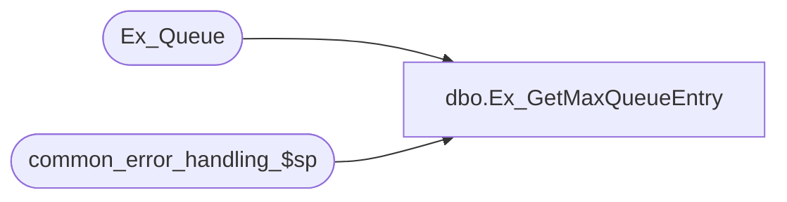

# dbo.Ex_GetMaxQueueEntry

**Database:** auditworks  
**Server:** bedrockdb01  

## Architecture Diagram



## Table Dependencies

| Referenced Table |
|---|
| Ex_Queue |
| common_error_handling_$sp |

## Stored Procedure Code

```sql
create proc dbo.Ex_GetMaxQueueEntry   
 @QueueID		tinyint,
 @MinSerialNo		numeric(14,0),
 @DesiredCount		int

AS

DECLARE
	@ActualCount		numeric(14,0),
	@ActualMaxSerialNo	numeric(14,0),
	@MaxSerialNo		numeric(14,0),
	@NextMinSerialNo	numeric(14,0),
	@NextMaxSerialNo	numeric(14,0),
	@TableMax		numeric(14,0),
	@errno			int,
	@errmsg 		nvarchar(255),	
	@object_name            nvarchar(255),
	@process_name           nvarchar(100),
	@operation_name         nvarchar(100),
	@message_id		int

/* 
PROC NAME: Ex_GetMaxQueueEntry
     DESC: To determine the max serial_no for the next batch of transactions
	   based on the @DesiredCount (desired max batch size) input parameter.
	   Uses return variable.
	   This version for the SA db also includes error logging to the SA error tables.
	   Called by generated SmartView exports.

  HISTORY:
Date     Name              Def# Desc
Dec19,10 Paul            105313 Use unicode datatypes
Jul12,10 Paul            119413 Overlay original smartview version of this proc in SA db with improved SA version
			 (includes bug fix 1-43SZMZ: If the last loop finds no more trans, zero is incorrectly returned).
	   
*/

SELECT @process_name = 'Ex_GetMaxQueueEntry',
      @message_id = 201068,
      @ActualMaxSerialNo = 0
      
	SELECT @NextMinSerialNo = MIN(serial_no) 
	  FROM Ex_Queue
	 WHERE queue_id = @QueueID
	   AND serial_no >= @MinSerialNo
	   
	SELECT @errno = @@error
	IF @errno != 0
	  BEGIN
	    SELECT @errmsg = 'Failed to select serial_no from Ex_Queue (1)',
	           @object_name    = 'Ex_Queue',
	           @operation_name = 'SELECT'
	    GOTO error
	  END	   

	IF @NextMinSerialNo IS NULL
        BEGIN
	   SELECT @ActualMaxSerialNo = 0
	   RETURN -- no data to post
	  END

	/* Init variables */
	SELECT @MaxSerialNo = @MinSerialNo - 1,
		@ActualMaxSerialNo = @MinSerialNo,
		@ActualCount = 0

	SELECT @TableMax = MAX(serial_no)
	  FROM Ex_Queue
	 WHERE queue_id = @QueueID
	   AND serial_no >= @MinSerialNo

	SELECT @errno = @@error
	IF @errno != 0
	  BEGIN
	    SELECT @errmsg = 'Failed to select serial_no from Ex_Queue (2)',
	           @object_name    = 'Ex_Queue',
	           @operation_name = 'SELECT'
	    GOTO error
	  END	   

	/* If the (desired count minus the actual number of rows selected) is > 10% of the desired
	   rows AND we have not exceeded the Maximum serial_no for the queue_id, then loop again. */
	WHILE ((@DesiredCount - @ActualCount) > (@DesiredCount / 10))
	  AND (@MaxSerialNo <= @TableMax)
	BEGIN
		SELECT @MaxSerialNo = @NextMinSerialNo + @DesiredCount - @ActualCount - 1

		SELECT @ActualCount = @ActualCount + COUNT(queue_id),
		       @NextMaxSerialNo = MAX(serial_no)
		  FROM  Ex_Queue
		 WHERE queue_id = @QueueID
		   AND serial_no BETWEEN @NextMinSerialNo AND @MaxSerialNo

		SELECT @errno = @@error
		IF @errno != 0
		  BEGIN
		    SELECT @errmsg = 'Failed to select serial_no from Ex_Queue (3)',
		           @object_name    = 'Ex_Queue',
		           @operation_name = 'SELECT'
		    GOTO error
		  END	   

		IF @NextMaxSerialNo IS NOT NULL
		  SELECT @ActualMaxSerialNo = @NextMaxSerialNo

		SELECT @NextMinSerialNo = MIN(serial_no) 
		  FROM  Ex_Queue
		 WHERE queue_id = @QueueID
		   AND serial_no > @MaxSerialNo

		SELECT @errno = @@error
		IF @errno != 0
		  BEGIN
		    SELECT @errmsg = 'Failed to select min serial_no from Ex_Queue (4)',
		           @object_name    = 'Ex_Queue',
		           @operation_name = 'SELECT'
		    GOTO error
		  END	   
		   

	END  /* While ... */ 

	/* If no rows were found in the specified range, Return 0 */
	IF @ActualCount = 0
	  SELECT @ActualMaxSerialNo = 0

	RETURN @ActualMaxSerialNo	

error:

  EXEC common_error_handling_$sp 36, @errno, @errmsg, 0, @message_id, 
                                 @process_name, @object_name, @operation_name,1
RETURN
```

