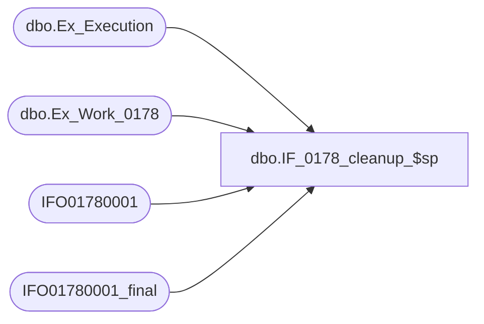

# dbo.IF_0178_cleanup_$sp

**Database:** auditworks  
**Server:** bedrockdb01  

## Architecture Diagram



## Table Dependencies

| Referenced Table |
|---|
| dbo.Ex_Execution |
| dbo.Ex_Work_0178 |
| IFO01780001 |
| IFO01780001_final |

## Stored Procedure Code

```sql
CREATE proc dbo.IF_0178_cleanup_$sp
/* Name: IF_0178_cleanup_$sp
   Generated: 7/20/2001 12:23:54
   Automatically Generated by SmartView Exports Builder
   Called by IF_0178_main_$sp.
Update rows as being processed..
   *** DO NOT MODIFY!!! ***
*/
@executionid int 
AS
DECLARE @errmsg               varchar(255), 
        @errno                int, 
        @transaction_count    numeric(12,0), 
        @process_no           smallint, 
        @process_log_entry    bit, 
        @process_timestamp    float, 
        @row                  int, 
        @return               tinyint, 
        @from_serial_no       numeric(14,0), 
        @to_serial_no         numeric(14,0) 

SELECT @errmsg = NULL, 
       @transaction_count = 0, 
       @process_no = 19, 
       @process_timestamp = 0, 
       @return = 1, 
       @to_serial_no = 0, 
       @from_serial_no = 0 


SELECT @from_serial_no = MIN(serial_no),
       @to_serial_no = MAX(serial_no)
  FROM auditworks.dbo.Ex_Work_0178

Begin Transaction

INSERT INTO IFO01780001_final
SELECT C1_Idntty, C2_IFEntryN, C3_TrnsctnLn, C4_TrnsctnDt, C5_TrnsctnN, C6_LctnID, C7_Rgstr, C8_RfrncN, C9_TrnsctnTyp, C10_StylID, C11_SKUID, C12_UPCN, C13_PrcOvrrd, C14_RsnCd, C15_Unts, C16_SldAtPrc, C17_POSDISCOUNTTYPECODE, C18_POSDISCOUNTTYPEDESC, C19_POSDISCOUNTAMOUNT, C20_APPLIEDBYLINEID, C21_RECORDTYPE
FROM IFO01780001

SELECT @errno = @@error 
IF @errno <> 0 
   BEGIN
   SELECT @errmsg = 'Unable to copy data to IFO01780001_final table.'
   GOTO error
   END


/* Insert into ex_execution the entries we have processed */
INSERT INTO auditworks.dbo.Ex_Execution
 (queue_id, object_id, execution_id, from_serial_no, to_serial_no)
 VALUES (27, 178, @executionid, 
 @from_serial_no, @to_serial_no)
SELECT @errno = @@error 
IF @errno <> 0 
   BEGIN
   SELECT @errmsg = 'Unable to insert into auditworks.dbo.Ex_Execution'
   GOTO error
   END


Commit Transaction
endofproc: /* End of Procedure */ 
RETURN @return

error: /* Error Handler */ 

If @@trancount > 0 
   ROLLBACK TRANSACTION 

SELECT @errmsg = 'IF_0178:' + @errmsg + ' - ' + convert(varchar, @errno) 

RAISERROR (@errmsg, 16, 1)
RETURN
```

