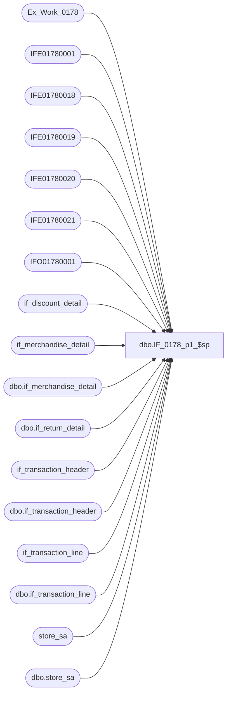

# dbo.IF_0178_p1_$sp

**Database:** auditworks  
**Server:** bedrockdb01  

## Architecture Diagram



## Table Dependencies

| Referenced Table |
|---|
| Ex_Work_0178 |
| IFE01780001 |
| IFE01780018 |
| IFE01780019 |
| IFE01780020 |
| IFE01780021 |
| IFO01780001 |
| if_discount_detail |
| if_merchandise_detail |
| dbo.if_merchandise_detail |
| dbo.if_return_detail |
| if_transaction_header |
| dbo.if_transaction_header |
| if_transaction_line |
| dbo.if_transaction_line |
| store_sa |
| dbo.store_sa |

## Stored Procedure Code

```sql
CREATE proc dbo.IF_0178_p1_$sp
/* Name: IF_0178_p1_$sp
   Generated: 7/20/2001 12:23:57
   Automatically Generated by SmartView Exports Builder
   Called by IF_0178_main_$sp.
Building the follwing extracts: 
Transaction Extract
Discount Extract
Discnt Tran Extract
Merch Extract
Return Extract.
   *** DO NOT MODIFY!!! ***
*/
AS
DECLARE @errmsg               varchar(255), 
        @errno                int, 
        @return               tinyint, 
        @transaction_count    numeric(12,0), 
        @process_no           smallint, 
        @process_log_entry    bit, 
        @process_timestamp    float

SELECT @errmsg = NULL, 
       @return = 0, 
       @process_no = 19, 
       @process_timestamp = 0


/*** Extracting data into the working table for the extract: Transaction Extract ***/

INSERT INTO IFE01780001 SELECT DISTINCT a.date_reject_id as Field_a, d.key_1 as Field_b, c.line_id as Field_c, a.transaction_date as Field_d, a.transaction_no as Field_e, e.location_id as Field_f, a.register_no as Field_g, c.reference_no as Field_h, c.line_action as Field_i, a.transaction_series as Field_j
FROM auditworks.dbo.if_transaction_header a, auditworks.dbo.if_merchandise_detail b, auditworks.dbo.if_transaction_line c, Ex_Work_0178 d, auditworks.dbo.store_sa e
WHERE a.if_entry_no = c.if_entry_no AND c.if_entry_no = b.if_entry_no and c.line_id = b.line_id
 AND 
a.if_entry_no = d.key_1 AND 
a.store_no=e.store_no
AND (c.line_action IN (1,2,20,21,54,101,102,120,121,201,202,219,220,221) AND  ( a.transaction_void_flag = 0 OR a.transaction_void_flag = 8 )  AND c.line_void_flag = 0 AND  ( c.line_object_type Between 1 and 15 OR c.line_object_type Between 20 and 21 OR c.line_object_type > 23 )  AND b.upc_lookup_division = 2)

SELECT @errno = @@error 
IF @errno <> 0 
   BEGIN
   SELECT @errmsg = 'Unable to extract data into the working table for: Transaction Extract.'
   GOTO error
   END


/*** Map the extract data to the output table ***/

INSERT INTO IFO01780001
( C2_IFEntryN,
 C4_TrnsctnDt,
 C5_TrnsctnN,
 C3_TrnsctnLn,
 C1_Idntty,
 C9_TrnsctnTyp,
 C7_Rgstr,
 C8_RfrncN,
 C21_RECORDTYPE,
 C6_LctnID)
SELECT Convert(numeric(12,0),a.C18_f_ntry_nky_1),
a.C19_trnsctndt,
a.C20_trnsctnn,
Convert(numeric(5,0),a.C22_lnID),
Convert(numeric(22,0),((( a.C18_f_ntry_nky_1  * 100000) +  a.C22_lnID ) * 100000)),
Convert(numeric(5,0),a.C31_lnctn),
Convert(numeric(5,0),a.C29_trnsctnrgstrn),
a.C30_lnrfrncn,
Convert(varchar(1),'H'),
Convert(numeric(5,0),a.C35_strlctn_d)
FROM IFE01780001 a


SELECT @errno = @@error 
IF @errno <> 0 
   BEGIN
   SELECT @errmsg = 'An error occurred while inserting into output table IFO01780001.'
   GOTO error
   END


/*** Extracting data into the working table for the extract: Discount Extract ***/

INSERT INTO IFE01780018 SELECT e.pos_discount_level as Field_a, d.key_1 as Field_b, e.line_id as Field_c, c.line_action as Field_d, e.pos_discount_type as Field_e, SUM(e.pos_discount_amount) as Field_f, e.applied_by_line_id as Field_g, e.pos_discount_serial_no as Field_h
FROM if_merchandise_detail a,
if_transaction_header b,
if_transaction_line c,
Ex_Work_0178 d,
if_discount_detail e
WHERE
(
c.line_action IN (1,2,20,21,54,101,102,120,121,201,202,219,220,221)
AND ( b.transaction_void_flag = 0 OR b.transaction_void_flag = 8 )
AND c.line_void_flag = 0
AND ( c.line_object_type Between 1 and 15 OR c.line_object_type Between 19 and 21 OR c.line_object_type > 23 )
AND a.upc_lookup_division =2
AND e.applied_flag=1
)
AND a.if_entry_no=b.if_entry_no
AND b.if_entry_no=c.if_entry_no
AND c.if_entry_no=e.if_entry_no
AND e.if_entry_no=d.key_1
AND a.line_id=c.line_id
AND c.line_id=e.line_id
GROUP BY e.pos_discount_level,d.key_1,e.line_id,c.line_action,e.pos_discount_type,e.applied_by_line_id,e.pos_discount_serial_no;


SELECT @errno = @@error 
IF @errno <> 0 
   BEGIN
   SELECT @errmsg = 'Unable to extract data into the working table for: Discount Extract.'
   GOTO error
   END


/*** Map the extract data to the output table ***/

INSERT INTO IFO01780001
( C2_IFEntryN,
 C3_TrnsctnLn,
 C9_TrnsctnTyp,
 C17_POSDISCOUNTTYPECODE,
 C19_POSDISCOUNTAMOUNT,
 C20_APPLIEDBYLINEID,
 C21_RECORDTYPE,
 C1_Idntty)
SELECT Convert(numeric(12,0),a.C2_f_ntry_nky_1),
Convert(numeric(5,0),a.C3_dscntlnd),
Convert(numeric(5,0),a.C7_lnctn),
Convert(numeric(5,0),a.C4_dscntpsdscnttyp),
Convert(numeric(12,4),a.C5_dscntpsdscntmt),
Convert(numeric(5,0),a.C6_dscntppldbylnd),
Convert(varchar(1),'D'),
Convert(numeric(22,0),((( a.C2_f_ntry_nky_1  * 100000) +  a.C3_dscntlnd ) * 100000) +  a.C6_dscntppldbylnd )
FROM IFE01780018 a


SELECT @errno = @@error 
IF @errno <> 0 
   BEGIN
   SELECT @errmsg = 'An error occurred while inserting into output table IFO01780001.'
   GOTO error
   END


/*** Extracting data into the working table for the extract: Discnt Tran Extract ***/

INSERT INTO IFE01780019  SELECT DISTINCT c.key_1 as Field_a, e.line_id as Field_b, b.line_id as Field_c, d.transaction_date as Field_d, d.transaction_no as Field_e, a.location_id as Field_f, d.register_no as Field_g, b.reference_no as Field_h,b.line_action as Field_i, e.applied_by_line_id as Field_j
FROM store_sa a,
if_transaction_line b,
Ex_Work_0178  c,
if_transaction_header d,
if_discount_detail e
WHERE d.store_no=a.store_no
 AND d.if_entry_no=b.if_entry_no
 AND d.if_entry_no=c.key_1
 AND c.key_1=e.if_entry_no
AND b.line_id=e.applied_by_line_id
AND e.applied_flag=1;
 


SELECT @errno = @@error 
IF @errno <> 0 
   BEGIN
   SELECT @errmsg = 'Unable to extract data into the working table for: Discnt Tran Extract.'
   GOTO error
   END


/*** Map the extract data to the output table ***/

UPDATE IFO01780001
 SET C4_TrnsctnDt = a.C3_trnsctndt,
C5_TrnsctnN = a.C4_trnsctnn,
C7_Rgstr = Convert(numeric(5,0),a.C6_trnsctnrgstrn),
C8_RfrncN = a.C7_lnrfrncn,
C6_LctnID = Convert(numeric(5,0),a.C13_strlctn_d),
C9_TrnsctnTyp = Convert(numeric(5,0),a.C14_lnctn)
FROM IFE01780019 a,IFO01780001 b
WHERE a.C1_f_ntry_nky_1 = b.C2_IFEntryN AND
a.C12_dscntlnd = b.C3_TrnsctnLn AND
a.C11_dscntppldbylnd = b.C20_APPLIEDBYLINEID

SELECT @errno = @@error 
IF @errno <> 0 
   BEGIN
   SELECT @errmsg = 'An error occurred while updating output table IFO01780001.'
   GOTO error
   END


/*** Extracting data into the working table for the extract: Merch Extract ***/

INSERT INTO IFE01780020 SELECT a.key_1 as Field_a, b.line_id as Field_b, b.style_reference_id as Field_c, b.sku_id as Field_d, b.upc_no as Field_e, b.price_override as Field_f, SUM(b.units) as Field_g, SUM(b.sold_at_price) as Field_h
FROM Ex_Work_0178 a, auditworks.dbo.if_merchandise_detail b
WHERE b.if_entry_no = a.key_1
AND (b.upc_lookup_division = 2)
GROUP BY a.key_1,b.line_id,b.style_reference_id,b.sku_id,b.upc_no,b.price_override

SELECT @errno = @@error 
IF @errno <> 0 
   BEGIN
   SELECT @errmsg = 'Unable to extract data into the working table for: Merch Extract.'
   GOTO error
   END


/*** Map the extract data to the output table ***/

UPDATE IFO01780001
 SET C10_StylID = a.C3_mrchstylrfrncd,
C11_SKUID = Convert(numeric(12,0),a.C4_mrchskd),
C12_UPCN = Convert(varchar(20),{fn CEILING( a.C5_mrchpcn )}),
C13_PrcOvrrd = a.C6_mrchprcvrrd,
C15_Unts = Convert(numeric(10,0),a.C7_mrchnts),
C16_SldAtPrc = Convert(numeric(12,4),a.C8_mrchsldtprc)
FROM IFE01780020 a,IFO01780001 b
WHERE a.C1_f_ntry_nky_1 = b.C2_IFEntryN AND
a.C2_mrchlnd = b.C3_TrnsctnLn

SELECT @errno = @@error 
IF @errno <> 0 
   BEGIN
   SELECT @errmsg = 'An error occurred while updating output table IFO01780001.'
   GOTO error
   END


/*** Extracting data into the working table for the extract: Return Extract ***/

INSERT INTO IFE01780021 SELECT DISTINCT a.key_1 as Field_a, b.line_id as Field_b, b.return_reason_code as Field_c
FROM Ex_Work_0178 a, auditworks.dbo.if_return_detail b
WHERE b.if_entry_no = a.key_1

SELECT @errno = @@error 
IF @errno <> 0 
   BEGIN
   SELECT @errmsg = 'Unable to extract data into the working table for: Return Extract.'
   GOTO error
   END


/*** Map the extract data to the output table ***/

UPDATE IFO01780001
 SET C14_RsnCd = Convert(numeric(5,0),a.C3_rtrnrsncd)
FROM IFE01780021 a,IFO01780001 b
WHERE a.C1_f_ntry_nky_1 = b.C2_IFEntryN AND
a.C2_rtrnln_d = b.C3_TrnsctnLn

SELECT @errno = @@error 
IF @errno <> 0 
   BEGIN
   SELECT @errmsg = 'An error occurred while updating output table IFO01780001.'
   GOTO error
   END

endofproc: /* End of Procedure */ 
RETURN @return

error: /* Error Handler */ 

If @@trancount > 0 
   ROLLBACK TRANSACTION 

SELECT @errmsg = 'IF_0178:' + @errmsg + ' - ' + convert(varchar, @errno) 

RAISERROR (@errmsg, 16, 1)
RETURN
```

