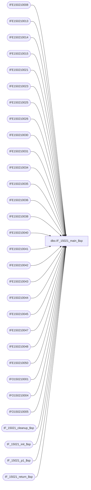

# dbo.IF_15021_main_$sp

**Database:** auditworks  
**Server:** bedrockdb01  

## Architecture Diagram



## Table Dependencies

| Referenced Table |
|---|
| IFE150210008 |
| IFE150210013 |
| IFE150210014 |
| IFE150210015 |
| IFE150210021 |
| IFE150210023 |
| IFE150210025 |
| IFE150210026 |
| IFE150210030 |
| IFE150210031 |
| IFE150210034 |
| IFE150210035 |
| IFE150210036 |
| IFE150210038 |
| IFE150210040 |
| IFE150210041 |
| IFE150210042 |
| IFE150210043 |
| IFE150210044 |
| IFE150210045 |
| IFE150210047 |
| IFE150210048 |
| IFE150210050 |
| IFO150210001 |
| IFO150210004 |
| IFO150210005 |
| IF_15021_cleanup_$sp |
| IF_15021_init_$sp |
| IF_15021_p1_$sp |
| IF_15021_return_$sp |

## Stored Procedure Code

```sql
create proc dbo.IF_15021_main_$sp
/* Name: IF_15021_main_$sp
   Generated: 6/1/2016 8:22:00 AM
   Automatically Generated by SmartView Exports Builder
   Called by SmartView Exports Server.
   Calls IF_15021_p1_$sp.
Building the export: LIVE CRMExport RideMakerz .
   *** DO NOT MODIFY!!! ***
*/
@executionid int, @iterations int, @batch_size int 
AS
DECLARE @errmsg               nvarchar(255), 
        @errno                int, 
        @transaction_count    numeric(12,0), 
        @terminate_interface  smallint, 
        @return               tinyint, 
        @min_serial_no        numeric(14,0), 
        @init                 smallint 

SELECT @errmsg = NULL, 
       @transaction_count = 0, 
       @terminate_interface = 0, 
       @return = 0, 
       @min_serial_no = 0, 
       @init = 0 

WHILE @terminate_interface < @iterations 
BEGIN 

/* @init = 0 when nothing to do, 1 if something to do. */
EXEC @init = IF_15021_init_$sp @batch_size
IF @init = 0 
   BREAK


/*** Truncate extract tables ***/

TRUNCATE TABLE IFE150210008
SELECT @errno = @@error 
IF @errno <> 0 
   BEGIN
   SELECT @errmsg = 'Unable to TRUNCATE IFE150210008 table.'
   GOTO error
   END

TRUNCATE TABLE IFE150210040
SELECT @errno = @@error 
IF @errno <> 0 
   BEGIN
   SELECT @errmsg = 'Unable to TRUNCATE IFE150210040 table.'
   GOTO error
   END

TRUNCATE TABLE IFE150210034
SELECT @errno = @@error 
IF @errno <> 0 
   BEGIN
   SELECT @errmsg = 'Unable to TRUNCATE IFE150210034 table.'
   GOTO error
   END

TRUNCATE TABLE IFE150210021
SELECT @errno = @@error 
IF @errno <> 0 
   BEGIN
   SELECT @errmsg = 'Unable to TRUNCATE IFE150210021 table.'
   GOTO error
   END

TRUNCATE TABLE IFE150210013
SELECT @errno = @@error 
IF @errno <> 0 
   BEGIN
   SELECT @errmsg = 'Unable to TRUNCATE IFE150210013 table.'
   GOTO error
   END

TRUNCATE TABLE IFE150210044
SELECT @errno = @@error 
IF @errno <> 0 
   BEGIN
   SELECT @errmsg = 'Unable to TRUNCATE IFE150210044 table.'
   GOTO error
   END

TRUNCATE TABLE IFE150210014
SELECT @errno = @@error 
IF @errno <> 0 
   BEGIN
   SELECT @errmsg = 'Unable to TRUNCATE IFE150210014 table.'
   GOTO error
   END

TRUNCATE TABLE IFE150210015
SELECT @errno = @@error 
IF @errno <> 0 
   BEGIN
   SELECT @errmsg = 'Unable to TRUNCATE IFE150210015 table.'
   GOTO error
   END

TRUNCATE TABLE IFE150210023
SELECT @errno = @@error 
IF @errno <> 0 
   BEGIN
   SELECT @errmsg = 'Unable to TRUNCATE IFE150210023 table.'
   GOTO error
   END

TRUNCATE TABLE IFE150210045
SELECT @errno = @@error 
IF @errno <> 0 
   BEGIN
   SELECT @errmsg = 'Unable to TRUNCATE IFE150210045 table.'
   GOTO error
   END

TRUNCATE TABLE IFE150210025
SELECT @errno = @@error 
IF @errno <> 0 
   BEGIN
   SELECT @errmsg = 'Unable to TRUNCATE IFE150210025 table.'
   GOTO error
   END

TRUNCATE TABLE IFE150210026
SELECT @errno = @@error 
IF @errno <> 0 
   BEGIN
   SELECT @errmsg = 'Unable to TRUNCATE IFE150210026 table.'
   GOTO error
   END

TRUNCATE TABLE IFE150210030
SELECT @errno = @@error 
IF @errno <> 0 
   BEGIN
   SELECT @errmsg = 'Unable to TRUNCATE IFE150210030 table.'
   GOTO error
   END

TRUNCATE TABLE IFE150210035
SELECT @errno = @@error 
IF @errno <> 0 
   BEGIN
   SELECT @errmsg = 'Unable to TRUNCATE IFE150210035 table.'
   GOTO error
   END

TRUNCATE TABLE IFE150210031
SELECT @errno = @@error 
IF @errno <> 0 
   BEGIN
   SELECT @errmsg = 'Unable to TRUNCATE IFE150210031 table.'
   GOTO error
   END

TRUNCATE TABLE IFE150210036
SELECT @errno = @@error 
IF @errno <> 0 
   BEGIN
   SELECT @errmsg = 'Unable to TRUNCATE IFE150210036 table.'
   GOTO error
   END

TRUNCATE TABLE IFE150210038
SELECT @errno = @@error 
IF @errno <> 0 
   BEGIN
   SELECT @errmsg = 'Unable to TRUNCATE IFE150210038 table.'
   GOTO error
   END

TRUNCATE TABLE IFE150210043
SELECT @errno = @@error 
IF @errno <> 0 
   BEGIN
   SELECT @errmsg = 'Unable to TRUNCATE IFE150210043 table.'
   GOTO error
   END

TRUNCATE TABLE IFE150210041
SELECT @errno = @@error 
IF @errno <> 0 
   BEGIN
   SELECT @errmsg = 'Unable to TRUNCATE IFE150210041 table.'
   GOTO error
   END

TRUNCATE TABLE IFE150210042
SELECT @errno = @@error 
IF @errno <> 0 
   BEGIN
   SELECT @errmsg = 'Unable to TRUNCATE IFE150210042 table.'
   GOTO error
   END

TRUNCATE TABLE IFE150210047
SELECT @errno = @@error 
IF @errno <> 0 
   BEGIN
   SELECT @errmsg = 'Unable to TRUNCATE IFE150210047 table.'
   GOTO error
   END

TRUNCATE TABLE IFE150210048
SELECT @errno = @@error 
IF @errno <> 0 
   BEGIN
   SELECT @errmsg = 'Unable to TRUNCATE IFE150210048 table.'
   GOTO error
   END

TRUNCATE TABLE IFE150210050
SELECT @errno = @@error 
IF @errno <> 0 
   BEGIN
   SELECT @errmsg = 'Unable to TRUNCATE IFE150210050 table.'
   GOTO error
   END

TRUNCATE TABLE IFO150210001
SELECT @errno = @@error 
IF @errno <> 0 
   BEGIN
   SELECT @errmsg = 'Unable to TRUNCATE IFO150210001 table.'
   GOTO error
   END

TRUNCATE TABLE IFO150210004
SELECT @errno = @@error 
IF @errno <> 0 
   BEGIN
   SELECT @errmsg = 'Unable to TRUNCATE IFO150210004 table.'
   GOTO error
   END

TRUNCATE TABLE IFO150210005
SELECT @errno = @@error 
IF @errno <> 0 
   BEGIN
   SELECT @errmsg = 'Unable to TRUNCATE IFO150210005 table.'
   GOTO error
   END

EXEC IF_15021_p1_$sp WITH RECOMPILE
SELECT @errno = @@error
IF @errno != 0
BEGIN
   SELECT @errmsg = 'Failed to execute stored procedure IF_15021_p1_$sp'
   GoTo error
End

EXEC IF_15021_cleanup_$sp @executionid WITH RECOMPILE
SELECT @errno = @@error
IF @errno != 0
BEGIN
   SELECT @errmsg = 'Failed to execute stored procedure IF_15021_cleanup_$sp'
   GoTo error
End

/* Bump up counters before looping. */
SELECT @terminate_interface = @terminate_interface + 1


END /* While @terminate_interface < @max_loop */ 

EXEC @return = IF_15021_return_$sp @init WITH RECOMPILE
SELECT @errno = @@error
IF @errno != 0
BEGIN
   SELECT @errmsg = 'Failed to execute stored procedure IF_15021_return_$sp'
   GoTo error
End

endofproc: /* End of Procedure */ 
RETURN @return

error: /* Error Handler */ 

If @@trancount > 0 
   ROLLBACK TRANSACTION 

SELECT @errmsg = 'IF_15021:' + @errmsg + ' - ' + convert(varchar, @errno) 

RAISERROR (@errmsg, 16, 1)
RETURN
```

