# dbo.IF_15021_p1_$sp

**Database:** auditworks  
**Server:** bedrockdb01  

## Architecture Diagram

```mermaid
flowchart LR
    SP["dbo.IF_15021_p1_$sp"]
    Ex_Queue(["Ex_Queue"]) --> SP
    Ex_Work_15021(["Ex_Work_15021"]) --> SP
    IFE150210008(["IFE150210008"]) --> SP
    IFE150210013(["IFE150210013"]) --> SP
    IFE150210014(["IFE150210014"]) --> SP
    IFE150210015(["IFE150210015"]) --> SP
    IFE150210021(["IFE150210021"]) --> SP
    IFE150210023(["IFE150210023"]) --> SP
    IFE150210025(["IFE150210025"]) --> SP
    IFE150210026(["IFE150210026"]) --> SP
    IFE150210030(["IFE150210030"]) --> SP
    IFE150210031(["IFE150210031"]) --> SP
    IFE150210034(["IFE150210034"]) --> SP
    IFE150210035(["IFE150210035"]) --> SP
    IFE150210036(["IFE150210036"]) --> SP
    IFE150210038(["IFE150210038"]) --> SP
    IFE150210040(["IFE150210040"]) --> SP
    IFE150210041(["IFE150210041"]) --> SP
    IFE150210042(["IFE150210042"]) --> SP
    IFE150210043(["IFE150210043"]) --> SP
    IFE150210044(["IFE150210044"]) --> SP
    IFE150210045(["IFE150210045"]) --> SP
    IFE150210047(["IFE150210047"]) --> SP
    IFE150210048(["IFE150210048"]) --> SP
    IFE150210050(["IFE150210050"]) --> SP
    IFO150210001(["IFO150210001"]) --> SP
    IFO150210004(["IFO150210004"]) --> SP
    IFO150210005(["IFO150210005"]) --> SP
    ORG_CHN_WRKSTN_CNFG(["ORG_CHN_WRKSTN_CNFG"]) --> SP
    ORG_CHN_WRKSTN_CNFG_A(["ORG_CHN_WRKSTN_CNFG_A"]) --> SP
    currency(["currency"]) --> SP
    if_customer(["if_customer"]) --> SP
    dbo_if_customer(["dbo.if_customer"]) --> SP
    dbo_if_discount_detail(["dbo.if_discount_detail"]) --> SP
    if_line_note(["if_line_note"]) --> SP
    dbo_if_merchandise_detail(["dbo.if_merchandise_detail"]) --> SP
    if_transaction_header(["if_transaction_header"]) --> SP
    dbo_if_transaction_header(["dbo.if_transaction_header"]) --> SP
    if_transaction_line(["if_transaction_line"]) --> SP
    dbo_if_transaction_line(["dbo.if_transaction_line"]) --> SP
    dbo_interface_applicability(["dbo.interface_applicability"]) --> SP
    register(["register"]) --> SP
    store_salesaudit(["store_salesaudit"]) --> SP
    dbo_store_salesaudit(["dbo.store_salesaudit"]) --> SP
```



## Table Dependencies

| Referenced Table |
|---|
| Ex_Queue |
| Ex_Work_15021 |
| IFE150210008 |
| IFE150210013 |
| IFE150210014 |
| IFE150210015 |
| IFE150210021 |
| IFE150210023 |
| IFE150210025 |
| IFE150210026 |
| IFE150210030 |
| IFE150210031 |
| IFE150210034 |
| IFE150210035 |
| IFE150210036 |
| IFE150210038 |
| IFE150210040 |
| IFE150210041 |
| IFE150210042 |
| IFE150210043 |
| IFE150210044 |
| IFE150210045 |
| IFE150210047 |
| IFE150210048 |
| IFE150210050 |
| IFO150210001 |
| IFO150210004 |
| IFO150210005 |
| ORG_CHN_WRKSTN_CNFG |
| ORG_CHN_WRKSTN_CNFG_A |
| currency |
| if_customer |
| dbo.if_customer |
| dbo.if_discount_detail |
| if_line_note |
| dbo.if_merchandise_detail |
| if_transaction_header |
| dbo.if_transaction_header |
| if_transaction_line |
| dbo.if_transaction_line |
| dbo.interface_applicability |
| register |
| store_salesaudit |
| dbo.store_salesaudit |

## Stored Procedure Code

```sql
create proc dbo.IF_15021_p1_$sp
/* Name: IF_15021_p1_$sp
   Generated: 6/1/2016 8:22:00 AM
   Automatically Generated by SmartView Exports Builder
   Called by IF_15021_main_$sp.
Building the follwing extracts: 
Customer Info *
All *
Transaction Source
TransType
Customer Info *
Loyalty Number
Flag A: Employee Sale
Flag B: Bear Bucks Redeemed
Flag C: Mall Certificate Redeemed
Flag D: Loyalty Reward Redeemed
Flad E: ECertificate Redeemed
Flag F: Buy Stuff Card Redeemed
Currency Code
Tender*
Tender Identifier
Lines* SQL
Gross And Net Line Amount
Discount Percent
Coupon Code (RPRO)
Non Merch Items
Delete Trxns with no DETAIL
Coupon Header SQL
Coupon Detail SQL.
   *** DO NOT MODIFY!!! ***
*/
AS
DECLARE @errmsg               nvarchar(255), 
        @errno                int, 
        @return               tinyint, 
        @transaction_count    numeric(12,0), 
        @process_no           smallint, 
        @process_log_entry    bit, 
        @process_timestamp    float

SELECT @errmsg = NULL, 
       @return = 0, 
       @process_no = 19, 
       @process_timestamp = 0


/*** Extracting data into the working table for the extract: Customer Info * ***/

INSERT INTO IFE150210008 SELECT DISTINCT c.key_1 as Field_a, d.title as Field_b, d.first_name as Field_c, d.last_name as Field_d, d.address_1 as Field_e, d.address_2 as Field_f, d.city as Field_g, d.county as Field_h, d.state as Field_i, d.country as Field_j, d.post_code as Field_k, d.telephone_no1 as Field_l, d.telephone_no2 as Field_m, d.customer_no as Field_n
FROM auditworks.dbo.if_transaction_header a, auditworks.dbo.if_transaction_line b, auditworks.dbo.if_customer d
, Ex_Work_15021 c
 WHERE a.if_entry_no = b.if_entry_no AND b.if_entry_no = d.if_entry_no and b.line_id = d.line_id

 AND c.key_1 = d.if_entry_no
AND (a.transaction_category = 1 AND a.transaction_void_flag = 0 AND b.line_void_flag = 0)

SELECT @errno = @@error 
IF @errno <> 0 
   BEGIN
   SELECT @errmsg = 'Unable to extract data into the working table for: Customer Info *.'
   GOTO error
   END


/*** Extracting data into the working table for the extract: All * ***/

INSERT INTO IFE150210040 SELECT b.key_1 as Field_a, b.key_2 as Field_b, a.transaction_id as Field_c, a.transaction_no as Field_d, a.store_no as Field_e, a.register_no as Field_f, a.transaction_date as Field_g, SUM(a.tender_total) as Field_h
FROM auditworks.dbo.if_transaction_header a, auditworks.dbo.store_salesaudit c
, Ex_Work_15021 b
 WHERE a.if_entry_no = b.key_1
 AND a.store_no = c.store_no
AND (( a.transaction_void_flag = 0 OR a.transaction_void_flag = 8 )  AND c.store_export_code IN ('T', 'X'))
GROUP BY b.key_1,b.key_2,a.transaction_id,a.transaction_no,a.store_no,a.register_no,a.transaction_date

SELECT @errno = @@error 
IF @errno <> 0 
   BEGIN
   SELECT @errmsg = 'Unable to extract data into the working table for: All *.'
   GOTO error
   END


/*** Map the extract data to the output table ***/

INSERT INTO IFO150210001
( C1_HdrID,
 C2_TrnsID,
 C3_POSTrnsN,
 C5_Str,
 C6_Rgstr,
 C9_TrnsDt,
 C34_Ky_2,
 C22_TrnsAmnt)
SELECT Convert(numeric(20,0),a.C1_f_ntry_nky_1),
a.C3_TrnsctnID,
Convert(numeric(20,0),a.C4_trnsctnn),
Convert(numeric(20,0),a.C5_trnsctnstrn),
Convert(numeric(20,0),a.C6_trnsctnrgstrn),
a.C7_trnsctndt,
a.C2_fcntrlflgky_2,
Convert(numeric(20,2),a.C8_trnsctntndrttl)
FROM IFE150210040 a


SELECT @errno = @@error 
IF @errno <> 0 
   BEGIN
   SELECT @errmsg = 'An error occurred while inserting into output table IFO150210001.'
   GOTO error
   END


/*** Extracting data into the working table for the extract: Transaction Source ***/

/*
 INSERT INTO IFE150210034 SELECT DISTINCT a.key_1 as Field_a, 0 as Field_b
FROM Ex_Work_15021 a, if_transaction_header h, register r, store_salesaudit d
WHERE h.if_entry_no = a.key_1
AND h.store_no = r.store_no
AND h.store_no = d.store_no
AND h.register_no = r.register_no
AND r.register_type = 3
AND (d.store_export_code IN ('T', 'X'))

INSERT INTO IFE150210034 SELECT DISTINCT a.key_1 as Field_a, 1 as Field_b
FROM Ex_Work_15021 a, if_transaction_header h, register r, store_salesaudit d
WHERE h.if_entry_no = a.key_1
AND h.store_no = r.store_no
AND h.store_no = d.store_no
AND h.register_no = r.register_no
AND r.register_type <> 3
AND (d.store_export_code IN ('T', 'X'))
*/

/*  Roula 08/11/2010:  Removed code above for SA5 compatibility */

INSERT INTO IFE150210034 
SELECT DISTINCT a.key_1 as Field_a, case when TRAN_TRNSLT_VRSN_NUM =4 then 0 else 1 end as Field_b
FROM Ex_Queue a, if_transaction_header h,  store_salesaudit d, register r
join ORG_CHN_WRKSTN_CNFG_A e on r.WRKSTN_ID = e.WRKSTN_ID
join ORG_CHN_WRKSTN_CNFG f on  f.WRKSTN_CNFG_CODE = e.WRKSTN_CNFG_CODE  
WHERE h.if_entry_no = a.key_1
AND h.store_no = r.store_no
AND h.store_no = d.store_no
AND h.register_no = r.register_no
AND d.store_export_code IN ('T', 'X')


SELECT @errno = @@error 
IF @errno <> 0 
   BEGIN
   SELECT @errmsg = 'Unable to extract data into the working table for: Transaction Source.'
   GOTO error
   END


/*** Map the extract data to the output table ***/

UPDATE IFO150210001
 SET C4_TrnsSrc = Convert(numeric(20,0),a.C2_cstmrNmbr)
FROM IFE150210034 a,IFO150210001 b
WHERE a.C1_f_ntry_nky_1 = b.C1_HdrID

SELECT @errno = @@error 
IF @errno <> 0 
   BEGIN
   SELECT @errmsg = 'An error occurred while updating output table IFO150210001.'
   GOTO error
   END


/*** Extracting data into the working table for the extract: TransType ***/

INSERT INTO IFE150210021 SELECT b.key_1 as Field_a, SUM(a.tender_total) as Field_b, c.store_export_code as Field_c
FROM auditworks.dbo.if_transaction_header a, auditworks.dbo.store_salesaudit c
, Ex_Work_15021 b
 WHERE a.if_entry_no = b.key_1
 AND a.store_no = c.store_no
AND (( a.transaction_void_flag = 0 OR a.transaction_void_flag = 8 )  AND c.store_export_code IN ('T', 'X'))
GROUP BY b.key_1,c.store_export_code

SELECT @errno = @@error 
IF @errno <> 0 
   BEGIN
   SELECT @errmsg = 'Unable to extract data into the working table for: TransType.'
   GOTO error
   END


/*** Map the extract data to the output table ***/

UPDATE IFO150210001
SET C8_TrnsTyp = Convert(nvarchar(4000),{fn UCASE( a.C3_StrslsStrxprtcd )} + 'S')
FROM IFE150210021 a, IFO150210001 b

WHERE a.C1_f_ntry_nky_1 = b.C1_HdrID
  AND (( a.C2_trnsctntndrttl  >= 0 AND  b.C34_Ky_2  <> 20) OR ( a.C2_trnsctntndrttl  <= 0 AND  b.C34_Ky_2  = 20))

SELECT @errno = @@error 
IF @errno <> 0 
   BEGIN
   SELECT @errmsg = 'An error occurred while updating output table IFO150210001.'
   GOTO error
   END

UPDATE IFO150210001
SET C8_TrnsTyp = Convert(nvarchar(4000),{fn UCASE( a.C3_StrslsStrxprtcd )} + 'R')
FROM IFE150210021 a, IFO150210001 b

WHERE a.C1_f_ntry_nky_1 = b.C1_HdrID
  AND (( a.C2_trnsctntndrttl  < 0 AND  b.C34_Ky_2  <> 20) OR ( a.C2_trnsctntndrttl  > 0 AND  b.C34_Ky_2  = 20))

SELECT @errno = @@error 
IF @errno <> 0 
   BEGIN
   SELECT @errmsg = 'An error occurred while updating output table IFO150210001.'
   GOTO error
   END


/*** Extracting data into the working table for the extract: Customer Info * ***/

INSERT INTO IFE150210013 SELECT DISTINCT a.key_1 as Field_a, c.customer_no as Field_b, c.telephone_no2 as Field_c
FROM Ex_Work_15021 a, if_transaction_header b, if_customer c, store_salesaudit d
WHERE a.key_1 = c.if_entry_no AND 
b.if_entry_no = c.if_entry_no 
AND c.line_id =1
AND c.customer_role = 1
AND b.store_no = d.store_no
AND (( b.transaction_void_flag = 0 OR b.transaction_void_flag = 8 )
AND d.store_export_code IN ('T', 'X'))

INSERT INTO IFE150210013 SELECT DISTINCT a.key_1 as Field_a, c.customer_no as Field_b, c.telephone_no1 as Field_c
FROM Ex_Work_15021 a, if_transaction_header b, if_customer c, store_salesaudit d
WHERE a.key_1 = c.if_entry_no AND 
b.if_entry_no = c.if_entry_no 
AND c.line_id =0
AND c.customer_role = 1
AND b.store_no = d.store_no
AND (( b.transaction_void_flag = 0 OR b.transaction_void_flag = 8 )
AND d.store_export_code IN ('T', 'X'))

SELECT @errno = @@error 
IF @errno <> 0 
   BEGIN
   SELECT @errmsg = 'Unable to extract data into the working table for: Customer Info *.'
   GOTO error
   END


/*** Map the extract data to the output table ***/

UPDATE IFO150210001
 SET C10_CstmrN = Convert(numeric(20,0),a.C2_cstmrNmbr),
C12_Tlphn = a.C3_cstmrTlphnn2
FROM IFE150210013 a,IFO150210001 b
WHERE a.C1_f_ntry_nky_1 = b.C1_HdrID

SELECT @errno = @@error 
IF @errno <> 0 
   BEGIN
   SELECT @errmsg = 'An error occurred while updating output table IFO150210001.'
   GOTO error
   END


/*** Extracting data into the working table for the extract: Loyalty Number ***/

INSERT INTO IFE150210044 SELECT DISTINCT c.key_1 as Field_a, b.reference_no as Field_b, b.line_object as Field_c
FROM auditworks.dbo.if_transaction_header a, auditworks.dbo.if_transaction_line b, auditworks.dbo.store_salesaudit d
, Ex_Work_15021 c
 WHERE a.if_entry_no=b.if_entry_no
 AND a.if_entry_no = c.key_1
 AND a.store_no = d.store_no
AND (( a.transaction_void_flag = 0 OR a.transaction_void_flag = 8 )  AND d.store_export_code IN ('T', 'X'))

SELECT @errno = @@error 
IF @errno <> 0 
   BEGIN
   SELECT @errmsg = 'Unable to extract data into the working table for: Loyalty Number.'
   GOTO error
   END


/*** Map the extract data to the output table ***/

UPDATE IFO150210001
SET C11_MtchKy = a.C2_lnrfrncn
FROM IFE150210044 a, IFO150210001 b

WHERE a.C1_f_ntry_nky_1 = b.C1_HdrID
  AND ( a.C3_lnbjct  = 640)

SELECT @errno = @@error 
IF @errno <> 0 
   BEGIN
   SELECT @errmsg = 'An error occurred while updating output table IFO150210001.'
   GOTO error
   END


/*** Extracting data into the working table for the extract: Flag A: Employee Sale ***/

INSERT INTO IFE150210014 SELECT DISTINCT b.key_1 as Field_a, a.employee_no as Field_b
FROM auditworks.dbo.if_transaction_header a, auditworks.dbo.store_salesaudit c
, Ex_Work_15021 b
 WHERE a.if_entry_no = b.key_1
 AND a.store_no = c.store_no
AND (( a.transaction_void_flag = 0 OR a.transaction_void_flag = 8 )  AND c.store_export_code IN ('T', 'X'))

SELECT @errno = @@error 
IF @errno <> 0 
   BEGIN
   SELECT @errmsg = 'Unable to extract data into the working table for: Flag A: Employee Sale.'
   GOTO error
   END


/*** Map the extract data to the output table ***/

UPDATE IFO150210001
SET C14_FlgAEmplySl = Convert(nvarchar(4000),'1')
FROM IFE150210014 a, IFO150210001 b

WHERE a.C1_f_ntry_nky_1 = b.C1_HdrID
  AND ( a.C2_mpprchstrnsmpn  > 0)

SELECT @errno = @@error 
IF @errno <> 0 
   BEGIN
   SELECT @errmsg = 'An error occurred while updating output table IFO150210001.'
   GOTO error
   END


/*** Extracting data into the working table for the extract: Flag B: Bear Bucks Redeemed ***/

INSERT INTO IFE150210015 SELECT DISTINCT c.key_1 as Field_a, b.line_object as Field_b
FROM auditworks.dbo.if_transaction_header a, auditworks.dbo.if_transaction_line b, auditworks.dbo.store_salesaudit d
, Ex_Work_15021 c
 WHERE a.if_entry_no=b.if_entry_no
 AND a.if_entry_no = c.key_1
 AND a.store_no = d.store_no
AND (( a.transaction_void_flag = 0 OR a.transaction_void_flag = 8 )  AND d.store_export_code IN ('T', 'X'))

SELECT @errno = @@error 
IF @errno <> 0 
   BEGIN
   SELECT @errmsg = 'Unable to extract data into the working table for: Flag B: Bear Bucks Redeemed.'
   GOTO error
   END


/*** Map the extract data to the output table ***/

UPDATE IFO150210001
SET C15_FlgBBrBcksRdmd = Convert(nvarchar(4000),'1')
FROM IFE150210015 a, IFO150210001 b

WHERE a.C5_f_ntry_nky_1 = b.C1_HdrID
  AND ( a.C4_lnbjct  = 621 OR  a.C4_lnbjct  = 633 OR  a.C4_lnbjct  = 641)

SELECT @errno = @@error 
IF @errno <> 0 
   BEGIN
   SELECT @errmsg = 'An error occurred while updating output table IFO150210001.'
   GOTO error
   END


/*** Extracting data into the working table for the extract: Flag C: Mall Certificate Redeemed ***/

INSERT INTO IFE150210023 SELECT DISTINCT c.key_1 as Field_a, b.line_object as Field_b
FROM auditworks.dbo.if_transaction_header a, auditworks.dbo.if_transaction_line b, auditworks.dbo.store_salesaudit d
, Ex_Work_15021 c
 WHERE a.if_entry_no=b.if_entry_no
 AND a.if_entry_no = c.key_1
 AND a.store_no = d.store_no
AND (( a.transaction_void_flag = 0 OR a.transaction_void_flag = 8 )  AND d.store_export_code IN ('T', 'X'))

SELECT @errno = @@error 
IF @errno <> 0 
   BEGIN
   SELECT @errmsg = 'Unable to extract data into the working table for: Flag C: Mall Certificate Redeemed.'
   GOTO error
   END


/*** Map the extract data to the output table ***/

UPDATE IFO150210001
SET C16_FlgCMllCrtfctRdmd = Convert(nvarchar(4000),'1')
FROM IFE150210023 a, IFO150210001 b

WHERE a.C1_f_ntry_nky_1 = b.C1_HdrID
  AND ( a.C4_lnbjct  = 619)

SELECT @errno = @@error 
IF @errno <> 0 
   BEGIN
   SELECT @errmsg = 'An error occurred while updating output table IFO150210001.'
   GOTO error
   END


/*** Extracting data into the working table for the extract: Flag D: Loyalty Reward Redeemed ***/

INSERT INTO IFE150210045 SELECT DISTINCT c.key_1 as Field_a, b.line_object as Field_b
FROM auditworks.dbo.if_transaction_header a, auditworks.dbo.if_transaction_line b, auditworks.dbo.store_salesaudit d
, Ex_Work_15021 c
 WHERE a.if_entry_no=b.if_entry_no
 AND a.if_entry_no = c.key_1
 AND a.store_no = d.store_no
AND (( a.transaction_void_flag = 0 OR a.transaction_void_flag = 8 )  AND d.store_export_code IN ('T', 'X'))

SELECT @errno = @@error 
IF @errno <> 0 
   BEGIN
   SELECT @errmsg = 'Unable to extract data into the working table for: Flag D: Loyalty Reward Redeemed.'
   GOTO error
   END


/*** Map the extract data to the output table ***/

UPDATE IFO150210001
SET C17_FlgDLyltyRwrdRdmd = Convert(nvarchar(4000),'1')
FROM IFE150210045 a, IFO150210001 b

WHERE a.C1_f_ntry_nky_1 = b.C1_HdrID
  AND ( a.C2_lnbjct  = 640)

SELECT @errno = @@error 
IF @errno <> 0 
   BEGIN
   SELECT @errmsg = 'An error occurred while updating output table IFO150210001.'
   GOTO error
   END


/*** Extracting data into the working table for the extract: Flad E: ECertificate Redeemed ***/

INSERT INTO IFE150210025 SELECT DISTINCT c.key_1 as Field_a, b.line_object as Field_b
FROM auditworks.dbo.if_transaction_header a, auditworks.dbo.if_transaction_line b, auditworks.dbo.store_salesaudit d
, Ex_Work_15021 c
 WHERE a.if_entry_no=b.if_entry_no
 AND a.if_entry_no = c.key_1
 AND a.store_no = d.store_no
AND (( a.transaction_void_flag = 0 OR a.transaction_void_flag = 8 )  AND d.store_export_code IN ('T', 'X'))

SELECT @errno = @@error 
IF @errno <> 0 
   BEGIN
   SELECT @errmsg = 'Unable to extract data into the working table for: Flad E: ECertificate Redeemed.'
   GOTO error
   END


/*** Map the extract data to the output table ***/

UPDATE IFO150210001
SET C30_FlgEECrtfctRdmd = Convert(nvarchar(4000),'1')
FROM IFE150210025 a, IFO150210001 b

WHERE a.C1_f_ntry_nky_1 = b.C1_HdrID
  AND ( a.C2_lnbjct  = 624)

SELECT @errno = @@error 
IF @errno <> 0 
   BEGIN
   SELECT @errmsg = 'An error occurred while updating output table IFO150210001.'
   GOTO error
   END


/*** Extracting data into the working table for the extract: Flag F: Buy Stuff Card Redeemed ***/

INSERT INTO IFE150210026 SELECT DISTINCT c.key_1 as Field_a, b.line_object as Field_b
FROM auditworks.dbo.if_transaction_header a, auditworks.dbo.if_transaction_line b, auditworks.dbo.store_salesaudit d
, Ex_Work_15021 c
 WHERE a.if_entry_no=b.if_entry_no
 AND a.if_entry_no = c.key_1
 AND a.store_no = d.store_no
AND (( a.transaction_void_flag = 0 OR a.transaction_void_flag = 8 )  AND d.store_export_code IN ('T', 'X'))

SELECT @errno = @@error 
IF @errno <> 0 
   BEGIN
   SELECT @errmsg = 'Unable to extract data into the working table for: Flag F: Buy Stuff Card Redeemed.'
   GOTO error
   END


/*** Map the extract data to the output table ***/

UPDATE IFO150210001
SET C29_FlgFByStffCrdRdmd = Convert(nvarchar(4000),'1')
FROM IFE150210026 a, IFO150210001 b

WHERE a.C1_f_ntry_nky_1 = b.C1_HdrID
  AND ( a.C2_lnbjct  = 690)

SELECT @errno = @@error 
IF @errno <> 0 
   BEGIN
   SELECT @errmsg = 'An error occurred while updating output table IFO150210001.'
   GOTO error
   END


/*** Extracting data into the working table for the extract: Currency Code ***/

/* 
INSERT INTO IFE150210030 SELECT DISTINCT a.key_1 as Field_a, cc.currency_code as field_b
FROM Ex_Work_15021 a, if_transaction_header h, store_salesaudit s, country c, currency cc
WHERE a.key_1 = h.if_entry_no
AND h.store_no = s.store_no
AND s.country_id = c.country_id
AND c.currency_id = cc.currency_id
AND (( h.transaction_void_flag = 0 or h.transaction_void_flag = 8 ) 
AND s.store_export_code IN ('T', 'X'))
*/

/* Roula: 08/11/2010 Modified for SA 5.0 Compatibility */

INSERT INTO IFE150210030 SELECT DISTINCT a.key_1 as Field_a, cc.currency_code as field_b
FROM Ex_Work_15021 a, if_transaction_header h, store_salesaudit s, currency cc
WHERE a.key_1 = h.if_entry_no
AND h.store_no = s.store_no
AND s.currency_id = cc.currency_id
AND (( h.transaction_void_flag = 0 or h.transaction_void_flag = 8 ) 
AND s.store_export_code IN ('T', 'X'))


SELECT @errno = @@error 
IF @errno <> 0 
   BEGIN
   SELECT @errmsg = 'Unable to extract data into the working table for: Currency Code.'
   GOTO error
   END


/*** Map the extract data to the output table ***/

UPDATE IFO150210001
 SET C33_CrrncyCd = a.C3_trnsctnrmrk
FROM IFE150210030 a,IFO150210001 b
WHERE a.C2_f_ntry_nky_1 = b.C1_HdrID

SELECT @errno = @@error 
IF @errno <> 0 
   BEGIN
   SELECT @errmsg = 'An error occurred while updating output table IFO150210001.'
   GOTO error
   END


/*** Extracting data into the working table for the extract: Tender* ***/

INSERT INTO IFE150210035 SELECT c.key_1 as Field_a, b.line_id as Field_b, b.line_object as Field_c, b.reference_no as Field_d, SUM(b.gross_line_amount * b.db_cr_none) as Field_e
FROM auditworks.dbo.if_transaction_header a, auditworks.dbo.if_transaction_line b, auditworks.dbo.store_salesaudit d
, Ex_Work_15021 c
 WHERE a.if_entry_no=b.if_entry_no
 AND a.if_entry_no = c.key_1
 AND a.store_no = d.store_no
AND (( a.transaction_void_flag = 0 OR a.transaction_void_flag = 8 )  AND b.line_object_type = 6 AND d.store_export_code IN ('T', 'X') AND b.line_object <> 666)
GROUP BY c.key_1,b.line_id,b.line_object,b.reference_no

SELECT @errno = @@error 
IF @errno <> 0 
   BEGIN
   SELECT @errmsg = 'Unable to extract data into the working table for: Tender*.'
   GOTO error
   END


/*** Map the extract data to the output table ***/

INSERT INTO IFO150210005
( C1_HdrID,
 C2_Ln#,
 C3_TndrTyp,
 C4_Idntfr,
 C5_Amnt)
SELECT Convert(numeric(20,0),a.C1_f_ntry_nky_1),
Convert(numeric(20,0),a.C2_lnID),
Convert(nvarchar(4000),a.C3_lnbjct),
a.C4_lnrfrncn,
Convert(numeric(20,2),a.C5_lngrsslnmtdbcr)
FROM IFE150210035 a


SELECT @errno = @@error 
IF @errno <> 0 
   BEGIN
   SELECT @errmsg = 'An error occurred while inserting into output table IFO150210005.'
   GOTO error
   END


/*** Extracting data into the working table for the extract: Tender Identifier ***/

INSERT INTO IFE150210031 SELECT DISTINCT c.key_1 as Field_a, b.line_id as Field_b, b.line_object as Field_c
FROM auditworks.dbo.if_transaction_header a, auditworks.dbo.if_transaction_line b, auditworks.dbo.store_salesaudit d
, Ex_Work_15021 c
 WHERE a.if_entry_no=b.if_entry_no
 AND a.if_entry_no = c.key_1
 AND a.store_no = d.store_no
AND (( a.transaction_void_flag = 0 OR a.transaction_void_flag = 8 )  AND b.line_object_type = 6 AND d.store_export_code IN ('T', 'X') AND b.line_object <> 666)

SELECT @errno = @@error 
IF @errno <> 0 
   BEGIN
   SELECT @errmsg = 'Unable to extract data into the working table for: Tender Identifier.'
   GOTO error
   END


/*** Map the extract data to the output table ***/

UPDATE IFO150210005
SET C3_TndrTyp = Convert(nvarchar(4000),'AMEX')
FROM IFE150210031 a, IFO150210005 b

WHERE a.C1_f_ntry_nky_1 = b.C1_HdrID AND
a.C2_lnID = b.C2_Ln#
  AND ( a.C3_lnbjct  = '606' OR  a.C3_lnbjct  = '697')

SELECT @errno = @@error 
IF @errno <> 0 
   BEGIN
   SELECT @errmsg = 'An error occurred while updating output table IFO150210005.'
   GOTO error
   END

UPDATE IFO150210005
SET C3_TndrTyp = Convert(nvarchar(4000),'VISA')
FROM IFE150210031 a, IFO150210005 b

WHERE a.C1_f_ntry_nky_1 = b.C1_HdrID AND
a.C2_lnID = b.C2_Ln#
  AND ( a.C3_lnbjct  = '604' OR  a.C3_lnbjct  = '698')

SELECT @errno = @@error 
IF @errno <> 0 
   BEGIN
   SELECT @errmsg = 'An error occurred while updating output table IFO150210005.'
   GOTO error
   END

UPDATE IFO150210005
SET C3_TndrTyp = Convert(nvarchar(4000),'MAST')
FROM IFE150210031 a, IFO150210005 b

WHERE a.C1_f_ntry_nky_1 = b.C1_HdrID AND
a.C2_lnID = b.C2_Ln#
  AND ( a.C3_lnbjct  = '605')

SELECT @errno = @@error 
IF @errno <> 0 
   BEGIN
   SELECT @errmsg = 'An error occurred while updating output table IFO150210005.'
   GOTO error
   END

UPDATE IFO150210005
SET C3_TndrTyp = Convert(nvarchar(4000),'DISC')
FROM IFE150210031 a, IFO150210005 b

WHERE a.C1_f_ntry_nky_1 = b.C1_HdrID AND
a.C2_lnID = b.C2_Ln#
  AND ( a.C3_lnbjct  = '608')

SELECT @errno = @@error 
IF @errno <> 0 
   BEGIN
   SELECT @errmsg = 'An error occurred while updating output table IFO150210005.'
   GOTO error
   END

UPDATE IFO150210005
SET C3_TndrTyp = Convert(nvarchar(4000),'UCSH')
FROM IFE150210031 a, IFO150210005 b

WHERE a.C1_f_ntry_nky_1 = b.C1_HdrID AND
a.C2_lnID = b.C2_Ln#
  AND ( a.C3_lnbjct  = '600')

SELECT @errno = @@error 
IF @errno <> 0 
   BEGIN
   SELECT @errmsg = 'An error occurred while updating output table IFO150210005.'
   GOTO error
   END

UPDATE IFO150210005
SET C3_TndrTyp = Convert(nvarchar(4000),'CHEK')
FROM IFE150210031 a, IFO150210005 b

WHERE a.C1_f_ntry_nky_1 = b.C1_HdrID AND
a.C2_lnID = b.C2_Ln#
  AND ( a.C3_lnbjct  = '601')

SELECT @errno = @@error 
IF @errno <> 0 
   BEGIN
   SELECT @errmsg = 'An error occurred while updating output table IFO150210005.'
   GOTO error
   END

UPDATE IFO150210005
SET C3_TndrTyp = Convert(nvarchar(4000),'REW')
FROM IFE150210031 a, IFO150210005 b

WHERE a.C1_f_ntry_nky_1 = b.C1_HdrID AND
a.C2_lnID = b.C2_Ln#
  AND ( a.C3_lnbjct  = '640')

SELECT @errno = @@error 
IF @errno <> 0 
   BEGIN
   SELECT @errmsg = 'An error occurred while updating output table IFO150210005.'
   GOTO error
   END

UPDATE IFO150210005
SET C3_TndrTyp = Convert(nvarchar(4000),'BEAR')
FROM IFE150210031 a, IFO150210005 b

WHERE a.C1_f_ntry_nky_1 = b.C1_HdrID AND
a.C2_lnID = b.C2_Ln#
  AND (( a.C3_lnbjct  = '621' OR  a.C3_lnbjct  = '633'))

SELECT @errno = @@error 
IF @errno <> 0 
   BEGIN
   SELECT @errmsg = 'An error occurred while updating output table IFO150210005.'
   GOTO error
   END

UPDATE IFO150210005
SET C3_TndrTyp = Convert(nvarchar(4000),'TRAV')
FROM IFE150210031 a, IFO150210005 b

WHERE a.C1_f_ntry_nky_1 = b.C1_HdrID AND
a.C2_lnID = b.C2_Ln#
  AND ( a.C3_lnbjct  = '602')

SELECT @errno = @@error 
IF @errno <> 0 
   BEGIN
   SELECT @errmsg = 'An error occurred while updating output table IFO150210005.'
   GOTO error
   END

UPDATE IFO150210005
SET C3_TndrTyp = Convert(nvarchar(4000),'DEBI')
FROM IFE150210031 a, IFO150210005 b

WHERE a.C1_f_ntry_nky_1 = b.C1_HdrID AND
a.C2_lnID = b.C2_Ln#
  AND ( a.C3_lnbjct  = '611')

SELECT @errno = @@error 
IF @errno <> 0 
   BEGIN
   SELECT @errmsg = 'An error occurred while updating output table IFO150210005.'
   GOTO error
   END

UPDATE IFO150210005
SET C3_TndrTyp = Convert(nvarchar(4000),'MALL')
FROM IFE150210031 a, IFO150210005 b

WHERE a.C1_f_ntry_nky_1 = b.C1_HdrID AND
a.C2_lnID = b.C2_Ln#
  AND ( a.C3_lnbjct  = '619')

SELECT @errno = @@error 
IF @errno <> 0 
   BEGIN
   SELECT @errmsg = 'An error occurred while updating output table IFO150210005.'
   GOTO error
   END

UPDATE IFO150210005
SET C3_TndrTyp = Convert(nvarchar(4000),'PBEA')
FROM IFE150210031 a, IFO150210005 b

WHERE a.C1_f_ntry_nky_1 = b.C1_HdrID AND
a.C2_lnID = b.C2_Ln#
  AND ( a.C3_lnbjct  = '622')

SELECT @errno = @@error 
IF @errno <> 0 
   BEGIN
   SELECT @errmsg = 'An error occurred while updating output table IFO150210005.'
   GOTO error
   END

UPDATE IFO150210005
SET C3_TndrTyp = Convert(nvarchar(4000),'ECTE')
FROM IFE150210031 a, IFO150210005 b

WHERE a.C1_f_ntry_nky_1 = b.C1_HdrID AND
a.C2_lnID = b.C2_Ln#
  AND ( a.C3_lnbjct  = '624')

SELECT @errno = @@error 
IF @errno <> 0 
   BEGIN
   SELECT @errmsg = 'An error occurred while updating output table IFO150210005.'
   GOTO error
   END

UPDATE IFO150210005
SET C3_TndrTyp = Convert(nvarchar(4000),'USF')
FROM IFE150210031 a, IFO150210005 b

WHERE a.C1_f_ntry_nky_1 = b.C1_HdrID AND
a.C2_lnID = b.C2_Ln#
  AND ( a.C3_lnbjct  = '625')

SELECT @errno = @@error 
IF @errno <> 0 
   BEGIN
   SELECT @errmsg = 'An error occurred while updating output table IFO150210005.'
   GOTO error
   END

UPDATE IFO150210005
SET C3_TndrTyp = Convert(nvarchar(4000),'UTRV')
FROM IFE150210031 a, IFO150210005 b

WHERE a.C1_f_ntry_nky_1 = b.C1_HdrID AND
a.C2_lnID = b.C2_Ln#
  AND ( a.C3_lnbjct  = '628')

SELECT @errno = @@error 
IF @errno <> 0 
   BEGIN
   SELECT @errmsg = 'An error occurred while updating output table IFO150210005.'
   GOTO error
   END

UPDATE IFO150210005
SET C3_TndrTyp = Convert(nvarchar(4000),'CHRG')
FROM IFE150210031 a, IFO150210005 b

WHERE a.C1_f_ntry_nky_1 = b.C1_HdrID AND
a.C2_lnID = b.C2_Ln#
  AND ( a.C3_lnbjct  = '630')

SELECT @errno = @@error 
IF @errno <> 0 
   BEGIN
   SELECT @errmsg = 'An error occurred while updating output table IFO150210005.'
   GOTO error
   END

UPDATE IFO150210005
SET C3_TndrTyp = Convert(nvarchar(4000),'BUY')
FROM IFE150210031 a, IFO150210005 b

WHERE a.C1_f_ntry_nky_1 = b.C1_HdrID AND
a.C2_lnID = b.C2_Ln#
  AND ( a.C3_lnbjct  = '690')

SELECT @errno = @@error 
IF @errno <> 0 
   BEGIN
   SELECT @errmsg = 'An error occurred while updating output table IFO150210005.'
   GOTO error
   END

UPDATE IFO150210005
SET C3_TndrTyp = Convert(nvarchar(4000),'MADC')
FROM IFE150210031 a, IFO150210005 b

WHERE a.C1_f_ntry_nky_1 = b.C1_HdrID AND
a.C2_lnID = b.C2_Ln#
  AND ( a.C3_lnbjct  = '691')

SELECT @errno = @@error 
IF @errno <> 0 
   BEGIN
   SELECT @errmsg = 'An error occurred while updating output table IFO150210005.'
   GOTO error
   END

UPDATE IFO150210005
SET C3_TndrTyp = Convert(nvarchar(4000),'CYB')
FROM IFE150210031 a, IFO150210005 b

WHERE a.C1_f_ntry_nky_1 = b.C1_HdrID AND
a.C2_lnID = b.C2_Ln#
  AND ( a.C3_lnbjct  = '609')

SELECT @errno = @@error 
IF @errno <> 0 
   BEGIN
   SELECT @errmsg = 'An error occurred while updating output table IFO150210005.'
   GOTO error
   END

UPDATE IFO150210005
SET C3_TndrTyp = Convert(nvarchar(4000),'JCB')
FROM IFE150210031 a, IFO150210005 b

WHERE a.C1_f_ntry_nky_1 = b.C1_HdrID AND
a.C2_lnID = b.C2_Ln#
  AND ( a.C3_lnbjct  = '642')

SELECT @errno = @@error 
IF @errno <> 0 
   BEGIN
   SELECT @errmsg = 'An error occurred while updating output table IFO150210005.'
   GOTO error
   END

UPDATE IFO150210005
SET C3_TndrTyp = Convert(nvarchar(4000),'PART')
FROM IFE150210031 a, IFO150210005 b

WHERE a.C1_f_ntry_nky_1 = b.C1_HdrID AND
a.C2_lnID = b.C2_Ln#
  AND ( a.C3_lnbjct  >= 6000 AND  a.C3_lnbjct  <= 6999)

SELECT @errno = @@error 
IF @errno <> 0 
   BEGIN
   SELECT @errmsg = 'An error occurred while updating output table IFO150210005.'
   GOTO error
   END

UPDATE IFO150210005
SET C3_TndrTyp = Convert(nvarchar(4000),'UKCC')
FROM IFE150210031 a, IFO150210005 b

WHERE a.C1_f_ntry_nky_1 = b.C1_HdrID AND
a.C2_lnID = b.C2_Ln#
  AND ( a.C3_lnbjct  = 699)

SELECT @errno = @@error 
IF @errno <> 0 
   BEGIN
   SELECT @errmsg = 'An error occurred while updating output table IFO150210005.'
   GOTO error
   END

UPDATE IFO150210005
SET C3_TndrTyp = Convert(nvarchar(4000),'PYPL')
FROM IFE150210031 a, IFO150210005 b

WHERE a.C1_f_ntry_nky_1 = b.C1_HdrID AND
a.C2_lnID = b.C2_Ln#
  AND ( a.C3_lnbjct  = 632)

SELECT @errno = @@error 
IF @errno <> 0 
   BEGIN
   SELECT @errmsg = 'An error occurred while updating output table IFO150210005.'
   GOTO error
   END


/*** Extracting data into the working table for the extract: Lines* SQL ***/

INSERT INTO IFE150210036 SELECT d.key_1 as Field_a, c.line_id as Field_b, SUM(b.sold_at_price) as Field_c, SUM(b.ticket_price) as Field_d, SUM(b.units) as Field_e, b.salesperson as Field_f, b.upc_no as Field_g
FROM auditworks.dbo.if_transaction_header a,
 auditworks.dbo.if_merchandise_detail b,
 auditworks.dbo.if_transaction_line c,
 Ex_Work_15021 d,
  auditworks.dbo.store_salesaudit e,
 auditworks.dbo.interface_applicability f
WHERE a.if_entry_no = c.if_entry_no
 AND c.if_entry_no = b.if_entry_no
 AND c.line_id = b.line_id
 AND c.line_object = f.line_object
 AND c.line_action = f.line_action
 AND a.transaction_category = f.transaction_category
 AND f.interface_id = 26
 AND a.if_entry_no = d.key_1
 AND a.store_no = e.store_no
AND (( a.transaction_void_flag = 0 OR a.transaction_void_flag = 8 )  AND c.line_void_flag = 0 AND c.line_object <> 293 AND e.store_export_code IN ('T', 'X'))
GROUP BY d.key_1,c.line_id,b.salesperson,b.upc_no


SELECT @errno = @@error 
IF @errno <> 0 
   BEGIN
   SELECT @errmsg = 'Unable to extract data into the working table for: Lines* SQL.'
   GOTO error
   END


/*** Map the extract data to the output table ***/

INSERT INTO IFO150210004
( C1_HdrID,
 C2_DtlLnN,
 C7_ItmAmntLcl,
 C12_PrdctCd,
 C6_Qntty,
 C14_DmmyNtCst)
SELECT Convert(numeric(20,0),a.C1_f_ntry_nky_1),
Convert(numeric(20,0),a.C2_lnID),
Convert(numeric(20,2),a.C3_mrchsldtprc),
Convert(numeric(20,0),a.C7_mrchpcn),
Convert(numeric(20,5),a.C5_mrchnts),
Convert(numeric(20,2),a.C4_mrchtcktprc)
FROM IFE150210036 a


SELECT @errno = @@error 
IF @errno <> 0 
   BEGIN
   SELECT @errmsg = 'An error occurred while inserting into output table IFO150210004.'
   GOTO error
   END


/*** Extracting data into the working table for the extract: Gross And Net Line Amount ***/

INSERT INTO IFE150210038 SELECT c.key_1 as Field_a, b.line_id as Field_b, SUM( (b.gross_line_amount - b.pos_discount_amount)*b.db_cr_none) as Field_c, SUM(b.gross_line_amount * b.db_cr_none) as Field_d
FROM auditworks.dbo.if_transaction_header a, auditworks.dbo.if_transaction_line b, auditworks.dbo.store_salesaudit d
, Ex_Work_15021 c
 WHERE a.if_entry_no=b.if_entry_no
 AND a.if_entry_no = c.key_1
 AND a.store_no = d.store_no
AND (( a.transaction_void_flag = 0 OR a.transaction_void_flag = 8 )  AND d.store_export_code IN ('T', 'X'))
GROUP BY c.key_1,b.line_id

SELECT @errno = @@error 
IF @errno <> 0 
   BEGIN
   SELECT @errmsg = 'Unable to extract data into the working table for: Gross And Net Line Amount.'
   GOTO error
   END


/*** Map the extract data to the output table ***/

UPDATE IFO150210004
 SET C7_ItmAmntLcl = Convert(numeric(20,2), a.C4_lnntlnmtdbcr  * (1 - 2)),
C14_DmmyNtCst = Convert(numeric(20,2), a.C5_lngrsslnmtdbcr  * (1 - 2))
FROM IFE150210038 a,IFO150210004 b
WHERE a.C1_f_ntry_nky_1 = b.C1_HdrID AND
a.C2_lnID = b.C2_DtlLnN

SELECT @errno = @@error 
IF @errno <> 0 
   BEGIN
   SELECT @errmsg = 'An error occurred while updating output table IFO150210004.'
   GOTO error
   END


/*** Extracting data into the working table for the extract: Discount Percent ***/

SELECT a.key_1 as Field_a, c.line_id as Field_b, c.line_object_type as Field_f INTO #SVWORK0
FROM Ex_Work_15021 a, if_transaction_header b, if_transaction_line c, store_salesaudit d
WHERE b.if_entry_no = a.key_1  AND c.if_entry_no = a.key_1 
AND b.store_no = d.store_no
AND (( b.transaction_void_flag = 0 OR b.transaction_void_flag = 8 ) AND d.store_export_code IN ('T', 'X'))
GROUP BY a.key_1,c.line_id,c.line_object_type

SELECT a.key_1 as Field_a, c.line_id as Field_b, SUM(b.tender_total) as Field_c, c.line_object_type as Field_f, SUM(c.gross_line_amount) as Field_d, SUM(c.gross_line_amount-c.pos_discount_amount) as Field_e INTO #SVWORK2
FROM Ex_Work_15021 a, if_transaction_header b, if_transaction_line c, store_salesaudit d
WHERE b.if_entry_no = a.key_1  AND c.if_entry_no = a.key_1
AND b.store_no = d.store_no
AND (( b.transaction_void_flag = 0 OR b.transaction_void_flag = 8 ) AND d.store_export_code IN ('T', 'X'))

GROUP BY a.key_1,c.line_id,c.line_object_type
INSERT INTO IFE150210043 SELECT DISTINCT #SVWORK0.Field_a, #SVWORK0.Field_b, #SVWORK2.Field_c, #SVWORK2.Field_d, #SVWORK2.Field_e, #SVWORK0.Field_f
/*FROM #SVWORK0,#SVWORK2
WHERE #SVWORK0.Field_a *= #SVWORK2.Field_a AND #SVWORK0.Field_b *= #SVWORK2.Field_b AND #SVWORK0.Field_f *= #SVWORK2.Field_f
*/
FROM #SVWORK0
left join #SVWORK2 on #SVWORK0.Field_a = #SVWORK2.Field_a 
  AND #SVWORK0.Field_b = #SVWORK2.Field_b 
  AND #SVWORK0.Field_f = #SVWORK2.Field_f

DROP TABLE #SVWORK2
DROP TABLE #SVWORK0

SELECT @errno = @@error 
IF @errno <> 0 
   BEGIN
   SELECT @errmsg = 'Unable to extract data into the working table for: Discount Percent.'
   GOTO error
   END


/*** Map the extract data to the output table ***/

UPDATE IFO150210004
SET C10_MrkdwnPrcnt = Convert(numeric(20,0),(1 -  a.C5_lnntlnmt  / ( a.C4_lngrssmnt  + 0.0001)) * 100)
FROM IFE150210043 a, IFO150210004 b

WHERE a.C1_f_ntry_nky_1 = b.C1_HdrID AND
a.C2_lnID = b.C2_DtlLnN
  AND (( a.C6_lnbjcttyp  = 1 OR  a.C6_lnbjcttyp  = 4) AND ((1 -  a.C5_lnntlnmt  / ( a.C4_lngrssmnt  + 0.0001)) * 100) > 0)

SELECT @errno = @@error 
IF @errno <> 0 
   BEGIN
   SELECT @errmsg = 'An error occurred while updating output table IFO150210004.'
   GOTO error
   END


/*** Extracting data into the working table for the extract: Coupon Code (RPRO) ***/

INSERT INTO IFE150210041 SELECT DISTINCT a.key_1 as Field_a, d.line_id as Field_b,  1 as Field_c, ((d.gross_line_amount - d.pos_discount_amount*d.db_cr_none) * -1) as Field_d, 
convert(numeric(14,0),d.reference_no) as Field_e, right(c.line_note,12) as Field_f
FROM Ex_Work_15021 a, if_transaction_header b, if_line_note c, if_transaction_line d, store_salesaudit s
WHERE b.if_entry_no = a.key_1 
AND s.store_no = b.store_no
AND b.if_entry_no = d.if_entry_no AND  d.if_entry_no = c.if_entry_no and d.line_id = c.line_id
AND (( b.transaction_void_flag = 0 OR b.transaction_void_flag = 8 )  AND d.line_void_flag = 0 AND d.line_object = 290 AND c.note_type = 8 AND s.store_export_code IN ('T', 'X'))


SELECT @errno = @@error 
IF @errno <> 0 
   BEGIN
   SELECT @errmsg = 'Unable to extract data into the working table for: Coupon Code (RPRO).'
   GOTO error
   END


/*** Map the extract data to the output table ***/

INSERT INTO IFO150210004
( C1_HdrID,
 C2_DtlLnN,
 C11_Cpn1,
 C7_ItmAmntLcl,
 C12_PrdctCd,
 C6_Qntty)
SELECT Convert(numeric(20,0),a.C1_f_ntry_nky_1),
Convert(numeric(20,0),a.C2_lnID),
a.C7_lnntnt,
Convert(numeric(20,2),a.C8_lngrsslnmtdbcr),
Convert(numeric(20,0),a.C5_lnrfrncn),
Convert(numeric(20,5),a.C10_lngrsslnmtdbcr)
FROM IFE150210041 a


SELECT @errno = @@error 
IF @errno <> 0 
   BEGIN
   SELECT @errmsg = 'An error occurred while inserting into output table IFO150210004.'
   GOTO error
   END


/*** Extracting data into the working table for the extract: Non Merch Items ***/

INSERT INTO IFE150210042 SELECT a.key_1 as Field_a, c.line_id as Field_b, SUM(c.gross_line_amount * c.db_cr_none) as Field_c, convert(numeric(14,0),c.reference_no) as Field_d
FROM Ex_Work_15021 a, if_transaction_header b, if_transaction_line c, store_salesaudit d
WHERE b.if_entry_no = a.key_1 
AND c.line_object = 291
AND c.if_entry_no = a.key_1
AND (( b.transaction_void_flag = 0 OR b.transaction_void_flag = 8 ) AND d.store_export_code IN ('T', 'X'))
AND c.line_void_flag = 0
AND b.store_no = d.store_no
GROUP BY a.key_1,c.line_id,c.reference_no

INSERT INTO IFE150210042 SELECT a.key_1 as Field_a, c.line_id as Field_b, SUM(c.gross_line_amount * c.db_cr_none) as Field_c, convert(numeric(14,0),6999) as Field_d
FROM Ex_Work_15021 a, if_transaction_header b, if_transaction_line c, store_salesaudit d
WHERE b.if_entry_no = a.key_1 
AND c.line_object = 404
AND c.if_entry_no = a.key_1
AND (( b.transaction_void_flag = 0 OR b.transaction_void_flag = 8 ) AND d.store_export_code IN ('T', 'X'))
AND c.line_void_flag = 0
AND b.store_no = d.store_no
GROUP BY a.key_1,c.line_id,c.reference_no

INSERT INTO IFE150210042 SELECT a.key_1 as Field_a, c.line_id as Field_b, SUM(c.gross_line_amount * c.db_cr_none) as Field_c, convert(numeric(14,0),65) as Field_d
FROM Ex_Work_15021 a, if_transaction_header b, if_transaction_line c, store_salesaudit d
WHERE b.if_entry_no = a.key_1 
AND c.line_object = 400
AND c.if_entry_no = a.key_1
AND (( b.transaction_void_flag = 0 OR b.transaction_void_flag = 8 ) AND d.store_export_code IN ('T', 'X'))
AND c.line_void_flag = 0
AND b.store_no = d.store_no
GROUP BY a.key_1,c.line_id,c.reference_no


INSERT INTO IFE150210042 SELECT a.key_1 as Field_a, c.line_id as Field_b, SUM(c.gross_line_amount * c.db_cr_none) as Field_c, convert(numeric(14,0),15) as Field_d
FROM Ex_Work_15021 a, if_transaction_header b, if_transaction_line c, store_salesaudit d
WHERE b.if_entry_no = a.key_1 
AND c.line_object = 202
AND c.if_entry_no = a.key_1
AND (( b.transaction_void_flag = 0 OR b.transaction_void_flag = 8 ) AND d.store_export_code IN ('T', 'X'))
AND c.line_void_flag = 0
AND b.store_no = d.store_no
GROUP BY a.key_1,c.line_id,c.reference_no

INSERT INTO IFE150210042 SELECT a.key_1 as Field_a, c.line_id as Field_b, SUM(c.gross_line_amount * c.db_cr_none) as Field_c, convert(numeric(14,0),8) as Field_d
FROM Ex_Work_15021 a, if_transaction_header b, if_transaction_line c, store_salesaudit d
WHERE b.if_entry_no = a.key_1
AND c.line_object = 250
AND c.if_entry_no = a.key_1
AND (( b.transaction_void_flag = 0 OR b.transaction_void_flag = 8 )AND d.store_export_code IN ('T', 'X'))
AND c.line_void_flag = 0
AND b.store_no = d.store_no
GROUP BY a.key_1,c.line_id,c.reference_no

INSERT INTO IFE150210042 SELECT a.key_1 as Field_a, c.line_id as Field_b, SUM(c.gross_line_amount * c.db_cr_none) as Field_c, convert(numeric(14,0),4) as Field_d
FROM Ex_Work_15021 a, if_transaction_header b, if_transaction_line c, store_salesaudit d
WHERE b.if_entry_no = a.key_1 
AND c.line_object = 210
AND c.if_entry_no = a.key_1
AND (( b.transaction_void_flag = 0 OR b.transaction_void_flag = 8 )AND d.store_export_code IN ('T', 'X'))
AND c.line_void_flag = 0
AND b.store_no = d.store_no
GROUP BY a.key_1,c.line_id,c.reference_no

INSERT INTO IFE150210042 SELECT a.key_1 as Field_a, c.line_id as Field_b, SUM(c.gross_line_amount * c.db_cr_none) as Field_c, convert(numeric(14,0),5198) as Field_d
FROM Ex_Work_15021 a, if_transaction_header b, if_transaction_line c, store_salesaudit d
WHERE b.if_entry_no = a.key_1 
AND c.line_object = 1182
AND c.if_entry_no = a.key_1
AND (( b.transaction_void_flag = 0 OR b.transaction_void_flag = 8 )AND d.store_export_code IN ('T', 'X'))
AND c.line_void_flag = 0
AND b.store_no = d.store_no
GROUP BY a.key_1,c.line_id,c.reference_no

INSERT INTO IFE150210042 SELECT a.key_1 as Field_a, c.line_id as Field_b, SUM(c.gross_line_amount * c.db_cr_none) as Field_c, convert(numeric(14,0),5199) as Field_d
FROM Ex_Work_15021 a, if_transaction_header b, if_transaction_line c, store_salesaudit d
WHERE b.if_entry_no = a.key_1 
AND c.line_object = 293
AND c.if_entry_no = a.key_1
AND (( b.transaction_void_flag = 0 OR b.transaction_void_flag = 8 )AND d.store_export_code IN ('T', 'X'))
AND c.line_void_flag = 0
AND b.store_no = d.store_no
GROUP BY a.key_1,c.line_id,c.reference_no

SELECT @errno = @@error 
IF @errno <> 0 
   BEGIN
   SELECT @errmsg = 'Unable to extract data into the working table for: Non Merch Items.'
   GOTO error
   END


/*** Map the extract data to the output table ***/

INSERT INTO IFO150210004
( C1_HdrID,
 C2_DtlLnN,
 C6_Qntty,
 C7_ItmAmntLcl,
 C12_PrdctCd)
SELECT Convert(numeric(20,0),a.C1_f_ntry_nky_1),
Convert(numeric(20,0),a.C2_lnID),
Convert(numeric(20,5),1),
Convert(numeric(20,2), a.C3_lngrsslnmtdbcr  * (1 - 2)),
Convert(numeric(20,0),a.C4_lnrfrncn)
FROM IFE150210042 a


SELECT @errno = @@error 
IF @errno <> 0 
   BEGIN
   SELECT @errmsg = 'An error occurred while inserting into output table IFO150210004.'
   GOTO error
   END


/*** Extracting data into the working table for the extract: Delete Trxns with no DETAIL ***/

INSERT INTO IFE150210047 SELECT DISTINCT a.key_1 as Field_a
FROM Ex_Work_15021 a

/* 
Roula:
Need this to exclude transactions - related to defect 77650 and 100872 where release < 4.1.001.030 where transactions not feeding based on interface applicability 
Delete transactions from Header and Tender where there are no Details
Would be able to delete this extract once client upgrades to release 4.1.001.030 or higher
*/

delete IFO150210001
where C1_HdrID not in ( select   C1_HdrID from IFO150210004)

delete IFO150210005 
where C1_HdrID not in ( select   C1_HdrID from IFO150210004)

SELECT @errno = @@error 
IF @errno <> 0 
   BEGIN
   SELECT @errmsg = 'Unable to extract data into the working table for: Delete Trxns with no DETAIL.'
   GOTO error
   END


/*** Map the extract data to the output table ***/


/*** Extracting data into the working table for the extract: Coupon Header SQL ***/

INSERT INTO IFE150210048 SELECT DISTINCT a.key_1 as Field_a, c.reference_no as Field_b
FROM Ex_Work_15021 a, auditworks.dbo.if_transaction_header b, auditworks.dbo.if_transaction_line c, auditworks.dbo.if_discount_detail d, auditworks.dbo.store_salesaudit s
WHERE a.key_1 = d.if_entry_no
 AND b.if_entry_no=d.if_entry_no
and b.store_no=s.store_no
 AND c.if_entry_no=d.if_entry_no AND c.line_id=d.applied_by_line_id
AND  b.transaction_void_flag IN (0,8) AND c.line_void_flag = 0 AND d.pos_discount_level = 18 AND d.pos_discount_type IN (1802,1803,1830)
and reference_no is not null
and s.store_export_code in ('T','X')


create table #crm_tmp_1 (
 line_no   numeric identity,
 pos_discount_type varchar(20),
 if_entry_no  numeric)

create table #crm_tmp_2 (
 if_entry_no  numeric,
 line_no   numeric)


INSERT #crm_tmp_1 (
 pos_discount_type,
 if_entry_no)
SELECT
 DISTINCT (C2_dscntpsdscsrln),
 C1_f_ntry_nky_1
FROM IFE150210048


INSERT #crm_tmp_2 (
 if_entry_no,
 line_no)
SELECT
 if_entry_no,
 MIN(line_no)
FROM #crm_tmp_1
GROUP BY  if_entry_no

UPDATE IFO150210001
SET C35_CpnCd1 = (SELECT case when   len(b.pos_discount_type) = 17 then Convert(varchar(255),{fn LEFT( b.pos_discount_type ,7)})  else Convert(varchar(255),{fn RIGHT( b.pos_discount_type ,12)})  end
      FROM #crm_tmp_1 b, #crm_tmp_2 c
     WHERE C1_HdrID = b.if_entry_no
       AND b.if_entry_no = c.if_entry_no
       AND b.line_no = c.line_no)
WHERE EXISTS (SELECT 1
         FROM #crm_tmp_1 b, #crm_tmp_2 c
  WHERE C1_HdrID = b.if_entry_no
    AND b.if_entry_no = c.if_entry_no
    AND b.line_no = c.line_no)

SELECT @errno = @@error 
IF @errno <> 0 
   BEGIN
   SELECT @errmsg = 'Unable to UPDATE IFO150210001 FOR C35_CpnCd1'
   GOTO error
   END

UPDATE IFO150210001
SET C36_CpnCd2 = (SELECT case when   len(b.pos_discount_type) = 17 then Convert(varchar(255),{fn LEFT( b.pos_discount_type ,7)})  else Convert(varchar(255),{fn RIGHT( b.pos_discount_type ,12)})  end
      FROM #crm_tmp_1 b, #crm_tmp_2 c
      WHERE C1_HdrID = b.if_entry_no
       AND b.if_entry_no = c.if_entry_no
       AND b.line_no = c.line_no + 1)
WHERE EXISTS (SELECT 1
   FROM #crm_tmp_1 b, #crm_tmp_2 c
  WHERE C1_HdrID = b.if_entry_no
    AND b.if_entry_no = c.if_entry_no
    AND b.line_no = c.line_no + 1)

SELECT @errno = @@error 
IF @errno <> 0 
   BEGIN
   SELECT @errmsg = 'Unable to UPDATE IFO150210001 FOR C36_CpnCd2'
   GOTO error
   END

UPDATE IFO150210001
SET C37_CpnCd3 = (SELECT case when   len(b.pos_discount_type) = 17 then Convert(varchar(255),{fn LEFT( b.pos_discount_type ,7)})  else Convert(varchar(255),{fn RIGHT( b.pos_discount_type ,12)})  end
      FROM #crm_tmp_1 b, #crm_tmp_2 c
     WHERE C1_HdrID = b.if_entry_no
       AND b.if_entry_no = c.if_entry_no
       AND b.line_no = c.line_no + 2)
 WHERE EXISTS (SELECT 1
  FROM #crm_tmp_1 b, #crm_tmp_2 c
  WHERE C1_HdrID = b.if_entry_no
    AND b.if_entry_no = c.if_entry_no
    AND b.line_no = c.line_no + 2)

SELECT @errno = @@error 
IF @errno <> 0 
   BEGIN
   SELECT @errmsg = 'Unable to UPDATE IFO150210001 FOR C37_CpnCd3'
   GOTO error
   END

UPDATE IFO150210001
SET C38_CpnCd4 = (SELECT case when   len(b.pos_discount_type) = 17 then Convert(varchar(255),{fn LEFT( b.pos_discount_type ,7)})  else Convert(varchar(255),{fn RIGHT( b.pos_discount_type ,12)})  end
      FROM #crm_tmp_1 b, #crm_tmp_2 c
     WHERE C1_HdrID = b.if_entry_no
       AND b.if_entry_no = c.if_entry_no
       AND b.line_no = c.line_no + 3)
WHERE EXISTS (SELECT 1
  FROM #crm_tmp_1 b, #crm_tmp_2 c
        WHERE C1_HdrID = b.if_entry_no
   AND b.if_entry_no = c.if_entry_no
   AND b.line_no = c.line_no + 3)

SELECT @errno = @@error 
IF @errno <> 0 
   BEGIN
   SELECT @errmsg = 'Unable to UPDATE IFO150210001 FOR C38_CpnCd4'
   GOTO error
   END


UPDATE IFO150210001
SET C39_CpnCd5 =  (SELECT case when   len(b.pos_discount_type) = 17 then Convert(varchar(255),{fn LEFT( b.pos_discount_type ,7)})  else Convert(varchar(255),{fn RIGHT( b.pos_discount_type ,12)})  end
      FROM #crm_tmp_1 b, #crm_tmp_2 c
     WHERE C1_HdrID = b.if_entry_no
       AND b.if_entry_no = c.if_entry_no
       AND b.line_no = c.line_no + 4)
WHERE EXISTS (SELECT 1
         FROM #crm_tmp_1 b, #crm_tmp_2 c
  WHERE C1_HdrID = b.if_entry_no
    AND b.if_entry_no = c.if_entry_no
    AND b.line_no = c.line_no + 4)

SELECT @errno = @@error 
IF @errno <> 0 
   BEGIN
   SELECT @errmsg = 'Unable to UPDATE IFO150210001 FOR C40_CpnCd5'
   GOTO error
   END


SELECT @errno = @@error 
IF @errno <> 0 
   BEGIN
   SELECT @errmsg = 'Unable to extract data into the working table for: Coupon Header SQL.'
   GOTO error
   END


/*** Map the extract data to the output table ***/


/*** Extracting data into the working table for the extract: Coupon Detail SQL ***/

/*** Extract Maximum of 5 Coupons per item SQL Override ***/

INSERT INTO IFE150210050 SELECT DISTINCT a.key_1 as Field_a, d.line_id as Field_b, c.reference_no as Field_c
FROM Ex_Work_15021 a, auditworks.dbo.if_transaction_header b, auditworks.dbo.if_transaction_line c, auditworks.dbo.if_discount_detail d, auditworks.dbo.store_salesaudit s
WHERE a.key_1 = d.if_entry_no
 AND b.if_entry_no=d.if_entry_no
and b.store_no=s.store_no
 AND c.if_entry_no=d.if_entry_no AND c.line_id=d.applied_by_line_id
AND b.transaction_void_flag IN (0,8) AND c.line_void_flag = 0 AND d.pos_discount_level = 16 AND c.reference_no IS NOT NULL AND d.pos_discount_type IN (1610,1611,1630,1631)
AND  s.store_export_code IN ('T', 'X')

create table #crm_tmp_3 (
 line_rec_no     numeric identity,
 pos_discount_type  varchar(20),
 if_entry_no    numeric,
 line_id    numeric)

create table #crm_tmp_4 (
 if_entry_no   numeric,
 line_rec_no   numeric,
 line_id    numeric)


INSERT #crm_tmp_3 (
  pos_discount_type,
  if_entry_no,
  line_id)
SELECT
  DISTINCT (C3_dscntpsdscsrln),
  C1_f_ntry_nky_1,
C2_dscntlnd
 FROM IFE150210050
 order by C1_f_ntry_nky_1,C2_dscntlnd

INSERT #crm_tmp_4 (
 if_entry_no,
 line_id,
 line_rec_no)
SELECT
 if_entry_no,
 line_id,
 MIN(line_rec_no)
 FROM #crm_tmp_3
GROUP BY if_entry_no,
         line_id

UPDATE IFO150210004
SET C11_Cpn1 = (SELECT case when   len(b.pos_discount_type) = 17 then Convert(varchar(255),{fn LEFT( b.pos_discount_type ,7)})  else Convert(varchar(255),{fn RIGHT( b.pos_discount_type ,12)})  end
           FROM #crm_tmp_3 b, #crm_tmp_4 c
          WHERE C1_HdrID = b.if_entry_no
     AND C2_DtlLnN = b.line_id
     AND b.if_entry_no = c.if_entry_no
     AND b.line_id = c.line_id
     AND b.line_rec_no = c.line_rec_no)
WHERE EXISTS (SELECT 1
  FROM #crm_tmp_3 b, #crm_tmp_4 c
        WHERE C1_HdrID = b.if_entry_no
   AND C2_DtlLnN = b.line_id
   AND b.if_entry_no = c.if_entry_no
   AND b.line_id = c.line_id
   AND b.line_rec_no = c.line_rec_no)

SELECT @errno = @@error 
IF @errno <> 0 
   BEGIN
   SELECT @errmsg = 'Unable to UPDATE IFO150210004 FOR C11_Cpn1'
   GOTO error
   END

UPDATE IFO150210004
SET C15_Cpn2 = (SELECT case when   len(b.pos_discount_type) = 17 then Convert(varchar(255),{fn LEFT( b.pos_discount_type ,7)})  else Convert(varchar(255),{fn RIGHT( b.pos_discount_type ,12)})  end
    FROM #crm_tmp_3 b, #crm_tmp_4 c
   WHERE C1_HdrID = b.if_entry_no
     AND C2_DtlLnN = b.line_id
     AND b.if_entry_no = c.if_entry_no
     AND b.line_id = c.line_id
     AND b.line_rec_no = c.line_rec_no + 1)
WHERE EXISTS (SELECT 1
   FROM #crm_tmp_3 b, #crm_tmp_4 c
  WHERE C1_HdrID= b.if_entry_no
    AND C2_DtlLnN = b.line_id
    AND b.if_entry_no = c.if_entry_no
    AND b.line_id = c.line_id
    AND b.line_rec_no = c.line_rec_no + 1)

SELECT @errno = @@error 
IF @errno <> 0 
   BEGIN
   SELECT @errmsg = 'Unable to UPDATE IFO150210004 FOR C15_Cpn2'
   GOTO error
   END

UPDATE IFO150210004
SET C16_Cpn3 = (SELECT case when   len(b.pos_discount_type) = 17 then Convert(varchar(255),{fn LEFT( b.pos_discount_type ,7)})  else Convert(varchar(255),{fn RIGHT( b.pos_discount_type ,12)})  end
    FROM #crm_tmp_3 b, #crm_tmp_4 c
   WHERE C1_HdrID = b.if_entry_no
     AND C2_DtlLnN = b.line_id
     AND b.if_entry_no = c.if_entry_no
     AND b.line_id = c.line_id
     AND b.line_rec_no = c.line_rec_no + 2)
WHERE EXISTS (SELECT 1
  FROM #crm_tmp_3 b, #crm_tmp_4 c
  WHERE C1_HdrID= b.if_entry_no
    AND C2_DtlLnN = b.line_id
    AND b.if_entry_no = c.if_entry_no
    AND b.line_id = c.line_id
    AND b.line_rec_no = c.line_rec_no + 2)

SELECT @errno = @@error 
IF @errno <> 0 
   BEGIN
   SELECT @errmsg = 'Unable to UPDATE IFO150210004 FOR C16_Cpn3'
   GOTO error
   END

UPDATE IFO150210004
SET C17_Cpn4 = (SELECT case when   len(b.pos_discount_type) = 17 then Convert(varchar(255),{fn LEFT( b.pos_discount_type ,7)})  else Convert(varchar(255),{fn RIGHT( b.pos_discount_type ,12)})  end
    FROM #crm_tmp_3 b, #crm_tmp_4 c
   WHERE C1_HdrID = b.if_entry_no
     AND C2_DtlLnN = b.line_id
     AND b.if_entry_no = c.if_entry_no
     AND b.line_id = c.line_id
     AND b.line_rec_no = c.line_rec_no + 3)
WHERE EXISTS (SELECT 1
  FROM #crm_tmp_3 b, #crm_tmp_4 c
  WHERE C1_HdrID = b.if_entry_no
    AND C2_DtlLnN = b.line_id
    AND b.if_entry_no = c.if_entry_no
    AND b.line_id = c.line_id
    AND b.line_rec_no = c.line_rec_no + 3)

SELECT @errno = @@error 
IF @errno <> 0 
   BEGIN
   SELECT @errmsg = 'Unable to UPDATE IFO150210004 FOR C17_Cpn4'
   GOTO error
   END

UPDATE IFO150210004
SET C18_Cpn5 = (SELECT case when   len(b.pos_discount_type) = 17 then Convert(varchar(255),{fn LEFT( b.pos_discount_type ,7)})  else Convert(varchar(255),{fn RIGHT( b.pos_discount_type ,12)})  end
    FROM #crm_tmp_3 b, #crm_tmp_4 c
   WHERE C1_HdrID = b.if_entry_no
     AND C2_DtlLnN = b.line_id
     AND b.if_entry_no = c.if_entry_no
     AND b.line_id = c.line_id
     AND b.line_rec_no = c.line_rec_no + 4)
WHERE EXISTS (SELECT 1
   FROM #crm_tmp_3 b, #crm_tmp_4 c
  WHERE C1_HdrID = b.if_entry_no
    AND C2_DtlLnN = b.line_id
    AND b.if_entry_no = c.if_entry_no
    AND b.line_id = c.line_id
    AND b.line_rec_no = c.line_rec_no + 4)

SELECT @errno = @@error 
IF @errno <> 0 
   BEGIN
   SELECT @errmsg = 'Unable to UPDATE IFO150210004 FOR C18_Cpn5'
   GOTO error
   END


SELECT @errno = @@error 
IF @errno <> 0 
   BEGIN
   SELECT @errmsg = 'Unable to extract data into the working table for: Coupon Detail SQL.'
   GOTO error
   END


/*** Map the extract data to the output table ***/

endofproc: /* End of Procedure */ 
RETURN @return

error: /* Error Handler */ 

If @@trancount > 0 
   ROLLBACK TRANSACTION 

SELECT @errmsg = 'IF_15021:' + @errmsg + ' - ' + convert(varchar, @errno) 

RAISERROR (@errmsg, 16, 1)
RETURN
```

