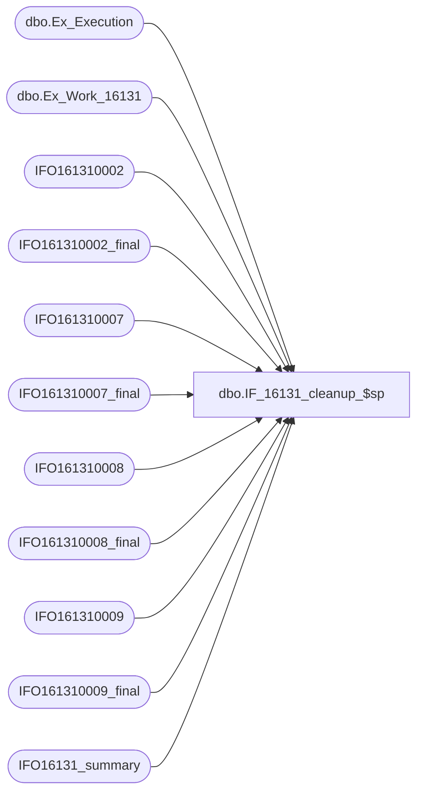

# dbo.IF_16131_cleanup_$sp

**Database:** auditworks  
**Server:** bedrockdb01  

## Architecture Diagram



## Table Dependencies

| Referenced Table |
|---|
| dbo.Ex_Execution |
| dbo.Ex_Work_16131 |
| IFO161310002 |
| IFO161310002_final |
| IFO161310007 |
| IFO161310007_final |
| IFO161310008 |
| IFO161310008_final |
| IFO161310009 |
| IFO161310009_final |
| IFO16131_summary |

## Stored Procedure Code

```sql
create proc dbo.IF_16131_cleanup_$sp
/* Name: IF_16131_cleanup_$sp
   Generated: 7/16/2015 4:49:55 PM
   Automatically Generated by SmartView Exports Builder
   Called by IF_16131_main_$sp.
Update rows as being processed..
   *** DO NOT MODIFY!!! ***
*/
@executionid int 
AS
DECLARE @errmsg               nvarchar(255), 
        @errno                int, 
        @transaction_count    numeric(12,0), 
        @process_no           smallint, 
        @process_log_entry    bit, 
        @process_timestamp    float, 
        @row                  int, 
        @return               tinyint, 
        @from_serial_no       numeric(14,0), 
        @to_serial_no         numeric(14,0) 

SELECT @errmsg = NULL, 
       @transaction_count = 0, 
       @process_no = 19, 
       @process_timestamp = 0, 
       @return = 1, 
       @to_serial_no = 0, 
       @from_serial_no = 0 


SELECT @from_serial_no = MIN(serial_no),
       @to_serial_no = MAX(serial_no)
  FROM auditworks.dbo.Ex_Work_16131

Begin Transaction

INSERT INTO IFO161310002_final
SELECT C1_RECORDID, C2_RECORDSEQUENCENUMBER, C3_FILLER, C4_TRANSACTIONSEQUENCENUMBER, C5_TRANSACTIONCODE, C6_CARDHOLDERACCOUNTNUMBER, C7_TRANSACTIONDATE, C8_TRANSACTIONTIME, C9_TRANSACTIONAMOUNT, C10_AUTHORIZATIONCODE, C11_ENTRYDATASOURCE, C12_POSENTRYMODE, C13_AUTHORIZATIONSOURCE, C14_AUTHORIZATIONRESPONSECODE, C15_DOWNGRADEREASON, C16_MERCHANTCATEGORYCODE, C17_INDUSTRYCODE, C18_AVSRESPONSECODE, C19_AVSREQUESTEDINDICATOR, C20_FILLER, C22_STORE, C23_MERCHANTNUMBER, C24_TERMINAL, C25_BATCHSALESCOUNT, C26_BATCHSALESAMOUNT, C27_BATCHRETURNSCOUNT, C28_BATCHRETURNSAMOUNT, C29_BATCHRECORDCOUNT, C30_IFENTRYNO, C31_LINEID, C32_CARDTYPE, C33_TRANSACTIONNUMBER, C34_REPORTAMOUNT, C35_CUSTOMERID, C36_GROUPID, C37_USERID, C38_FILEID, C39_BANKNUMBER, C40_STORELIVEFLAG, C41_STORELIVEDATE, C42_REPORTSWIPEINDICATOR, C43_BATCHNUMBER, C44_REPORTREGISTER
FROM IFO161310002

SELECT @errno = @@error 
IF @errno <> 0 
   BEGIN
   SELECT @errmsg = 'Unable to copy data to IFO161310002_final table.'
   GOTO error
   END


INSERT INTO IFO161310007_final
SELECT C1_RECORDID, C2_RECORDSEQUENCENUMBER, C3_INDUSTRYADDENDATYPE, C4_INVOICENUMBER, C5_RETAILITEMCODE1, C6_RETAILITEMCODE2, C7_RETAILITEMCODE3, C8_RETAILITEMCODE4, C9_RETAILITEMCODE5, C10_FILLER, C11_STORE, C13_IFENTRYNO, C14_LINEID, C15_DATE
FROM IFO161310007

SELECT @errno = @@error 
IF @errno <> 0 
   BEGIN
   SELECT @errmsg = 'Unable to copy data to IFO161310007_final table.'
   GOTO error
   END


INSERT INTO IFO161310008_final
SELECT C1_RECORDID, C2_RECORDSEQUENCENUMBER, C3_INDUSTRYADDENDATYPE, C4_ORDERNUMBER, C5_ELECTRONICCOMMERCEINDICATOR, C6_FILLER, C7_STORE, C8_IFENTRYNO, C9_LINEID, C10_DATE
FROM IFO161310008

SELECT @errno = @@error 
IF @errno <> 0 
   BEGIN
   SELECT @errmsg = 'Unable to copy data to IFO161310008_final table.'
   GOTO error
   END


INSERT INTO IFO161310009_final
SELECT C1_1RECORDID, C2_2RECORDSEQUENCENUMBER, C3_3DETAILADDENDATYPE, C4_4HARDWAREVENDORIDENTIER, C5_5SOFTWAREIDENTIFIER, C6_6HARDWARESERIALNUMBER, C7_7HOSTPROCESSINGPLATFORM, C8_8MESSAGEFORMATSUPPORT1, C9_9MESSAGEFORMATSUPPORT2, C10_10PERIPHERALSUPPORT1, C11_11PERIPHERALSUPPORT2, C12_12COMMUNICATIONINFO1, C13_13COMMUNICATIONINFO2, C14_14INDUSTRYINFORMATION1, C15_15INDUSTRYINFORMATION2, C16_16CLASSCOMPLIANCECERTIFICA, C17_17FUTURECAPABILITIES1, C18_18FUTURECAPABILITIES2, C19_19FILLER, C20_STORE, C21_IFENTRYNO, C22_LINEID, C23_DATE
FROM IFO161310009

SELECT @errno = @@error 
IF @errno <> 0 
   BEGIN
   SELECT @errmsg = 'Unable to copy data to IFO161310009_final table.'
   GOTO error
   END


 /*  Summary table cleanup and add rows to IFO16131_summary based on selection on 
     the Summary node. */

DELETE FROM IFO16131_summary WHERE execution_date < dateadd(dd, -30, getdate())
SELECT @errno = @@error 
IF @errno <> 0 
   BEGIN
   SELECT @errmsg = 'Unable to Delete from IFO16131_summary table.'
   GOTO error
   END


INSERT INTO IFO16131_summary
 (execution_id, execution_date, store, register, transaction_date, transaction_no, line_id, amount, card_type, account_no, auth_no, data1, data3)
   (SELECT @executionid, getdate(), a.C22_STORE, a.C24_TERMINAL, a.C7_TRANSACTIONDATE, a.C33_TRANSACTIONNUMBER, a.C31_LINEID, a.C34_REPORTAMOUNT, a.C32_CARDTYPE, a.C6_CARDHOLDERACCOUNTNUMBER, a.C10_AUTHORIZATIONCODE, a.C30_IFENTRYNO, a.C42_REPORTSWIPEINDICATOR
   FROM IFO161310002 a)

SELECT @errno = @@error 
IF @errno <> 0 
   BEGIN
   SELECT @errmsg = 'Unable to copy data to IFO16131_summary table.'
   GOTO error
   END


/* Insert into ex_execution the entries we have processed */
INSERT INTO auditworks.dbo.Ex_Execution
 (queue_id, object_id, execution_id, from_serial_no, to_serial_no)
 VALUES (52, 16131, @executionid, 
 @from_serial_no, @to_serial_no)
SELECT @errno = @@error 
IF @errno <> 0 
   BEGIN
   SELECT @errmsg = 'Unable to insert into auditworks.dbo.Ex_Execution'
   GOTO error
   END


Commit Transaction
endofproc: /* End of Procedure */ 
RETURN @return

error: /* Error Handler */ 

If @@trancount > 0 
   ROLLBACK TRANSACTION 

SELECT @errmsg = 'IF_16131:' + @errmsg + ' - ' + convert(varchar, @errno) 

RAISERROR (@errmsg, 16, 1)
RETURN
```

