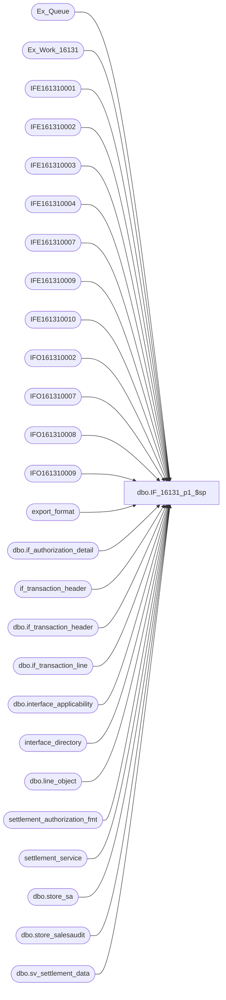

# dbo.IF_16131_p1_$sp

**Database:** auditworks  
**Server:** bedrockdb01  

## Architecture Diagram



## Table Dependencies

| Referenced Table |
|---|
| Ex_Queue |
| Ex_Work_16131 |
| IFE161310001 |
| IFE161310002 |
| IFE161310003 |
| IFE161310004 |
| IFE161310007 |
| IFE161310009 |
| IFE161310010 |
| IFO161310002 |
| IFO161310007 |
| IFO161310008 |
| IFO161310009 |
| export_format |
| dbo.if_authorization_detail |
| if_transaction_header |
| dbo.if_transaction_header |
| dbo.if_transaction_line |
| dbo.interface_applicability |
| interface_directory |
| dbo.line_object |
| settlement_authorization_fmt |
| settlement_service |
| dbo.store_sa |
| dbo.store_salesaudit |
| dbo.sv_settlement_data |

## Stored Procedure Code

```sql
create proc dbo.IF_16131_p1_$sp
/* Name: IF_16131_p1_$sp
   Generated: 7/16/2015 4:49:55 PM
   Automatically Generated by SmartView Exports Builder
   Called by IF_16131_main_$sp.
Building the follwing extracts: 
SQL Extract 1
SQL Extract 2
SQL Extract 3
SQL Extract 4
SQL Extract 7
Batch Number
SQL Extract 10.
   *** DO NOT MODIFY!!! ***
*/
AS
DECLARE @errmsg               nvarchar(255), 
        @errno                int, 
        @return               tinyint, 
        @transaction_count    numeric(12,0), 
        @process_no           smallint, 
        @process_log_entry    bit, 
        @process_timestamp    float

SELECT @errmsg = NULL, 
       @return = 0, 
       @process_no = 19, 
       @process_timestamp = 0


/*** Extracting data into the working table for the extract: SQL Extract 1 ***/

/*Reversal logic which will remove the original transaction and the reversal if they are in the same export processing batch.*/
/*You would insert this logic in the first SQL overide of the export, as it removes the original and the reversal from the work table.*/

DECLARE @C1_key_1 int,
@C1_key_2 int,
@C1_transaction_id int,
@C2_key_1 int,
@C2_key_2 int, 
@C2_transaction_id int
 
DECLARE c1 CURSOR READ_ONLY
FOR
Select a.key_1, a.key_2, b.transaction_id from Ex_Work_16131 a, if_transaction_header b 
where a.key_1 = b.if_entry_no and key_1 in
(Select if_entry_no from if_transaction_header where transaction_id in
(Select transaction_id from if_transaction_header where if_entry_no in 
(Select key_1 from Ex_Work_16131 where key_2 in (20,30))))
order by b.transaction_id DESC, a.key_1 DESC

DECLARE c2 CURSOR READ_ONLY
FOR
Select a.key_1, a.key_2, b.transaction_id from Ex_Work_16131 a, if_transaction_header b 
where a.key_1 = b.if_entry_no and key_1 in
(Select if_entry_no from if_transaction_header where transaction_id in
(Select transaction_id from if_transaction_header where if_entry_no in 
(Select key_1 from Ex_Work_16131 where key_2 in (20,30))))
order by b.transaction_id DESC, a.key_1 DESC

OPEN c1
OPEN c2

FETCH NEXT FROM c1
INTO @C1_key_1, @C1_key_2, @C1_transaction_id

FETCH NEXT FROM c2
INTO @C2_key_1, @C2_key_2, @C2_transaction_id

FETCH NEXT FROM c2
INTO @C2_key_1, @C2_key_2, @C2_transaction_id

WHILE @@FETCH_STATUS = 0
BEGIN
 Delete Ex_Work_16131 where key_1 in 
 (select @C1_key_1 where @C1_key_2 = 20 and @C2_key_2 in (10,30) and @C1_transaction_id = @C2_transaction_id)
 
 Delete Ex_Work_16131 where key_1 in  
 (select @C2_key_1 where @C1_key_2 = 20 and @C2_key_2 in (10,30) and @C1_transaction_id = @C2_transaction_id)
  
 FETCH NEXT FROM c1
 INTO @C1_key_1, @C1_key_2, @C1_transaction_id
 FETCH NEXT FROM c2
 INTO @C2_key_1, @C2_key_2, @C2_transaction_id

END

CLOSE c1
DEALLOCATE c1

CLOSE c2
DEALLOCATE c2

/* Paymentech Base */
/* AND (a.transaction_date >= d.store_live_date OR d.store_live_date = NULL) */
INSERT INTO IFE161310001 
SELECT a.key_1 as Field_a, c.line_id as Field_b, 
card_type = 
CASE     WHEN lower(f.line_object_description) like '%visa%' THEN 1
         WHEN lower(f.line_object_description) like '%master%' THEN 2
         WHEN lower(f.line_object_description) like '%american%' THEN 3
   WHEN lower(f.line_object_description) like '%amex%' THEN 3
   WHEN lower(f.line_object_description) like '%disco%' THEN 4
   WHEN lower(f.line_object_description) like '%jcb%' THEN 5
   WHEN lower(f.line_object_description) like '%diner%' THEN 6
   WHEN lower(f.line_object_description) like '%blanche%' THEN 7
         ELSE 0
      END,
c.line_action as Field_d, c.reference_no as Field_e, SUM(c.gross_line_amount) as Field_f, b.transaction_date as Field_g, b.store_no as Field_h, b.register_no as Field_i, b.entry_date_time as Field_j, b.transaction_no as Field_k, SUM(c.gross_line_amount * c.db_cr_none) as Field_l
FROM Ex_Work_16131 a, dbo.if_transaction_header b, dbo.if_transaction_line c, 
dbo.sv_settlement_data d, dbo.line_object f, dbo.interface_applicability g
WHERE b.if_entry_no = a.key_1
 AND b.if_entry_no=c.if_entry_no
 AND b.store_no=d.store_no
AND (b.transaction_date >= d.store_live_date OR d.store_live_date = NULL)
AND a.key_2 IN (10,20,30) 
AND c.line_object = f.line_object
AND c.line_object = g.line_object
AND c.line_action = g.line_action
AND b.transaction_category = g.transaction_category
AND d.interface_id = g.interface_id
AND c.line_void_flag = 0 AND d.store_live_flag = 1 
AND g.interface_id in
(Select queue_id from Ex_Queue where serial_no = (Select max(serial_no) from Ex_Work_16131))
AND c.gross_line_amount * c.db_cr_none <> 0
GROUP BY a.key_1,c.line_id,c.line_object,c.line_action,c.reference_no,
b.transaction_date,b.store_no,b.register_no,
b.entry_date_time,b.transaction_no,f.line_object_description


SELECT @errno = @@error 
IF @errno <> 0 
   BEGIN
   SELECT @errmsg = 'Unable to extract data into the working table for: SQL Extract 1.'
   GOTO error
   END


/*** Map the extract data to the output table ***/

INSERT INTO IFO161310002
( C6_CARDHOLDERACCOUNTNUMBER,
 C7_TRANSACTIONDATE,
 C8_TRANSACTIONTIME,
 C22_STORE,
 C30_IFENTRYNO,
 C31_LINEID)
SELECT Convert(nvarchar(4000), a.C5_lnrfrncn ),
a.C7_trnsctndt,
a.C10_trnsctnntrydttm,
Convert(numeric(20,0),{fn LEFT( a.C8_trnsctnstrn ,5)}),
Convert(numeric(20,0),a.C1_f_ntry_nky_1),
Convert(numeric(20,0),a.C2_lnID)
FROM IFE161310001 a


SELECT @errno = @@error 
IF @errno <> 0 
   BEGIN
   SELECT @errmsg = 'An error occurred while inserting into output table IFO161310002.'
   GOTO error
   END


UPDATE IFO161310002
 SET C9_TRANSACTIONAMOUNT = Convert(numeric(20,0),{fn LEFT({fn ABS( a.C6_lngrssmnt )} * 100,8)}),
C29_BATCHRECORDCOUNT = Convert(numeric(20,0),1),
C33_TRANSACTIONNUMBER = Convert(numeric(20,0),{fn RIGHT( a.C11_trnsctnn ,5)}),
C34_REPORTAMOUNT = Convert(numeric(20,2),{fn LEFT( a.C12_lngrsslnmtdbcr ,8)}),
C44_REPORTREGISTER = Convert(numeric(20,0),{fn RIGHT( a.C9_trnsctnrgstrn ,6)})
FROM IFE161310001 a,IFO161310002 b
WHERE a.C1_f_ntry_nky_1 = b.C30_IFENTRYNO AND
a.C2_lnID = b.C31_LINEID AND
a.C5_lnrfrncn = b.C6_CARDHOLDERACCOUNTNUMBER AND
a.C7_trnsctndt = b.C7_TRANSACTIONDATE AND
a.C8_trnsctnstrn = b.C22_STORE AND
a.C10_trnsctnntrydttm = b.C8_TRANSACTIONTIME

SELECT @errno = @@error 
IF @errno <> 0 
   BEGIN
   SELECT @errmsg = 'An error occurred while updating output table IFO161310002.'
   GOTO error
   END

UPDATE IFO161310002
SET C5_TRANSACTIONCODE = Convert(numeric(20,0),06)
FROM IFE161310001 a, IFO161310002 b

WHERE a.C1_f_ntry_nky_1 = b.C30_IFENTRYNO AND
a.C2_lnID = b.C31_LINEID AND
a.C5_lnrfrncn = b.C6_CARDHOLDERACCOUNTNUMBER AND
a.C7_trnsctndt = b.C7_TRANSACTIONDATE AND
a.C8_trnsctnstrn = b.C22_STORE AND
a.C10_trnsctnntrydttm = b.C8_TRANSACTIONTIME
  AND ( a.C12_lngrsslnmtdbcr  < 0)

SELECT @errno = @@error 
IF @errno <> 0 
   BEGIN
   SELECT @errmsg = 'An error occurred while updating output table IFO161310002.'
   GOTO error
   END

UPDATE IFO161310002
SET C17_INDUSTRYCODE = Convert(numeric(20,0),4)
FROM IFE161310001 a, IFO161310002 b

WHERE a.C1_f_ntry_nky_1 = b.C30_IFENTRYNO AND
a.C2_lnID = b.C31_LINEID AND
a.C5_lnrfrncn = b.C6_CARDHOLDERACCOUNTNUMBER AND
a.C7_trnsctndt = b.C7_TRANSACTIONDATE AND
a.C8_trnsctnstrn = b.C22_STORE AND
a.C10_trnsctnntrydttm = b.C8_TRANSACTIONTIME
  AND ( a.C3_lnbjct  = 3 OR  a.C3_lnbjct  = 4 OR  a.C3_lnbjct  = 5)

SELECT @errno = @@error 
IF @errno <> 0 
   BEGIN
   SELECT @errmsg = 'An error occurred while updating output table IFO161310002.'
   GOTO error
   END

UPDATE IFO161310002
SET C26_BATCHSALESAMOUNT = Convert(numeric(20,0),{fn LEFT({fn ABS( a.C6_lngrssmnt )} * 100,11)})
FROM IFE161310001 a, IFO161310002 b

WHERE a.C1_f_ntry_nky_1 = b.C30_IFENTRYNO AND
a.C2_lnID = b.C31_LINEID AND
a.C5_lnrfrncn = b.C6_CARDHOLDERACCOUNTNUMBER AND
a.C7_trnsctndt = b.C7_TRANSACTIONDATE AND
a.C8_trnsctnstrn = b.C22_STORE AND
a.C10_trnsctnntrydttm = b.C8_TRANSACTIONTIME
  AND ( a.C12_lngrsslnmtdbcr  > 0)

SELECT @errno = @@error 
IF @errno <> 0 
   BEGIN
   SELECT @errmsg = 'An error occurred while updating output table IFO161310002.'
   GOTO error
   END

UPDATE IFO161310002
SET C25_BATCHSALESCOUNT = Convert(numeric(20,0),1)
FROM IFE161310001 a, IFO161310002 b

WHERE a.C1_f_ntry_nky_1 = b.C30_IFENTRYNO AND
a.C2_lnID = b.C31_LINEID AND
a.C5_lnrfrncn = b.C6_CARDHOLDERACCOUNTNUMBER AND
a.C7_trnsctndt = b.C7_TRANSACTIONDATE AND
a.C8_trnsctnstrn = b.C22_STORE AND
a.C10_trnsctnntrydttm = b.C8_TRANSACTIONTIME
  AND ( a.C12_lngrsslnmtdbcr  > 0)

SELECT @errno = @@error 
IF @errno <> 0 
   BEGIN
   SELECT @errmsg = 'An error occurred while updating output table IFO161310002.'
   GOTO error
   END

UPDATE IFO161310002
SET C28_BATCHRETURNSAMOUNT = Convert(numeric(20,0),{fn LEFT({fn ABS( a.C6_lngrssmnt )} * 100,11)})
FROM IFE161310001 a, IFO161310002 b

WHERE a.C1_f_ntry_nky_1 = b.C30_IFENTRYNO AND
a.C2_lnID = b.C31_LINEID AND
a.C5_lnrfrncn = b.C6_CARDHOLDERACCOUNTNUMBER AND
a.C7_trnsctndt = b.C7_TRANSACTIONDATE AND
a.C8_trnsctnstrn = b.C22_STORE AND
a.C10_trnsctnntrydttm = b.C8_TRANSACTIONTIME
  AND ( a.C12_lngrsslnmtdbcr  < 0)

SELECT @errno = @@error 
IF @errno <> 0 
   BEGIN
   SELECT @errmsg = 'An error occurred while updating output table IFO161310002.'
   GOTO error
   END

UPDATE IFO161310002
SET C27_BATCHRETURNSCOUNT = Convert(numeric(20,0),1)
FROM IFE161310001 a, IFO161310002 b

WHERE a.C1_f_ntry_nky_1 = b.C30_IFENTRYNO AND
a.C2_lnID = b.C31_LINEID AND
a.C5_lnrfrncn = b.C6_CARDHOLDERACCOUNTNUMBER AND
a.C7_trnsctndt = b.C7_TRANSACTIONDATE AND
a.C8_trnsctnstrn = b.C22_STORE AND
a.C10_trnsctnntrydttm = b.C8_TRANSACTIONTIME
  AND ( a.C12_lngrsslnmtdbcr  < 0)

SELECT @errno = @@error 
IF @errno <> 0 
   BEGIN
   SELECT @errmsg = 'An error occurred while updating output table IFO161310002.'
   GOTO error
   END

UPDATE IFO161310002
SET C13_AUTHORIZATIONSOURCE = Convert(nvarchar(4000),'E')
FROM IFE161310001 a, IFO161310002 b

WHERE a.C1_f_ntry_nky_1 = b.C30_IFENTRYNO AND
a.C2_lnID = b.C31_LINEID AND
a.C5_lnrfrncn = b.C6_CARDHOLDERACCOUNTNUMBER AND
a.C7_trnsctndt = b.C7_TRANSACTIONDATE AND
a.C8_trnsctnstrn = b.C22_STORE AND
a.C10_trnsctnntrydttm = b.C8_TRANSACTIONTIME
  AND ( a.C12_lngrsslnmtdbcr  > 0 AND  a.C3_lnbjct  = 1)

SELECT @errno = @@error 
IF @errno <> 0 
   BEGIN
   SELECT @errmsg = 'An error occurred while updating output table IFO161310002.'
   GOTO error
   END

UPDATE IFO161310002
SET C13_AUTHORIZATIONSOURCE = Convert(nvarchar(4000),'9')
FROM IFE161310001 a, IFO161310002 b

WHERE a.C1_f_ntry_nky_1 = b.C30_IFENTRYNO AND
a.C2_lnID = b.C31_LINEID AND
a.C5_lnrfrncn = b.C6_CARDHOLDERACCOUNTNUMBER AND
a.C7_trnsctndt = b.C7_TRANSACTIONDATE AND
a.C8_trnsctnstrn = b.C22_STORE AND
a.C10_trnsctnntrydttm = b.C8_TRANSACTIONTIME
  AND ( a.C12_lngrsslnmtdbcr  < 0 AND  a.C3_lnbjct  = 1)

SELECT @errno = @@error 
IF @errno <> 0 
   BEGIN
   SELECT @errmsg = 'An error occurred while updating output table IFO161310002.'
   GOTO error
   END


/*** Extracting data into the working table for the extract: SQL Extract 2 ***/

/* Paymentech Base */
/* AND (a.transaction_date >= e.store_live_date OR e.store_live_date = NULL) */

INSERT INTO IFE161310002 
SELECT a.key_1 as Field_a, d.line_id as Field_b, c.authorization_no as Field_c, 
convert(smalldatetime,b.entry_date_time) as Field_d, c.swipe_indicator as Field_e, 
c.approval_message as Field_f, d.line_action as Field_g, 
card_type = 
CASE     WHEN lower(f.line_object_description) like '%visa%' THEN 1
         WHEN lower(f.line_object_description) like '%master%' THEN 2
         WHEN lower(f.line_object_description) like '%american%' THEN 3
   WHEN lower(f.line_object_description) like '%amex%' THEN 3
   WHEN lower(f.line_object_description) like '%disco%' THEN 4
   WHEN lower(f.line_object_description) like '%jcb%' THEN 5
   WHEN lower(f.line_object_description) like '%diner%' THEN 6
   WHEN lower(f.line_object_description) like '%blanche%' THEN 7
         ELSE 0
      END,
c.card_type as Field_i, SUM(d.gross_line_amount * d.db_cr_none) as Field_j
FROM Ex_Work_16131 a, dbo.if_transaction_header b, dbo.if_authorization_detail c, 
dbo.if_transaction_line d, dbo.sv_settlement_data e, dbo.line_object f, dbo.interface_applicability g
WHERE b.if_entry_no = a.key_1
 AND b.if_entry_no = d.if_entry_no AND d.line_id = c.line_id and d.if_entry_no = c.if_entry_no
 AND b.store_no=e.store_no
AND (b.transaction_date >= e.store_live_date OR e.store_live_date = NULL) 
AND a.key_2 IN (10,20,30) 
AND d.line_object = f.line_object
AND d.line_object = g.line_object
AND d.line_action = g.line_action
AND b.transaction_category = g.transaction_category
AND e.interface_id = g.interface_id
AND d.line_void_flag = 0 AND e.store_live_flag = 1 
AND g.interface_id in
(Select queue_id from Ex_Queue where serial_no = (Select max(serial_no) from Ex_Work_16131))
AND d.gross_line_amount * d.db_cr_none <> 0
GROUP BY a.key_1,d.line_id,c.authorization_no,convert(smalldatetime,b.entry_date_time),
c.swipe_indicator,c.approval_message,d.line_action,d.line_object,c.card_type, f.line_object_description


SELECT @errno = @@error 
IF @errno <> 0 
   BEGIN
   SELECT @errmsg = 'Unable to extract data into the working table for: SQL Extract 2.'
   GOTO error
   END


/*** Map the extract data to the output table ***/

UPDATE IFO161310002
 SET C32_CARDTYPE = Convert(nvarchar(4000),{fn LEFT( a.C15_thcrdtypcd ,1)})
FROM IFE161310002 a,IFO161310002 b
WHERE a.C1_f_ntry_nky_1 = b.C30_IFENTRYNO AND
a.C2_lnID = b.C31_LINEID

SELECT @errno = @@error 
IF @errno <> 0 
   BEGIN
   SELECT @errmsg = 'An error occurred while updating output table IFO161310002.'
   GOTO error
   END

UPDATE IFO161310002
SET C12_POSENTRYMODE = Convert(nvarchar(4000),'01')
FROM IFE161310002 a, IFO161310002 b

WHERE a.C1_f_ntry_nky_1 = b.C30_IFENTRYNO AND
a.C2_lnID = b.C31_LINEID
  AND ( a.C9_thswpndctr  = 1)

SELECT @errno = @@error 
IF @errno <> 0 
   BEGIN
   SELECT @errmsg = 'An error occurred while updating output table IFO161310002.'
   GOTO error
   END

UPDATE IFO161310002
SET C10_AUTHORIZATIONCODE = Convert(nvarchar(4000),{fn LEFT( a.C8_ththrztnn ,6)})
FROM IFE161310002 a, IFO161310002 b

WHERE a.C1_f_ntry_nky_1 = b.C30_IFENTRYNO AND
a.C2_lnID = b.C31_LINEID
  AND ( a.C16_lngrsslnmtdbcr  > 0)

SELECT @errno = @@error 
IF @errno <> 0 
   BEGIN
   SELECT @errmsg = 'An error occurred while updating output table IFO161310002.'
   GOTO error
   END

UPDATE IFO161310002
SET C11_ENTRYDATASOURCE = Convert(numeric(20,0),2)
FROM IFE161310002 a, IFO161310002 b

WHERE a.C1_f_ntry_nky_1 = b.C30_IFENTRYNO AND
a.C2_lnID = b.C31_LINEID
  AND ( a.C9_thswpndctr  = 1)

SELECT @errno = @@error 
IF @errno <> 0 
   BEGIN
   SELECT @errmsg = 'An error occurred while updating output table IFO161310002.'
   GOTO error
   END

UPDATE IFO161310002
SET C13_AUTHORIZATIONSOURCE = Convert(nvarchar(4000),5)
FROM IFE161310002 a, IFO161310002 b

WHERE a.C1_f_ntry_nky_1 = b.C30_IFENTRYNO AND
a.C2_lnID = b.C31_LINEID
  AND ( a.C3_lnbjct  = 1 AND  a.C16_lngrsslnmtdbcr  > 0 AND {fn LEFT( a.C10_thpprvlmsg ,1)} = 'a')

SELECT @errno = @@error 
IF @errno <> 0 
   BEGIN
   SELECT @errmsg = 'An error occurred while updating output table IFO161310002.'
   GOTO error
   END

UPDATE IFO161310002
SET C14_AUTHORIZATIONRESPONSECODE = Convert(nvarchar(4000),'00')
FROM IFE161310002 a, IFO161310002 b

WHERE a.C1_f_ntry_nky_1 = b.C30_IFENTRYNO AND
a.C2_lnID = b.C31_LINEID
  AND ( a.C3_lnbjct  = 1 AND  a.C16_lngrsslnmtdbcr  > 0)

SELECT @errno = @@error 
IF @errno <> 0 
   BEGIN
   SELECT @errmsg = 'An error occurred while updating output table IFO161310002.'
   GOTO error
   END

UPDATE IFO161310002
SET C42_REPORTSWIPEINDICATOR = Convert(nvarchar(4000),'SWIPED')
FROM IFE161310002 a, IFO161310002 b

WHERE a.C1_f_ntry_nky_1 = b.C30_IFENTRYNO AND
a.C2_lnID = b.C31_LINEID
  AND ( a.C9_thswpndctr  <> 1)

SELECT @errno = @@error 
IF @errno <> 0 
   BEGIN
   SELECT @errmsg = 'An error occurred while updating output table IFO161310002.'
   GOTO error
   END

UPDATE IFO161310002
SET C42_REPORTSWIPEINDICATOR = Convert(nvarchar(4000),'KEYED')
FROM IFE161310002 a, IFO161310002 b

WHERE a.C1_f_ntry_nky_1 = b.C30_IFENTRYNO AND
a.C2_lnID = b.C31_LINEID
  AND ( a.C9_thswpndctr  = 1)

SELECT @errno = @@error 
IF @errno <> 0 
   BEGIN
   SELECT @errmsg = 'An error occurred while updating output table IFO161310002.'
   GOTO error
   END

UPDATE IFO161310002
SET C12_POSENTRYMODE = Convert(nvarchar(4000),'02')
FROM IFE161310002 a, IFO161310002 b

WHERE a.C1_f_ntry_nky_1 = b.C30_IFENTRYNO AND
a.C2_lnID = b.C31_LINEID
  AND ( a.C3_lnbjct  = 4 AND  a.C9_thswpndctr  = 2)

SELECT @errno = @@error 
IF @errno <> 0 
   BEGIN
   SELECT @errmsg = 'An error occurred while updating output table IFO161310002.'
   GOTO error
   END

UPDATE IFO161310002
SET C12_POSENTRYMODE = Convert(nvarchar(4000),'01')
FROM IFE161310002 a, IFO161310002 b

WHERE a.C1_f_ntry_nky_1 = b.C30_IFENTRYNO AND
a.C2_lnID = b.C31_LINEID
  AND ( a.C3_lnbjct  = 4 AND  a.C9_thswpndctr  <> 2)

SELECT @errno = @@error 
IF @errno <> 0 
   BEGIN
   SELECT @errmsg = 'An error occurred while updating output table IFO161310002.'
   GOTO error
   END

UPDATE IFO161310002
SET C5_TRANSACTIONCODE = Convert(numeric(20,0),01)
FROM IFE161310002 a, IFO161310002 b

WHERE a.C1_f_ntry_nky_1 = b.C30_IFENTRYNO AND
a.C2_lnID = b.C31_LINEID
  AND ({fn LEFT( a.C10_thpprvlmsg ,1)} = 'a' AND  a.C16_lngrsslnmtdbcr  > 0)

SELECT @errno = @@error 
IF @errno <> 0 
   BEGIN
   SELECT @errmsg = 'An error occurred while updating output table IFO161310002.'
   GOTO error
   END


/*** Extracting data into the working table for the extract: SQL Extract 3 ***/

/* Paymentech Base */
/* AND (a.transaction_date >= e.store_live_date OR e.store_live_date = NULL) */
INSERT INTO IFE161310003 
SELECT DISTINCT c.key_1 as Field_a, b.line_id as Field_b, 
card_type = 
CASE     WHEN lower(f.line_object_description) like '%visa%' THEN 1
         WHEN lower(f.line_object_description) like '%master%' THEN 2
         WHEN lower(f.line_object_description) like '%american%' THEN 3
   WHEN lower(f.line_object_description) like '%amex%' THEN 3
   WHEN lower(f.line_object_description) like '%disco%' THEN 4
   WHEN lower(f.line_object_description) like '%jcb%' THEN 5
   WHEN lower(f.line_object_description) like '%diner%' THEN 6
   WHEN lower(f.line_object_description) like '%blanche%' THEN 7
      ELSE 0
      END,
b.line_action as Field_d, d.store_name as Field_e, e.interface_id as Field_f, 
e.store_merchant_id as Field_g, e.store_live_date as Field_h, e.store_live_flag as Field_i, 
e.interface_id as Field_j, e.chain_name as Field_k, e.chain_merchant_id as Field_l, 
e.service_parameters as Field_m, e.merchandise_description as Field_n
FROM dbo.if_transaction_header a, dbo.if_transaction_line b, Ex_Work_16131 c, dbo.store_sa d, dbo.sv_settlement_data e
, dbo.line_object f, dbo.interface_applicability g
WHERE a.if_entry_no=b.if_entry_no
 AND a.if_entry_no = c.key_1
 AND a.store_no=d.store_no
 AND a.store_no=e.store_no
AND (a.transaction_date >= e.store_live_date OR e.store_live_date = NULL)
AND c.key_2 IN (10,20,30) 
AND b.line_object = f.line_object
AND b.line_object = g.line_object
AND b.line_action = g.line_action
AND a.transaction_category = g.transaction_category
AND b.line_void_flag = 0 
AND e.store_live_flag = 1 
AND e.interface_id = g.interface_id
AND g.interface_id in
(Select queue_id from Ex_Queue where serial_no = (Select max(serial_no) from Ex_Work_16131))
AND b.gross_line_amount * b.db_cr_none <> 0


SELECT @errno = @@error 
IF @errno <> 0 
   BEGIN
   SELECT @errmsg = 'Unable to extract data into the working table for: SQL Extract 3.'
   GOTO error
   END


/*** Map the extract data to the output table ***/

UPDATE IFO161310002
 SET C23_MERCHANTNUMBER = Convert(numeric(20,0),{fn LEFT( a.C8_SSETstr_mrchnt_d ,12)}),
C35_CUSTOMERID = Convert(nvarchar(4000),{fn LEFT( a.C10_SSchn_nm ,10)}),
C16_MERCHANTCATEGORYCODE = Convert(numeric(20,0),{fn LEFT( a.C11_SSchn_mrchnt_d ,4)}),
C39_BANKNUMBER = Convert(numeric(20,0),{fn SUBSTRING( a.C11_SSchn_mrchnt_d ,5,3)}),
C36_GROUPID = Convert(nvarchar(4000),{fn LEFT( a.C12_SSsrvc_prmtrs ,8)}),
C37_USERID = Convert(nvarchar(4000),{fn SUBSTRING( a.C12_SSsrvc_prmtrs ,9,8)}),
C38_FILEID = Convert(nvarchar(4000),{fn LEFT( a.C13_SSmrchnds_dscrptn ,20)})
FROM IFE161310003 a,IFO161310002 b
WHERE a.C1_f_ntry_nky_1 = b.C30_IFENTRYNO AND
a.C2_lnID = b.C31_LINEID

SELECT @errno = @@error 
IF @errno <> 0 
   BEGIN
   SELECT @errmsg = 'An error occurred while updating output table IFO161310002.'
   GOTO error
   END


/*** Extracting data into the working table for the extract: SQL Extract 4 ***/

/* Paymentech Base */
/*AND (a.transaction_date >= e.store_live_date OR e.store_live_date = NULL) */
INSERT INTO IFE161310004 
SELECT DISTINCT c.key_1 as Field_a, b.line_id as Field_b, 
card_type = 
CASE     WHEN lower(f.line_object_description) like '%visa%' THEN 1
         WHEN lower(f.line_object_description) like '%master%' THEN 2
         WHEN lower(f.line_object_description) like '%american%' THEN 3
   WHEN lower(f.line_object_description) like '%amex%' THEN 3
   WHEN lower(f.line_object_description) like '%disco%' THEN 4
   WHEN lower(f.line_object_description) like '%jcb%' THEN 5
   WHEN lower(f.line_object_description) like '%diner%' THEN 6
   WHEN lower(f.line_object_description) like '%blanche%' THEN 7
         ELSE 0
      END,
b.line_action as Field_d, a.store_no as Field_e, a.register_no as Field_f, a.transaction_no as Field_g, 
a.transaction_date as Field_h
FROM dbo.if_transaction_header a, dbo.if_transaction_line b, Ex_Work_16131 c, dbo.store_salesaudit d, dbo.sv_settlement_data e
, dbo.line_object f, dbo.interface_applicability g
WHERE a.if_entry_no=b.if_entry_no
 AND a.if_entry_no = c.key_1
 AND a.store_no = d.store_no
 AND a.store_no=e.store_no
AND c.key_2 IN (10,20,30) 
AND b.line_object = f.line_object
AND b.line_object = g.line_object
AND b.line_action = g.line_action
AND a.transaction_category = g.transaction_category
AND b.line_void_flag = 0 AND e.store_live_flag = 1 
AND e.interface_id = g.interface_id
AND g.interface_id in
(Select queue_id from Ex_Queue where serial_no = (Select max(serial_no) from Ex_Work_16131))
AND d.store_export_code <> 'E' AND b.gross_line_amount * b.db_cr_none <> 0
AND (a.transaction_date >= e.store_live_date OR e.store_live_date = NULL)
AND (lower(f.line_object_description) like '%american%'
or lower(f.line_object_description) like '%amex%'
or lower(f.line_object_description) like '%discover%'
or lower(f.line_object_description) like '%jcb%')


SELECT @errno = @@error 
IF @errno <> 0 
   BEGIN
   SELECT @errmsg = 'Unable to extract data into the working table for: SQL Extract 4.'
   GOTO error
   END


/*** Map the extract data to the output table ***/

INSERT INTO IFO161310007
( C11_STORE,
 C13_IFENTRYNO,
 C14_LINEID)
SELECT Convert(numeric(20,0),{fn LEFT( a.C9_trnsctnstrn ,5)}),
Convert(numeric(20,0),a.C1_f_ntry_nky_1),
Convert(numeric(20,0),a.C2_lnID)
FROM IFE161310004 a


SELECT @errno = @@error 
IF @errno <> 0 
   BEGIN
   SELECT @errmsg = 'An error occurred while inserting into output table IFO161310007.'
   GOTO error
   END


UPDATE IFO161310007
 SET C4_INVOICENUMBER = Convert(numeric(20,0),{fn LEFT( a.C12_trnsctnn ,6)}),
C15_DATE = a.C14_trnsctndt
FROM IFE161310004 a,IFO161310007 b
WHERE a.C1_f_ntry_nky_1 = b.C13_IFENTRYNO AND
a.C2_lnID = b.C14_LINEID AND
a.C9_trnsctnstrn = b.C11_STORE

SELECT @errno = @@error 
IF @errno <> 0 
   BEGIN
   SELECT @errmsg = 'An error occurred while updating output table IFO161310007.'
   GOTO error
   END


/*** Extracting data into the working table for the extract: SQL Extract 7 ***/

/* Paymentech Base */
/*AND (b.transaction_date >= e.store_live_date OR e.store_live_date = NULL) */
INSERT INTO IFE161310007 
SELECT DISTINCT a.key_1 as Field_a, c.line_id as Field_b, 
card_type = 
CASE     WHEN lower(f.line_object_description) like '%visa%' THEN 1
         WHEN lower(f.line_object_description) like '%master%' THEN 2
         WHEN lower(f.line_object_description) like '%american%' THEN 3
   WHEN lower(f.line_object_description) like '%amex%' THEN 3
   WHEN lower(f.line_object_description) like '%disco%' THEN 4
   WHEN lower(f.line_object_description) like '%jcb%' THEN 5
   WHEN lower(f.line_object_description) like '%diner%' THEN 6
   WHEN lower(f.line_object_description) like '%blanche%' THEN 7
         ELSE 0
      END,
c.line_action as Field_d, b.store_no as Field_e, b.register_no as Field_f, b.transaction_no as Field_g, b.transaction_date as Field_h
FROM Ex_Work_16131 a, dbo.if_transaction_header b, dbo.if_transaction_line c, dbo.store_salesaudit d, dbo.sv_settlement_data e
, dbo.line_object f, dbo.interface_applicability g
WHERE b.if_entry_no = a.key_1
 AND b.if_entry_no=c.if_entry_no
 AND b.store_no = d.store_no
 AND b.store_no=e.store_no
AND (b.transaction_date >= e.store_live_date OR e.store_live_date = NULL)
AND a.key_2 IN (10,20,30) 
AND c.line_object = f.line_object
AND c.line_object = g.line_object
AND c.line_action = g.line_action
AND b.transaction_category = g.transaction_category
AND c.line_void_flag = 0 
AND e.store_live_flag = 1 
AND e.interface_id = g.interface_id
AND g.interface_id in
(Select queue_id from Ex_Queue where serial_no = (Select max(serial_no) from Ex_Work_16131))
AND d.store_export_code = 'E' 
AND c.gross_line_amount * c.db_cr_none <> 0
AND (lower(f.line_object_description) like '%visa%'
or lower(f.line_object_description) like '%master%'
or lower(f.line_object_description) like '%american%'
or lower(f.line_object_description) like '%amex%')


SELECT @errno = @@error 
IF @errno <> 0 
   BEGIN
   SELECT @errmsg = 'Unable to extract data into the working table for: SQL Extract 7.'
   GOTO error
   END


/*** Map the extract data to the output table ***/

INSERT INTO IFO161310008
( C7_STORE,
 C8_IFENTRYNO,
 C9_LINEID)
SELECT Convert(numeric(20,0),{fn LEFT( a.C6_trnsctnstrn ,5)}),
Convert(numeric(20,0),a.C1_f_ntry_nky_1),
Convert(numeric(20,0),a.C2_lnID)
FROM IFE161310007 a


SELECT @errno = @@error 
IF @errno <> 0 
   BEGIN
   SELECT @errmsg = 'An error occurred while inserting into output table IFO161310008.'
   GOTO error
   END


UPDATE IFO161310008
 SET C10_DATE = a.C9_trnsctndt
FROM IFE161310007 a,IFO161310008 b
WHERE a.C1_f_ntry_nky_1 = b.C8_IFENTRYNO AND
a.C2_lnID = b.C9_LINEID AND
a.C6_trnsctnstrn = b.C7_STORE

SELECT @errno = @@error 
IF @errno <> 0 
   BEGIN
   SELECT @errmsg = 'An error occurred while updating output table IFO161310008.'
   GOTO error
   END


/*** Extracting data into the working table for the extract: Batch Number ***/

DECLARE @saf_service_parameters varchar(255), @interface_id tinyint, @export_format tinyint, @if_export_code smallint
SELECT @interface_id = max(e.interface_id), @export_format = max(d.ascii_export)
  FROM interface_directory d, export_format e
 WHERE d.interface_id in (Select queue_id from Ex_Queue where serial_no = (Select max(serial_no) from Ex_Work_16131))

   AND d.ascii_export = e.export_format
   AND (d.interface_id = e.interface_id or e.interface_id = 0)

SELECT @if_export_code = IsNull(if_export_code, 1)
  FROM export_format
 WHERE interface_id = @interface_id 
   AND export_format = @export_format

select @saf_service_parameters = settlement_authorization_fmt.service_parameters
from settlement_service ss, settlement_authorization_fmt
where ss.interface_id in (Select queue_id from Ex_Queue where serial_no = (Select max(serial_no) from Ex_Work_16131))

and ss.auth_format_default = settlement_authorization_fmt.auth_format

IF charindex('TID=', @saf_service_parameters) <> 0
  SELECT @saf_service_parameters = substring(@saf_service_parameters, charindex('TID=', @saf_service_parameters) + 4, 3)
ELSE
  SELECT @saf_service_parameters = '001'

IF IsNull(datalength(@saf_service_parameters), 0) <> 3
  SELECT @saf_service_parameters = '001'

INSERT INTO IFE161310009 
VALUES(@if_export_code, @saf_service_parameters )

IF @if_export_code < 998
BEGIN
  UPDATE export_format
     SET if_export_code = @if_export_code + 1
   WHERE interface_id = @interface_id 
     AND export_format = @export_format
END
ELSE
BEGIN
  UPDATE export_format
     SET if_export_code = 1
   WHERE interface_id = @interface_id 
     AND export_format = @export_format
END


SELECT @errno = @@error 
IF @errno <> 0 
   BEGIN
   SELECT @errmsg = 'Unable to extract data into the working table for: Batch Number.'
   GOTO error
   END


/*** Map the extract data to the output table ***/

UPDATE IFO161310002
 SET C43_BATCHNUMBER = Convert(numeric(20,0),a.C1_trnsctnSrcPrcssN),
C24_TERMINAL = Convert(numeric(20,0),a.C2_SSsrvc_prmtrs)
FROM IFE161310009 a,IFO161310002 b

SELECT @errno = @@error 
IF @errno <> 0 
   BEGIN
   SELECT @errmsg = 'An error occurred while updating output table IFO161310002.'
   GOTO error
   END


/*** Extracting data into the working table for the extract: SQL Extract 10 ***/

/* Paymentech Base */
/* AND (a.transaction_date >= d.store_live_date OR d.store_live_date = NULL) */

INSERT INTO IFE161310010 SELECT DISTINCT c.key_1 as Field_a, b.line_id as Field_b, 
a.transaction_date as Field_c, a.store_no as Field_d
FROM dbo.if_transaction_header a, dbo.if_transaction_line b, 
Ex_Work_16131 c, dbo.sv_settlement_data d, dbo.line_object f, 
dbo.interface_applicability g, dbo.store_salesaudit h
WHERE a.if_entry_no=b.if_entry_no
 AND a.if_entry_no = c.key_1
 AND a.store_no=d.store_no
AND a.store_no=h.store_no
AND b.line_object = f.line_object
AND b.line_object = g.line_object
AND b.line_action = g.line_action
AND a.transaction_category = g.transaction_category
AND c.key_2 IN (10,20,30) 
AND b.line_void_flag = 0 
AND d.store_live_flag = 1 
AND d.interface_id = g.interface_id
AND g.interface_id in
(Select queue_id from Ex_Queue where serial_no = (Select max(serial_no) from Ex_Work_16131))
AND b.gross_line_amount * b.db_cr_none <> 0
AND (a.transaction_date >= d.store_live_date OR d.store_live_date = NULL)
AND (upper(left(h.settlement_billing_name,1)) = 'N'  OR upper(substring(d.chain_merchant_id,8,1)) <> 'R')

SELECT @errno = @@error 
IF @errno <> 0 
   BEGIN
   SELECT @errmsg = 'Unable to extract data into the working table for: SQL Extract 10.'
   GOTO error
   END


/*** Map the extract data to the output table ***/

INSERT INTO IFO161310009
( C21_IFENTRYNO,
 C22_LINEID,
 C23_DATE,
 C20_STORE)
SELECT Convert(numeric(20,0),a.C1_f_ntry_nky_1),
Convert(numeric(20,0),a.C2_lnID),
a.C5_trnsctndt,
Convert(numeric(20,0),a.C6_trnsctnstrn)
FROM IFE161310010 a


SELECT @errno = @@error 
IF @errno <> 0 
   BEGIN
   SELECT @errmsg = 'An error occurred while inserting into output table IFO161310009.'
   GOTO error
   END


endofproc: /* End of Procedure */ 
RETURN @return

error: /* Error Handler */ 

If @@trancount > 0 
   ROLLBACK TRANSACTION 

SELECT @errmsg = 'IF_16131:' + @errmsg + ' - ' + convert(varchar, @errno) 

RAISERROR (@errmsg, 16, 1)
RETURN
```

