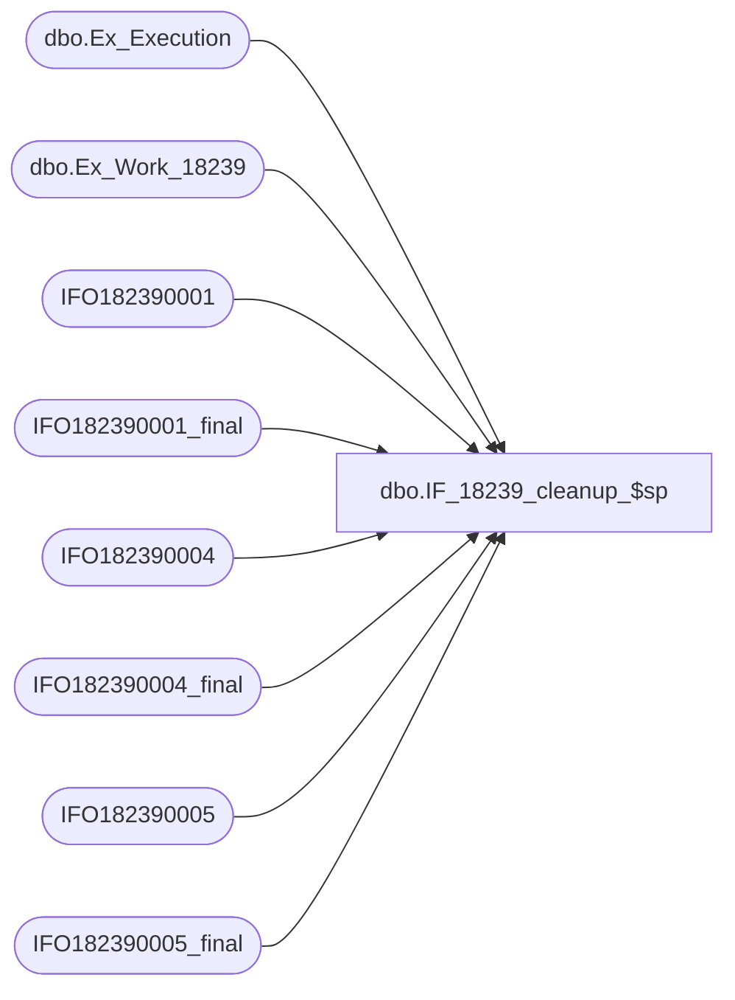

# dbo.IF_18239_cleanup_$sp

**Database:** auditworks  
**Server:** bedrockdb01  

## Architecture Diagram



## Table Dependencies

| Referenced Table |
|---|
| dbo.Ex_Execution |
| dbo.Ex_Work_18239 |
| IFO182390001 |
| IFO182390001_final |
| IFO182390004 |
| IFO182390004_final |
| IFO182390005 |
| IFO182390005_final |

## Stored Procedure Code

```sql
create proc dbo.IF_18239_cleanup_$sp
/* Name: IF_18239_cleanup_$sp
   Generated: 9/28/2010 10:22:42 AM
   Automatically Generated by SmartView Exports Builder
   Called by IF_18239_main_$sp.
Update rows as being processed..
   *** DO NOT MODIFY!!! ***
*/
@executionid int 
AS
DECLARE @errmsg               varchar(255), 
        @errno                int, 
        @transaction_count    numeric(12,0), 
        @process_no           smallint, 
        @process_log_entry    bit, 
        @process_timestamp    float, 
        @row                  int, 
        @return               tinyint, 
        @from_serial_no       numeric(14,0), 
        @to_serial_no         numeric(14,0) 

SELECT @errmsg = NULL, 
       @transaction_count = 0, 
       @process_no = 19, 
       @process_timestamp = 0, 
       @return = 1, 
       @to_serial_no = 0, 
       @from_serial_no = 0 


SELECT @from_serial_no = MIN(serial_no),
       @to_serial_no = MAX(serial_no)
  FROM auditworks.dbo.Ex_Work_18239

Begin Transaction

INSERT INTO IFO182390001_final
SELECT C1_HdrID, C34_Ky_2, C2_TrnsID, C3_POSTrnsN, C4_TrnsSrc, C5_Str, C6_Rgstr, C7_Cshr, C8_TrnsTyp, C9_TrnsDt, C10_CstmrN, C11_MtchKy, C12_Tlphn, C13_TndrTyp, C14_FlgAEmplySl, C15_FlgBBrBcksRdmd, C16_FlgCMllCrtfctRdmd, C17_FlgDLyltyRwrdRdmd, C30_FlgEECrtfctRdmd, C29_FlgFByStffCrdRdmd, C28_FlgGCbCsh, C27_SgFlg8, C22_TrnsAmnt, C33_CrrncyCd, C35_CpnCd1, C36_CpnCd2, C37_CpnCd3, C38_CpnCd4, C40_CpnCd5
FROM IFO182390001

SELECT @errno = @@error 
IF @errno <> 0 
   BEGIN
   SELECT @errmsg = 'Unable to copy data to IFO182390001_final table.'
   GOTO error
   END


INSERT INTO IFO182390004_final
SELECT C1_HdrID, C2_DtlLnN, C3_MrchndsngStylCd, C4_ClrCd, C5_SzDscrptn, C6_Qntty, C7_ItmAmntLcl, C14_DmmyNtCst, C9_SlsAssctN, C10_MrkdwnPrcnt, C11_Cpn1, C12_PrdctCd, C13_Cmmnt, C15_Cpn2, C16_Cpn3, C17_Cpn4, C18_Cpn5
FROM IFO182390004

SELECT @errno = @@error 
IF @errno <> 0 
   BEGIN
   SELECT @errmsg = 'Unable to copy data to IFO182390004_final table.'
   GOTO error
   END


INSERT INTO IFO182390005_final
SELECT C1_HdrID, C2_Ln#, C3_TndrTyp, C4_Idntfr, C5_Amnt
FROM IFO182390005

SELECT @errno = @@error 
IF @errno <> 0 
   BEGIN
   SELECT @errmsg = 'Unable to copy data to IFO182390005_final table.'
   GOTO error
   END


/* Insert into ex_execution the entries we have processed */
INSERT INTO auditworks.dbo.Ex_Execution
 (queue_id, object_id, execution_id, from_serial_no, to_serial_no)
 VALUES (26, 18239, @executionid, 
 @from_serial_no, @to_serial_no)
SELECT @errno = @@error 
IF @errno <> 0 
   BEGIN
   SELECT @errmsg = 'Unable to insert into auditworks.dbo.Ex_Execution'
   GOTO error
   END


Commit Transaction
endofproc: /* End of Procedure */ 
RETURN @return

error: /* Error Handler */ 

If @@trancount > 0 
   ROLLBACK TRANSACTION 

SELECT @errmsg = 'IF_18239:' + @errmsg + ' - ' + convert(varchar, @errno) 

RAISERROR (@errmsg, 16, 1)
RETURN
```

