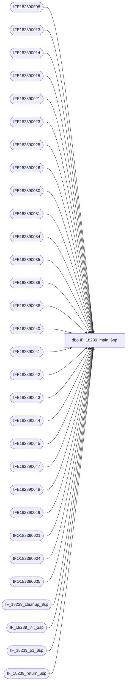

# dbo.IF_18239_main_$sp

**Database:** auditworks  
**Server:** bedrockdb01  

## Architecture Diagram



## Table Dependencies

| Referenced Table |
|---|
| IFE182390008 |
| IFE182390013 |
| IFE182390014 |
| IFE182390015 |
| IFE182390021 |
| IFE182390023 |
| IFE182390025 |
| IFE182390026 |
| IFE182390030 |
| IFE182390031 |
| IFE182390034 |
| IFE182390035 |
| IFE182390036 |
| IFE182390038 |
| IFE182390040 |
| IFE182390041 |
| IFE182390042 |
| IFE182390043 |
| IFE182390044 |
| IFE182390045 |
| IFE182390047 |
| IFE182390048 |
| IFE182390049 |
| IFO182390001 |
| IFO182390004 |
| IFO182390005 |
| IF_18239_cleanup_$sp |
| IF_18239_init_$sp |
| IF_18239_p1_$sp |
| IF_18239_return_$sp |

## Stored Procedure Code

```sql
create proc dbo.IF_18239_main_$sp
/* Name: IF_18239_main_$sp
   Generated: 9/28/2010 10:22:59 AM
   Automatically Generated by SmartView Exports Builder
   Called by SmartView Exports Server.
   Calls IF_18239_p1_$sp.
Building the export: LIVE CRMExport Bab.
   *** DO NOT MODIFY!!! ***
*/
@executionid int, @iterations int, @batch_size int 
AS
DECLARE @errmsg               varchar(255), 
        @errno                int, 
        @transaction_count    numeric(12,0), 
        @terminate_interface  smallint, 
        @return               tinyint, 
        @min_serial_no        numeric(14,0), 
        @init                 smallint 

SELECT @errmsg = NULL, 
       @transaction_count = 0, 
       @terminate_interface = 0, 
       @return = 0, 
       @min_serial_no = 0, 
       @init = 0 

WHILE @terminate_interface < @iterations 
BEGIN 

/* @init = 0 when nothing to do, 1 if something to do. */
EXEC @init = IF_18239_init_$sp @batch_size
IF @init = 0 
   BREAK


/*** Truncate extract tables ***/

TRUNCATE TABLE IFE182390008
SELECT @errno = @@error 
IF @errno <> 0 
   BEGIN
   SELECT @errmsg = 'Unable to TRUNCATE IFE182390008 table.'
   GOTO error
   END

TRUNCATE TABLE IFE182390040
SELECT @errno = @@error 
IF @errno <> 0 
   BEGIN
   SELECT @errmsg = 'Unable to TRUNCATE IFE182390040 table.'
   GOTO error
   END

TRUNCATE TABLE IFE182390034
SELECT @errno = @@error 
IF @errno <> 0 
   BEGIN
   SELECT @errmsg = 'Unable to TRUNCATE IFE182390034 table.'
   GOTO error
   END

TRUNCATE TABLE IFE182390021
SELECT @errno = @@error 
IF @errno <> 0 
   BEGIN
   SELECT @errmsg = 'Unable to TRUNCATE IFE182390021 table.'
   GOTO error
   END

TRUNCATE TABLE IFE182390013
SELECT @errno = @@error 
IF @errno <> 0 
   BEGIN
   SELECT @errmsg = 'Unable to TRUNCATE IFE182390013 table.'
   GOTO error
   END

TRUNCATE TABLE IFE182390044
SELECT @errno = @@error 
IF @errno <> 0 
   BEGIN
   SELECT @errmsg = 'Unable to TRUNCATE IFE182390044 table.'
   GOTO error
   END

TRUNCATE TABLE IFE182390014
SELECT @errno = @@error 
IF @errno <> 0 
   BEGIN
   SELECT @errmsg = 'Unable to TRUNCATE IFE182390014 table.'
   GOTO error
   END

TRUNCATE TABLE IFE182390015
SELECT @errno = @@error 
IF @errno <> 0 
   BEGIN
   SELECT @errmsg = 'Unable to TRUNCATE IFE182390015 table.'
   GOTO error
   END

TRUNCATE TABLE IFE182390023
SELECT @errno = @@error 
IF @errno <> 0 
   BEGIN
   SELECT @errmsg = 'Unable to TRUNCATE IFE182390023 table.'
   GOTO error
   END

TRUNCATE TABLE IFE182390045
SELECT @errno = @@error 
IF @errno <> 0 
   BEGIN
   SELECT @errmsg = 'Unable to TRUNCATE IFE182390045 table.'
   GOTO error
   END

TRUNCATE TABLE IFE182390025
SELECT @errno = @@error 
IF @errno <> 0 
   BEGIN
   SELECT @errmsg = 'Unable to TRUNCATE IFE182390025 table.'
   GOTO error
   END

TRUNCATE TABLE IFE182390026
SELECT @errno = @@error 
IF @errno <> 0 
   BEGIN
   SELECT @errmsg = 'Unable to TRUNCATE IFE182390026 table.'
   GOTO error
   END

TRUNCATE TABLE IFE182390030
SELECT @errno = @@error 
IF @errno <> 0 
   BEGIN
   SELECT @errmsg = 'Unable to TRUNCATE IFE182390030 table.'
   GOTO error
   END

TRUNCATE TABLE IFE182390035
SELECT @errno = @@error 
IF @errno <> 0 
   BEGIN
   SELECT @errmsg = 'Unable to TRUNCATE IFE182390035 table.'
   GOTO error
   END

TRUNCATE TABLE IFE182390031
SELECT @errno = @@error 
IF @errno <> 0 
   BEGIN
   SELECT @errmsg = 'Unable to TRUNCATE IFE182390031 table.'
   GOTO error
   END

TRUNCATE TABLE IFE182390036
SELECT @errno = @@error 
IF @errno <> 0 
   BEGIN
   SELECT @errmsg = 'Unable to TRUNCATE IFE182390036 table.'
   GOTO error
   END

TRUNCATE TABLE IFE182390038
SELECT @errno = @@error 
IF @errno <> 0 
   BEGIN
   SELECT @errmsg = 'Unable to TRUNCATE IFE182390038 table.'
   GOTO error
   END

TRUNCATE TABLE IFE182390043
SELECT @errno = @@error 
IF @errno <> 0 
   BEGIN
   SELECT @errmsg = 'Unable to TRUNCATE IFE182390043 table.'
   GOTO error
   END

TRUNCATE TABLE IFE182390041
SELECT @errno = @@error 
IF @errno <> 0 
   BEGIN
   SELECT @errmsg = 'Unable to TRUNCATE IFE182390041 table.'
   GOTO error
   END

TRUNCATE TABLE IFE182390042
SELECT @errno = @@error 
IF @errno <> 0 
   BEGIN
   SELECT @errmsg = 'Unable to TRUNCATE IFE182390042 table.'
   GOTO error
   END

TRUNCATE TABLE IFE182390047
SELECT @errno = @@error 
IF @errno <> 0 
   BEGIN
   SELECT @errmsg = 'Unable to TRUNCATE IFE182390047 table.'
   GOTO error
   END

TRUNCATE TABLE IFE182390048
SELECT @errno = @@error 
IF @errno <> 0 
   BEGIN
   SELECT @errmsg = 'Unable to TRUNCATE IFE182390048 table.'
   GOTO error
   END

TRUNCATE TABLE IFE182390049
SELECT @errno = @@error 
IF @errno <> 0 
   BEGIN
   SELECT @errmsg = 'Unable to TRUNCATE IFE182390049 table.'
   GOTO error
   END

TRUNCATE TABLE IFO182390001
SELECT @errno = @@error 
IF @errno <> 0 
   BEGIN
   SELECT @errmsg = 'Unable to TRUNCATE IFO182390001 table.'
   GOTO error
   END

TRUNCATE TABLE IFO182390004
SELECT @errno = @@error 
IF @errno <> 0 
   BEGIN
   SELECT @errmsg = 'Unable to TRUNCATE IFO182390004 table.'
   GOTO error
   END

TRUNCATE TABLE IFO182390005
SELECT @errno = @@error 
IF @errno <> 0 
   BEGIN
   SELECT @errmsg = 'Unable to TRUNCATE IFO182390005 table.'
   GOTO error
   END

EXEC IF_18239_p1_$sp WITH RECOMPILE
SELECT @errno = @@error
IF @errno != 0
BEGIN
   SELECT @errmsg = 'Failed to execute stored procedure IF_18239_p1_$sp'
   GoTo error
End

EXEC IF_18239_cleanup_$sp @executionid WITH RECOMPILE
SELECT @errno = @@error
IF @errno != 0
BEGIN
   SELECT @errmsg = 'Failed to execute stored procedure IF_18239_cleanup_$sp'
   GoTo error
End

/* Bump up counters before looping. */
SELECT @terminate_interface = @terminate_interface + 1


END /* While @terminate_interface < @max_loop */ 

EXEC @return = IF_18239_return_$sp @init WITH RECOMPILE
SELECT @errno = @@error
IF @errno != 0
BEGIN
   SELECT @errmsg = 'Failed to execute stored procedure IF_18239_return_$sp'
   GoTo error
End

endofproc: /* End of Procedure */ 
RETURN @return

error: /* Error Handler */ 

If @@trancount > 0 
   ROLLBACK TRANSACTION 

SELECT @errmsg = 'IF_18239:' + @errmsg + ' - ' + convert(varchar, @errno) 

RAISERROR (@errmsg, 16, 1)
RETURN
```

