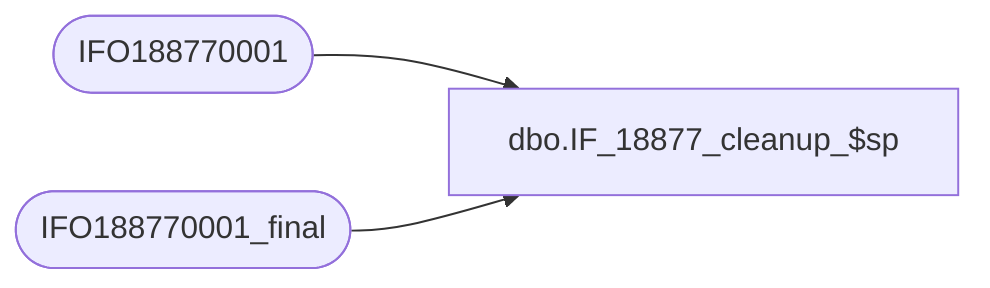

# dbo.IF_18877_cleanup_$sp

**Database:** auditworks  
**Server:** bedrockdb01  

## Architecture Diagram



## Table Dependencies

| Referenced Table |
|---|
| IFO188770001 |
| IFO188770001_final |

## Stored Procedure Code

```sql
create proc dbo.IF_18877_cleanup_$sp
/* Name: IF_18877_cleanup_$sp
   Generated: 4/19/2016 1:01:05 PM
   Automatically Generated by SmartView Exports Builder
   Called by IF_18877_main_$sp.
Update rows as being processed..
   *** DO NOT MODIFY!!! ***
*/
@executionid int 
AS
DECLARE @errmsg               nvarchar(255), 
        @errno                int, 
        @transaction_count    numeric(12,0), 
        @process_no           smallint, 
        @process_log_entry    bit, 
        @process_timestamp    float, 
        @row                  int, 
        @return               tinyint, 
        @from_serial_no       numeric(14,0), 
        @to_serial_no         numeric(14,0) 

SELECT @errmsg = NULL, 
       @transaction_count = 0, 
       @process_no = 19, 
       @process_timestamp = 0, 
       @return = 1, 
       @to_serial_no = 0, 
       @from_serial_no = 0 


Begin Transaction

INSERT INTO IFO188770001_final
SELECT C1_STORENO, C2_CURRENCYCODE
FROM IFO188770001

SELECT @errno = @@error 
IF @errno <> 0 
   BEGIN
   SELECT @errmsg = 'Unable to copy data to IFO188770001_final table.'
   GOTO error
   END


Commit Transaction
endofproc: /* End of Procedure */ 
RETURN @return

error: /* Error Handler */ 

If @@trancount > 0 
   ROLLBACK TRANSACTION 

SELECT @errmsg = 'IF_18877:' + @errmsg + ' - ' + convert(varchar, @errno) 

RAISERROR (@errmsg, 16, 1)
RETURN
```

