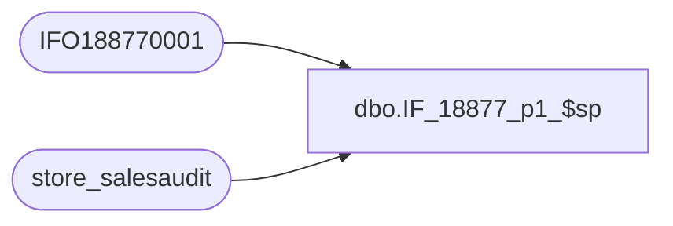

# dbo.IF_18877_p1_$sp

**Database:** auditworks  
**Server:** bedrockdb01  

## Architecture Diagram



## Table Dependencies

| Referenced Table |
|---|
| IFO188770001 |
| store_salesaudit |

## Stored Procedure Code

```sql
create proc dbo.IF_18877_p1_$sp
/* Name: IF_18877_p1_$sp
   Generated: 4/19/2016 1:01:05 PM
   Automatically Generated by SmartView Exports Builder
   Called by IF_18877_main_$sp.
Building the follwing extracts: 
Store Extract.
   *** DO NOT MODIFY!!! ***
*/
AS
DECLARE @errmsg               nvarchar(255), 
        @errno                int, 
        @return               tinyint, 
        @transaction_count    numeric(12,0), 
        @process_no           smallint, 
        @process_log_entry    bit, 
        @process_timestamp    float

SELECT @errmsg = NULL, 
       @return = 0, 
       @process_no = 19, 
       @process_timestamp = 0


/*** Extracting data into the working table for the extract: Store Extract ***/

INSERT INTO IFO188770001(
 C1_STORENO,
 C2_CURRENCYCODE)
SELECT  
 store_no,
 currency_id 
FROM store_salesaudit
WHERE currency_id in (32,35,43,49,52)


SELECT @errno = @@error 
IF @errno <> 0 
   BEGIN
   SELECT @errmsg = 'Unable to extract data into the working table for: Store Extract.'
   GOTO error
   END


/*** Map the extract data to the output table ***/

endofproc: /* End of Procedure */ 
RETURN @return

error: /* Error Handler */ 

If @@trancount > 0 
   ROLLBACK TRANSACTION 

SELECT @errmsg = 'IF_18877:' + @errmsg + ' - ' + convert(varchar, @errno) 

RAISERROR (@errmsg, 16, 1)
RETURN
```

