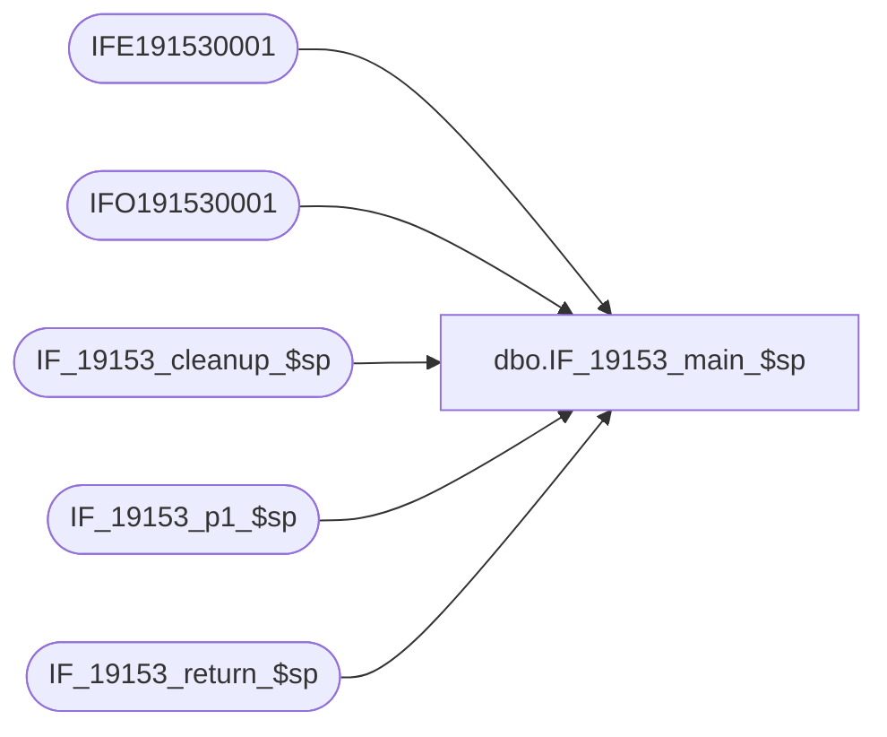

# dbo.IF_19153_main_$sp

**Database:** auditworks  
**Server:** bedrockdb01  

## Architecture Diagram



## Table Dependencies

| Referenced Table |
|---|
| IFE191530001 |
| IFO191530001 |
| IF_19153_cleanup_$sp |
| IF_19153_p1_$sp |
| IF_19153_return_$sp |

## Stored Procedure Code

```sql
create proc dbo.IF_19153_main_$sp
/* Name: IF_19153_main_$sp
   Generated: 8/24/2021 1:23:17 PM
   Automatically Generated by SmartView Exports Builder
   Called by SmartView Exports Server.
   Calls IF_19153_p1_$sp.
Building the export: TOKEN.
   *** DO NOT MODIFY!!! ***
*/
@executionid int, @iterations int, @batch_size int 
AS
DECLARE @errmsg               nvarchar(255), 
        @errno                int, 
        @transaction_count    numeric(12,0), 
        @terminate_interface  smallint, 
        @return               tinyint, 
        @min_serial_no        numeric(14,0), 
        @init                 smallint 

SELECT @errmsg = NULL, 
       @transaction_count = 0, 
       @terminate_interface = 0, 
       @return = 0, 
       @min_serial_no = 0, 
       @init = 0 


/*** Truncate extract tables ***/

TRUNCATE TABLE IFE191530001
SELECT @errno = @@error 
IF @errno <> 0 
   BEGIN
   SELECT @errmsg = 'Unable to TRUNCATE IFE191530001 table.'
   GOTO error
   END

TRUNCATE TABLE IFO191530001
SELECT @errno = @@error 
IF @errno <> 0 
   BEGIN
   SELECT @errmsg = 'Unable to TRUNCATE IFO191530001 table.'
   GOTO error
   END

EXEC IF_19153_p1_$sp WITH RECOMPILE
SELECT @errno = @@error
IF @errno != 0
BEGIN
   SELECT @errmsg = 'Failed to execute stored procedure IF_19153_p1_$sp'
   GoTo error
End

EXEC IF_19153_cleanup_$sp @executionid WITH RECOMPILE
SELECT @errno = @@error
IF @errno != 0
BEGIN
   SELECT @errmsg = 'Failed to execute stored procedure IF_19153_cleanup_$sp'
   GoTo error
End

EXEC @return = IF_19153_return_$sp @init WITH RECOMPILE
SELECT @errno = @@error
IF @errno != 0
BEGIN
   SELECT @errmsg = 'Failed to execute stored procedure IF_19153_return_$sp'
   GoTo error
End

endofproc: /* End of Procedure */ 
RETURN @return

error: /* Error Handler */ 

If @@trancount > 0 
   ROLLBACK TRANSACTION 

SELECT @errmsg = 'IF_19153:' + @errmsg + ' - ' + convert(varchar, @errno) 

RAISERROR (@errmsg, 16, 1)
RETURN
```

