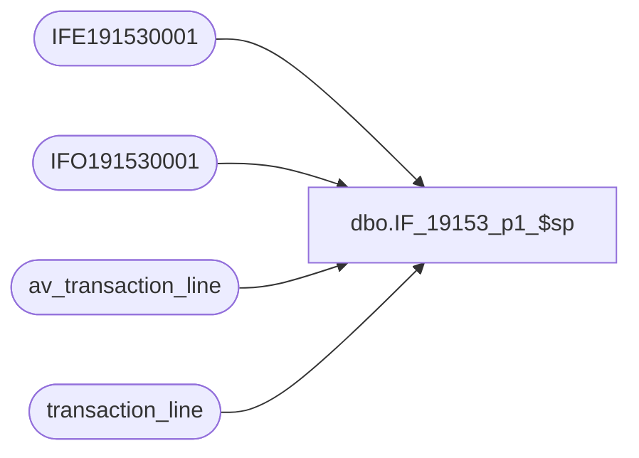

# dbo.IF_19153_p1_$sp

**Database:** auditworks  
**Server:** bedrockdb01  

## Architecture Diagram



## Table Dependencies

| Referenced Table |
|---|
| IFE191530001 |
| IFO191530001 |
| av_transaction_line |
| transaction_line |

## Stored Procedure Code

```sql
create proc dbo.IF_19153_p1_$sp
/* Name: IF_19153_p1_$sp
   Generated: 8/24/2021 1:23:17 PM
   Automatically Generated by SmartView Exports Builder
   Called by IF_19153_main_$sp.
Building the follwing extracts: 
Extract 1.
   *** DO NOT MODIFY!!! ***
*/
AS
DECLARE @errmsg               nvarchar(255), 
        @errno                int, 
        @return               tinyint, 
        @transaction_count    numeric(12,0), 
        @process_no           smallint, 
        @process_log_entry    bit, 
        @process_timestamp    float

SELECT @errmsg = NULL, 
       @return = 0, 
       @process_no = 19, 
       @process_timestamp = 0


/*** Extracting data into the working table for the extract: Extract 1 ***/

INSERT INTO IFE191530001
SELECT distinct reference_no FROM  av_transaction_line where reference_no like '=%'
UNION SELECT distinct reference_no FROM transaction_line where reference_no like '=%'


SELECT @errno = @@error 
IF @errno <> 0 
   BEGIN
   SELECT @errmsg = 'Unable to extract data into the working table for: Extract 1.'
   GOTO error
   END


/*** Map the extract data to the output table ***/

INSERT INTO IFO191530001
( C1_Accnt,
 C2_Tkn)
SELECT a.C1_lnrfrncn,
a.C1_lnrfrncn
FROM IFE191530001 a


SELECT @errno = @@error 
IF @errno <> 0 
   BEGIN
   SELECT @errmsg = 'An error occurred while inserting into output table IFO191530001.'
   GOTO error
   END


endofproc: /* End of Procedure */ 
RETURN @return

error: /* Error Handler */ 

If @@trancount > 0 
   ROLLBACK TRANSACTION 

SELECT @errmsg = 'IF_19153:' + @errmsg + ' - ' + convert(varchar, @errno) 

RAISERROR (@errmsg, 16, 1)
RETURN
```

