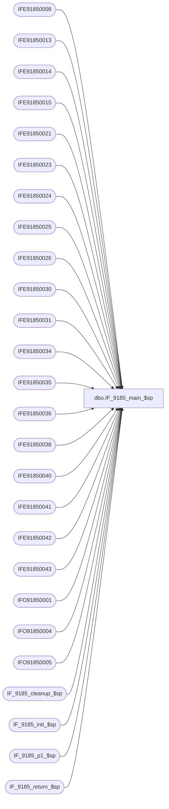

# dbo.IF_9185_main_$sp

**Database:** auditworks  
**Server:** bedrockdb01  

## Architecture Diagram



## Table Dependencies

| Referenced Table |
|---|
| IFE91850008 |
| IFE91850013 |
| IFE91850014 |
| IFE91850015 |
| IFE91850021 |
| IFE91850023 |
| IFE91850024 |
| IFE91850025 |
| IFE91850026 |
| IFE91850030 |
| IFE91850031 |
| IFE91850034 |
| IFE91850035 |
| IFE91850036 |
| IFE91850038 |
| IFE91850040 |
| IFE91850041 |
| IFE91850042 |
| IFE91850043 |
| IFO91850001 |
| IFO91850004 |
| IFO91850005 |
| IF_9185_cleanup_$sp |
| IF_9185_init_$sp |
| IF_9185_p1_$sp |
| IF_9185_return_$sp |

## Stored Procedure Code

```sql
create proc dbo.IF_9185_main_$sp
/* Name: IF_9185_main_$sp
   Generated: 03/16/04 3:40:53 PM
   Automatically Generated by SmartView Exports Builder
   Called by SmartView Exports Server.
   Calls IF_9185_p1_$sp.
Building the export: Live CRMExport.
   *** DO NOT MODIFY!!! ***
*/
@executionid int, @iterations int, @batch_size int 
AS
DECLARE @errmsg               varchar(255), 
        @errno                int, 
        @transaction_count    numeric(12,0), 
        @terminate_interface  smallint, 
        @return               tinyint, 
        @min_serial_no        numeric(14,0), 
        @init                 smallint 

SELECT @errmsg = NULL, 
       @transaction_count = 0, 
       @terminate_interface = 0, 
       @return = 0, 
       @min_serial_no = 0, 
       @init = 0 

WHILE @terminate_interface < @iterations 
BEGIN 

/* @init = 0 when nothing to do, 1 if something to do. */
EXEC @init = IF_9185_init_$sp @batch_size
IF @init = 0 
   BREAK


/*** Truncate extract tables ***/

TRUNCATE TABLE IFE91850008
SELECT @errno = @@error 
IF @errno <> 0 
   BEGIN
   SELECT @errmsg = 'Unable to TRUNCATE IFE91850008 table.'
   GOTO error
   END

TRUNCATE TABLE IFE91850040
SELECT @errno = @@error 
IF @errno <> 0 
   BEGIN
   SELECT @errmsg = 'Unable to TRUNCATE IFE91850040 table.'
   GOTO error
   END

TRUNCATE TABLE IFE91850034
SELECT @errno = @@error 
IF @errno <> 0 
   BEGIN
   SELECT @errmsg = 'Unable to TRUNCATE IFE91850034 table.'
   GOTO error
   END

TRUNCATE TABLE IFE91850021
SELECT @errno = @@error 
IF @errno <> 0 
   BEGIN
   SELECT @errmsg = 'Unable to TRUNCATE IFE91850021 table.'
   GOTO error
   END

TRUNCATE TABLE IFE91850013
SELECT @errno = @@error 
IF @errno <> 0 
   BEGIN
   SELECT @errmsg = 'Unable to TRUNCATE IFE91850013 table.'
   GOTO error
   END

TRUNCATE TABLE IFE91850014
SELECT @errno = @@error 
IF @errno <> 0 
   BEGIN
   SELECT @errmsg = 'Unable to TRUNCATE IFE91850014 table.'
   GOTO error
   END

TRUNCATE TABLE IFE91850015
SELECT @errno = @@error 
IF @errno <> 0 
   BEGIN
   SELECT @errmsg = 'Unable to TRUNCATE IFE91850015 table.'
   GOTO error
   END

TRUNCATE TABLE IFE91850023
SELECT @errno = @@error 
IF @errno <> 0 
   BEGIN
   SELECT @errmsg = 'Unable to TRUNCATE IFE91850023 table.'
   GOTO error
   END

TRUNCATE TABLE IFE91850024
SELECT @errno = @@error 
IF @errno <> 0 
   BEGIN
   SELECT @errmsg = 'Unable to TRUNCATE IFE91850024 table.'
   GOTO error
   END

TRUNCATE TABLE IFE91850025
SELECT @errno = @@error 
IF @errno <> 0 
   BEGIN
   SELECT @errmsg = 'Unable to TRUNCATE IFE91850025 table.'
   GOTO error
   END

TRUNCATE TABLE IFE91850026
SELECT @errno = @@error 
IF @errno <> 0 
   BEGIN
   SELECT @errmsg = 'Unable to TRUNCATE IFE91850026 table.'
   GOTO error
   END

TRUNCATE TABLE IFE91850030
SELECT @errno = @@error 
IF @errno <> 0 
   BEGIN
   SELECT @errmsg = 'Unable to TRUNCATE IFE91850030 table.'
   GOTO error
   END

TRUNCATE TABLE IFE91850035
SELECT @errno = @@error 
IF @errno <> 0 
   BEGIN
   SELECT @errmsg = 'Unable to TRUNCATE IFE91850035 table.'
   GOTO error
   END

TRUNCATE TABLE IFE91850031
SELECT @errno = @@error 
IF @errno <> 0 
   BEGIN
   SELECT @errmsg = 'Unable to TRUNCATE IFE91850031 table.'
   GOTO error
   END

TRUNCATE TABLE IFE91850036
SELECT @errno = @@error 
IF @errno <> 0 
   BEGIN
   SELECT @errmsg = 'Unable to TRUNCATE IFE91850036 table.'
   GOTO error
   END

TRUNCATE TABLE IFE91850038
SELECT @errno = @@error 
IF @errno <> 0 
   BEGIN
   SELECT @errmsg = 'Unable to TRUNCATE IFE91850038 table.'
   GOTO error
   END

TRUNCATE TABLE IFE91850043
SELECT @errno = @@error 
IF @errno <> 0 
   BEGIN
   SELECT @errmsg = 'Unable to TRUNCATE IFE91850043 table.'
   GOTO error
   END

TRUNCATE TABLE IFE91850041
SELECT @errno = @@error 
IF @errno <> 0 
   BEGIN
   SELECT @errmsg = 'Unable to TRUNCATE IFE91850041 table.'
   GOTO error
   END

TRUNCATE TABLE IFE91850042
SELECT @errno = @@error 
IF @errno <> 0 
   BEGIN
   SELECT @errmsg = 'Unable to TRUNCATE IFE91850042 table.'
   GOTO error
   END

TRUNCATE TABLE IFO91850001
SELECT @errno = @@error 
IF @errno <> 0 
   BEGIN
   SELECT @errmsg = 'Unable to TRUNCATE IFO91850001 table.'
   GOTO error
   END

TRUNCATE TABLE IFO91850004
SELECT @errno = @@error 
IF @errno <> 0 
   BEGIN
   SELECT @errmsg = 'Unable to TRUNCATE IFO91850004 table.'
   GOTO error
   END

TRUNCATE TABLE IFO91850005
SELECT @errno = @@error 
IF @errno <> 0 
   BEGIN
   SELECT @errmsg = 'Unable to TRUNCATE IFO91850005 table.'
   GOTO error
   END

EXEC IF_9185_p1_$sp WITH RECOMPILE
SELECT @errno = @@error
IF @errno != 0
BEGIN
   SELECT @errmsg = 'Failed to execute stored procedure IF_9185_p1_$sp'
   GoTo error
End

EXEC IF_9185_cleanup_$sp @executionid WITH RECOMPILE
SELECT @errno = @@error
IF @errno != 0
BEGIN
   SELECT @errmsg = 'Failed to execute stored procedure IF_9185_cleanup_$sp'
   GoTo error
End

/* Bump up counters before looping. */
SELECT @terminate_interface = @terminate_interface + 1


END /* While @terminate_interface < @max_loop */ 

EXEC @return = IF_9185_return_$sp @init WITH RECOMPILE
SELECT @errno = @@error
IF @errno != 0
BEGIN
   SELECT @errmsg = 'Failed to execute stored procedure IF_9185_return_$sp'
   GoTo error
End

endofproc: /* End of Procedure */ 
RETURN @return

error: /* Error Handler */ 

If @@trancount > 0 
   ROLLBACK TRANSACTION 

SELECT @errmsg = 'IF_9185:' + @errmsg + ' - ' + convert(varchar, @errno) 

RAISERROR (@errmsg, 16, 1)
RETURN
```

