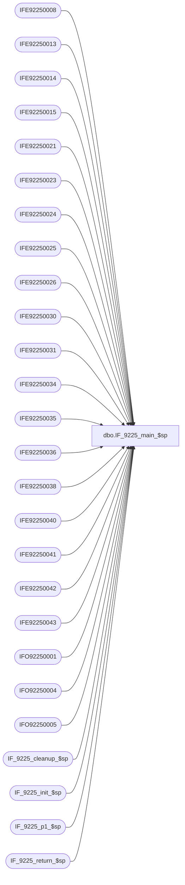

# dbo.IF_9225_main_$sp

**Database:** auditworks  
**Server:** bedrockdb01  

## Architecture Diagram



## Table Dependencies

| Referenced Table |
|---|
| IFE92250008 |
| IFE92250013 |
| IFE92250014 |
| IFE92250015 |
| IFE92250021 |
| IFE92250023 |
| IFE92250024 |
| IFE92250025 |
| IFE92250026 |
| IFE92250030 |
| IFE92250031 |
| IFE92250034 |
| IFE92250035 |
| IFE92250036 |
| IFE92250038 |
| IFE92250040 |
| IFE92250041 |
| IFE92250042 |
| IFE92250043 |
| IFO92250001 |
| IFO92250004 |
| IFO92250005 |
| IF_9225_cleanup_$sp |
| IF_9225_init_$sp |
| IF_9225_p1_$sp |
| IF_9225_return_$sp |

## Stored Procedure Code

```sql
create proc dbo.IF_9225_main_$sp
/* Name: IF_9225_main_$sp
   Generated: 03/17/04 5:38:47 PM
   Automatically Generated by SmartView Exports Builder
   Called by SmartView Exports Server.
   Calls IF_9225_p1_$sp.
Building the export: LIVE CRMExport.
   *** DO NOT MODIFY!!! ***
*/
@executionid int, @iterations int, @batch_size int 
AS
DECLARE @errmsg               varchar(255), 
        @errno                int, 
        @transaction_count    numeric(12,0), 
        @terminate_interface  smallint, 
        @return               tinyint, 
        @min_serial_no        numeric(14,0), 
        @init                 smallint 

SELECT @errmsg = NULL, 
       @transaction_count = 0, 
       @terminate_interface = 0, 
       @return = 0, 
       @min_serial_no = 0, 
       @init = 0 

WHILE @terminate_interface < @iterations 
BEGIN 

/* @init = 0 when nothing to do, 1 if something to do. */
EXEC @init = IF_9225_init_$sp @batch_size
IF @init = 0 
   BREAK


/*** Truncate extract tables ***/

TRUNCATE TABLE IFE92250008
SELECT @errno = @@error 
IF @errno <> 0 
   BEGIN
   SELECT @errmsg = 'Unable to TRUNCATE IFE92250008 table.'
   GOTO error
   END

TRUNCATE TABLE IFE92250040
SELECT @errno = @@error 
IF @errno <> 0 
   BEGIN
   SELECT @errmsg = 'Unable to TRUNCATE IFE92250040 table.'
   GOTO error
   END

TRUNCATE TABLE IFE92250034
SELECT @errno = @@error 
IF @errno <> 0 
   BEGIN
   SELECT @errmsg = 'Unable to TRUNCATE IFE92250034 table.'
   GOTO error
   END

TRUNCATE TABLE IFE92250021
SELECT @errno = @@error 
IF @errno <> 0 
   BEGIN
   SELECT @errmsg = 'Unable to TRUNCATE IFE92250021 table.'
   GOTO error
   END

TRUNCATE TABLE IFE92250013
SELECT @errno = @@error 
IF @errno <> 0 
   BEGIN
   SELECT @errmsg = 'Unable to TRUNCATE IFE92250013 table.'
   GOTO error
   END

TRUNCATE TABLE IFE92250014
SELECT @errno = @@error 
IF @errno <> 0 
   BEGIN
   SELECT @errmsg = 'Unable to TRUNCATE IFE92250014 table.'
   GOTO error
   END

TRUNCATE TABLE IFE92250015
SELECT @errno = @@error 
IF @errno <> 0 
   BEGIN
   SELECT @errmsg = 'Unable to TRUNCATE IFE92250015 table.'
   GOTO error
   END

TRUNCATE TABLE IFE92250023
SELECT @errno = @@error 
IF @errno <> 0 
   BEGIN
   SELECT @errmsg = 'Unable to TRUNCATE IFE92250023 table.'
   GOTO error
   END

TRUNCATE TABLE IFE92250024
SELECT @errno = @@error 
IF @errno <> 0 
   BEGIN
   SELECT @errmsg = 'Unable to TRUNCATE IFE92250024 table.'
   GOTO error
   END

TRUNCATE TABLE IFE92250025
SELECT @errno = @@error 
IF @errno <> 0 
   BEGIN
   SELECT @errmsg = 'Unable to TRUNCATE IFE92250025 table.'
   GOTO error
   END

TRUNCATE TABLE IFE92250026
SELECT @errno = @@error 
IF @errno <> 0 
   BEGIN
   SELECT @errmsg = 'Unable to TRUNCATE IFE92250026 table.'
   GOTO error
   END

TRUNCATE TABLE IFE92250030
SELECT @errno = @@error 
IF @errno <> 0 
   BEGIN
   SELECT @errmsg = 'Unable to TRUNCATE IFE92250030 table.'
   GOTO error
   END

TRUNCATE TABLE IFE92250035
SELECT @errno = @@error 
IF @errno <> 0 
   BEGIN
   SELECT @errmsg = 'Unable to TRUNCATE IFE92250035 table.'
   GOTO error
   END

TRUNCATE TABLE IFE92250031
SELECT @errno = @@error 
IF @errno <> 0 
   BEGIN
   SELECT @errmsg = 'Unable to TRUNCATE IFE92250031 table.'
   GOTO error
   END

TRUNCATE TABLE IFE92250036
SELECT @errno = @@error 
IF @errno <> 0 
   BEGIN
   SELECT @errmsg = 'Unable to TRUNCATE IFE92250036 table.'
   GOTO error
   END

TRUNCATE TABLE IFE92250038
SELECT @errno = @@error 
IF @errno <> 0 
   BEGIN
   SELECT @errmsg = 'Unable to TRUNCATE IFE92250038 table.'
   GOTO error
   END

TRUNCATE TABLE IFE92250043
SELECT @errno = @@error 
IF @errno <> 0 
   BEGIN
   SELECT @errmsg = 'Unable to TRUNCATE IFE92250043 table.'
   GOTO error
   END

TRUNCATE TABLE IFE92250041
SELECT @errno = @@error 
IF @errno <> 0 
   BEGIN
   SELECT @errmsg = 'Unable to TRUNCATE IFE92250041 table.'
   GOTO error
   END

TRUNCATE TABLE IFE92250042
SELECT @errno = @@error 
IF @errno <> 0 
   BEGIN
   SELECT @errmsg = 'Unable to TRUNCATE IFE92250042 table.'
   GOTO error
   END

TRUNCATE TABLE IFO92250001
SELECT @errno = @@error 
IF @errno <> 0 
   BEGIN
   SELECT @errmsg = 'Unable to TRUNCATE IFO92250001 table.'
   GOTO error
   END

TRUNCATE TABLE IFO92250004
SELECT @errno = @@error 
IF @errno <> 0 
   BEGIN
   SELECT @errmsg = 'Unable to TRUNCATE IFO92250004 table.'
   GOTO error
   END

TRUNCATE TABLE IFO92250005
SELECT @errno = @@error 
IF @errno <> 0 
   BEGIN
   SELECT @errmsg = 'Unable to TRUNCATE IFO92250005 table.'
   GOTO error
   END

EXEC IF_9225_p1_$sp WITH RECOMPILE
SELECT @errno = @@error
IF @errno != 0
BEGIN
   SELECT @errmsg = 'Failed to execute stored procedure IF_9225_p1_$sp'
   GoTo error
End

EXEC IF_9225_cleanup_$sp @executionid WITH RECOMPILE
SELECT @errno = @@error
IF @errno != 0
BEGIN
   SELECT @errmsg = 'Failed to execute stored procedure IF_9225_cleanup_$sp'
   GoTo error
End

/* Bump up counters before looping. */
SELECT @terminate_interface = @terminate_interface + 1


END /* While @terminate_interface < @max_loop */ 

EXEC @return = IF_9225_return_$sp @init WITH RECOMPILE
SELECT @errno = @@error
IF @errno != 0
BEGIN
   SELECT @errmsg = 'Failed to execute stored procedure IF_9225_return_$sp'
   GoTo error
End

endofproc: /* End of Procedure */ 
RETURN @return

error: /* Error Handler */ 

If @@trancount > 0 
   ROLLBACK TRANSACTION 

SELECT @errmsg = 'IF_9225:' + @errmsg + ' - ' + convert(varchar, @errno) 

RAISERROR (@errmsg, 16, 1)
RETURN
```

