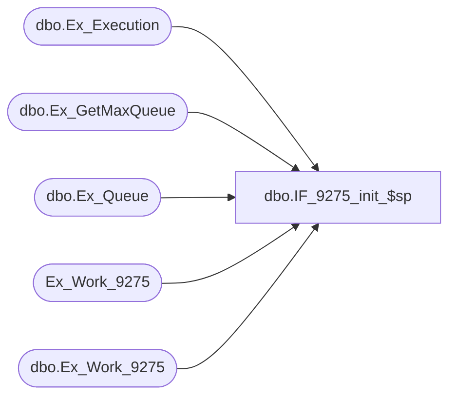

# dbo.IF_9275_init_$sp

**Database:** auditworks  
**Server:** bedrockdb01  

## Architecture Diagram



## Table Dependencies

| Referenced Table |
|---|
| dbo.Ex_Execution |
| dbo.Ex_GetMaxQueue |
| dbo.Ex_Queue |
| Ex_Work_9275 |
| dbo.Ex_Work_9275 |

## Stored Procedure Code

```sql
create proc dbo.IF_9275_init_$sp
@batch_size int 
AS
DECLARE @errmsg               varchar(255), 
        @errno                int, 
        @return               tinyint, 
        @min_serial_no        numeric(14,0), 
        @max_serial_no        numeric(14,0), 
        @last_serial_no       numeric(14,0) 
SELECT @errmsg = NULL, 
       @return = 0, 
       @min_serial_no = 0, 
       @max_serial_no = 0, 
       @last_serial_no = 0 

/* TRUNCATE Ex_Work_9275 */
TRUNCATE TABLE Ex_Work_9275
SELECT @errno = @@error 
IF @errno <> 0 
   BEGIN
   SELECT @errmsg = 'Unable to Truncate Ex_Work_9275 table'
   GOTO error
   END


SELECT @last_serial_no = MAX(to_serial_no) 
  FROM auditworks.dbo.Ex_Execution
 WHERE queue_id = 26
   AND object_id = 9275

IF @last_serial_no IS NULL
   SELECT @last_serial_no = 0

SELECT @min_serial_no = @last_serial_no + 1
EXEC auditworks.dbo.Ex_GetMaxQueue 26, @min_serial_no, @batch_size, @max_serial_no OUTPUT

IF @max_serial_no = 0
BEGIN
   select @return = 0
   GOTO endofproc
END

INSERT INTO auditworks.dbo.Ex_Work_9275
SELECT serial_no, key_1, key_2
  FROM auditworks.dbo.Ex_Queue
  WHERE queue_id = 26 AND 
        serial_no >= @min_serial_no AND 
        serial_no <= @max_serial_no AND
        (used_by_object_id = 9275 OR
         used_by_object_id IS NULL)

select @return = 1

endofproc: /* End of Procedure */ 
RETURN @return

error: /* Error Handler */ 

If @@trancount > 0 
   ROLLBACK TRANSACTION 

SELECT @errmsg = 'IF_9275:' + @errmsg + ' - ' + convert(varchar, @errno) 

RAISERROR (@errmsg, 16, 1)
RETURN
```

