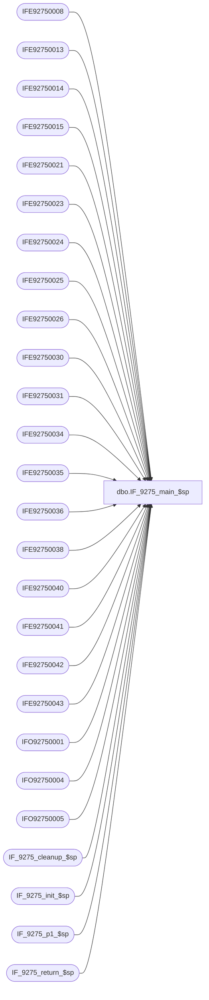

# dbo.IF_9275_main_$sp

**Database:** auditworks  
**Server:** bedrockdb01  

## Architecture Diagram



## Table Dependencies

| Referenced Table |
|---|
| IFE92750008 |
| IFE92750013 |
| IFE92750014 |
| IFE92750015 |
| IFE92750021 |
| IFE92750023 |
| IFE92750024 |
| IFE92750025 |
| IFE92750026 |
| IFE92750030 |
| IFE92750031 |
| IFE92750034 |
| IFE92750035 |
| IFE92750036 |
| IFE92750038 |
| IFE92750040 |
| IFE92750041 |
| IFE92750042 |
| IFE92750043 |
| IFO92750001 |
| IFO92750004 |
| IFO92750005 |
| IF_9275_cleanup_$sp |
| IF_9275_init_$sp |
| IF_9275_p1_$sp |
| IF_9275_return_$sp |

## Stored Procedure Code

```sql
create proc dbo.IF_9275_main_$sp
/* Name: IF_9275_main_$sp
   Generated: 05/25/04 11:40:38 AM
   Automatically Generated by SmartView Exports Builder
   Called by SmartView Exports Server.
   Calls IF_9275_p1_$sp.
Building the export: LIVE CRMExport.
   *** DO NOT MODIFY!!! ***
*/
@executionid int, @iterations int, @batch_size int 
AS
DECLARE @errmsg               varchar(255), 
        @errno                int, 
        @transaction_count    numeric(12,0), 
        @terminate_interface  smallint, 
        @return               tinyint, 
        @min_serial_no        numeric(14,0), 
        @init                 smallint 

SELECT @errmsg = NULL, 
       @transaction_count = 0, 
       @terminate_interface = 0, 
       @return = 0, 
       @min_serial_no = 0, 
       @init = 0 

WHILE @terminate_interface < @iterations 
BEGIN 

/* @init = 0 when nothing to do, 1 if something to do. */
EXEC @init = IF_9275_init_$sp @batch_size
IF @init = 0 
   BREAK


/*** Truncate extract tables ***/

TRUNCATE TABLE IFE92750008
SELECT @errno = @@error 
IF @errno <> 0 
   BEGIN
   SELECT @errmsg = 'Unable to TRUNCATE IFE92750008 table.'
   GOTO error
   END

TRUNCATE TABLE IFE92750040
SELECT @errno = @@error 
IF @errno <> 0 
   BEGIN
   SELECT @errmsg = 'Unable to TRUNCATE IFE92750040 table.'
   GOTO error
   END

TRUNCATE TABLE IFE92750034
SELECT @errno = @@error 
IF @errno <> 0 
   BEGIN
   SELECT @errmsg = 'Unable to TRUNCATE IFE92750034 table.'
   GOTO error
   END

TRUNCATE TABLE IFE92750021
SELECT @errno = @@error 
IF @errno <> 0 
   BEGIN
   SELECT @errmsg = 'Unable to TRUNCATE IFE92750021 table.'
   GOTO error
   END

TRUNCATE TABLE IFE92750013
SELECT @errno = @@error 
IF @errno <> 0 
   BEGIN
   SELECT @errmsg = 'Unable to TRUNCATE IFE92750013 table.'
   GOTO error
   END

TRUNCATE TABLE IFE92750014
SELECT @errno = @@error 
IF @errno <> 0 
   BEGIN
   SELECT @errmsg = 'Unable to TRUNCATE IFE92750014 table.'
   GOTO error
   END

TRUNCATE TABLE IFE92750015
SELECT @errno = @@error 
IF @errno <> 0 
   BEGIN
   SELECT @errmsg = 'Unable to TRUNCATE IFE92750015 table.'
   GOTO error
   END

TRUNCATE TABLE IFE92750023
SELECT @errno = @@error 
IF @errno <> 0 
   BEGIN
   SELECT @errmsg = 'Unable to TRUNCATE IFE92750023 table.'
   GOTO error
   END

TRUNCATE TABLE IFE92750024
SELECT @errno = @@error 
IF @errno <> 0 
   BEGIN
   SELECT @errmsg = 'Unable to TRUNCATE IFE92750024 table.'
   GOTO error
   END

TRUNCATE TABLE IFE92750025
SELECT @errno = @@error 
IF @errno <> 0 
   BEGIN
   SELECT @errmsg = 'Unable to TRUNCATE IFE92750025 table.'
   GOTO error
   END

TRUNCATE TABLE IFE92750026
SELECT @errno = @@error 
IF @errno <> 0 
   BEGIN
   SELECT @errmsg = 'Unable to TRUNCATE IFE92750026 table.'
   GOTO error
   END

TRUNCATE TABLE IFE92750030
SELECT @errno = @@error 
IF @errno <> 0 
   BEGIN
   SELECT @errmsg = 'Unable to TRUNCATE IFE92750030 table.'
   GOTO error
   END

TRUNCATE TABLE IFE92750035
SELECT @errno = @@error 
IF @errno <> 0 
   BEGIN
   SELECT @errmsg = 'Unable to TRUNCATE IFE92750035 table.'
   GOTO error
   END

TRUNCATE TABLE IFE92750031
SELECT @errno = @@error 
IF @errno <> 0 
   BEGIN
   SELECT @errmsg = 'Unable to TRUNCATE IFE92750031 table.'
   GOTO error
   END

TRUNCATE TABLE IFE92750036
SELECT @errno = @@error 
IF @errno <> 0 
   BEGIN
   SELECT @errmsg = 'Unable to TRUNCATE IFE92750036 table.'
   GOTO error
   END

TRUNCATE TABLE IFE92750038
SELECT @errno = @@error 
IF @errno <> 0 
   BEGIN
   SELECT @errmsg = 'Unable to TRUNCATE IFE92750038 table.'
   GOTO error
   END

TRUNCATE TABLE IFE92750043
SELECT @errno = @@error 
IF @errno <> 0 
   BEGIN
   SELECT @errmsg = 'Unable to TRUNCATE IFE92750043 table.'
   GOTO error
   END

TRUNCATE TABLE IFE92750041
SELECT @errno = @@error 
IF @errno <> 0 
   BEGIN
   SELECT @errmsg = 'Unable to TRUNCATE IFE92750041 table.'
   GOTO error
   END

TRUNCATE TABLE IFE92750042
SELECT @errno = @@error 
IF @errno <> 0 
   BEGIN
   SELECT @errmsg = 'Unable to TRUNCATE IFE92750042 table.'
   GOTO error
   END

TRUNCATE TABLE IFO92750001
SELECT @errno = @@error 
IF @errno <> 0 
   BEGIN
   SELECT @errmsg = 'Unable to TRUNCATE IFO92750001 table.'
   GOTO error
   END

TRUNCATE TABLE IFO92750004
SELECT @errno = @@error 
IF @errno <> 0 
   BEGIN
   SELECT @errmsg = 'Unable to TRUNCATE IFO92750004 table.'
   GOTO error
   END

TRUNCATE TABLE IFO92750005
SELECT @errno = @@error 
IF @errno <> 0 
   BEGIN
   SELECT @errmsg = 'Unable to TRUNCATE IFO92750005 table.'
   GOTO error
   END

EXEC IF_9275_p1_$sp WITH RECOMPILE
SELECT @errno = @@error
IF @errno != 0
BEGIN
   SELECT @errmsg = 'Failed to execute stored procedure IF_9275_p1_$sp'
   GoTo error
End

EXEC IF_9275_cleanup_$sp @executionid WITH RECOMPILE
SELECT @errno = @@error
IF @errno != 0
BEGIN
   SELECT @errmsg = 'Failed to execute stored procedure IF_9275_cleanup_$sp'
   GoTo error
End

/* Bump up counters before looping. */
SELECT @terminate_interface = @terminate_interface + 1


END /* While @terminate_interface < @max_loop */ 

EXEC @return = IF_9275_return_$sp @init WITH RECOMPILE
SELECT @errno = @@error
IF @errno != 0
BEGIN
   SELECT @errmsg = 'Failed to execute stored procedure IF_9275_return_$sp'
   GoTo error
End

endofproc: /* End of Procedure */ 
RETURN @return

error: /* Error Handler */ 

If @@trancount > 0 
   ROLLBACK TRANSACTION 

SELECT @errmsg = 'IF_9275:' + @errmsg + ' - ' + convert(varchar, @errno) 

RAISERROR (@errmsg, 16, 1)
RETURN
```

