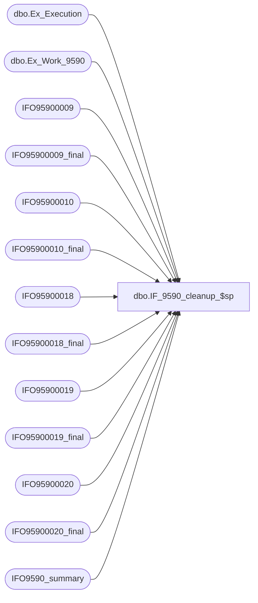

# dbo.IF_9590_cleanup_$sp

**Database:** auditworks  
**Server:** bedrockdb01  

## Architecture Diagram



## Table Dependencies

| Referenced Table |
|---|
| dbo.Ex_Execution |
| dbo.Ex_Work_9590 |
| IFO95900009 |
| IFO95900009_final |
| IFO95900010 |
| IFO95900010_final |
| IFO95900018 |
| IFO95900018_final |
| IFO95900019 |
| IFO95900019_final |
| IFO95900020 |
| IFO95900020_final |
| IFO9590_summary |

## Stored Procedure Code

```sql
create proc dbo.IF_9590_cleanup_$sp
/* Name: IF_9590_cleanup_$sp
   Generated: 8/21/2007 5:10:33 PM
   Automatically Generated by SmartView Exports Builder
   Called by IF_9590_main_$sp.
Update rows as being processed..
   *** DO NOT MODIFY!!! ***
*/
@executionid int 
AS
DECLARE @errmsg               varchar(255), 
        @errno                int, 
        @transaction_count    numeric(12,0), 
        @process_no           smallint, 
        @process_log_entry    bit, 
        @process_timestamp    float, 
        @row                  int, 
        @return               tinyint, 
        @from_serial_no       numeric(14,0), 
        @to_serial_no         numeric(14,0) 

SELECT @errmsg = NULL, 
       @transaction_count = 0, 
       @process_no = 19, 
       @process_timestamp = 0, 
       @return = 1, 
       @to_serial_no = 0, 
       @from_serial_no = 0 


SELECT @from_serial_no = MIN(serial_no),
       @to_serial_no = MAX(serial_no)
  FROM auditworks.dbo.Ex_Work_9590

Begin Transaction

INSERT INTO IFO95900009_final
SELECT C30_IFENTRYNO, C31_LINEID, C32_LINEOBJECT, C1_RECORDID, C2_STOREID, C3_REGISTERID, C4_MERCHANTCATEGORYCODE, C5_CARDHOLDERACTIVATEDTERMINAL, C6_MAGNETICSTRIPSTATUS, C7_VISASERVICE, C8_FILLER, C9_AUTHORIZATIONSOURCE, C10_POSTERMINALCAPABILITY, C11_ENTRYMODE, C12_CARDHOLDERID, C13_ZIPCODE, C14_FILLER2, C15_RECORDSEQUENCENO, C16_FILLER3, C20_ED_TOTALSALES, C21_ED_TOTALCREDIT, C33_MERCHANTNAME, C34_CITY, C35_STATE, C36_MERCH_ACCT, C37_SECUR_CODE, C38_ENRICHEDCHARGEDESCRIPTION, C40_STORELIVEDATE, C41_TRANSACTIONDATE
FROM IFO95900009

SELECT @errno = @@error 
IF @errno <> 0 
   BEGIN
   SELECT @errmsg = 'Unable to copy data to IFO95900009_final table.'
   GOTO error
   END


INSERT INTO IFO95900018_final
SELECT C1_IFENTRYNO, C2_LINEID, C3_LINEOBJECT, C4_STORENO, C5_RECORDID, C6_SEQUENCENUMBER, C11_FILLER, C10_FILLER, C7_FILLER, C13_FILLER, C8_XD24AMOUNT
FROM IFO95900018

SELECT @errno = @@error 
IF @errno <> 0 
   BEGIN
   SELECT @errmsg = 'Unable to copy data to IFO95900018_final table.'
   GOTO error
   END


INSERT INTO IFO95900019_final
SELECT C1_IFENTRYNO, C2_LINEID, C3_LINEOBJECT, C4_STORENO, C5_RECORDID, C6_SEQUENCENUMBER, C7_INITIALAUTHAMOUNT, C8_AUTHCURRENCYCODE, C9_AUTHRESPONSECODE, C10_CASHBACKAMOUNT, C11_AUTHCHARACTERISTICINDICATO, C12_ADDRESSVERIFICATIONSERV, C13_ACKNOWLEGMENTTRANSACTIONID, C14_ACKNOWLEDGMENTVALIDATIONCO, C15_FILLER, C16_XD01AMOUNT
FROM IFO95900019

SELECT @errno = @@error 
IF @errno <> 0 
   BEGIN
   SELECT @errmsg = 'Unable to copy data to IFO95900019_final table.'
   GOTO error
   END


INSERT INTO IFO95900020_final
SELECT C1_IFENTRYNO, C2_LINEID, C3_LINEOBJECT, C4_STORENO, C5_RECORDID, C6_SEQUENCENUMBER, C7_BANKNETREFERENCENUMBER, C8_BANKNETDATE, C9_FILLER, C10_AUTHAMOUNT, C11_MAGSTRIPQUALITYCODE, C12_CVCINCORRECTINDICATOR, C13_ENTRYMODECHANGEDINDICATOR, C14_AUTHTIME, C15_FILLER, C16_XD02AMOUNT
FROM IFO95900020

SELECT @errno = @@error 
IF @errno <> 0 
   BEGIN
   SELECT @errmsg = 'Unable to copy data to IFO95900020_final table.'
   GOTO error
   END


INSERT INTO IFO95900010_final
SELECT C12_IFENTRYNO, C13_LINEID, C20_LINEOBJECT, C15_STORENO, C22_CARD_TYPE, C18_SWIPEINDICATOR, C1_RECORDID, C2_ACCOUNTNO, C3_TRANSACTIONCODE, C4_TRANSACTIONAMOUNT, C5_TRANSACTIONDATE, C6_AUTHORIZATIONCODE, C31_AUTHORIZATIONDATEMONTH, C7_AUTHORIZATIONDATEDAY, C8_EXPIRYDATE, C21_REFERENCEREGISTER, C9_REFERENCETRANSACTIONNO, C10_RECORDSEQUENCENO, C26_REQUESTEDPAYMENTSERVICE, C27_PREPAIDCARDINDICATOR, C28_TRANSACTIONIDENTIFIER, C29_AUTHORIZATIONIDENTIFIER, C30_VALIDATIONCODE, C16_TD_TOTALSALES, C17_TD_TOTALRETURNS, C23_CS_AMOUNT, C24_TRANS_NUM, C32_REPORTSWIPEINDICATOR
FROM IFO95900010

SELECT @errno = @@error 
IF @errno <> 0 
   BEGIN
   SELECT @errmsg = 'Unable to copy data to IFO95900010_final table.'
   GOTO error
   END


 /*  Summary table cleanup and add rows to IFO9590_summary based on selection on 
     the Summary node. */

DELETE FROM IFO9590_summary WHERE execution_date < dateadd(dd, -30, getdate())
SELECT @errno = @@error 
IF @errno <> 0 
   BEGIN
   SELECT @errmsg = 'Unable to Delete from IFO9590_summary table.'
   GOTO error
   END


INSERT INTO IFO9590_summary
 (execution_id, execution_date, store, register, transaction_date, transaction_no, line_id, amount, card_type, account_no, auth_no, data1, data3)
   (SELECT @executionid, getdate(), a.C15_STORENO, a.C21_REFERENCEREGISTER, a.C5_TRANSACTIONDATE, a.C24_TRANS_NUM, a.C13_LINEID, a.C23_CS_AMOUNT, a.C22_CARD_TYPE, a.C2_ACCOUNTNO, a.C6_AUTHORIZATIONCODE, a.C12_IFENTRYNO, a.C32_REPORTSWIPEINDICATOR
   FROM IFO95900010 a)

SELECT @errno = @@error 
IF @errno <> 0 
   BEGIN
   SELECT @errmsg = 'Unable to copy data to IFO9590_summary table.'
   GOTO error
   END


/* Insert into ex_execution the entries we have processed */
INSERT INTO auditworks.dbo.Ex_Execution
 (queue_id, object_id, execution_id, from_serial_no, to_serial_no)
 VALUES (50, 9590, @executionid, 
 @from_serial_no, @to_serial_no)
SELECT @errno = @@error 
IF @errno <> 0 
   BEGIN
   SELECT @errmsg = 'Unable to insert into auditworks.dbo.Ex_Execution'
   GOTO error
   END


Commit Transaction
endofproc: /* End of Procedure */ 
RETURN @return

error: /* Error Handler */ 

If @@trancount > 0 
   ROLLBACK TRANSACTION 

SELECT @errmsg = 'IF_9590:' + @errmsg + ' - ' + convert(varchar, @errno) 

RAISERROR (@errmsg, 16, 1)
RETURN
```

