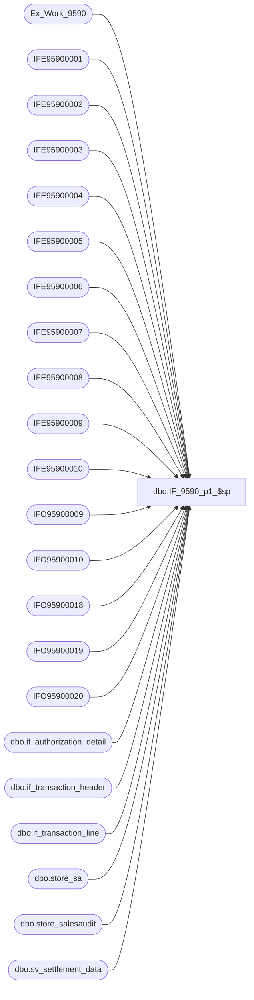

# dbo.IF_9590_p1_$sp

**Database:** auditworks  
**Server:** bedrockdb01  

## Architecture Diagram



## Table Dependencies

| Referenced Table |
|---|
| Ex_Work_9590 |
| IFE95900001 |
| IFE95900002 |
| IFE95900003 |
| IFE95900004 |
| IFE95900005 |
| IFE95900006 |
| IFE95900007 |
| IFE95900008 |
| IFE95900009 |
| IFE95900010 |
| IFO95900009 |
| IFO95900010 |
| IFO95900018 |
| IFO95900019 |
| IFO95900020 |
| dbo.if_authorization_detail |
| dbo.if_transaction_header |
| dbo.if_transaction_line |
| dbo.store_sa |
| dbo.store_salesaudit |
| dbo.sv_settlement_data |

## Stored Procedure Code

```sql
create proc dbo.IF_9590_p1_$sp
/* Name: IF_9590_p1_$sp
   Generated: 8/21/2007 5:10:37 PM
   Automatically Generated by SmartView Exports Builder
   Called by IF_9590_main_$sp.
Building the follwing extracts: 
SQL ENRICHED EXTRACT
ENRICHED AUTH. EXTRACT
SQL TRAN EXTRACT
TRAN AUTH EXTRACT
ENRICHED STORE EXTRACT
SQL XD24 EXTRACT
SQL XD01 EXTRACT
SQL XD02 EXTRACT
SQL XD01 EXTRACT 2
SQL XD02 EXTRACT 2.
   *** DO NOT MODIFY!!! ***
*/
AS
DECLARE @errmsg               varchar(255), 
        @errno                int, 
        @return               tinyint, 
        @transaction_count    numeric(12,0), 
        @process_no           smallint, 
        @process_log_entry    bit, 
        @process_timestamp    float

SELECT @errmsg = NULL, 
       @return = 0, 
       @process_no = 19, 
       @process_timestamp = 0


/*** Extracting data into the working table for the extract: SQL ENRICHED EXTRACT ***/


INSERT INTO IFE95900001 SELECT a.key_1 as Field_a, e.line_id as Field_b, e.line_object as Field_c, c.store_no as Field_d, c.register_no as Field_e, e.line_action as Field_f, SUM(e.gross_line_amount) as Field_g, d.swipe_indicator as Field_h, c.transaction_date as Field_i, SUM(e.gross_line_amount * e.db_cr_none) as Field_j
FROM Ex_Work_9590 a, auditworks.dbo.sv_settlement_data b, auditworks.dbo.if_transaction_header c, auditworks.dbo.if_authorization_detail d, auditworks.dbo.if_transaction_line e
WHERE c.if_entry_no = a.key_1
 AND c.store_no=b.store_no
 AND c.if_entry_no = e.if_entry_no AND e.line_id = d.line_id and e.if_entry_no = d.if_entry_no
AND (e.line_action IN (11,27) AND a.key_2 IN (10,20,30) AND e.line_object IN (604,605,606,608,642) AND e.line_void_flag = 0 AND b.store_live_flag = 1 AND b.interface_id = 50)
AND b.store_live_date <= c.transaction_date
GROUP BY a.key_1,e.line_id,e.line_object,c.store_no,c.register_no,e.line_action,d.swipe_indicator,c.transaction_date


SELECT @errno = @@error 
IF @errno <> 0 
   BEGIN
   SELECT @errmsg = 'Unable to extract data into the working table for: SQL ENRICHED EXTRACT.'
   GOTO error
   END


/*** Map the extract data to the output table ***/

INSERT INTO IFO95900009
( C2_STOREID,
 C3_REGISTERID,
 C30_IFENTRYNO,
 C31_LINEID,
 C32_LINEOBJECT)
SELECT Convert(varchar(255),a.C6_trnsctnstrn),
Convert(varchar(255),a.C15_trnsctnrgstrn),
Convert(numeric(20,0),a.C12_f_ntry_nky_1),
Convert(numeric(20,0),a.C16_lnID),
Convert(numeric(20,0),a.C17_lnbjct)
FROM IFE95900001 a


SELECT @errno = @@error 
IF @errno <> 0 
   BEGIN
   SELECT @errmsg = 'An error occurred while inserting into output table IFO95900009.'
   GOTO error
   END


UPDATE IFO95900009
 SET C41_TRANSACTIONDATE = a.C21_trnsctndt
FROM IFE95900001 a,IFO95900009 b
WHERE a.C12_f_ntry_nky_1 = b.C30_IFENTRYNO AND
a.C16_lnID = b.C31_LINEID AND
a.C17_lnbjct = b.C32_LINEOBJECT AND
a.C6_trnsctnstrn = b.C2_STOREID AND
a.C15_trnsctnrgstrn = b.C3_REGISTERID

SELECT @errno = @@error 
IF @errno <> 0 
   BEGIN
   SELECT @errmsg = 'An error occurred while updating output table IFO95900009.'
   GOTO error
   END

UPDATE IFO95900009
SET C20_ED_TOTALSALES = Convert(numeric(20,0),{fn ABS( a.C18_lngrssmnt  * 100)})
FROM IFE95900001 a, IFO95900009 b

WHERE a.C12_f_ntry_nky_1 = b.C30_IFENTRYNO AND
a.C16_lnID = b.C31_LINEID AND
a.C17_lnbjct = b.C32_LINEOBJECT AND
a.C6_trnsctnstrn = b.C2_STOREID AND
a.C15_trnsctnrgstrn = b.C3_REGISTERID
  AND ( a.C22_lngrsslnmtdbcr  > 0)

SELECT @errno = @@error 
IF @errno <> 0 
   BEGIN
   SELECT @errmsg = 'An error occurred while updating output table IFO95900009.'
   GOTO error
   END

UPDATE IFO95900009
SET C21_ED_TOTALCREDIT = Convert(numeric(20,0),{fn ABS( a.C18_lngrssmnt  * 100)})
FROM IFE95900001 a, IFO95900009 b

WHERE a.C12_f_ntry_nky_1 = b.C30_IFENTRYNO AND
a.C16_lnID = b.C31_LINEID AND
a.C17_lnbjct = b.C32_LINEOBJECT AND
a.C6_trnsctnstrn = b.C2_STOREID AND
a.C15_trnsctnrgstrn = b.C3_REGISTERID
  AND ( a.C22_lngrsslnmtdbcr  < 0)

SELECT @errno = @@error 
IF @errno <> 0 
   BEGIN
   SELECT @errmsg = 'An error occurred while updating output table IFO95900009.'
   GOTO error
   END


/*** Extracting data into the working table for the extract: ENRICHED AUTH. EXTRACT ***/

INSERT INTO IFE95900002 SELECT DISTINCT a.key_1 as Field_a, e.line_id as Field_b, e.line_object as Field_c, d.swipe_indicator as Field_d
FROM auditworks.dbo.sv_settlement_data b, auditworks.dbo.if_transaction_header c, auditworks.dbo.if_authorization_detail d, auditworks.dbo.if_transaction_line e
, Ex_Work_9590 a
 WHERE c.if_entry_no = a.key_1
 AND c.store_no=b.store_no
 AND c.if_entry_no = e.if_entry_no AND e.line_id = d.line_id and e.if_entry_no = d.if_entry_no

AND (e.line_action IN (11,27) AND a.key_2 IN (10,20,30) AND e.line_object IN (604,605,606,608,642) AND e.line_void_flag = 0 AND b.store_live_flag = 1 AND b.interface_id = 50)

SELECT @errno = @@error 
IF @errno <> 0 
   BEGIN
   SELECT @errmsg = 'Unable to extract data into the working table for: ENRICHED AUTH. EXTRACT.'
   GOTO error
   END


/*** Map the extract data to the output table ***/

UPDATE IFO95900009
SET C11_ENTRYMODE = Convert(varchar(255),'1')
FROM IFE95900002 a, IFO95900009 b

WHERE a.C2_f_ntry_nky_1 = b.C30_IFENTRYNO AND
a.C3_lnID = b.C31_LINEID AND
a.C4_lnbjct = b.C32_LINEOBJECT
  AND ( a.C1_thswpndctr  = 1)

SELECT @errno = @@error 
IF @errno <> 0 
   BEGIN
   SELECT @errmsg = 'An error occurred while updating output table IFO95900009.'
   GOTO error
   END

UPDATE IFO95900009
SET C6_MAGNETICSTRIPSTATUS = Convert(varchar(255),'90')
FROM IFE95900002 a, IFO95900009 b

WHERE a.C2_f_ntry_nky_1 = b.C30_IFENTRYNO AND
a.C3_lnID = b.C31_LINEID AND
a.C4_lnbjct = b.C32_LINEOBJECT
  AND ( a.C1_thswpndctr  = 2)

SELECT @errno = @@error 
IF @errno <> 0 
   BEGIN
   SELECT @errmsg = 'An error occurred while updating output table IFO95900009.'
   GOTO error
   END

UPDATE IFO95900009
SET C6_MAGNETICSTRIPSTATUS = Convert(varchar(255),'01')
FROM IFE95900002 a, IFO95900009 b

WHERE a.C2_f_ntry_nky_1 = b.C30_IFENTRYNO AND
a.C3_lnID = b.C31_LINEID AND
a.C4_lnbjct = b.C32_LINEOBJECT
  AND ( a.C1_thswpndctr  = 1)

SELECT @errno = @@error 
IF @errno <> 0 
   BEGIN
   SELECT @errmsg = 'An error occurred while updating output table IFO95900009.'
   GOTO error
   END

UPDATE IFO95900009
SET C11_ENTRYMODE = Convert(varchar(255),'9')
FROM IFE95900002 a, IFO95900009 b

WHERE a.C2_f_ntry_nky_1 = b.C30_IFENTRYNO AND
a.C3_lnID = b.C31_LINEID AND
a.C4_lnbjct = b.C32_LINEOBJECT
  AND ( a.C1_thswpndctr  = 2)

SELECT @errno = @@error 
IF @errno <> 0 
   BEGIN
   SELECT @errmsg = 'An error occurred while updating output table IFO95900009.'
   GOTO error
   END


/*** Extracting data into the working table for the extract: SQL TRAN EXTRACT ***/


INSERT INTO IFE95900003 SELECT a.key_1 as Field_a, c.line_id as Field_b, c.line_object as Field_c, b.store_no as Field_d, c.reference_no as Field_e, c.line_action as Field_f, SUM(c.gross_line_amount) as Field_g, SUM(c.gross_line_amount * c.db_cr_none) as Field_h, b.transaction_date as Field_i, b.register_no as Field_j, b.transaction_no as Field_k
FROM Ex_Work_9590 a, auditworks.dbo.if_transaction_header b, auditworks.dbo.if_transaction_line c, auditworks.dbo.sv_settlement_data d
WHERE b.if_entry_no = a.key_1
 AND b.if_entry_no=c.if_entry_no
 AND b.store_no=d.store_no
AND (c.line_action IN (11,27) AND a.key_2 IN (10,20,30) AND c.line_object IN (604,605,606,608,642) AND c.line_void_flag = 0 AND d.store_live_flag = 1 AND d.interface_id = 50)
AND d.store_live_date <= b.transaction_date
GROUP BY a.key_1,c.line_id,c.line_object,b.store_no,c.reference_no,c.line_action,b.transaction_date,b.register_no,b.transaction_no


SELECT @errno = @@error 
IF @errno <> 0 
   BEGIN
   SELECT @errmsg = 'Unable to extract data into the working table for: SQL TRAN EXTRACT.'
   GOTO error
   END


/*** Map the extract data to the output table ***/

INSERT INTO IFO95900010
( C12_IFENTRYNO,
 C13_LINEID,
 C15_STORENO,
 C5_TRANSACTIONDATE,
 C4_TRANSACTIONAMOUNT,
 C2_ACCOUNTNO,
 C20_LINEOBJECT,
 C21_REFERENCEREGISTER,
 C9_REFERENCETRANSACTIONNO,
 C23_CS_AMOUNT,
 C24_TRANS_NUM)
SELECT Convert(numeric(20,0),a.C9_f_ntry_nky_1),
Convert(numeric(20,0),a.C5_lnID),
Convert(varchar(255),a.C1_trnsctnstrn),
a.C10_trnsctndt,
Convert(numeric(20,0),{fn ABS( a.C6_lngrssmnt  * 100)}),
a.C8_lnrfrncn,
Convert(numeric(20,0),a.C11_lnbjct),
Convert(numeric(20,0),{fn RIGHT( a.C13_trnsctnrgstrn ,4)}),
Convert(numeric(20,0),{fn RIGHT( a.C14_trnsctnn ,4)}),
Convert(numeric(20,2), a.C16_lngrsslnmtdbcr ),
Convert(numeric(20,0),{fn RIGHT( a.C14_trnsctnn ,6)})
FROM IFE95900003 a


SELECT @errno = @@error 
IF @errno <> 0 
   BEGIN
   SELECT @errmsg = 'An error occurred while inserting into output table IFO95900010.'
   GOTO error
   END


UPDATE IFO95900010
SET C3_TRANSACTIONCODE = Convert(varchar(255),'5')
FROM IFE95900003 a, IFO95900010 b

WHERE a.C9_f_ntry_nky_1 = b.C12_IFENTRYNO AND
a.C5_lnID = b.C13_LINEID AND
a.C11_lnbjct = b.C20_LINEOBJECT AND
a.C1_trnsctnstrn = b.C15_STORENO AND
a.C8_lnrfrncn = b.C2_ACCOUNTNO AND
a.C10_trnsctndt = b.C5_TRANSACTIONDATE AND
a.C13_trnsctnrgstrn = b.C21_REFERENCEREGISTER AND
a.C14_trnsctnn = b.C24_TRANS_NUM
  AND ( a.C16_lngrsslnmtdbcr  >= 0)

SELECT @errno = @@error 
IF @errno <> 0 
   BEGIN
   SELECT @errmsg = 'An error occurred while updating output table IFO95900010.'
   GOTO error
   END

UPDATE IFO95900010
SET C3_TRANSACTIONCODE = Convert(varchar(255),'6')
FROM IFE95900003 a, IFO95900010 b

WHERE a.C9_f_ntry_nky_1 = b.C12_IFENTRYNO AND
a.C5_lnID = b.C13_LINEID AND
a.C11_lnbjct = b.C20_LINEOBJECT AND
a.C1_trnsctnstrn = b.C15_STORENO AND
a.C8_lnrfrncn = b.C2_ACCOUNTNO AND
a.C10_trnsctndt = b.C5_TRANSACTIONDATE AND
a.C13_trnsctnrgstrn = b.C21_REFERENCEREGISTER AND
a.C14_trnsctnn = b.C24_TRANS_NUM
  AND ( a.C16_lngrsslnmtdbcr  < 0)

SELECT @errno = @@error 
IF @errno <> 0 
   BEGIN
   SELECT @errmsg = 'An error occurred while updating output table IFO95900010.'
   GOTO error
   END

UPDATE IFO95900010
SET C16_TD_TOTALSALES = Convert(numeric(20,0),{fn ABS( a.C6_lngrssmnt )})
FROM IFE95900003 a, IFO95900010 b

WHERE a.C9_f_ntry_nky_1 = b.C12_IFENTRYNO AND
a.C5_lnID = b.C13_LINEID AND
a.C11_lnbjct = b.C20_LINEOBJECT AND
a.C1_trnsctnstrn = b.C15_STORENO AND
a.C8_lnrfrncn = b.C2_ACCOUNTNO AND
a.C10_trnsctndt = b.C5_TRANSACTIONDATE AND
a.C13_trnsctnrgstrn = b.C21_REFERENCEREGISTER AND
a.C14_trnsctnn = b.C24_TRANS_NUM
  AND ( a.C16_lngrsslnmtdbcr  >= 0)

SELECT @errno = @@error 
IF @errno <> 0 
   BEGIN
   SELECT @errmsg = 'An error occurred while updating output table IFO95900010.'
   GOTO error
   END

UPDATE IFO95900010
SET C17_TD_TOTALRETURNS = Convert(numeric(20,0),{fn ABS( a.C6_lngrssmnt )})
FROM IFE95900003 a, IFO95900010 b

WHERE a.C9_f_ntry_nky_1 = b.C12_IFENTRYNO AND
a.C5_lnID = b.C13_LINEID AND
a.C11_lnbjct = b.C20_LINEOBJECT AND
a.C1_trnsctnstrn = b.C15_STORENO AND
a.C8_lnrfrncn = b.C2_ACCOUNTNO AND
a.C10_trnsctndt = b.C5_TRANSACTIONDATE AND
a.C13_trnsctnrgstrn = b.C21_REFERENCEREGISTER AND
a.C14_trnsctnn = b.C24_TRANS_NUM
  AND ( a.C16_lngrsslnmtdbcr  < 0)

SELECT @errno = @@error 
IF @errno <> 0 
   BEGIN
   SELECT @errmsg = 'An error occurred while updating output table IFO95900010.'
   GOTO error
   END


/*** Extracting data into the working table for the extract: TRAN AUTH EXTRACT ***/

INSERT INTO IFE95900004 SELECT a.key_1 as Field_a, e.line_id as Field_b, d.authorization_no as Field_c, c.entry_date_time as Field_d, d.expiry_date as Field_e, d.card_type as Field_f, e.line_action as Field_g, e.line_object as Field_h, SUM(e.gross_line_amount * e.db_cr_none) as Field_i, d.approval_message as Field_j, d.swipe_indicator as Field_k
FROM auditworks.dbo.sv_settlement_data b, auditworks.dbo.if_transaction_header c, auditworks.dbo.if_authorization_detail d, auditworks.dbo.if_transaction_line e
, Ex_Work_9590 a
 WHERE c.if_entry_no = a.key_1
 AND c.store_no=b.store_no
 AND c.if_entry_no = e.if_entry_no AND e.line_id = d.line_id and e.if_entry_no = d.if_entry_no

AND (e.line_action IN (11,27) AND a.key_2 IN (10,20,30) AND e.line_object IN (604,605,606,608,642) AND e.line_void_flag = 0 AND b.store_live_flag = 1 AND b.interface_id = 50)
GROUP BY a.key_1,e.line_id,d.authorization_no,c.entry_date_time,d.expiry_date,d.card_type,e.line_action,e.line_object,d.approval_message,d.swipe_indicator

SELECT @errno = @@error 
IF @errno <> 0 
   BEGIN
   SELECT @errmsg = 'Unable to extract data into the working table for: TRAN AUTH EXTRACT.'
   GOTO error
   END


/*** Map the extract data to the output table ***/

UPDATE IFO95900010
 SET C8_EXPIRYDATE = Convert(varchar(255),a.C3_thcrdxprydt),
C22_CARD_TYPE = a.C7_thcrdtypcd
FROM IFE95900004 a,IFO95900010 b
WHERE a.C1_f_ntry_nky_1 = b.C12_IFENTRYNO AND
a.C2_lnID = b.C13_LINEID

SELECT @errno = @@error 
IF @errno <> 0 
   BEGIN
   SELECT @errmsg = 'An error occurred while updating output table IFO95900010.'
   GOTO error
   END

UPDATE IFO95900010
SET C6_AUTHORIZATIONCODE = Convert(varchar(255),{fn LEFT( a.C5_ththrztnn ,6)})
FROM IFE95900004 a, IFO95900010 b

WHERE a.C1_f_ntry_nky_1 = b.C12_IFENTRYNO AND
a.C2_lnID = b.C13_LINEID
  AND ( a.C11_lngrsslnmtdbcr  >= 0)

SELECT @errno = @@error 
IF @errno <> 0 
   BEGIN
   SELECT @errmsg = 'An error occurred while updating output table IFO95900010.'
   GOTO error
   END

UPDATE IFO95900010
SET C31_AUTHORIZATIONDATEMONTH = Convert(varchar(255),{fn MONTH( a.C6_trnsctnntrydttm )})
FROM IFE95900004 a, IFO95900010 b

WHERE a.C1_f_ntry_nky_1 = b.C12_IFENTRYNO AND
a.C2_lnID = b.C13_LINEID
  AND ( a.C11_lngrsslnmtdbcr  >= 0)

SELECT @errno = @@error 
IF @errno <> 0 
   BEGIN
   SELECT @errmsg = 'An error occurred while updating output table IFO95900010.'
   GOTO error
   END

UPDATE IFO95900010
SET C26_REQUESTEDPAYMENTSERVICE = Convert(varchar(255),'A')
FROM IFE95900004 a, IFO95900010 b

WHERE a.C1_f_ntry_nky_1 = b.C12_IFENTRYNO AND
a.C2_lnID = b.C13_LINEID
  AND ( a.C9_lnbjct  = 604 AND  a.C11_lngrsslnmtdbcr  > 0)

SELECT @errno = @@error 
IF @errno <> 0 
   BEGIN
   SELECT @errmsg = 'An error occurred while updating output table IFO95900010.'
   GOTO error
   END

UPDATE IFO95900010
SET C28_TRANSACTIONIDENTIFIER = Convert(varchar(255),{fn SUBSTRING( a.C12_thpprvlmsg ,42,15)})
FROM IFE95900004 a, IFO95900010 b

WHERE a.C1_f_ntry_nky_1 = b.C12_IFENTRYNO AND
a.C2_lnID = b.C13_LINEID
  AND ( a.C9_lnbjct  = 604 AND {fn SUBSTRING( a.C12_thpprvlmsg ,42,5)} <> '     ' AND  a.C11_lngrsslnmtdbcr  >= 0 AND {fn SUBSTRING( a.C12_thpprvlmsg ,3,2)} <> 'AP')

SELECT @errno = @@error 
IF @errno <> 0 
   BEGIN
   SELECT @errmsg = 'An error occurred while updating output table IFO95900010.'
   GOTO error
   END

UPDATE IFO95900010
SET C30_VALIDATIONCODE = Convert(varchar(255),{fn SUBSTRING( a.C12_thpprvlmsg ,57,4)})
FROM IFE95900004 a, IFO95900010 b

WHERE a.C1_f_ntry_nky_1 = b.C12_IFENTRYNO AND
a.C2_lnID = b.C13_LINEID
  AND ( a.C9_lnbjct  = 604 AND {fn SUBSTRING( a.C12_thpprvlmsg ,57,4)} <> '    ' AND  a.C11_lngrsslnmtdbcr  >= 0 AND {fn SUBSTRING( a.C12_thpprvlmsg ,3,2)} <> 'AP')

SELECT @errno = @@error 
IF @errno <> 0 
   BEGIN
   SELECT @errmsg = 'An error occurred while updating output table IFO95900010.'
   GOTO error
   END

UPDATE IFO95900010
SET C29_AUTHORIZATIONIDENTIFIER = Convert(varchar(255),'Y')
FROM IFE95900004 a, IFO95900010 b

WHERE a.C1_f_ntry_nky_1 = b.C12_IFENTRYNO AND
a.C2_lnID = b.C13_LINEID
  AND ({fn SUBSTRING( a.C12_thpprvlmsg ,61,2)} = '00' AND  a.C9_lnbjct  = 604 AND  a.C11_lngrsslnmtdbcr  >= 0 AND {fn SUBSTRING( a.C12_thpprvlmsg ,3,2)} <> 'AP')

SELECT @errno = @@error 
IF @errno <> 0 
   BEGIN
   SELECT @errmsg = 'An error occurred while updating output table IFO95900010.'
   GOTO error
   END

UPDATE IFO95900010
SET C7_AUTHORIZATIONDATEDAY = Convert(varchar(255),{fn DAYOFMONTH( a.C6_trnsctnntrydttm )})
FROM IFE95900004 a, IFO95900010 b

WHERE a.C1_f_ntry_nky_1 = b.C12_IFENTRYNO AND
a.C2_lnID = b.C13_LINEID
  AND ( a.C11_lngrsslnmtdbcr  >= 0)

SELECT @errno = @@error 
IF @errno <> 0 
   BEGIN
   SELECT @errmsg = 'An error occurred while updating output table IFO95900010.'
   GOTO error
   END

UPDATE IFO95900010
SET C32_REPORTSWIPEINDICATOR = Convert(varchar(255),'SWIPED')
FROM IFE95900004 a, IFO95900010 b

WHERE a.C1_f_ntry_nky_1 = b.C12_IFENTRYNO AND
a.C2_lnID = b.C13_LINEID
  AND ( a.C13_thswpndctr  <> 1)

SELECT @errno = @@error 
IF @errno <> 0 
   BEGIN
   SELECT @errmsg = 'An error occurred while updating output table IFO95900010.'
   GOTO error
   END

UPDATE IFO95900010
SET C32_REPORTSWIPEINDICATOR = Convert(varchar(255),'KEYED')
FROM IFE95900004 a, IFO95900010 b

WHERE a.C1_f_ntry_nky_1 = b.C12_IFENTRYNO AND
a.C2_lnID = b.C13_LINEID
  AND ( a.C13_thswpndctr  = 1)

SELECT @errno = @@error 
IF @errno <> 0 
   BEGIN
   SELECT @errmsg = 'An error occurred while updating output table IFO95900010.'
   GOTO error
   END

UPDATE IFO95900010
SET C28_TRANSACTIONIDENTIFIER = Convert(varchar(255),{fn SUBSTRING( a.C12_thpprvlmsg ,23,15)})
FROM IFE95900004 a, IFO95900010 b

WHERE a.C1_f_ntry_nky_1 = b.C12_IFENTRYNO AND
a.C2_lnID = b.C13_LINEID
  AND ( a.C9_lnbjct  = 604 AND  a.C11_lngrsslnmtdbcr  >= 0 AND {fn SUBSTRING( a.C12_thpprvlmsg ,3,2)} = 'AP' AND {fn SUBSTRING( a.C12_thpprvlmsg ,22,1)} <> 'N')

SELECT @errno = @@error 
IF @errno <> 0 
   BEGIN
   SELECT @errmsg = 'An error occurred while updating output table IFO95900010.'
   GOTO error
   END

UPDATE IFO95900010
SET C30_VALIDATIONCODE = Convert(varchar(255),{fn SUBSTRING( a.C12_thpprvlmsg ,38,4)})
FROM IFE95900004 a, IFO95900010 b

WHERE a.C1_f_ntry_nky_1 = b.C12_IFENTRYNO AND
a.C2_lnID = b.C13_LINEID
  AND ( a.C9_lnbjct  = 604 AND  a.C11_lngrsslnmtdbcr  >= 0 AND {fn SUBSTRING( a.C12_thpprvlmsg ,3,2)} = 'AP' AND {fn SUBSTRING( a.C12_thpprvlmsg ,22,1)} <> 'N')

SELECT @errno = @@error 
IF @errno <> 0 
   BEGIN
   SELECT @errmsg = 'An error occurred while updating output table IFO95900010.'
   GOTO error
   END

UPDATE IFO95900010
SET C29_AUTHORIZATIONIDENTIFIER = Convert(varchar(255),'Y')
FROM IFE95900004 a, IFO95900010 b

WHERE a.C1_f_ntry_nky_1 = b.C12_IFENTRYNO AND
a.C2_lnID = b.C13_LINEID
  AND ( a.C9_lnbjct  = 604 AND  a.C11_lngrsslnmtdbcr  >= 0 AND {fn SUBSTRING( a.C12_thpprvlmsg ,3,2)} = 'AP' AND {fn SUBSTRING( a.C12_thpprvlmsg ,22,1)} <> 'N')

SELECT @errno = @@error 
IF @errno <> 0 
   BEGIN
   SELECT @errmsg = 'An error occurred while updating output table IFO95900010.'
   GOTO error
   END


/*** Extracting data into the working table for the extract: ENRICHED STORE EXTRACT ***/

INSERT INTO IFE95900005 SELECT DISTINCT d.store_no as Field_a, b.zip_code as Field_b, b.settlement_billing_name as Field_c, b.city as Field_d, b.state_code as Field_e, c.store_parameter1 as Field_f, c.store_merchant_id as Field_g, f.store_name as Field_h, c.interface_id as Field_i, c.service_parameters as Field_j, c.chain_merchant_id as Field_k, c.merchandise_description as Field_l, c.store_live_flag as Field_m, c.store_live_date as Field_n, a.key_1 as Field_o
FROM auditworks.dbo.store_salesaudit b, auditworks.dbo.sv_settlement_data c, auditworks.dbo.if_transaction_header d, auditworks.dbo.if_transaction_line e, auditworks.dbo.store_sa f
, Ex_Work_9590 a
 WHERE d.if_entry_no = a.key_1
 AND d.store_no = b.store_no
 AND d.store_no=c.store_no
 AND d.if_entry_no=e.if_entry_no
 AND d.store_no=f.store_no
AND (e.line_action IN (11,27) AND a.key_2 IN (10,20,30) AND e.line_object IN (604,605,606,608,642) AND e.line_void_flag = 0 AND c.store_live_flag = 1 AND c.interface_id = 50)

SELECT @errno = @@error 
IF @errno <> 0 
   BEGIN
   SELECT @errmsg = 'Unable to extract data into the working table for: ENRICHED STORE EXTRACT.'
   GOTO error
   END


/*** Map the extract data to the output table ***/

UPDATE IFO95900009
 SET C13_ZIPCODE = Convert(varchar(255),{fn LEFT( a.C3_StrSlsZpCd ,9)}),
C33_MERCHANTNAME = Convert(varchar(255),{fn LEFT( a.C6_StrSlsSttlBllngN ,19)}),
C34_CITY = Convert(varchar(255),{fn LEFT( a.C7_StrSlsCty ,13)}),
C35_STATE = a.C8_StrSlsSttCd,
C36_MERCH_ACCT = Convert(varchar(255),{fn LEFT( a.C12_SSETstr_mrchnt_d ,12)}),
C37_SECUR_CODE = Convert(varchar(255),{fn LEFT( a.C23_SSchn_mrchnt_d ,4)}),
C38_ENRICHEDCHARGEDESCRIPTION = Convert(varchar(255),{fn LEFT( a.C24_SSmrchnds_dscrptn ,23)}),
C4_MERCHANTCATEGORYCODE = Convert(varchar(255),{fn LEFT( a.C22_SSsrvc_prmtrs ,4)}),
C40_STORELIVEDATE = a.C26_SSETstr_lv_dt
FROM IFE95900005 a,IFO95900009 b
WHERE a.C5_trnsctnstrn = b.C2_STOREID AND
a.C27_f_ntry_nky_1 = b.C30_IFENTRYNO

SELECT @errno = @@error 
IF @errno <> 0 
   BEGIN
   SELECT @errmsg = 'An error occurred while updating output table IFO95900009.'
   GOTO error
   END


/*** Extracting data into the working table for the extract: SQL XD24 EXTRACT ***/


INSERT INTO IFE95900006 SELECT a.key_1 as Field_a, c.line_id as Field_b, c.line_object as Field_c, SUM(c.gross_line_amount * c.db_cr_none) as Field_d, b.store_no as Field_e
FROM Ex_Work_9590 a, auditworks.dbo.if_transaction_header b, auditworks.dbo.if_transaction_line c, auditworks.dbo.sv_settlement_data d
WHERE b.if_entry_no = a.key_1
 AND b.if_entry_no=c.if_entry_no
 AND b.store_no=d.store_no
AND (c.line_action IN (11,27) AND a.key_2 IN (10,20,30) AND c.line_object IN (604,605) AND c.line_void_flag = 0 AND d.store_live_flag = 1 AND d.interface_id = 50)
AND d.store_live_date <= b.transaction_date
GROUP BY a.key_1,c.line_id,c.line_object,b.store_no


SELECT @errno = @@error 
IF @errno <> 0 
   BEGIN
   SELECT @errmsg = 'Unable to extract data into the working table for: SQL XD24 EXTRACT.'
   GOTO error
   END


/*** Map the extract data to the output table ***/

INSERT INTO IFO95900018
( C1_IFENTRYNO,
 C2_LINEID,
 C8_XD24AMOUNT,
 C3_LINEOBJECT,
 C4_STORENO)
SELECT Convert(numeric(20,0),a.C1_f_ntry_nky_1),
Convert(numeric(20,0),a.C2_lnID),
Convert(numeric(20,0), a.C4_lngrsslnmtdbcr  * 100),
Convert(numeric(20,0),a.C3_lnbjct),
Convert(varchar(255),a.C5_trnsctnstrn)
FROM IFE95900006 a


SELECT @errno = @@error 
IF @errno <> 0 
   BEGIN
   SELECT @errmsg = 'An error occurred while inserting into output table IFO95900018.'
   GOTO error
   END


DELETE IFO95900018
FROM IFO95900018 b
WHERE b.C8_XD24AMOUNT  < 0


SELECT @errno = @@error 
IF @errno <> 0 
   BEGIN
   SELECT @errmsg = 'An error occurred while deleting from output table IFO95900018.'
   GOTO error
   END


/*** Extracting data into the working table for the extract: SQL XD01 EXTRACT ***/


INSERT INTO IFE95900007 SELECT a.key_1 as Field_a, e.line_id as Field_b, e.line_object as Field_c, SUM(e.gross_line_amount * e.db_cr_none) as Field_d, d.approval_message as Field_e, c.store_no as Field_f
FROM Ex_Work_9590 a, auditworks.dbo.sv_settlement_data b, auditworks.dbo.if_transaction_header c, auditworks.dbo.if_authorization_detail d, auditworks.dbo.if_transaction_line e
WHERE c.if_entry_no = a.key_1
 AND c.store_no=b.store_no
 AND c.if_entry_no = e.if_entry_no AND e.line_id = d.line_id and e.if_entry_no = d.if_entry_no
AND (e.line_action IN (11,27) AND a.key_2 IN (10,20,30) AND e.line_object = 604 AND e.line_void_flag = 0 AND b.store_live_flag = 1 AND b.interface_id = 50)
AND b.store_live_date <= c.transaction_date
GROUP BY a.key_1,e.line_id,e.line_object,d.approval_message,c.store_no


SELECT @errno = @@error 
IF @errno <> 0 
   BEGIN
   SELECT @errmsg = 'Unable to extract data into the working table for: SQL XD01 EXTRACT.'
   GOTO error
   END


/*** Map the extract data to the output table ***/

INSERT INTO IFO95900019
( C1_IFENTRYNO,
 C2_LINEID,
 C3_LINEOBJECT,
 C4_STORENO,
 C7_INITIALAUTHAMOUNT,
 C9_AUTHRESPONSECODE,
 C16_XD01AMOUNT,
 C11_AUTHCHARACTERISTICINDICATO)
SELECT Convert(numeric(20,0),a.C1_f_ntry_nky_1),
Convert(numeric(20,0),a.C2_lnID),
Convert(numeric(20,0),a.C3_lnbjct),
Convert(varchar(255),a.C7_trnsctnstrn),
Convert(numeric(20,0),{fn ABS( a.C4_lngrsslnmtdbcr  * 100)}),
Convert(varchar(255),{fn SUBSTRING( a.C5_thpprvlmsg ,61,2)}),
Convert(numeric(20,0), a.C4_lngrsslnmtdbcr  * 100),
Convert(varchar(255),{fn SUBSTRING( a.C5_thpprvlmsg ,41,1)})
FROM IFE95900007 a


SELECT @errno = @@error 
IF @errno <> 0 
   BEGIN
   SELECT @errmsg = 'An error occurred while inserting into output table IFO95900019.'
   GOTO error
   END


DELETE IFO95900019
FROM IFO95900019 b
WHERE b.C16_XD01AMOUNT  < 0


SELECT @errno = @@error 
IF @errno <> 0 
   BEGIN
   SELECT @errmsg = 'An error occurred while deleting from output table IFO95900019.'
   GOTO error
   END


/*** Extracting data into the working table for the extract: SQL XD02 EXTRACT ***/


INSERT INTO IFE95900008 SELECT a.key_1 as Field_a, e.line_id as Field_b, e.line_object as Field_c, SUM(e.gross_line_amount * e.db_cr_none) as Field_d, d.approval_message as Field_e, c.store_no as Field_f
FROM Ex_Work_9590 a, auditworks.dbo.sv_settlement_data b, auditworks.dbo.if_transaction_header c, auditworks.dbo.if_authorization_detail d, auditworks.dbo.if_transaction_line e
WHERE c.if_entry_no = a.key_1
 AND c.store_no=b.store_no
 AND c.if_entry_no = e.if_entry_no AND e.line_id = d.line_id and e.if_entry_no = d.if_entry_no
AND (e.line_action IN (11,27) AND a.key_2 IN (10,20,30) AND e.line_object = 605 AND e.line_void_flag = 0 AND b.store_live_flag = 1 AND b.interface_id = 50)
AND b.store_live_date <= c.transaction_date
GROUP BY a.key_1,e.line_id,e.line_object,d.approval_message,c.store_no


SELECT @errno = @@error 
IF @errno <> 0 
   BEGIN
   SELECT @errmsg = 'Unable to extract data into the working table for: SQL XD02 EXTRACT.'
   GOTO error
   END


/*** Map the extract data to the output table ***/

INSERT INTO IFO95900020
( C1_IFENTRYNO,
 C2_LINEID,
 C3_LINEOBJECT,
 C10_AUTHAMOUNT,
 C7_BANKNETREFERENCENUMBER,
 C8_BANKNETDATE,
 C16_XD02AMOUNT,
 C4_STORENO)
SELECT Convert(numeric(20,0),a.C1_f_ntry_nky_1),
Convert(numeric(20,0),a.C2_lnID),
Convert(numeric(20,0),a.C3_lnbjct),
Convert(numeric(20,0),{fn ABS( a.C4_lngrsslnmtdbcr  * 100)}),
Convert(varchar(255),{fn SUBSTRING( a.C5_thpprvlmsg ,42,9)}),
Convert(varchar(255),{fn SUBSTRING( a.C5_thpprvlmsg ,51,4)}),
Convert(numeric(20,0), a.C4_lngrsslnmtdbcr  * 100),
Convert(varchar(255),a.C6_trnsctnstrn)
FROM IFE95900008 a


SELECT @errno = @@error 
IF @errno <> 0 
   BEGIN
   SELECT @errmsg = 'An error occurred while inserting into output table IFO95900020.'
   GOTO error
   END


DELETE IFO95900020
FROM IFO95900020 b
WHERE b.C16_XD02AMOUNT  < 0


SELECT @errno = @@error 
IF @errno <> 0 
   BEGIN
   SELECT @errmsg = 'An error occurred while deleting from output table IFO95900020.'
   GOTO error
   END


/*** Extracting data into the working table for the extract: SQL XD01 EXTRACT 2 ***/


INSERT INTO IFE95900009 SELECT a.key_1 as Field_a, e.line_id as Field_b, e.line_object as Field_c, SUM(e.gross_line_amount * e.db_cr_none) as Field_d, d.approval_message as Field_e, c.store_no as Field_f
FROM Ex_Work_9590 a, auditworks.dbo.sv_settlement_data b, auditworks.dbo.if_transaction_header c, auditworks.dbo.if_authorization_detail d, auditworks.dbo.if_transaction_line e
WHERE c.if_entry_no = a.key_1
 AND c.store_no=b.store_no
 AND c.if_entry_no = e.if_entry_no AND e.line_id = d.line_id and e.if_entry_no = d.if_entry_no
AND (e.line_action IN (11,27) AND a.key_2 IN (10,20,30) AND e.line_object = 604 AND e.line_void_flag = 0 AND b.store_live_flag = 1 AND b.interface_id = 50)
AND b.store_live_date <= c.transaction_date
GROUP BY a.key_1,e.line_id,e.line_object,d.approval_message,c.store_no


SELECT @errno = @@error 
IF @errno <> 0 
   BEGIN
   SELECT @errmsg = 'Unable to extract data into the working table for: SQL XD01 EXTRACT 2.'
   GOTO error
   END


/*** Map the extract data to the output table ***/

UPDATE IFO95900019
SET C11_AUTHCHARACTERISTICINDICATO = Convert(varchar(255),{fn SUBSTRING( a.C5_thpprvlmsg ,22,1)})
FROM IFE95900009 a, IFO95900019 b

WHERE a.C1_f_ntry_nky_1 = b.C1_IFENTRYNO AND
a.C2_lnID = b.C2_LINEID
  AND ({fn SUBSTRING( a.C5_thpprvlmsg ,3,2)} = 'AP')

SELECT @errno = @@error 
IF @errno <> 0 
   BEGIN
   SELECT @errmsg = 'An error occurred while updating output table IFO95900019.'
   GOTO error
   END

UPDATE IFO95900019
SET C9_AUTHRESPONSECODE = Convert(varchar(255),'00')
FROM IFE95900009 a, IFO95900019 b

WHERE a.C1_f_ntry_nky_1 = b.C1_IFENTRYNO AND
a.C2_lnID = b.C2_LINEID
  AND ({fn SUBSTRING( a.C5_thpprvlmsg ,3,2)} = 'AP')

SELECT @errno = @@error 
IF @errno <> 0 
   BEGIN
   SELECT @errmsg = 'An error occurred while updating output table IFO95900019.'
   GOTO error
   END


/*** Extracting data into the working table for the extract: SQL XD02 EXTRACT 2 ***/


INSERT INTO IFE95900010 SELECT a.key_1 as Field_a, e.line_id as Field_b, e.line_object as Field_c, SUM(e.gross_line_amount * e.db_cr_none) as Field_d, d.approval_message as Field_e, c.store_no as Field_f
FROM Ex_Work_9590 a, auditworks.dbo.sv_settlement_data b, auditworks.dbo.if_transaction_header c, auditworks.dbo.if_authorization_detail d, auditworks.dbo.if_transaction_line e
WHERE c.if_entry_no = a.key_1
 AND c.store_no=b.store_no
 AND c.if_entry_no = e.if_entry_no AND e.line_id = d.line_id and e.if_entry_no = d.if_entry_no
AND (e.line_action IN (11,27) AND a.key_2 IN (10,20,30) AND e.line_object = 605 AND e.line_void_flag = 0 AND b.store_live_flag = 1 AND b.interface_id = 50)
AND b.store_live_date <= c.transaction_date
GROUP BY a.key_1,e.line_id,e.line_object,d.approval_message,c.store_no


SELECT @errno = @@error 
IF @errno <> 0 
   BEGIN
   SELECT @errmsg = 'Unable to extract data into the working table for: SQL XD02 EXTRACT 2.'
   GOTO error
   END


/*** Map the extract data to the output table ***/

UPDATE IFO95900020
SET C7_BANKNETREFERENCENUMBER = Convert(varchar(255),{fn SUBSTRING( a.C5_thpprvlmsg ,27,9)})
FROM IFE95900010 a, IFO95900020 b

WHERE a.C1_f_ntry_nky_1 = b.C1_IFENTRYNO AND
a.C2_lnID = b.C2_LINEID
  AND ({fn SUBSTRING( a.C5_thpprvlmsg ,3,2)} = 'AP')

SELECT @errno = @@error 
IF @errno <> 0 
   BEGIN
   SELECT @errmsg = 'An error occurred while updating output table IFO95900020.'
   GOTO error
   END

UPDATE IFO95900020
SET C8_BANKNETDATE = Convert(varchar(255),{fn SUBSTRING( a.C5_thpprvlmsg ,23,4)})
FROM IFE95900010 a, IFO95900020 b

WHERE a.C1_f_ntry_nky_1 = b.C1_IFENTRYNO AND
a.C2_lnID = b.C2_LINEID
  AND ({fn SUBSTRING( a.C5_thpprvlmsg ,3,2)} = 'AP')

SELECT @errno = @@error 
IF @errno <> 0 
   BEGIN
   SELECT @errmsg = 'An error occurred while updating output table IFO95900020.'
   GOTO error
   END

endofproc: /* End of Procedure */ 
RETURN @return

error: /* Error Handler */ 

If @@trancount > 0 
   ROLLBACK TRANSACTION 

SELECT @errmsg = 'IF_9590:' + @errmsg + ' - ' + convert(varchar, @errno) 

RAISERROR (@errmsg, 16, 1)
RETURN
```

