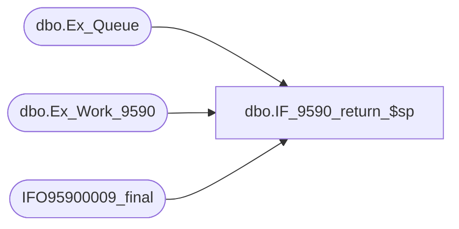

# dbo.IF_9590_return_$sp

**Database:** auditworks  
**Server:** bedrockdb01  

## Architecture Diagram



## Table Dependencies

| Referenced Table |
|---|
| dbo.Ex_Queue |
| dbo.Ex_Work_9590 |
| IFO95900009_final |

## Stored Procedure Code

```sql
create proc dbo.IF_9590_return_$sp
/* Name: IF_9590_return_$sp
   Generated: 8/21/2007 5:10:37 PM
   Automatically Generated by SmartView Exports Builder
   Called by SmartView Exports Server.
Building the export: LIVE FDMS Settlement.
   *** DO NOT MODIFY!!! ***
*/
@init int
AS
DECLARE @errmsg               varchar(255), 
        @errno                int, 
        @to_serial_no         numeric(14,0), 
        @transaction_count    numeric(12,0), 
        @edit_complete        bit, 
        @dayend_complete      bit, 
        @return               tinyint, 
        @more_data            bit, 
        @release_data         bit, 
        @external_logic       bit, 
        @produce_GO           bit 

SELECT @errmsg = NULL, 
       @to_serial_no = 0, 
       @transaction_count = 0, 
       @edit_complete = 0, 
       @return = 0, 
       @more_data = 0, 
       @release_data = 1, 
       @external_logic = 1, 
       @produce_GO = 1 

SELECT @to_serial_no = MAX(serial_no)
  FROM auditworks.dbo.Ex_Work_9590


IF @init <> 0
   SELECT @more_data = 1
     FROM auditworks.dbo.Ex_Queue
    WHERE queue_id = 50
      AND serial_no > @to_serial_no

endofreleaselogic:

IF @release_data = 0
BEGIN
    SELECT @return = 5
    GOTO endofproc
END

endofGOlogic:

SELECT @transaction_count = COUNT(*) FROM IFO95900009_final

IF @produce_GO = 1 AND @more_data = 0 
     IF @transaction_count = 0
         SELECT @return = 1
     ELSE
         SELECT @return = 2
ELSE
     IF @transaction_count = 0
         SELECT @return = 5
     ELSE
         SELECT @return = 4

endofproc: /* End of Procedure */ 
RETURN @return


error: /* Error Handler */ 

If @@trancount > 0 
   ROLLBACK TRANSACTION 

SELECT @errmsg = 'IF_9590:' + @errmsg + ' - ' + convert(varchar, @errno) 

RAISERROR (@errmsg, 16, 1)
RETURN
```

