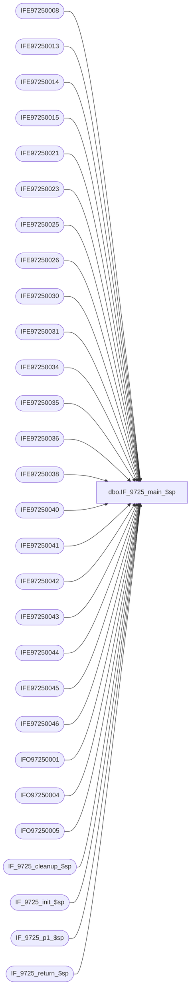

# dbo.IF_9725_main_$sp

**Database:** auditworks  
**Server:** bedrockdb01  

## Architecture Diagram



## Table Dependencies

| Referenced Table |
|---|
| IFE97250008 |
| IFE97250013 |
| IFE97250014 |
| IFE97250015 |
| IFE97250021 |
| IFE97250023 |
| IFE97250025 |
| IFE97250026 |
| IFE97250030 |
| IFE97250031 |
| IFE97250034 |
| IFE97250035 |
| IFE97250036 |
| IFE97250038 |
| IFE97250040 |
| IFE97250041 |
| IFE97250042 |
| IFE97250043 |
| IFE97250044 |
| IFE97250045 |
| IFE97250046 |
| IFO97250001 |
| IFO97250004 |
| IFO97250005 |
| IF_9725_cleanup_$sp |
| IF_9725_init_$sp |
| IF_9725_p1_$sp |
| IF_9725_return_$sp |

## Stored Procedure Code

```sql
create proc dbo.IF_9725_main_$sp
/* Name: IF_9725_main_$sp
   Generated: 07/08/04 4:13:25 PM
   Automatically Generated by SmartView Exports Builder
   Called by SmartView Exports Server.
   Calls IF_9725_p1_$sp.
Building the export: New LIVE CRMExport.
   *** DO NOT MODIFY!!! ***
*/
@executionid int, @iterations int, @batch_size int 
AS
DECLARE @errmsg               varchar(255), 
        @errno                int, 
        @transaction_count    numeric(12,0), 
        @terminate_interface  smallint, 
        @return               tinyint, 
        @min_serial_no        numeric(14,0), 
        @init                 smallint 

SELECT @errmsg = NULL, 
       @transaction_count = 0, 
       @terminate_interface = 0, 
       @return = 0, 
       @min_serial_no = 0, 
       @init = 0 

WHILE @terminate_interface < @iterations 
BEGIN 

/* @init = 0 when nothing to do, 1 if something to do. */
EXEC @init = IF_9725_init_$sp @batch_size
IF @init = 0 
   BREAK


/*** Truncate extract tables ***/

TRUNCATE TABLE IFE97250008
SELECT @errno = @@error 
IF @errno <> 0 
   BEGIN
   SELECT @errmsg = 'Unable to TRUNCATE IFE97250008 table.'
   GOTO error
   END

TRUNCATE TABLE IFE97250040
SELECT @errno = @@error 
IF @errno <> 0 
   BEGIN
   SELECT @errmsg = 'Unable to TRUNCATE IFE97250040 table.'
   GOTO error
   END

TRUNCATE TABLE IFE97250034
SELECT @errno = @@error 
IF @errno <> 0 
   BEGIN
   SELECT @errmsg = 'Unable to TRUNCATE IFE97250034 table.'
   GOTO error
   END

TRUNCATE TABLE IFE97250021
SELECT @errno = @@error 
IF @errno <> 0 
   BEGIN
   SELECT @errmsg = 'Unable to TRUNCATE IFE97250021 table.'
   GOTO error
   END

TRUNCATE TABLE IFE97250013
SELECT @errno = @@error 
IF @errno <> 0 
   BEGIN
   SELECT @errmsg = 'Unable to TRUNCATE IFE97250013 table.'
   GOTO error
   END

TRUNCATE TABLE IFE97250044
SELECT @errno = @@error 
IF @errno <> 0 
   BEGIN
   SELECT @errmsg = 'Unable to TRUNCATE IFE97250044 table.'
   GOTO error
   END

TRUNCATE TABLE IFE97250014
SELECT @errno = @@error 
IF @errno <> 0 
   BEGIN
   SELECT @errmsg = 'Unable to TRUNCATE IFE97250014 table.'
   GOTO error
   END

TRUNCATE TABLE IFE97250015
SELECT @errno = @@error 
IF @errno <> 0 
   BEGIN
   SELECT @errmsg = 'Unable to TRUNCATE IFE97250015 table.'
   GOTO error
   END

TRUNCATE TABLE IFE97250023
SELECT @errno = @@error 
IF @errno <> 0 
   BEGIN
   SELECT @errmsg = 'Unable to TRUNCATE IFE97250023 table.'
   GOTO error
   END

TRUNCATE TABLE IFE97250045
SELECT @errno = @@error 
IF @errno <> 0 
   BEGIN
   SELECT @errmsg = 'Unable to TRUNCATE IFE97250045 table.'
   GOTO error
   END

TRUNCATE TABLE IFE97250025
SELECT @errno = @@error 
IF @errno <> 0 
   BEGIN
   SELECT @errmsg = 'Unable to TRUNCATE IFE97250025 table.'
   GOTO error
   END

TRUNCATE TABLE IFE97250026
SELECT @errno = @@error 
IF @errno <> 0 
   BEGIN
   SELECT @errmsg = 'Unable to TRUNCATE IFE97250026 table.'
   GOTO error
   END

TRUNCATE TABLE IFE97250030
SELECT @errno = @@error 
IF @errno <> 0 
   BEGIN
   SELECT @errmsg = 'Unable to TRUNCATE IFE97250030 table.'
   GOTO error
   END

TRUNCATE TABLE IFE97250035
SELECT @errno = @@error 
IF @errno <> 0 
   BEGIN
   SELECT @errmsg = 'Unable to TRUNCATE IFE97250035 table.'
   GOTO error
   END

TRUNCATE TABLE IFE97250031
SELECT @errno = @@error 
IF @errno <> 0 
   BEGIN
   SELECT @errmsg = 'Unable to TRUNCATE IFE97250031 table.'
   GOTO error
   END

TRUNCATE TABLE IFE97250036
SELECT @errno = @@error 
IF @errno <> 0 
   BEGIN
   SELECT @errmsg = 'Unable to TRUNCATE IFE97250036 table.'
   GOTO error
   END

TRUNCATE TABLE IFE97250038
SELECT @errno = @@error 
IF @errno <> 0 
   BEGIN
   SELECT @errmsg = 'Unable to TRUNCATE IFE97250038 table.'
   GOTO error
   END

TRUNCATE TABLE IFE97250043
SELECT @errno = @@error 
IF @errno <> 0 
   BEGIN
   SELECT @errmsg = 'Unable to TRUNCATE IFE97250043 table.'
   GOTO error
   END

TRUNCATE TABLE IFE97250041
SELECT @errno = @@error 
IF @errno <> 0 
   BEGIN
   SELECT @errmsg = 'Unable to TRUNCATE IFE97250041 table.'
   GOTO error
   END

TRUNCATE TABLE IFE97250046
SELECT @errno = @@error 
IF @errno <> 0 
   BEGIN
   SELECT @errmsg = 'Unable to TRUNCATE IFE97250046 table.'
   GOTO error
   END

TRUNCATE TABLE IFE97250042
SELECT @errno = @@error 
IF @errno <> 0 
   BEGIN
   SELECT @errmsg = 'Unable to TRUNCATE IFE97250042 table.'
   GOTO error
   END

TRUNCATE TABLE IFO97250001
SELECT @errno = @@error 
IF @errno <> 0 
   BEGIN
   SELECT @errmsg = 'Unable to TRUNCATE IFO97250001 table.'
   GOTO error
   END

TRUNCATE TABLE IFO97250004
SELECT @errno = @@error 
IF @errno <> 0 
   BEGIN
   SELECT @errmsg = 'Unable to TRUNCATE IFO97250004 table.'
   GOTO error
   END

TRUNCATE TABLE IFO97250005
SELECT @errno = @@error 
IF @errno <> 0 
   BEGIN
   SELECT @errmsg = 'Unable to TRUNCATE IFO97250005 table.'
   GOTO error
   END

EXEC IF_9725_p1_$sp WITH RECOMPILE
SELECT @errno = @@error
IF @errno != 0
BEGIN
   SELECT @errmsg = 'Failed to execute stored procedure IF_9725_p1_$sp'
   GoTo error
End

EXEC IF_9725_cleanup_$sp @executionid WITH RECOMPILE
SELECT @errno = @@error
IF @errno != 0
BEGIN
   SELECT @errmsg = 'Failed to execute stored procedure IF_9725_cleanup_$sp'
   GoTo error
End

/* Bump up counters before looping. */
SELECT @terminate_interface = @terminate_interface + 1


END /* While @terminate_interface < @max_loop */ 

EXEC @return = IF_9725_return_$sp @init WITH RECOMPILE
SELECT @errno = @@error
IF @errno != 0
BEGIN
   SELECT @errmsg = 'Failed to execute stored procedure IF_9725_return_$sp'
   GoTo error
End

endofproc: /* End of Procedure */ 
RETURN @return

error: /* Error Handler */ 

If @@trancount > 0 
   ROLLBACK TRANSACTION 

SELECT @errmsg = 'IF_9725:' + @errmsg + ' - ' + convert(varchar, @errno) 

RAISERROR (@errmsg, 16, 1)
RETURN 


dbo,dt_verstamp007,/*
**	This procedure returns the version number of the stored
**    procedures used by the the Microsoft Visual Database Tools.
**	Version is 7.0.05.
*/
create procedure dbo.dt_verstamp007
as
	select 7005
```

