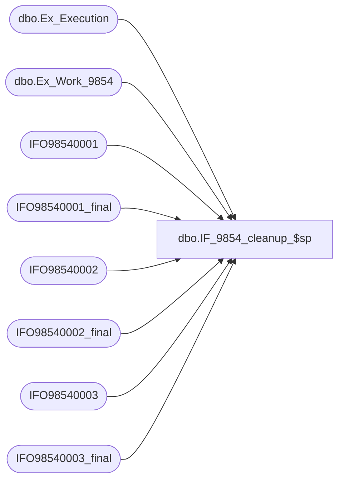

# dbo.IF_9854_cleanup_$sp

**Database:** auditworks  
**Server:** bedrockdb01  

## Architecture Diagram



## Table Dependencies

| Referenced Table |
|---|
| dbo.Ex_Execution |
| dbo.Ex_Work_9854 |
| IFO98540001 |
| IFO98540001_final |
| IFO98540002 |
| IFO98540002_final |
| IFO98540003 |
| IFO98540003_final |

## Stored Procedure Code

```sql
create proc dbo.IF_9854_cleanup_$sp
/* Name: IF_9854_cleanup_$sp
   Generated: 11/13/2018 2:25:34 PM
   Automatically Generated by SmartView Exports Builder
   Called by IF_9854_main_$sp.
Update rows as being processed..
   *** DO NOT MODIFY!!! ***
*/
@executionid int 
AS
DECLARE @errmsg               nvarchar(255), 
        @errno                int, 
        @transaction_count    numeric(12,0), 
        @process_no           smallint, 
        @process_log_entry    bit, 
        @process_timestamp    float, 
        @row                  int, 
        @return               tinyint, 
        @from_serial_no       numeric(14,0), 
        @to_serial_no         numeric(14,0) 

SELECT @errmsg = NULL, 
       @transaction_count = 0, 
       @process_no = 19, 
       @process_timestamp = 0, 
       @return = 1, 
       @to_serial_no = 0, 
       @from_serial_no = 0 


SELECT @from_serial_no = MIN(serial_no),
       @to_serial_no = MAX(serial_no)
  FROM auditworks.dbo.Ex_Work_9854

Begin Transaction

INSERT INTO IFO98540001_final
SELECT C1_HdrID, C2_TrnsID, C3_POSTrnsN, C4_TrnsSrc, C5_Str, C6_Rgstr, C7_Cshr, C8_TrnsTyp, C9_TrnsDt, C10_CstmrN, C11_MtchKy, C12_Tlphn, C13_TndrTyp, C14_FlgA, C15_FlgB, C16_FlgC, C17_FlgD, C18_FlgE, C19_FlgF, C20_FlgG, C21_FlgH, C22_TrnsAmnt, C23_Cpn1, C24_Cpn2, C25_Cpn3, C26_Cpn4, C27_Cpn5, C28_CrrncyCd, C29_TrnsctnAmntCntrlndEmlAddrs
FROM IFO98540001

SELECT @errno = @@error 
IF @errno <> 0 
   BEGIN
   SELECT @errmsg = 'Unable to copy data to IFO98540001_final table.'
   GOTO error
   END


INSERT INTO IFO98540002_final
SELECT C1_HdrId, C2_Ln, C3_StylCd, C4_ClrCd, C5_SzDsc, C6_Qntty, C7_NtRtl, C8_NtCst, C9_Slsprsn, C10_Mrkdwn, C11_CpnCd, C12_UPC, C13_Cmmnt, C14_Cpn2, C15_Cpn3, C16_Cpn4, C17_Cpn5, C18_ItmAmntCntrl, C19_MrkdwnAmntLcl, C20_MrkdwnAmntCntrl, C21_NtCstCntrl
FROM IFO98540002

SELECT @errno = @@error 
IF @errno <> 0 
   BEGIN
   SELECT @errmsg = 'Unable to copy data to IFO98540002_final table.'
   GOTO error
   END


INSERT INTO IFO98540003_final
SELECT C1_HdrID, C2_Ln#, C3_TndrTyp, C4_Idntfr, C5_Amnt
FROM IFO98540003

SELECT @errno = @@error 
IF @errno <> 0 
   BEGIN
   SELECT @errmsg = 'Unable to copy data to IFO98540003_final table.'
   GOTO error
   END


/* Insert into ex_execution the entries we have processed */
INSERT INTO auditworks.dbo.Ex_Execution
 (queue_id, object_id, execution_id, from_serial_no, to_serial_no)
 VALUES (26, 9854, @executionid, 
 @from_serial_no, @to_serial_no)
SELECT @errno = @@error 
IF @errno <> 0 
   BEGIN
   SELECT @errmsg = 'Unable to insert into auditworks.dbo.Ex_Execution'
   GOTO error
   END


Commit Transaction
endofproc: /* End of Procedure */ 
RETURN @return

error: /* Error Handler */ 

If @@trancount > 0 
   ROLLBACK TRANSACTION 

SELECT @errmsg = 'IF_9854:' + @errmsg + ' - ' + convert(varchar, @errno) 

RAISERROR (@errmsg, 16, 1)
RETURN
```

