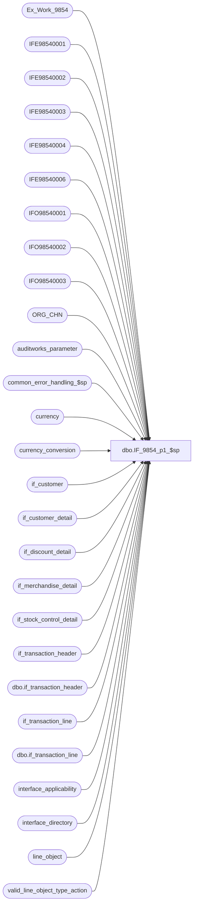

# dbo.IF_9854_p1_$sp

**Database:** auditworks  
**Server:** bedrockdb01  

## Architecture Diagram



## Table Dependencies

| Referenced Table |
|---|
| Ex_Work_9854 |
| IFE98540001 |
| IFE98540002 |
| IFE98540003 |
| IFE98540004 |
| IFE98540006 |
| IFO98540001 |
| IFO98540002 |
| IFO98540003 |
| ORG_CHN |
| auditworks_parameter |
| common_error_handling_$sp |
| currency |
| currency_conversion |
| if_customer |
| if_customer_detail |
| if_discount_detail |
| if_merchandise_detail |
| if_stock_control_detail |
| if_transaction_header |
| dbo.if_transaction_header |
| if_transaction_line |
| dbo.if_transaction_line |
| interface_applicability |
| interface_directory |
| line_object |
| valid_line_object_type_action |

## Stored Procedure Code

```sql
CREATE proc [dbo].[IF_9854_p1_$sp]
/* Name: IF_9854_p1_$sp
   Generated: 11/13/2018 2:25:34 PM
   Automatically Generated by SmartView Exports Builder
   Called by IF_9854_main_$sp.
Building the follwing extracts: 
CIM_header
CIM_detail
CIM_tender
CIM_NonMerch
Even Exchange SQL
Flag BearBucksAndLoyalty.
   *** DO NOT MODIFY!!! ***
*/
AS
DECLARE @errmsg               nvarchar(255), 
        @errno                int, 
        @return               tinyint, 
        @transaction_count    numeric(12,0), 
        @process_no           smallint, 
        @process_log_entry    bit, 
        @process_timestamp    float

SELECT @errmsg = NULL, 
       @return = 0, 
       @process_no = 19, 
       @process_timestamp = 0


/*** Extracting data into the working table for the extract: CIM_header ***/

/*
CRM SP12+ version 
Note: 
-when saving for Xpress, use d:\HostData\aw_xpr_01\OUTPUT\CRM\BK for the output 
-when saving for unit testing in aw51_tempX2, use c:\HostData\aw51_tempX2\OUTPUT\CRM\BK

  History:
  Oct20,2018  Kiri   DAOM-3629 Fix alphanumeric coupon code in pos_discount_serial_no issue - SQL2012+
  May26,2016  Roula  Update    Fees and Liabilities in Detail File - if included in interface applicability
  Sep22,2016  Vicci  DAOM-1486 Correct format of amount fields to only include 2 decimals.
  Sep20,2016  Vicci  DAOM-1473 Add Email address to header file if export format is >= 3 (i.e. CRM SP12+).
  Mar23,2016  Vicci   DAOM-270 Add try/catch and log errors to process error log;  Expand amount fields;  Fix to handle period, comma, plus or minus sign being treated as numeric by IsNumeric check.
  Jun05,2015  Vicci  TFS-52923 Log entry_date_time instead of transaction_date to CRM transaction date field;  
                               include coupons referenced directly in transaction line reference# (as can happen for discount or tender lines);
                               export transaction_id instead of if entry no as transaction id;
                               chop off leading digits if if_entry_no bigger than CRM 13 digit limit or transaction_id bigger than CRM 9 digit limit.
  Apr09,2014  Vicci 151067     Support fees in interface applicability to feed CRM.
  Nov21,2013  Vicci 148322     Expand Match Key to 80 and populate it with new Offline Customer Creation ID.
  Nov11,2013  Vicci 147455     Chop coupons off at 24 instead of 12 for CRM 7+ (although S/A currently only supports 16 for promotions and 20 for manually input numbers).
  Sep18,2013  Vicci 146810     Add currency code and converted tender total to Header;  Add converted item amount to detail;  Handle new CRM Exchange transaction type;
                               Set flagC if transaction contains order items;  Log disc% as 100 if it exceeds 100;  Set item comment to ORDER or CANCEL if item is ordered or cancelled;
                               Handle WSTR location type transactions as E-commerce.
                               If configured to feed orders at time of order-create and a transaction with
                               order items being picked up ends up being fed to CRM because it also has items
                               being sold outright, do not include the pickup items.
  Aug27,2013  Vicci 146259     Make ansi compliant, correct coupon logging, remove ref to hard-code work table name, reference ORG_CHN instead of store_salesaudit, log coupon serial# to header as well
  Sep16,2013  Vicci 146810     Set Trans Source to hard-coded value of 1 in CIM_header map
                                                        Hard-code a map of WSTR (warehouse store) to E (E-commerce store) since CRDM does not allow the same ORG_CHN_TYPE to be mapped to more than 1 SYS_CODE.
 May05,2014  Vicci TFS-72085 Remove store-type from TransactionType exported for CRM 7+
*/ 

DECLARE @base_currency_code nvarchar(3),
        @new_crm tinyint,
        @include_email tinyint

DECLARE @errno1          int,
        @errmsg1         nvarchar(2000), 
        @message_id1     int, 
        @object_name1    nvarchar(255), 
        @operation_name1 nvarchar(100),
        @process_name1   nvarchar(100),
        @process_no1     smallint;

SELECT @process_name1 = 'S/A to CRM export',
       @message_id1 = 201068,
       @process_no1 = 19,
       @errmsg1 = 'Failed to execute S/A to CRM File 1 CIM_header Extract',
       @object_name1 = 'S/A to CRM export',                   
       @operation_name1 = 'EXECUTE';

BEGIN TRY

SELECT @base_currency_code = c.currency_code
  FROM auditworks_parameter p, currency c
 WHERE par_name = 'common_currency'
   AND CASE WHEN IsNumeric(par_value) = 1 THEN convert(decimal(12,0), par_value) ELSE -1 END = c.currency_id

IF EXISTS (SELECT *
             FROM interface_directory
            WHERE interface_id = 26
              AND ascii_export > 1)
  SELECT @new_crm = 1
ELSE 
  SELECT @new_crm = 0

IF EXISTS (SELECT *
             FROM interface_directory
            WHERE interface_id = 26
              AND ascii_export > 2)
  SELECT @include_email = 1
ELSE 
  SELECT @include_email = 0
  
INSERT INTO IFE98540001 
SELECT w.key_1 as key_1, --will be shortened to 13 digits after use
                  h.transaction_id%1000000000 as transaction_id, --CRM only supports 9 digits
                  h.transaction_no as transaction_no, 
                  h.store_no as store_no, 
                  h.register_no as register_no, 
                  h.cashier_no as cashier_no, 
                  CASE WHEN @new_crm = 0 
                       THEN CASE WHEN s.ORG_CHN_TYPE_CODE = 'WSTR' 
                                 THEN 'E' 
                                 ELSE s.ORG_CHN_TYPE_CODE 
                            END 
                       ELSE ''
                  END
                  + CASE SIGN( SUM(  (l.gross_line_amount - l.pos_discount_amount) 
                                   * -1 
                                   * CASE WHEN l.db_cr_none = 0 THEN v.default_db_cr_none ELSE l.db_cr_none END
                                   * l.voiding_reversal_flag 
                                   * CASE WHEN l.line_object_type IN (1, 2,4) AND i.interface_id IS NOT NULL THEN 1 ELSE 0 END))
                         WHEN -1 THEN 'R' 
                         WHEN  0 THEN 'E' 
                         ELSE 'S' 
                    END as  trans_type,
                  CASE WHEN @new_crm = 1 THEN h.entry_date_time ELSE h.transaction_date END as transaction_date, 
                  MAX(c.customer_no) as customer_no,
                  IsNull(sign(h.employee_no + 1), 0) as employee_purch_flag_A,
                  MAX(IsNull((1-(abs(sign(l.reference_type - 4)) * abs(sign(l.reference_type - 203)))), 0)) as gift_cert_card_flag_B,
                  
                  SUM( (l.gross_line_amount - l.pos_discount_amount) 
                      * -1 
                      * CASE WHEN l.db_cr_none = 0 THEN v.default_db_cr_none ELSE l.db_cr_none END
                      * l.voiding_reversal_flag 
                      * CASE WHEN l.line_object_type IN (1, 2,4) AND i.interface_id IS NOT NULL THEN 1 ELSE 0 END
                     ) as transaction_amount_local,
                  MAX(c.telephone_no1) as telephone_no,
                  NULL as coupon1,
                  NULL as coupon2,
                  NULL as coupon3,
                  NULL as coupon4,
                  NULL as coupon5,
                  MAX(CASE WHEN l.line_action IN (7, 8, 90, 142) THEN 1 ELSE 0 END) as contains_order_item_flag_C,
                  COALESCE(s.DFLT_CRNCY_CODE, @base_currency_code) as currency_code,
                  CONVERT(nvarchar, convert(money, SUM((l.gross_line_amount - l.pos_discount_amount) * -1 * CASE WHEN l.db_cr_none = 0 THEN v.default_db_cr_none ELSE l.db_cr_none END * l.voiding_reversal_flag * CASE WHEN l.line_object_type IN (1, 2, 4) AND i.interface_id IS NOT NULL THEN 1 ELSE 0 END * COALESCE(cc.exchange_rate, 1))))
                    + CASE WHEN @include_email = 1 THEN NCHAR(9) +  COALESCE(MAX(c.email_address), '')  ELSE '' END as transaction_amount_central_email,
                  MAX(cd.customer_info) as match_key
FROM  Ex_Work_9854 w
               INNER JOIN if_transaction_header h
                       ON w.key_1 = h.if_entry_no
                      AND ( h.transaction_void_flag = 0 OR h.transaction_void_flag = 8 )
               INNER JOIN ORG_CHN s
                       ON h.store_no = s.ORG_CHN_NUM
               LEFT OUTER JOIN if_customer c 
                       ON h.if_entry_no = c.if_entry_no
                      AND c.customer_role = 1
               LEFT OUTER JOIN if_customer_detail cd 
                       ON h.if_entry_no = cd.if_entry_no
                      AND cd.customer_role = 1
                      AND cd.customer_info_type = 210 --Offline Customer Creation ID
               LEFT OUTER JOIN if_transaction_line l
                       ON h.if_entry_no = l.if_entry_no
                      AND l.line_object_type in (1, 2, 4, 6)  --obj-type2 and 4
                      AND l.line_void_flag = 0
                      AND (l.line_action NOT IN (90, 142) 
                           OR NOT EXISTS (SELECT 1
                                            FROM interface_applicability i
                                            WHERE i.interface_id = 26
                                              AND l.line_object = i.line_object
                                              AND i.line_action = 7))  --since additional purchases can be made while picking up an ordere item that would case the transaction to be sent to CRM
               LEFT OUTER JOIN interface_applicability i  
                       ON i.interface_id = 26
                      AND h.transaction_category = i.transaction_category
                      AND l.line_object = i.line_object
                      AND l.line_action = i.line_action
               LEFT OUTER JOIN valid_line_object_type_action v
                       ON l.line_object_type = v.line_object_type
                      AND l.line_action = v.line_action
               LEFT OUTER JOIN currency cu
                       ON COALESCE(s.DFLT_CRNCY_CODE, @base_currency_code) = cu.currency_code
               LEFT OUTER JOIN currency_conversion cc
                       ON cu.currency_id = cc.currency_id
                      AND cc.currency_conversion_type_id = 1
                      AND cc.effective_date_from <= h.transaction_date
                      AND (cc.effective_date_to >= h.transaction_date OR cc.effective_date_to IS NULL)
GROUP BY w.key_1, 
                  h.transaction_id, 
                  h.transaction_no, 
                  h.store_no, 
                  h.register_no, 
                  h.cashier_no, 
                  CASE WHEN @new_crm = 0 
                       THEN CASE WHEN s.ORG_CHN_TYPE_CODE = 'WSTR' 
                                 THEN 'E' 
                                 ELSE s.ORG_CHN_TYPE_CODE 
                            END 
                       ELSE ''
                  END,
                  CASE WHEN @new_crm = 1 THEN h.entry_date_time ELSE h.transaction_date END,
                  IsNull(sign(h.employee_no + 1), 0),
                  COALESCE(s.DFLT_CRNCY_CODE, @base_currency_code)
                  
CREATE TABLE #crm_hdr_coupon(
                   if_entry_no numeric(14,0) not null,
                   coupon1 nvarchar(24) null, 
                   coupon2 nvarchar(24) null, 
                   coupon3 nvarchar(24) null, 
                   coupon4 nvarchar(24) null, 
                   coupon5 nvarchar(24) null)

INSERT INTO #crm_hdr_coupon(if_entry_no, coupon1, coupon2, coupon3, coupon4, coupon5)
SELECT q.if_entry_no, 
       MAX(CASE WHEN q.coupon_seq = 1 THEN q.coupon_no ELSE NULL END) as coupon1,
       MAX(CASE WHEN q.coupon_seq = 2 THEN q.coupon_no ELSE NULL END) as coupon2,
       MAX(CASE WHEN q.coupon_seq = 3 THEN q.coupon_no ELSE NULL END) as coupon3,
       MAX(CASE WHEN q.coupon_seq = 4 THEN q.coupon_no ELSE NULL END) as coupon4,
       MAX(CASE WHEN q.coupon_seq = 5 THEN q.coupon_no ELSE NULL END) as coupon5
from (
SELECT sq.if_entry_no,
       sq.coupon_no,
       ROW_NUMBER() OVER(PARTITION BY sq.if_entry_no ORDER BY sq.if_entry_no) as coupon_seq
FROM (
SELECT  DISTINCT h.if_entry_no, 
CASE WHEN TRY_PARSE(d.pos_discount_serial_no AS int) IS NOT NULL 
     THEN CASE WHEN LTRIM(RTRIM(d.pos_discount_serial_no)) IN ('-', '.', ',', '+') 
               THEN NULL 
               ELSE SUBSTRING(CONVERT(nvarchar, CONVERT(numeric(24,0), d.pos_discount_serial_no)), 1, CASE WHEN @new_crm = 1 THEN 24 ELSE 12 END) END
     ELSE
         CASE WHEN TRY_PARSE(SUBSTRING(d.pos_discount_serial_no, 1, 16) AS int) IS NOT NULL 
                           THEN SUBSTRING(CONVERT(nvarchar, CONVERT(numeric(16,0), SUBSTRING(d.pos_discount_serial_no, 1, 16))), 1, CASE WHEN @new_crm = 1 THEN 24 ELSE 12 END)
                           ELSE SUBSTRING(d.pos_discount_serial_no, 1, CASE WHEN @new_crm = 1 THEN 24 ELSE 12 END)
                           END
                      END as coupon_no
                 FROM  Ex_Work_9854 w
               INNER JOIN if_transaction_header h
                       ON w.key_1 = h.if_entry_no
                    AND ( h.transaction_void_flag = 0 OR h.transaction_void_flag = 8 )
               INNER JOIN if_discount_detail d
                      ON h.if_entry_no = d.if_entry_no
                   AND d.pos_discount_level = 18 --(23 would be Merch promo numbers not coupon numbers)
                   AND d.pos_discount_serial_no IS NOT NULL
               INNER JOIN if_transaction_line l
                      ON d.if_entry_no = l.if_entry_no
                    AND d.line_id = l.line_id
                    AND l.line_void_flag = 0
UNION
SELECT  DISTINCT h.if_entry_no, 
        SUBSTRING(s.pos_identifier, 1, CASE WHEN @new_crm = 1 THEN 24 ELSE 12 END) as coupon_no
FROM  Ex_Work_9854 w
       INNER JOIN if_transaction_header h
          ON w.key_1 = h.if_entry_no
         AND ( h.transaction_void_flag = 0 OR h.transaction_void_flag = 8 )
       INNER JOIN if_stock_control_detail s  --note these are attached to the discount or tender line not the item line so they are output at header level
          ON h.if_entry_no = s.if_entry_no
         AND s.display_def_id = 53  --reference document
         AND pos_identifier_type = 8 --coupon#
       INNER JOIN if_transaction_line l
          ON s.if_entry_no = l.if_entry_no
         AND s.line_id = l.line_id
         AND l.line_void_flag = 0
UNION
SELECT  DISTINCT h.if_entry_no, 
        SUBSTRING(l.reference_no, 1, CASE WHEN @new_crm = 1 THEN 24 ELSE 12 END) as coupon_no
FROM  Ex_Work_9854 w
       INNER JOIN if_transaction_header h
          ON w.key_1 = h.if_entry_no
         AND ( h.transaction_void_flag = 0 OR h.transaction_void_flag = 8 )
       INNER JOIN if_transaction_line l  --note coupons are in the tender or discount line, not the item line so they are output at header level
          ON h.if_entry_no = l.if_entry_no
         AND l.line_void_flag = 0
         AND l.reference_type = 8  --coupon#
) sq
) q
GROUP BY q.if_entry_no


IF @@rowcount > 0
BEGIN
  UPDATE  IFE98540001 
             SET C25_trnsctnrmrk= coupon1,
                       C24_trnsctnrmrk= coupon2,
                       C23_trnsctnrmrk= coupon3,  
                       C26_trnsctnrmrk= coupon4,
                       C27_trnsctnrmrk= coupon5
          FROM #crm_hdr_coupon cc 
      WHERE  C1_f_ntry_nky_1=  cc.if_entry_no                  
END

--chop off leading digits if if_entry_no bigger than CRM 13 digit limit or transaction_id bigger than CRM 9 digit limit.
UPDATE IFE98540001 
   SET C1_f_ntry_nky_1 = C1_f_ntry_nky_1%10000000000000
 WHERE C1_f_ntry_nky_1 > 9999999999999  --CRM only support 13 digits

END TRY
BEGIN CATCH
  SELECT @errno1 = ERROR_NUMBER();
  SELECT @errmsg1 = @process_name1 + ':  ' + COALESCE(@errmsg1, '') + ' Line: ' + CONVERT(nvarchar, ERROR_LINE()) + ', ' + ERROR_MESSAGE();

  EXEC common_error_handling_$sp @process_no1, @errno1, @errmsg1, 0, @message_id1, @process_name1, @object_name1, @operation_name1, 1, 1;
  
  RETURN;
END CATCH;


SELECT @errno = @@error 
IF @errno <> 0 
   BEGIN
   SELECT @errmsg = 'Unable to extract data into the working table for: CIM_header.'
   GOTO error
   END


/*** Map the extract data to the output table ***/

INSERT INTO IFO98540001
( C1_HdrID,
 C2_TrnsID,
 C3_POSTrnsN,
 C5_Str,
 C6_Rgstr,
 C7_Cshr,
 C8_TrnsTyp,
 C9_TrnsDt,
 C10_CstmrN,
 C14_FlgA,
 C15_FlgB,
 C22_TrnsAmnt,
 C12_Tlphn,
 C28_CrrncyCd,
 C29_TrnsctnAmntCntrlndEmlAddrs,
 C16_FlgC,
 C23_Cpn1,
 C24_Cpn2,
 C25_Cpn3,
 C26_Cpn4,
 C27_Cpn5,
 C11_MtchKy)
SELECT Convert(numeric(20,0),a.C1_f_ntry_nky_1),
Convert(numeric(20,0),a.C2_TrnsctnID),
Convert(numeric(20,0),a.C3_trnsctnn),
Convert(numeric(20,0),a.C4_trnsctnstrn),
Convert(numeric(20,0),a.C5_trnsctnrgstrn),
Convert(numeric(20,0),a.C6_trnsctncshrn),
a.C7_StrslsStrxprtcd,
a.C8_trnsctndt,
Convert(numeric(20,0),a.C9_cstmrNmbr),
Convert(nvarchar(4000),a.C10_mpprchstrnsmpn),
Convert(nvarchar(4000),a.C11_lnrfrnctyp),
Convert(numeric(20,4),a.C12_trnsctntndrttl),
Convert(numeric(20,0),a.C13_cstmrTlphnn1),
a.C20_trnsctnrmrk,
a.C30_trnsctnrmrk,
Convert(nvarchar(4000),a.C22_lnrfrnctyp),
a.C25_trnsctnrmrk,
a.C24_trnsctnrmrk,
a.C23_trnsctnrmrk,
a.C26_trnsctnrmrk,
a.C27_trnsctnrmrk,
a.C28_trnsctnrmrk
FROM IFE98540001 a


SELECT @errno = @@error 
IF @errno <> 0 
   BEGIN
   SELECT @errmsg = 'An error occurred while inserting into output table IFO98540001.'
   GOTO error
   END


/*** Extracting data into the working table for the extract: CIM_detail ***/

/* History:
  Oct20,2018  Kiri  DAOM-3629 Fix alphanumeric coupon code in pos_discount_serial_no issue - SQL2012+
  Mar23,2016  Vicci  DAOM-270  Add try/catch and log errors to process error log;  Expand amount fields;  Fix to handle period, comma, plus or minus sign being treated as numeric by IsNumeric check.
  Jun05,2015  Vicci TFS-52923  chop off leading digits if if_entry_no bigger than CRM 13 digit limit;
                               log new local and central markdown amounts instead of markdown percent;
                               log new central net cost and old local net cost.
  Apr01,2014  Vicci 151067     Support fees with merchandise attachments feeding CRM;  
                               add join to interface applicability since it should already include all relevant merch/fee objects in order for the transaction to even make it to the I/F tables for CRM, 
                               and it a) allows for control over both what merch objects and what fee objects are fed to CRM (the need for one is as likely as the need for the other), 
                               b) handles situations where layaway pickups and outright sales (for example) are all done within a single transaction but only the sale lines are to be fed 
                               (not the pickup lines that would already have gone through when the layaway was created).
  Nov08,2013  Vicci 147455     Chop coupons off at 24 instead of 12 for CRM 7+ (although S/A currently only supports 16 for promotions and 20 for manually input numbers).
  Sep18,2013  Vicci 146810     Add converted item amount;  
                               Log disc% as 100 if it exceeds 100;  
                               Set item comment to ORDER or CANCEL if item is ordered or cancelled;
                               If configured to feed orders at time of order-create and a transaction with
                               order items being picked up ends up being fed to CRM because it also has items
                               being sold outright, do not include the pickup items.
*/

DECLARE @base_currency nvarchar(3),
        @new_crm_flag tinyint,
        
        @errno2          int,
        @errmsg2         nvarchar(2000), 
        @message_id2     int, 
        @object_name2    nvarchar(255), 
        @operation_name2 nvarchar(100),
        @process_name2   nvarchar(100),
        @process_no2     smallint;

SELECT @process_name2 = 'S/A to CRM export',
       @message_id2 = 201068,
       @process_no2 = 19,
       @errmsg2 = 'Failed to execute S/A to CRM File 2 CIM_detail Extract',
       @object_name2 = 'S/A to CRM export',                   
       @operation_name2 = 'EXECUTE';

BEGIN TRY

SELECT @base_currency = c.currency_code
  FROM auditworks_parameter p, currency c
 WHERE par_name = 'common_currency'
   AND CASE WHEN IsNumeric(par_value) = 1 THEN convert(decimal(12,0), par_value) ELSE -1 END = c.currency_id

IF EXISTS (SELECT *
             FROM interface_directory
            WHERE interface_id = 26
              AND ascii_export > 1)
  SELECT @new_crm_flag = 1
ELSE 
  SELECT @new_crm_flag = 0

INSERT INTO IFE98540002 
SELECT w.key_1 as key_1, 
                   l.line_id as line_id, 
                   (m.units * CASE WHEN l.db_cr_none = 0 THEN v.default_db_cr_none ELSE l.db_cr_none END * -1) as units, 
                   (l.gross_line_amount - l.pos_discount_amount)  * l.voiding_reversal_flag * CASE WHEN l.db_cr_none = 0 THEN v.default_db_cr_none ELSE l.db_cr_none END * -1 as net_amount, 
                   m.salesperson as salesperson,
                   CASE WHEN @new_crm_flag <> 0 THEN NULL ELSE
                   CASE WHEN l.gross_line_amount = 0 OR sign(l.gross_line_amount) <> sign(l.pos_discount_amount) THEN 0 
                                ELSE CASE WHEN ABS(l.pos_discount_amount) > ABS(l.gross_line_amount) THEN 100
                                                          ELSE ROUND(convert(float,100.0000) * l.pos_discount_amount / l.gross_line_amount, 4) 
                                             END
                   END END as discount_percent,
                   m.upc_no as upc_no,
                   min(CASE WHEN TRY_PARSE(d.pos_discount_serial_no AS int) IS NOT NULL 
                            THEN CASE WHEN LTRIM(RTRIM(d.pos_discount_serial_no)) IN ('-', '.', ',', '+') 
                                      THEN NULL 
                                      ELSE SUBSTRING(CONVERT(nvarchar, CONVERT(numeric(24,0), d.pos_discount_serial_no)), 1, CASE WHEN @new_crm_flag = 1 THEN 24 ELSE 12 END) END
                            ELSE
                      CASE WHEN TRY_PARSE(SUBSTRING(d.pos_discount_serial_no, 1, 16) AS int) IS NOT NULL 
                           THEN SUBSTRING(CONVERT(nvarchar, CONVERT(numeric(16,0), SUBSTRING(d.pos_discount_serial_no, 1, 16))), 1, CASE WHEN @new_crm_flag = 1 THEN 24 ELSE 12 END)
                           ELSE SUBSTRING(d.pos_discount_serial_no, 1, CASE WHEN @new_crm_flag = 1 THEN 24 ELSE 12 END)
                           END
                      END) as coupon1,
                   null as coupon2,
                   null as coupon3,
                   null as coupon4,
                   null as coupon5,
                   count(d.pos_discount_serial_no) as coupon_count,
                   (l.gross_line_amount - l.pos_discount_amount)  * l.voiding_reversal_flag * CASE WHEN l.db_cr_none = 0 THEN v.default_db_cr_none ELSE l.db_cr_none END * -1  * COALESCE(cc.exchange_rate, 1) as item_amount_central,
                   CASE l.line_action WHEN 7 THEN 'ORDER' WHEN 8 THEN 'CANCEL' ELSE NULL END as comment,
                   CASE WHEN l.pos_discount_amount <= 0 --markup
                             OR @new_crm_flag = 0 THEN NULL 
                        ELSE l.pos_discount_amount END as pos_discount_amount, 
                   CASE WHEN l.pos_discount_amount <= 0 --markup
                             OR @new_crm_flag = 0 THEN NULL 
                        ELSE l.pos_discount_amount * COALESCE(cc.exchange_rate, 1) END as pos_discount_amount_central,
                   CASE WHEN @new_crm_flag = 0 THEN NULL
                        ELSE m.cost * m.units * COALESCE(cc.exchange_rate, 1)  * l.voiding_reversal_flag * CASE WHEN l.db_cr_none = 0 THEN v.default_db_cr_none ELSE l.db_cr_none END * -1 END as extended_cost_central,
                   CASE WHEN @new_crm_flag = 0 THEN NULL
                        ELSE m.cost * m.units * l.voiding_reversal_flag * CASE WHEN l.db_cr_none = 0 THEN v.default_db_cr_none ELSE l.db_cr_none END * -1 END as extended_cost
FROM  Ex_Work_9854 w
               INNER JOIN if_transaction_header h
                      ON w.key_1 = h.if_entry_no 
                    AND h.transaction_void_flag in (0, 8)
               INNER JOIN ORG_CHN s
                       ON h.store_no = s.ORG_CHN_NUM
               INNER JOIN if_transaction_line l
                       ON h.if_entry_no = l.if_entry_no 
                    AND l.line_void_flag = 0
                    AND l.line_object_type IN (1, 2, 4) 
               INNER JOIN interface_applicability i
                       ON i.interface_id = 26
                      AND h.transaction_category = i.transaction_category
                      AND l.line_object = i.line_object
                      AND l.line_action = i.line_action
               INNER JOIN if_merchandise_detail m 
                      ON l.if_entry_no = m.if_entry_no 
                   AND l.line_id = m.line_id
               LEFT OUTER JOIN if_discount_detail d
                     ON l.if_entry_no = d.if_entry_no 
                  AND l.line_id = d.line_id
                  AND d.pos_discount_level = 16  --22 would be a merch promo number not a coupon number
                      AND (l.line_action NOT IN (90, 142) 
                           OR NOT EXISTS (SELECT 1
                                            FROM interface_applicability i
                                            WHERE i.interface_id = 26
                                              AND l.line_object = i.line_object
                                              AND i.line_action = 7))  --since additional purchases can be made while picking up an ordere item that would case the transaction to be sent to CRM
               LEFT OUTER JOIN valid_line_object_type_action v
                       ON l.line_object_type = v.line_object_type
                      AND l.line_action = v.line_action
               LEFT OUTER JOIN currency cu
                       ON COALESCE(s.DFLT_CRNCY_CODE, @base_currency) = cu.currency_code
               LEFT OUTER JOIN currency_conversion cc
                       ON cu.currency_id = cc.currency_id
                      AND cc.currency_conversion_type_id = 1
                      AND cc.effective_date_from <= h.transaction_date
                      AND (cc.effective_date_to >= h.transaction_date OR cc.effective_date_to IS NULL)
GROUP BY w.key_1, 
         l.line_id, 
         (m.units * CASE WHEN l.db_cr_none = 0 THEN v.default_db_cr_none ELSE l.db_cr_none END * -1), 
         (l.gross_line_amount - l.pos_discount_amount)  * l.voiding_reversal_flag * CASE WHEN l.db_cr_none = 0 THEN v.default_db_cr_none ELSE l.db_cr_none END * -1, 
         m.salesperson,
                            CASE WHEN @new_crm_flag <> 0 THEN NULL ELSE
                   CASE WHEN l.gross_line_amount = 0 OR sign(l.gross_line_amount) <> sign(l.pos_discount_amount) THEN 0 
                                ELSE CASE WHEN ABS(l.pos_discount_amount) > ABS(l.gross_line_amount) THEN 100
                                                          ELSE ROUND(convert(float,100.0000) * l.pos_discount_amount / l.gross_line_amount, 4) 
                                             END
                   END END, 
         m.upc_no,
         (l.gross_line_amount - l.pos_discount_amount)  * l.voiding_reversal_flag * CASE WHEN l.db_cr_none = 0 THEN v.default_db_cr_none ELSE l.db_cr_none END * -1  * COALESCE(cc.exchange_rate, 1),
         CASE l.line_action WHEN 7 THEN 'ORDER' WHEN 8 THEN 'CANCEL' ELSE NULL END,
         CASE WHEN l.pos_discount_amount <= 0 --markup
                   OR @new_crm_flag = 0 THEN NULL 
              ELSE l.pos_discount_amount END, 
         CASE WHEN l.pos_discount_amount <= 0 --markup
                   OR @new_crm_flag = 0 THEN NULL 
              ELSE l.pos_discount_amount * COALESCE(cc.exchange_rate, 1) END,
         CASE WHEN @new_crm_flag = 0 THEN NULL
              ELSE m.cost * m.units * COALESCE(cc.exchange_rate, 1)  * l.voiding_reversal_flag * CASE WHEN l.db_cr_none = 0 THEN v.default_db_cr_none ELSE l.db_cr_none END * -1 END,
         CASE WHEN @new_crm_flag = 0 THEN NULL
              ELSE m.cost * m.units * l.voiding_reversal_flag * CASE WHEN l.db_cr_none = 0 THEN v.default_db_cr_none ELSE l.db_cr_none END * -1 END

UPDATE IFE98540002
SET C17_trnsctnrmrk = (SELECT min(CASE WHEN TRY_PARSE(d.pos_discount_serial_no AS int) IS NOT NULL 
                                  THEN CASE WHEN LTRIM(RTRIM(d.pos_discount_serial_no)) IN ('-', '.', ',', '+') 
                                            THEN NULL 
                                            ELSE SUBSTRING(CONVERT(nvarchar, CONVERT(numeric(24,0), d.pos_discount_serial_no)), 1, CASE WHEN @new_crm_flag = 1 THEN 24 ELSE 12 END) END
                                  ELSE
         CASE WHEN TRY_PARSE(SUBSTRING(d.pos_discount_serial_no, 1, 16) AS int) IS NOT NULL 
                           THEN SUBSTRING(CONVERT(nvarchar, CONVERT(numeric(16,0), SUBSTRING(d.pos_discount_serial_no, 1, 16))), 1, CASE WHEN @new_crm_flag = 1 THEN 24 ELSE 12 END)
                           ELSE SUBSTRING(d.pos_discount_serial_no, 1, CASE WHEN @new_crm_flag = 1 THEN 24 ELSE 12 END)
                           END
                      END)
              FROM if_discount_detail d
             WHERE C1_f_ntry_nky_1 = d.if_entry_no 
                        AND C2_lnID = d.line_id 
          AND d.pos_discount_serial_no is not null
                      AND d.pos_discount_level = 16
                      AND CASE WHEN TRY_PARSE(d.pos_discount_serial_no AS int) IS NOT NULL 
                      THEN CASE WHEN LTRIM(RTRIM(d.pos_discount_serial_no)) IN ('-', '.', ',', '+') 
                                THEN NULL 
                                ELSE SUBSTRING(CONVERT(nvarchar, CONVERT(numeric(24,0), d.pos_discount_serial_no)), 1, CASE WHEN @new_crm_flag = 1 THEN 24 ELSE 12 END) END
                      ELSE
         CASE WHEN TRY_PARSE(SUBSTRING(d.pos_discount_serial_no, 1, 16) AS int) IS NOT NULL 
                           THEN SUBSTRING(CONVERT(nvarchar, CONVERT(numeric(16,0), SUBSTRING(d.pos_discount_serial_no, 1, 16))), 1, CASE WHEN @new_crm_flag = 1 THEN 24 ELSE 12 END)
                           ELSE SUBSTRING(d.pos_discount_serial_no, 1, CASE WHEN @new_crm_flag = 1 THEN 24 ELSE 12 END)
                           END
                      END <> C16_trnsctnrmrk)
WHERE C13_dscntppldbylnd > 1

IF @@rowcount > 0
BEGIN
UPDATE IFE98540002
SET C18_trnsctnrmrk = (SELECT min(CASE WHEN TRY_PARSE(d.pos_discount_serial_no AS int) IS NOT NULL 
                      THEN CASE WHEN LTRIM(RTRIM(d.pos_discount_serial_no)) IN ('-', '.', ',', '+') 
               THEN NULL 
               ELSE SUBSTRING(CONVERT(nvarchar, CONVERT(numeric(24,0), d.pos_discount_serial_no)), 1, CASE WHEN @new_crm_flag = 1 THEN 24 ELSE 12 END) END
                      ELSE
         CASE WHEN TRY_PARSE(SUBSTRING(d.pos_discount_serial_no, 1, 16) AS int) IS NOT NULL 
                           THEN SUBSTRING(CONVERT(nvarchar, CONVERT(numeric(16,0), SUBSTRING(d.pos_discount_serial_no, 1, 16))), 1, CASE WHEN @new_crm_flag = 1 THEN 24 ELSE 12 END)
                           ELSE SUBSTRING(d.pos_discount_serial_no, 1, CASE WHEN @new_crm_flag = 1 THEN 24 ELSE 12 END)
                           END
                      END)
              FROM if_discount_detail d
             WHERE C1_f_ntry_nky_1 = d.if_entry_no 
                        AND C2_lnID = d.line_id 
          AND d.pos_discount_serial_no is not null
                      AND d.pos_discount_level = 16
                      AND CASE WHEN TRY_PARSE(d.pos_discount_serial_no AS int) IS NOT NULL 
                      THEN CASE WHEN LTRIM(RTRIM(d.pos_discount_serial_no)) IN ('-', '.', ',', '+') 
               THEN NULL 
               ELSE SUBSTRING(CONVERT(nvarchar, CONVERT(numeric(24,0), d.pos_discount_serial_no)), 1, CASE WHEN @new_crm_flag = 1 THEN 24 ELSE 12 END) END
                      ELSE
         CASE WHEN TRY_PARSE(SUBSTRING(d.pos_discount_serial_no, 1, 16) AS int) IS NOT NULL 
                           THEN SUBSTRING(CONVERT(nvarchar, CONVERT(numeric(16,0), SUBSTRING(d.pos_discount_serial_no, 1, 16))), 1, CASE WHEN @new_crm_flag = 1 THEN 24 ELSE 12 END)
                           ELSE SUBSTRING(d.pos_discount_serial_no, 1, CASE WHEN @new_crm_flag = 1 THEN 24 ELSE 12 END)
                           END
                      END <> C16_trnsctnrmrk
                      AND CASE WHEN TRY_PARSE(d.pos_discount_serial_no AS int) IS NOT NULL 
                      THEN CASE WHEN LTRIM(RTRIM(d.pos_discount_serial_no)) IN ('-', '.', ',', '+') 
               THEN NULL 
               ELSE SUBSTRING(CONVERT(nvarchar, CONVERT(numeric(24,0), d.pos_discount_serial_no)), 1, CASE WHEN @new_crm_flag = 1 THEN 24 ELSE 12 END) END
                      ELSE
         CASE WHEN TRY_PARSE(SUBSTRING(d.pos_discount_serial_no, 1, 16) AS int) IS NOT NULL 
                           THEN CASE WHEN LTRIM(RTRIM(d.pos_discount_serial_no)) IN ('-', '.', ',', '+') 
               THEN NULL 
               ELSE SUBSTRING(CONVERT(nvarchar, CONVERT(numeric(16,0), SUBSTRING(d.pos_discount_serial_no, 1, 16))), 1, CASE WHEN @new_crm_flag = 1 THEN 24 ELSE 12 END) END
                           ELSE SUBSTRING(d.pos_discount_serial_no, 1, CASE WHEN @new_crm_flag = 1 THEN 24 ELSE 12 END)
                           END
                      END <> C17_trnsctnrmrk)
WHERE C13_dscntppldbylnd > 2

IF @@rowcount > 0
BEGIN
UPDATE IFE98540002
SET C19_trnsctnrmrk = (SELECT min(CASE WHEN TRY_PARSE(d.pos_discount_serial_no AS int) IS NOT NULL 
                      THEN CASE WHEN LTRIM(RTRIM(d.pos_discount_serial_no)) IN ('-', '.', ',', '+') 
               THEN NULL 
               ELSE SUBSTRING(CONVERT(nvarchar, CONVERT(numeric(24,0), d.pos_discount_serial_no)), 1, CASE WHEN @new_crm_flag = 1 THEN 24 ELSE 12 END) END
                      ELSE
         CASE WHEN TRY_PARSE(SUBSTRING(d.pos_discount_serial_no, 1, 16) AS int) IS NOT NULL 
                           THEN SUBSTRING(CONVERT(nvarchar, CONVERT(numeric(16,0), SUBSTRING(d.pos_discount_serial_no, 1, 16))), 1, CASE WHEN @new_crm_flag = 1 THEN 24 ELSE 12 END)
                           ELSE SUBSTRING(d.pos_discount_serial_no, 1, CASE WHEN @new_crm_flag = 1 THEN 24 ELSE 12 END)
                           END
                      END)
              FROM if_discount_detail d
             WHERE C1_f_ntry_nky_1 = d.if_entry_no 
                        AND C2_lnID = d.line_id 
          AND d.pos_discount_serial_no is not null
                      AND d.pos_discount_level = 16
                      AND CASE WHEN TRY_PARSE(d.pos_discount_serial_no AS int) IS NOT NULL 
                      THEN CASE WHEN LTRIM(RTRIM(d.pos_discount_serial_no)) IN ('-', '.', ',', '+') 
               THEN NULL 
               ELSE SUBSTRING(CONVERT(nvarchar, CONVERT(numeric(24,0), d.pos_discount_serial_no)), 1, CASE WHEN @new_crm_flag = 1 THEN 24 ELSE 12 END) END 
                      ELSE
         CASE WHEN TRY_PARSE(SUBSTRING(d.pos_discount_serial_no, 1, 16) AS int) IS NOT NULL 
                           THEN SUBSTRING(CONVERT(nvarchar, CONVERT(numeric(16,0), SUBSTRING(d.pos_discount_serial_no, 1, 16))), 1, CASE WHEN @new_crm_flag = 1 THEN 24 ELSE 12 END)
                           ELSE SUBSTRING(d.pos_discount_serial_no, 1, CASE WHEN @new_crm_flag = 1 THEN 24 ELSE 12 END)
                           END
                      END <> C16_trnsctnrmrk
                      AND CASE WHEN TRY_PARSE(d.pos_discount_serial_no AS int) IS NOT NULL 
                      THEN CASE WHEN LTRIM(RTRIM(d.pos_discount_serial_no)) IN ('-', '.', ',', '+') 
               THEN NULL 
               ELSE SUBSTRING(CONVERT(nvarchar, CONVERT(numeric(24,0), d.pos_discount_serial_no)), 1, CASE WHEN @new_crm_flag = 1 THEN 24 ELSE 12 END) END
                      ELSE
         CASE WHEN TRY_PARSE(SUBSTRING(d.pos_discount_serial_no, 1, 16) AS int) IS NOT NULL 
                           THEN SUBSTRING(CONVERT(nvarchar, CONVERT(numeric(16,0), SUBSTRING(d.pos_discount_serial_no, 1, 16))), 1, CASE WHEN @new_crm_flag = 1 THEN 24 ELSE 12 END)
                           ELSE SUBSTRING(d.pos_discount_serial_no, 1, CASE WHEN @new_crm_flag = 1 THEN 24 ELSE 12 END)
                           END
                      END <> C17_trnsctnrmrk
                      AND CASE WHEN TRY_PARSE(d.pos_discount_serial_no AS int) IS NOT NULL 
                      THEN CASE WHEN LTRIM(RTRIM(d.pos_discount_serial_no)) IN ('-', '.', ',', '+') 
               THEN NULL 
               ELSE SUBSTRING(CONVERT(nvarchar, CONVERT(numeric(24,0), d.pos_discount_serial_no)), 1, CASE WHEN @new_crm_flag = 1 THEN 24 ELSE 12 END) END
                      ELSE
         CASE WHEN TRY_PARSE(SUBSTRING(d.pos_discount_serial_no, 1, 16) AS int) IS NOT NULL 
                           THEN SUBSTRING(CONVERT(nvarchar, CONVERT(numeric(16,0), SUBSTRING(d.pos_discount_serial_no, 1, 16))), 1, CASE WHEN @new_crm_flag = 1 THEN 24 ELSE 12 END)
                           ELSE SUBSTRING(d.pos_discount_serial_no, 1, CASE WHEN @new_crm_flag = 1 THEN 24 ELSE 12 END)
                           END
                      END <> C18_trnsctnrmrk)
WHERE C13_dscntppldbylnd > 3

IF @@rowcount > 0
UPDATE IFE98540002
SET C20_trnsctnrmrk = (SELECT min(CASE WHEN TRY_PARSE(d.pos_discount_serial_no AS int) IS NOT NULL 
                      THEN CASE WHEN LTRIM(RTRIM(d.pos_discount_serial_no)) IN ('-', '.', ',', '+') 
               THEN NULL 
               ELSE SUBSTRING(CONVERT(nvarchar, CONVERT(numeric(24,0), d.pos_discount_serial_no)), 1, CASE WHEN @new_crm_flag = 1 THEN 24 ELSE 12 END) END 
                      ELSE
         CASE WHEN TRY_PARSE(SUBSTRING(d.pos_discount_serial_no, 1, 16) AS int) IS NOT NULL 
                           THEN SUBSTRING(CONVERT(nvarchar, CONVERT(numeric(16,0), SUBSTRING(d.pos_discount_serial_no, 1, 16))), 1, CASE WHEN @new_crm_flag = 1 THEN 24 ELSE 12 END)
                           ELSE SUBSTRING(d.pos_discount_serial_no, 1, CASE WHEN @new_crm_flag = 1 THEN 24 ELSE 12 END)
                           END
                      END)
              FROM if_discount_detail d
             WHERE C1_f_ntry_nky_1 = d.if_entry_no 
                        AND C2_lnID = d.line_id 
          AND d.pos_discount_serial_no is not null
                      AND d.pos_discount_level = 16
                      AND CASE WHEN TRY_PARSE(d.pos_discount_serial_no AS int) IS NOT NULL 
                      THEN CASE WHEN LTRIM(RTRIM(d.pos_discount_serial_no)) IN ('-', '.', ',', '+') 
               THEN NULL 
               ELSE SUBSTRING(CONVERT(nvarchar, CONVERT(numeric(24,0), d.pos_discount_serial_no)), 1, CASE WHEN @new_crm_flag = 1 THEN 24 ELSE 12 END) END
                      ELSE
         CASE WHEN TRY_PARSE(SUBSTRING(d.pos_discount_serial_no, 1, 16) AS int) IS NOT NULL 
                           THEN SUBSTRING(CONVERT(nvarchar, CONVERT(numeric(16,0), SUBSTRING(d.pos_discount_serial_no, 1, 16))), 1, CASE WHEN @new_crm_flag = 1 THEN 24 ELSE 12 END)
                           ELSE SUBSTRING(d.pos_discount_serial_no, 1, CASE WHEN @new_crm_flag = 1 THEN 24 ELSE 12 END)
                           END
                      END <> C16_trnsctnrmrk
                      AND CASE WHEN TRY_PARSE(d.pos_discount_serial_no AS int) IS NOT NULL 
                      THEN CASE WHEN LTRIM(RTRIM(d.pos_discount_serial_no)) IN ('-', '.', ',', '+') 
               THEN NULL 
               ELSE SUBSTRING(CONVERT(nvarchar, CONVERT(numeric(24,0), d.pos_discount_serial_no)), 1, CASE WHEN @new_crm_flag = 1 THEN 24 ELSE 12 END) END 
                      ELSE
         CASE WHEN TRY_PARSE(SUBSTRING(d.pos_discount_serial_no, 1, 16) AS int) IS NOT NULL 
                           THEN SUBSTRING(CONVERT(nvarchar, CONVERT(numeric(16,0), SUBSTRING(d.pos_discount_serial_no, 1, 16))), 1, CASE WHEN @new_crm_flag = 1 THEN 24 ELSE 12 END)
                           ELSE SUBSTRING(d.pos_discount_serial_no, 1, CASE WHEN @new_crm_flag = 1 THEN 24 ELSE 12 END)
                           END
                      END <> C17_trnsctnrmrk
                      AND CASE WHEN TRY_PARSE(d.pos_discount_serial_no AS int) IS NOT NULL 
                      THEN CASE WHEN LTRIM(RTRIM(d.pos_discount_serial_no)) IN ('-', '.', ',', '+') 
               THEN NULL 
               ELSE SUBSTRING(CONVERT(nvarchar, CONVERT(numeric(24,0), d.pos_discount_serial_no)), 1, CASE WHEN @new_crm_flag = 1 THEN 24 ELSE 12 END) END 
                      ELSE
         CASE WHEN TRY_PARSE(SUBSTRING(d.pos_discount_serial_no, 1, 16) AS int) IS NOT NULL 
                           THEN SUBSTRING(CONVERT(nvarchar, CONVERT(numeric(16,0), SUBSTRING(d.pos_discount_serial_no, 1, 16))), 1, CASE WHEN @new_crm_flag = 1 THEN 24 ELSE 12 END)
                           ELSE SUBSTRING(d.pos_discount_serial_no, 1, CASE WHEN @new_crm_flag = 1 THEN 24 ELSE 12 END)
                           END
                      END <> C18_trnsctnrmrk
                      AND CASE WHEN TRY_PARSE(d.pos_discount_serial_no AS int) IS NOT NULL 
                      THEN CASE WHEN LTRIM(RTRIM(d.pos_discount_serial_no)) IN ('-', '.', ',', '+') 
               THEN NULL 
               ELSE SUBSTRING(CONVERT(nvarchar, CONVERT(numeric(24,0), d.pos_discount_serial_no)), 1, CASE WHEN @new_crm_flag = 1 THEN 24 ELSE 12 END) END 
                      ELSE
         CASE WHEN TRY_PARSE(SUBSTRING(d.pos_discount_serial_no, 1, 16) AS int) IS NOT NULL 
                           THEN SUBSTRING(CONVERT(nvarchar, CONVERT(numeric(16,0), SUBSTRING(d.pos_discount_serial_no, 1, 16))), 1, CASE WHEN @new_crm_flag = 1 THEN 24 ELSE 12 END)
                           ELSE SUBSTRING(d.pos_discount_serial_no, 1, CASE WHEN @new_crm_flag = 1 THEN 24 ELSE 12 END)
                           END
                      END <> C19_trnsctnrmrk)
WHERE C13_dscntppldbylnd > 4
END
END

--chop off leading digits if if_entry_no bigger than CRM 13 digit limit or transaction_id bigger than CRM 9 digit limit.
UPDATE IFE98540002 
   SET C1_f_ntry_nky_1 = C1_f_ntry_nky_1%10000000000000
 WHERE C1_f_ntry_nky_1 > 9999999999999  --CRM only support 13 digits

END TRY
BEGIN CATCH
  SELECT @errno2 = ERROR_NUMBER();
  SELECT @errmsg2 = @process_name2 + ':  ' + COALESCE(@errmsg2, '') + ' Line: ' + CONVERT(nvarchar, ERROR_LINE()) + ', ' + ERROR_MESSAGE();

  EXEC common_error_handling_$sp @process_no2, @errno2, @errmsg2, 0, @message_id2, @process_name2, @object_name2, @operation_name2, 1, 1;
  
  RETURN;
END CATCH;


SELECT @errno = @@error 
IF @errno <> 0 
   BEGIN
   SELECT @errmsg = 'Unable to extract data into the working table for: CIM_detail.'
   GOTO error
   END


/*** Map the extract data to the output table ***/

INSERT INTO IFO98540002
( C1_HdrId,
 C18_ItmAmntCntrl,
 C6_Qntty,
 C7_NtRtl,
 C9_Slsprsn,
 C10_Mrkdwn,
 C12_UPC,
 C13_Cmmnt,
 C11_CpnCd,
 C14_Cpn2,
 C15_Cpn3,
 C16_Cpn4,
 C17_Cpn5,
 C19_MrkdwnAmntLcl,
 C20_MrkdwnAmntCntrl,
 C21_NtCstCntrl,
 C8_NtCst,
 C2_Ln)
SELECT Convert(numeric(20,0),a.C1_f_ntry_nky_1),
Convert(numeric(20,4),a.C14_lngrssmnt),
Convert(numeric(20,5),a.C3_mrchnts),
Convert(numeric(20,4),a.C4_lngrssmnt),
Convert(numeric(20,0),a.C5_mrchslsprsn),
Convert(numeric(20,0),a.C6_lnpsdscntpct),
Convert(numeric(20,0),a.C7_mrchpcn),
a.C15_trnsctnrmrk,
a.C16_trnsctnrmrk,
a.C17_trnsctnrmrk,
a.C18_trnsctnrmrk,
a.C19_trnsctnrmrk,
a.C20_trnsctnrmrk,
Convert(numeric(20,4),a.C21_lngrssmnt),
Convert(numeric(20,4),a.C22_lngrssmnt),
Convert(numeric(20,4),a.C23_lngrssmnt),
Convert(numeric(20,4),a.C24_lngrssmnt),
Convert(numeric(20,0),a.C2_lnID)
FROM IFE98540002 a


SELECT @errno = @@error 
IF @errno <> 0 
   BEGIN
   SELECT @errmsg = 'An error occurred while inserting into output table IFO98540002.'
   GOTO error
   END


/*** Extracting data into the working table for the extract: CIM_tender ***/

/* History:
   Jul28,2017 Bayani Customization for even exchange transactions to send dummy 0$ cash tender
   Apr4,2017 Stephen Customization to ensure dummy export code sent for EOM transactions w/o tenders
   Mar23,2016 Vicci DAOM-270 Add try/catch and log errors to process error log;  Expand amount fields.
  Jun05,2015  Vicci TFS-52923  chop off leading digits if if_entry_no bigger than CRM 13 digit limit;
   Oct03,2013  Vicci 146810         Send auth amount even if not charged yet when no tender given in order-create.
*/
DECLARE @errno3          int,
        @errmsg3         nvarchar(2000), 
        @message_id3     int, 
        @object_name3    nvarchar(255), 
        @operation_name3 nvarchar(100),
        @process_name3   nvarchar(100),
        @process_no3     smallint;

SELECT @process_name3 = 'S/A to CRM export',
       @message_id3 = 201068,
       @process_no3 = 19,
       @errmsg3 = 'Failed to execute S/A to CRM File 3 CIM_tender Extract',
       @object_name3 = 'S/A to CRM export',                   
       @operation_name3 = 'EXECUTE';

BEGIN TRY

INSERT INTO IFE98540003 
SELECT  w.key_1%10000000000000 as if_entry_no, 
                    l.line_id as line_id, 
                   o.object_export_code as tender_code, 
                   --l.reference_no as reference_no, 
                   CASE WHEN l.line_object_type = 6 THEN l.reference_no 
                        ELSE NULL END as reference_no, 
                   l.gross_line_amount  * CASE WHEN l.db_cr_none = 0 THEN 1 ELSE l.db_cr_none END * l.voiding_reversal_flag as amount
FROM Ex_Work_9854 w,
              if_transaction_header h, 
              if_transaction_line l, 
              line_object o 
WHERE w.key_1 = h.if_entry_no
 AND h.transaction_void_flag in (0,8)
 AND h.if_entry_no = l.if_entry_no
AND ((l.line_object_type = 6
 AND l.line_action <> 55 --retrieved from POS i.e. gift card inquiries
 AND (l.line_action <> 72 OR h.tender_total = 0) /*i.e. exclude authorizations if tender also present*/
             AND l.if_entry_no NOT IN (SELECT l1.if_entry_no 
                                                                  FROM Ex_Work_9854 ew JOIN if_transaction_line l1 ON ew.key_1 = l1.if_entry_no
                                                                  WHERE line_object = 9111 AND line_action = 46))
    OR l.line_object = 9111 and l.line_action = 46)   
 AND l.line_void_flag = 0
 AND l.line_object = o.line_object

END TRY
BEGIN CATCH
  SELECT @errno3 = ERROR_NUMBER();
  SELECT @errmsg3 = @process_name2 + ':  ' + COALESCE(@errmsg3, '') + ' Line: ' + CONVERT(nvarchar, ERROR_LINE()) + ', ' + ERROR_MESSAGE();

  EXEC common_error_handling_$sp @process_no3, @errno3, @errmsg3, 0, @message_id3, @process_name3, @object_name3, @operation_name3, 1, 1;
  
  RETURN;
END CATCH;


SELECT @errno = @@error 
IF @errno <> 0 
   BEGIN
   SELECT @errmsg = 'Unable to extract data into the working table for: CIM_tender.'
   GOTO error
   END


/*** Map the extract data to the output table ***/

INSERT INTO IFO98540003
( C1_HdrID,
 C5_Amnt,
 C3_TndrTyp,
 C4_Idntfr)
SELECT Convert(numeric(20,0),a.C1_f_ntry_nky_1),
Convert(numeric(20,4),a.C5_lngrsslnmtdbcr),
a.C3_Lnbjctbjctxprtcd,
a.C4_lnrfrncn
FROM IFE98540003 a


SELECT @errno = @@error 
IF @errno <> 0 
   BEGIN
   SELECT @errmsg = 'An error occurred while inserting into output table IFO98540003.'
   GOTO error
   END


/*** Extracting data into the working table for the extract: CIM_NonMerch ***/

/* History:
 May26,2016  Roula Update Fees and Liabilities in Detail File - if included in interface applicability
*/
INSERT INTO IFE98540004
SELECT w.key_1 as key_1, 
       l.line_id as line_id, 
       1 as units, 
       (l.gross_line_amount - l.pos_discount_amount)  * l.voiding_reversal_flag * CASE WHEN l.db_cr_none = 0 THEN v.default_db_cr_none ELSE l.db_cr_none END * -1 as net_amount, 
       (l.gross_line_amount - l.pos_discount_amount)  * l.voiding_reversal_flag * CASE WHEN l.db_cr_none = 0 THEN v.default_db_cr_none ELSE l.db_cr_none END * -1  * COALESCE(cc.exchange_rate, 1) as item_amount_central,
       l.line_object as product_code 
FROM  Ex_Work_9854 w
      INNER JOIN if_transaction_header h ON w.key_1 = h.if_entry_no AND h.transaction_void_flag in (0, 8)
      INNER JOIN ORG_CHN s ON h.store_no = s.ORG_CHN_NUM
      INNER JOIN if_transaction_line l   ON h.if_entry_no = l.if_entry_no AND l.line_void_flag = 0 AND l.line_object_type IN (2, 4) 
      INNER JOIN interface_applicability i ON i.interface_id = 26 AND h.transaction_category = i.transaction_category AND l.line_object = i.line_object AND l.line_action = i.line_action
      LEFT OUTER JOIN valid_line_object_type_action v ON l.line_object_type = v.line_object_type AND l.line_action = v.line_action
      LEFT OUTER JOIN currency cu ON COALESCE(s.DFLT_CRNCY_CODE, @base_currency) = cu.currency_code
      LEFT OUTER JOIN currency_conversion cc ON cu.currency_id = cc.currency_id AND cc.currency_conversion_type_id = 1 AND cc.effective_date_from <= h.transaction_date AND (cc.effective_date_to >= h.transaction_date OR cc.effective_date_to IS NULL)


SELECT @errno = @@error 
IF @errno <> 0 
   BEGIN
   SELECT @errmsg = 'Unable to extract data into the working table for: CIM_NonMerch.'
   GOTO error
   END


/*** Map the extract data to the output table ***/

INSERT INTO IFO98540002
( C1_HdrId,
 C2_Ln,
 C6_Qntty,
 C7_NtRtl,
 C18_ItmAmntCntrl,
 C3_StylCd)
SELECT Convert(numeric(20,0),a.C1_f_ntry_nky_1),
Convert(numeric(20,0),a.C2_lnID),
Convert(numeric(20,5),a.C4_mrchnts),
Convert(numeric(20,4),a.C3_lnntlnmt),
Convert(numeric(20,4),a.C5_lngrssmnt),
Convert(nvarchar(4000),a.C6_lnbjct)
FROM IFE98540004 a


SELECT @errno = @@error 
IF @errno <> 0 
   BEGIN
   SELECT @errmsg = 'An error occurred while inserting into output table IFO98540002.'
   GOTO error
   END


/*** Extracting data into the working table for the extract: Even Exchange SQL ***/

INSERT INTO IFO98540003
( C1_HdrID,
 C5_Amnt,
 C3_TndrTyp,
 C4_Idntfr)
SELECT 
       a.C1_HdrID,
       0.00, --Convert(numeric(20,4),a.C5_lngrsslnmtdbcr),
       'CASH', --a.C3_Lnbjctbjctxprtcd,
       '' --a.C4_lnrfrncn
FROM IFO98540001 a 
   INNER JOIN Ex_Work_9854 w ON a.C1_HdrID = w.key_1
   LEFT JOIN IFO98540003 b ON a.C1_HdrID = b.C1_HdrID
    WHERE a.C8_TrnsTyp = 'E'
      AND b.C1_HdrID IS NULL

SELECT @errno = @@error 
IF @errno <> 0 
   BEGIN
   SELECT @errmsg = 'Unable to extract data into the working table for: Even Exchange SQL.'
   GOTO error
   END


/*** Map the extract data to the output table ***/


/*** Extracting data into the working table for the extract: Flag BearBucksAndLoyalty ***/

INSERT INTO IFE98540006 SELECT DISTINCT c.key_1 as Field_a, b.line_object as Field_b
FROM auditworks.dbo.if_transaction_header a, auditworks.dbo.if_transaction_line b, Ex_Work_9854 c
WHERE a.if_entry_no = c.key_1
 AND b.if_entry_no = c.key_1
AND (a.transaction_void_flag IN (0,8) AND b.line_void_flag = 0 AND b.line_object IN (621,633,640,641))

SELECT @errno = @@error 
IF @errno <> 0 
   BEGIN
   SELECT @errmsg = 'Unable to extract data into the working table for: Flag BearBucksAndLoyalty.'
   GOTO error
   END


/*** Map the extract data to the output table ***/

UPDATE IFO98540001
SET C17_FlgD = Convert(nvarchar(4000),'1')
FROM IFE98540006 a, IFO98540001 b

WHERE a.C1_f_ntry_nky_1 = b.C1_HdrID
  AND ( a.C2_lnbjct  = 621 OR  a.C2_lnbjct  = 633 OR  a.C2_lnbjct  = 641)

SELECT @errno = @@error 
IF @errno <> 0 
   BEGIN
   SELECT @errmsg = 'An error occurred while updating output table IFO98540001.'
   GOTO error
   END

UPDATE IFO98540001
SET C18_FlgE = Convert(nvarchar(4000),'1')
FROM IFE98540006 a, IFO98540001 b

WHERE a.C1_f_ntry_nky_1 = b.C1_HdrID
  AND ( a.C2_lnbjct  = 640)

SELECT @errno = @@error 
IF @errno <> 0 
   BEGIN
   SELECT @errmsg = 'An error occurred while updating output table IFO98540001.'
   GOTO error
   END

endofproc: /* End of Procedure */ 
RETURN @return

error: /* Error Handler */ 

If @@trancount > 0 
   ROLLBACK TRANSACTION 

SELECT @errmsg = 'IF_9854:' + @errmsg + ' - ' + convert(varchar, @errno) 

RAISERROR (@errmsg, 16, 1)
RETURN
```

