# dbo.IF_9854_p1_0706_$sp

**Database:** auditworks  
**Server:** bedrockdb01  

## Architecture Diagram

```mermaid
flowchart LR
    SP["dbo.IF_9854_p1_0706_$sp"]
    Ex_Work_9854(["Ex_Work_9854"]) --> SP
    IFE98540008(["IFE98540008"]) --> SP
    IFE98540013(["IFE98540013"]) --> SP
    IFE98540014(["IFE98540014"]) --> SP
    IFE98540015(["IFE98540015"]) --> SP
    IFE98540021(["IFE98540021"]) --> SP
    IFE98540023(["IFE98540023"]) --> SP
    IFE98540025(["IFE98540025"]) --> SP
    IFE98540026(["IFE98540026"]) --> SP
    IFE98540030(["IFE98540030"]) --> SP
    IFE98540031(["IFE98540031"]) --> SP
    IFE98540034(["IFE98540034"]) --> SP
    IFE98540035(["IFE98540035"]) --> SP
    IFE98540036(["IFE98540036"]) --> SP
    IFE98540038(["IFE98540038"]) --> SP
    IFE98540040(["IFE98540040"]) --> SP
    IFE98540041(["IFE98540041"]) --> SP
    IFE98540042(["IFE98540042"]) --> SP
    IFE98540043(["IFE98540043"]) --> SP
    IFE98540044(["IFE98540044"]) --> SP
    IFE98540045(["IFE98540045"]) --> SP
    IFE98540046(["IFE98540046"]) --> SP
    IFO98540001(["IFO98540001"]) --> SP
    IFO98540004(["IFO98540004"]) --> SP
    IFO98540005(["IFO98540005"]) --> SP
    country(["country"]) --> SP
    currency(["currency"]) --> SP
    if_customer(["if_customer"]) --> SP
    dbo_if_customer(["dbo.if_customer"]) --> SP
    if_discount_detail(["if_discount_detail"]) --> SP
    if_line_note(["if_line_note"]) --> SP
    dbo_if_merchandise_detail(["dbo.if_merchandise_detail"]) --> SP
    if_transaction_header(["if_transaction_header"]) --> SP
    dbo_if_transaction_header(["dbo.if_transaction_header"]) --> SP
    if_transaction_line(["if_transaction_line"]) --> SP
    dbo_if_transaction_line(["dbo.if_transaction_line"]) --> SP
    register(["register"]) --> SP
    store_salesaudit(["store_salesaudit"]) --> SP
    dbo_store_salesaudit(["dbo.store_salesaudit"]) --> SP
```



## Table Dependencies

| Referenced Table |
|---|
| Ex_Work_9854 |
| IFE98540008 |
| IFE98540013 |
| IFE98540014 |
| IFE98540015 |
| IFE98540021 |
| IFE98540023 |
| IFE98540025 |
| IFE98540026 |
| IFE98540030 |
| IFE98540031 |
| IFE98540034 |
| IFE98540035 |
| IFE98540036 |
| IFE98540038 |
| IFE98540040 |
| IFE98540041 |
| IFE98540042 |
| IFE98540043 |
| IFE98540044 |
| IFE98540045 |
| IFE98540046 |
| IFO98540001 |
| IFO98540004 |
| IFO98540005 |
| country |
| currency |
| if_customer |
| dbo.if_customer |
| if_discount_detail |
| if_line_note |
| dbo.if_merchandise_detail |
| if_transaction_header |
| dbo.if_transaction_header |
| if_transaction_line |
| dbo.if_transaction_line |
| register |
| store_salesaudit |
| dbo.store_salesaudit |

## Stored Procedure Code

```sql
create proc dbo.IF_9854_p1_0706_$sp /* Name: IF_9854_p1_$sp
   Generated: 6/20/2007 5:31:26 PM
   Automatically Generated by SmartView Exports Builder
   Called by IF_9854_main_$sp.
Building the follwing extracts: 
Customer Info *
All *
Transaction Source
TransType
Customer Info *
Loyalty Number
Flag A: Employee Sale
Flag B: Bear Bucks Redeemed
Flag C: Mall Certificate Redeemed
Flag D: Loyalty Reward Redeemed
Flad E: ECertificate Redeemed
Flag F: Buy Stuff Card Redeemed
Currency Code
Tender*
Tender Identifier
Lines*
Gross And Net Line Amount
Discount Percent
Coupon Code (RPRO)
Coupon Code (Coalition)
Non Merch Items.
   *** DO NOT MODIFY!!! ***
*/
AS
DECLARE @errmsg               varchar(255), 
        @errno                int, 
        @return               tinyint, 
        @transaction_count    numeric(12,0), 
        @process_no           smallint, 
        @process_log_entry    bit, 
        @process_timestamp    float

SELECT @errmsg = NULL, 
       @return = 0, 
       @process_no = 19, 
       @process_timestamp = 0


/*** Extracting data into the working table for the extract: Customer Info * ***/

INSERT INTO IFE98540008 SELECT DISTINCT a.key_1 as Field_a, d.title as Field_b, d.first_name as Field_c, d.last_name as Field_d, d.address_1 as Field_e, d.address_2 as Field_f, d.city as Field_g, d.county as Field_h, d.state as Field_i, d.country as Field_j, d.post_code as Field_k, d.telephone_no1 as Field_l, d.telephone_no2 as Field_m, d.customer_no as Field_n
FROM auditworks.dbo.if_transaction_header b, auditworks.dbo.if_transaction_line c, auditworks.dbo.if_customer d
, Ex_Work_9854 a
 WHERE a.key_1 = d.if_entry_no
 AND b.if_entry_no = c.if_entry_no AND c.if_entry_no = d.if_entry_no and c.line_id = d.from_line_id

AND (b.transaction_category = 1 AND b.transaction_void_flag = 0 AND c.line_void_flag = 0)

SELECT @errno = @@error 
IF @errno <> 0 
   BEGIN
   SELECT @errmsg = 'Unable to extract data into the working table for: Customer Info *.'
   GOTO error
   END


/*** Extracting data into the working table for the extract: All * ***/

INSERT INTO IFE98540040 SELECT a.key_1 as Field_a, a.key_2 as Field_b, b.if_entry_no as Field_c, b.transaction_no as Field_d, b.store_no as Field_e, b.register_no as Field_f, b.transaction_date as Field_g, SUM(b.tender_total) as Field_h
FROM auditworks.dbo.if_transaction_header b, auditworks.dbo.store_salesaudit c
, Ex_Work_9854 a
 WHERE b.if_entry_no = a.key_1
 AND b.store_no = c.store_no
AND (( b.transaction_void_flag = 0 OR b.transaction_void_flag = 8 )  AND c.store_export_code IN ('S', 'W'))
GROUP BY a.key_1,a.key_2,b.if_entry_no,b.transaction_no,b.store_no,b.register_no,b.transaction_date

SELECT @errno = @@error 
IF @errno <> 0 
   BEGIN
   SELECT @errmsg = 'Unable to extract data into the working table for: All *.'
   GOTO error
   END


/*** Map the extract data to the output table ***/

INSERT INTO IFO98540001
( C1_HdrID,
 C2_TrnsID,
 C3_POSTrnsN,
 C5_Str,
 C6_Rgstr,
 C9_TrnsDt,
 C34_Ky_2,
 C22_TrnsAmnt)
SELECT Convert(numeric(20,0),a.C1_f_ntry_nky_1),
a.C3_TrnsctnID,
Convert(numeric(20,0),a.C4_trnsctnn),
Convert(numeric(20,0),a.C5_trnsctnstrn),
Convert(numeric(20,0),a.C6_trnsctnrgstrn),
a.C7_trnsctndt,
a.C2_fcntrlflgky_2,
Convert(numeric(20,2),a.C8_trnsctntndrttl)
FROM IFE98540040 a


SELECT @errno = @@error 
IF @errno <> 0 
   BEGIN
   SELECT @errmsg = 'An error occurred while inserting into output table IFO98540001.'
   GOTO error
   END


/*** Extracting data into the working table for the extract: Transaction Source ***/

INSERT INTO IFE98540034 SELECT DISTINCT a.key_1 as Field_a, 0 as Field_b
FROM Ex_Work_9854 a, if_transaction_header h, register r, store_salesaudit d
WHERE h.if_entry_no = a.key_1
AND h.store_no = r.store_no
AND h.store_no = d.store_no
AND h.register_no = r.register_no
AND r.register_type = 3
AND (d.store_export_code IN ('S', 'W'))

INSERT INTO IFE98540034 SELECT DISTINCT a.key_1 as Field_a, 1 as Field_b
FROM Ex_Work_9854 a, if_transaction_header h, register r, store_salesaudit d
WHERE h.if_entry_no = a.key_1
AND h.store_no = r.store_no
AND h.store_no = d.store_no
AND h.register_no = r.register_no
AND r.register_type <> 3
AND (d.store_export_code IN ('S', 'W'))


SELECT @errno = @@error 
IF @errno <> 0 
   BEGIN
   SELECT @errmsg = 'Unable to extract data into the working table for: Transaction Source.'
   GOTO error
   END


/*** Map the extract data to the output table ***/

UPDATE IFO98540001
 SET C4_TrnsSrc = Convert(numeric(20,0),a.C2_cstmrNmbr)
FROM IFE98540034 a,IFO98540001 b
WHERE a.C1_f_ntry_nky_1 = b.C1_HdrID

SELECT @errno = @@error 
IF @errno <> 0 
   BEGIN
   SELECT @errmsg = 'An error occurred while updating output table IFO98540001.'
   GOTO error
   END


/*** Extracting data into the working table for the extract: TransType ***/

INSERT INTO IFE98540021 SELECT a.key_1 as Field_a, SUM(b.tender_total) as Field_b, c.store_export_code as Field_c
FROM auditworks.dbo.if_transaction_header b, auditworks.dbo.store_salesaudit c
, Ex_Work_9854 a
 WHERE b.if_entry_no = a.key_1
 AND b.store_no = c.store_no
AND (( b.transaction_void_flag = 0 OR b.transaction_void_flag = 8 )  AND c.store_export_code IN ('S', 'W'))
GROUP BY a.key_1,c.store_export_code

SELECT @errno = @@error 
IF @errno <> 0 
   BEGIN
   SELECT @errmsg = 'Unable to extract data into the working table for: TransType.'
   GOTO error
   END


/*** Map the extract data to the output table ***/

UPDATE IFO98540001
SET C8_TrnsTyp = Convert(varchar(255),{fn UCASE( a.C3_StrslsStrxprtcd )} + 'S')
FROM IFE98540021 a, IFO98540001 b

WHERE a.C1_f_ntry_nky_1 = b.C1_HdrID
  AND (( a.C2_trnsctntndrttl  >= 0 AND  b.C34_Ky_2  <> 20) OR ( a.C2_trnsctntndrttl  <= 0 AND  b.C34_Ky_2  = 20))

SELECT @errno = @@error 
IF @errno <> 0 
   BEGIN
   SELECT @errmsg = 'An error occurred while updating output table IFO98540001.'
   GOTO error
   END

UPDATE IFO98540001
SET C8_TrnsTyp = Convert(varchar(255),{fn UCASE( a.C3_StrslsStrxprtcd )} + 'R')
FROM IFE98540021 a, IFO98540001 b

WHERE a.C1_f_ntry_nky_1 = b.C1_HdrID
  AND (( a.C2_trnsctntndrttl  < 0 AND  b.C34_Ky_2  <> 20) OR ( a.C2_trnsctntndrttl  > 0 AND  b.C34_Ky_2  = 20))

SELECT @errno = @@error 
IF @errno <> 0 
   BEGIN
   SELECT @errmsg = 'An error occurred while updating output table IFO98540001.'
   GOTO error
   END


/*** Extracting data into the working table for the extract: Customer Info * ***/

INSERT INTO IFE98540013 SELECT DISTINCT a.key_1 as Field_a, c.customer_no as Field_b, c.telephone_no2 as Field_c
FROM Ex_Work_9854 a, if_transaction_header b, if_customer c, store_salesaudit d
WHERE a.key_1 = c.if_entry_no AND 
b.if_entry_no = c.if_entry_no 
AND c.from_line_id =1
AND c.customer_role = 1
AND b.store_no = d.store_no
AND (( b.transaction_void_flag = 0 OR b.transaction_void_flag = 8 )
AND d.store_export_code IN ('S', 'W'))

INSERT INTO IFE98540013 SELECT DISTINCT a.key_1 as Field_a, c.customer_no as Field_b, c.telephone_no1 as Field_c
FROM Ex_Work_9854 a, if_transaction_header b, if_customer c, store_salesaudit d
WHERE a.key_1 = c.if_entry_no AND 
b.if_entry_no = c.if_entry_no 
AND c.from_line_id =0
AND c.customer_role = 1
AND b.store_no = d.store_no
AND (( b.transaction_void_flag = 0 OR b.transaction_void_flag = 8 )
AND d.store_export_code IN ('S', 'W'))

SELECT @errno = @@error 
IF @errno <> 0 
   BEGIN
   SELECT @errmsg = 'Unable to extract data into the working table for: Customer Info *.'
   GOTO error
   END


/*** Map the extract data to the output table ***/

UPDATE IFO98540001
 SET C10_CstmrN = Convert(numeric(20,0),a.C2_cstmrNmbr),
C12_Tlphn = a.C3_cstmrTlphnn2
FROM IFE98540013 a,IFO98540001 b
WHERE a.C1_f_ntry_nky_1 = b.C1_HdrID

SELECT @errno = @@error 
IF @errno <> 0 
   BEGIN
   SELECT @errmsg = 'An error occurred while updating output table IFO98540001.'
   GOTO error
   END


/*** Extracting data into the working table for the extract: Loyalty Number ***/

INSERT INTO IFE98540044 SELECT DISTINCT a.key_1 as Field_a, c.reference_no as Field_b, c.line_object as Field_c
FROM auditworks.dbo.if_transaction_header b, auditworks.dbo.if_transaction_line c, auditworks.dbo.store_salesaudit d
, Ex_Work_9854 a
 WHERE b.if_entry_no = a.key_1
 AND b.if_entry_no=c.if_entry_no
 AND b.store_no = d.store_no
AND (( b.transaction_void_flag = 0 OR b.transaction_void_flag = 8 )  AND d.store_export_code IN ('S', 'W'))

SELECT @errno = @@error 
IF @errno <> 0 
   BEGIN
   SELECT @errmsg = 'Unable to extract data into the working table for: Loyalty Number.'
   GOTO error
   END


/*** Map the extract data to the output table ***/

UPDATE IFO98540001
SET C11_MtchKy = a.C2_lnrfrncn
FROM IFE98540044 a, IFO98540001 b

WHERE a.C1_f_ntry_nky_1 = b.C1_HdrID
  AND ( a.C3_lnbjct  = 640)

SELECT @errno = @@error 
IF @errno <> 0 
   BEGIN
   SELECT @errmsg = 'An error occurred while updating output table IFO98540001.'
   GOTO error
   END


/*** Extracting data into the working table for the extract: Flag A: Employee Sale ***/

INSERT INTO IFE98540014 SELECT DISTINCT a.key_1 as Field_a, b.employee_no as Field_b
FROM auditworks.dbo.if_transaction_header b, auditworks.dbo.store_salesaudit c
, Ex_Work_9854 a
 WHERE b.if_entry_no = a.key_1
 AND b.store_no = c.store_no
AND (( b.transaction_void_flag = 0 OR b.transaction_void_flag = 8 )  AND c.store_export_code IN ('S', 'W'))

SELECT @errno = @@error 
IF @errno <> 0 
   BEGIN
   SELECT @errmsg = 'Unable to extract data into the working table for: Flag A: Employee Sale.'
   GOTO error
   END


/*** Map the extract data to the output table ***/

UPDATE IFO98540001
SET C14_FlgAEmplySl = Convert(varchar(255),'1')
FROM IFE98540014 a, IFO98540001 b

WHERE a.C1_f_ntry_nky_1 = b.C1_HdrID
  AND ( a.C2_mpprchstrnsmpn  > 0)

SELECT @errno = @@error 
IF @errno <> 0 
   BEGIN
   SELECT @errmsg = 'An error occurred while updating output table IFO98540001.'
   GOTO error
   END


/*** Extracting data into the working table for the extract: Flag B: Bear Bucks Redeemed ***/

INSERT INTO IFE98540015 SELECT DISTINCT a.key_1 as Field_a, c.line_object as Field_b
FROM auditworks.dbo.if_transaction_header b, auditworks.dbo.if_transaction_line c, auditworks.dbo.store_salesaudit d
, Ex_Work_9854 a
 WHERE b.if_entry_no = a.key_1
 AND b.if_entry_no=c.if_entry_no
 AND b.store_no = d.store_no
AND (( b.transaction_void_flag = 0 OR b.transaction_void_flag = 8 )  AND d.store_export_code IN ('S', 'W'))

SELECT @errno = @@error 
IF @errno <> 0 
   BEGIN
   SELECT @errmsg = 'Unable to extract data into the working table for: Flag B: Bear Bucks Redeemed.'
   GOTO error
   END


/*** Map the extract data to the output table ***/

UPDATE IFO98540001
SET C15_FlgBBrBcksRdmd = Convert(varchar(255),'1')
FROM IFE98540015 a, IFO98540001 b

WHERE a.C5_f_ntry_nky_1 = b.C1_HdrID
  AND ( a.C4_lnbjct  = 621 OR  a.C4_lnbjct  = 633 OR  a.C4_lnbjct  = 641)

SELECT @errno = @@error 
IF @errno <> 0 
   BEGIN
   SELECT @errmsg = 'An error occurred while updating output table IFO98540001.'
   GOTO error
   END


/*** Extracting data into the working table for the extract: Flag C: Mall Certificate Redeemed ***/

INSERT INTO IFE98540023 SELECT DISTINCT a.key_1 as Field_a, c.line_object as Field_b
FROM auditworks.dbo.if_transaction_header b, auditworks.dbo.if_transaction_line c, auditworks.dbo.store_salesaudit d
, Ex_Work_9854 a
 WHERE b.if_entry_no = a.key_1
 AND b.if_entry_no=c.if_entry_no
 AND b.store_no = d.store_no
AND (( b.transaction_void_flag = 0 OR b.transaction_void_flag = 8 )  AND d.store_export_code IN ('S', 'W'))

SELECT @errno = @@error 
IF @errno <> 0 
   BEGIN
   SELECT @errmsg = 'Unable to extract data into the working table for: Flag C: Mall Certificate Redeemed.'
   GOTO error
   END


/*** Map the extract data to the output table ***/

UPDATE IFO98540001
SET C16_FlgCMllCrtfctRdmd = Convert(varchar(255),'1')
FROM IFE98540023 a, IFO98540001 b

WHERE a.C1_f_ntry_nky_1 = b.C1_HdrID
  AND ( a.C4_lnbjct  = 619)

SELECT @errno = @@error 
IF @errno <> 0 
   BEGIN
   SELECT @errmsg = 'An error occurred while updating output table IFO98540001.'
   GOTO error
   END


/*** Extracting data into the working table for the extract: Flag D: Loyalty Reward Redeemed ***/

INSERT INTO IFE98540045 SELECT DISTINCT a.key_1 as Field_a, c.line_object as Field_b
FROM auditworks.dbo.if_transaction_header b, auditworks.dbo.if_transaction_line c, auditworks.dbo.store_salesaudit d
, Ex_Work_9854 a
 WHERE b.if_entry_no = a.key_1
 AND b.if_entry_no=c.if_entry_no
 AND b.store_no = d.store_no
AND (( b.transaction_void_flag = 0 OR b.transaction_void_flag = 8 )  AND d.store_export_code IN ('S', 'W'))

SELECT @errno = @@error 
IF @errno <> 0 
   BEGIN
   SELECT @errmsg = 'Unable to extract data into the working table for: Flag D: Loyalty Reward Redeemed.'
   GOTO error
   END


/*** Map the extract data to the output table ***/

UPDATE IFO98540001
SET C17_FlgDLyltyRwrdRdmd = Convert(varchar(255),'1')
FROM IFE98540045 a, IFO98540001 b

WHERE a.C1_f_ntry_nky_1 = b.C1_HdrID
  AND ( a.C2_lnbjct  = 640)

SELECT @errno = @@error 
IF @errno <> 0 
   BEGIN
   SELECT @errmsg = 'An error occurred while updating output table IFO98540001.'
   GOTO error
   END


/*** Extracting data into the working table for the extract: Flad E: ECertificate Redeemed ***/

INSERT INTO IFE98540025 SELECT DISTINCT a.key_1 as Field_a, c.line_object as Field_b
FROM auditworks.dbo.if_transaction_header b, auditworks.dbo.if_transaction_line c, auditworks.dbo.store_salesaudit d
, Ex_Work_9854 a
 WHERE b.if_entry_no = a.key_1
 AND b.if_entry_no=c.if_entry_no
 AND b.store_no = d.store_no
AND (( b.transaction_void_flag = 0 OR b.transaction_void_flag = 8 )  AND d.store_export_code IN ('S', 'W'))

SELECT @errno = @@error 
IF @errno <> 0 
   BEGIN
   SELECT @errmsg = 'Unable to extract data into the working table for: Flad E: ECertificate Redeemed.'
   GOTO error
   END


/*** Map the extract data to the output table ***/

UPDATE IFO98540001
SET C30_FlgEECrtfctRdmd = Convert(varchar(255),'1')
FROM IFE98540025 a, IFO98540001 b

WHERE a.C1_f_ntry_nky_1 = b.C1_HdrID
  AND ( a.C2_lnbjct  = 624)

SELECT @errno = @@error 
IF @errno <> 0 
   BEGIN
   SELECT @errmsg = 'An error occurred while updating output table IFO98540001.'
   GOTO error
   END


/*** Extracting data into the working table for the extract: Flag F: Buy Stuff Card Redeemed ***/

INSERT INTO IFE98540026 SELECT DISTINCT a.key_1 as Field_a, c.line_object as Field_b
FROM auditworks.dbo.if_transaction_header b, auditworks.dbo.if_transaction_line c, auditworks.dbo.store_salesaudit d
, Ex_Work_9854 a
 WHERE b.if_entry_no = a.key_1
 AND b.if_entry_no=c.if_entry_no
 AND b.store_no = d.store_no
AND (( b.transaction_void_flag = 0 OR b.transaction_void_flag = 8 )  AND d.store_export_code IN ('S', 'W'))

SELECT @errno = @@error 
IF @errno <> 0 
   BEGIN
   SELECT @errmsg = 'Unable to extract data into the working table for: Flag F: Buy Stuff Card Redeemed.'
   GOTO error
   END


/*** Map the extract data to the output table ***/

UPDATE IFO98540001
SET C29_FlgFByStffCrdRdmd = Convert(varchar(255),'1')
FROM IFE98540026 a, IFO98540001 b

WHERE a.C1_f_ntry_nky_1 = b.C1_HdrID
  AND ( a.C2_lnbjct  = 690)

SELECT @errno = @@error 
IF @errno <> 0 
   BEGIN
   SELECT @errmsg = 'An error occurred while updating output table IFO98540001.'
   GOTO error
   END


/*** Extracting data into the working table for the extract: Currency Code ***/

INSERT INTO IFE98540030 SELECT DISTINCT a.key_1 as Field_a, cc.currency_code as field_b
FROM Ex_Work_9854 a, if_transaction_header h, store_salesaudit s, country c, currency cc
WHERE a.key_1 = h.if_entry_no
AND h.store_no = s.store_no
AND s.country_id = c.country_id
AND c.currency_id = cc.currency_id
AND (( h.transaction_void_flag = 0 or h.transaction_void_flag = 8 ) 
AND s.store_export_code IN ('S', 'W'))


SELECT @errno = @@error 
IF @errno <> 0 
   BEGIN
   SELECT @errmsg = 'Unable to extract data into the working table for: Currency Code.'
   GOTO error
   END


/*** Map the extract data to the output table ***/

UPDATE IFO98540001
 SET C33_CrrncyCd = a.C3_trnsctnrmrk
FROM IFE98540030 a,IFO98540001 b
WHERE a.C2_f_ntry_nky_1 = b.C1_HdrID

SELECT @errno = @@error 
IF @errno <> 0 
   BEGIN
   SELECT @errmsg = 'An error occurred while updating output table IFO98540001.'
   GOTO error
   END


/*** Extracting data into the working table for the extract: Tender* ***/

INSERT INTO IFE98540035 SELECT a.key_1 as Field_a, c.line_id as Field_b, c.line_object as Field_c, c.reference_no as Field_d, SUM(c.gross_line_amount * c.db_cr_none) as Field_e
FROM auditworks.dbo.if_transaction_header b, auditworks.dbo.if_transaction_line c, auditworks.dbo.store_salesaudit d
, Ex_Work_9854 a
 WHERE b.if_entry_no = a.key_1
 AND b.if_entry_no=c.if_entry_no
 AND b.store_no = d.store_no
AND (( b.transaction_void_flag = 0 OR b.transaction_void_flag = 8 )  AND c.line_object_type = 6 AND d.store_export_code IN ('S', 'W'))
GROUP BY a.key_1,c.line_id,c.line_object,c.reference_no

SELECT @errno = @@error 
IF @errno <> 0 
   BEGIN
   SELECT @errmsg = 'Unable to extract data into the working table for: Tender*.'
   GOTO error
   END


/*** Map the extract data to the output table ***/

INSERT INTO IFO98540005
( C1_HdrID,
 C2_Ln#,
 C3_TndrTyp,
 C4_Idntfr,
 C5_Amnt)
SELECT Convert(numeric(20,0),a.C1_f_ntry_nky_1),
Convert(numeric(20,0),a.C2_lnID),
Convert(varchar(255),a.C3_lnbjct),
a.C4_lnrfrncn,
Convert(numeric(20,2),a.C5_lngrsslnmtdbcr)
FROM IFE98540035 a


SELECT @errno = @@error 
IF @errno <> 0 
   BEGIN
   SELECT @errmsg = 'An error occurred while inserting into output table IFO98540005.'
   GOTO error
   END


/*** Extracting data into the working table for the extract: Tender Identifier ***/

INSERT INTO IFE98540031 SELECT DISTINCT a.key_1 as Field_a, c.line_id as Field_b, c.line_object as Field_c
FROM auditworks.dbo.if_transaction_header b, auditworks.dbo.if_transaction_line c, auditworks.dbo.store_salesaudit d
, Ex_Work_9854 a
 WHERE b.if_entry_no = a.key_1
 AND b.if_entry_no=c.if_entry_no
 AND b.store_no = d.store_no
AND (( b.transaction_void_flag = 0 OR b.transaction_void_flag = 8 )  AND c.line_object_type = 6 AND d.store_export_code IN ('S', 'W'))

SELECT @errno = @@error 
IF @errno <> 0 
   BEGIN
   SELECT @errmsg = 'Unable to extract data into the working table for: Tender Identifier.'
   GOTO error
   END


/*** Map the extract data to the output table ***/

UPDATE IFO98540005
SET C3_TndrTyp = Convert(varchar(255),'AMEX')
FROM IFE98540031 a, IFO98540005 b

WHERE a.C1_f_ntry_nky_1 = b.C1_HdrID AND
a.C2_lnID = b.C2_Ln#
  AND ( a.C3_lnbjct  = '606')

SELECT @errno = @@error 
IF @errno <> 0 
   BEGIN
   SELECT @errmsg = 'An error occurred while updating output table IFO98540005.'
   GOTO error
   END

UPDATE IFO98540005
SET C3_TndrTyp = Convert(varchar(255),'VISA')
FROM IFE98540031 a, IFO98540005 b

WHERE a.C1_f_ntry_nky_1 = b.C1_HdrID AND
a.C2_lnID = b.C2_Ln#
  AND ( a.C3_lnbjct  = '604')

SELECT @errno = @@error 
IF @errno <> 0 
   BEGIN
   SELECT @errmsg = 'An error occurred while updating output table IFO98540005.'
   GOTO error
   END

UPDATE IFO98540005
SET C3_TndrTyp = Convert(varchar(255),'MAST')
FROM IFE98540031 a, IFO98540005 b

WHERE a.C1_f_ntry_nky_1 = b.C1_HdrID AND
a.C2_lnID = b.C2_Ln#
  AND ( a.C3_lnbjct  = '605')

SELECT @errno = @@error 
IF @errno <> 0 
   BEGIN
   SELECT @errmsg = 'An error occurred while updating output table IFO98540005.'
   GOTO error
   END

UPDATE IFO98540005
SET C3_TndrTyp = Convert(varchar(255),'DISC')
FROM IFE98540031 a, IFO98540005 b

WHERE a.C1_f_ntry_nky_1 = b.C1_HdrID AND
a.C2_lnID = b.C2_Ln#
  AND ( a.C3_lnbjct  = '608')

SELECT @errno = @@error 
IF @errno <> 0 
   BEGIN
   SELECT @errmsg = 'An error occurred while updating output table IFO98540005.'
   GOTO error
   END

UPDATE IFO98540005
SET C3_TndrTyp = Convert(varchar(255),'UCSH')
FROM IFE98540031 a, IFO98540005 b

WHERE a.C1_f_ntry_nky_1 = b.C1_HdrID AND
a.C2_lnID = b.C2_Ln#
  AND ( a.C3_lnbjct  = '600')

SELECT @errno = @@error 
IF @errno <> 0 
   BEGIN
   SELECT @errmsg = 'An error occurred while updating output table IFO98540005.'
   GOTO error
   END

UPDATE IFO98540005
SET C3_TndrTyp = Convert(varchar(255),'CHEK')
FROM IFE98540031 a, IFO98540005 b

WHERE a.C1_f_ntry_nky_1 = b.C1_HdrID AND
a.C2_lnID = b.C2_Ln#
  AND ( a.C3_lnbjct  = '601')

SELECT @errno = @@error 
IF @errno <> 0 
   BEGIN
   SELECT @errmsg = 'An error occurred while updating output table IFO98540005.'
   GOTO error
   END

UPDATE IFO98540005
SET C3_TndrTyp = Convert(varchar(255),'REW')
FROM IFE98540031 a, IFO98540005 b

WHERE a.C1_f_ntry_nky_1 = b.C1_HdrID AND
a.C2_lnID = b.C2_Ln#
  AND ( a.C3_lnbjct  = '640')

SELECT @errno = @@error 
IF @errno <> 0 
   BEGIN
   SELECT @errmsg = 'An error occurred while updating output table IFO98540005.'
   GOTO error
   END

UPDATE IFO98540005
SET C3_TndrTyp = Convert(varchar(255),'BEAR')
FROM IFE98540031 a, IFO98540005 b

WHERE a.C1_f_ntry_nky_1 = b.C1_HdrID AND
a.C2_lnID = b.C2_Ln#
  AND (( a.C3_lnbjct  = '621' OR  a.C3_lnbjct  = '633'))

SELECT @errno = @@error 
IF @errno <> 0 
   BEGIN
   SELECT @errmsg = 'An error occurred while updating output table IFO98540005.'
   GOTO error
   END

UPDATE IFO98540005
SET C3_TndrTyp = Convert(varchar(255),'TRAV')
FROM IFE98540031 a, IFO98540005 b

WHERE a.C1_f_ntry_nky_1 = b.C1_HdrID AND
a.C2_lnID = b.C2_Ln#
  AND ( a.C3_lnbjct  = '602')

SELECT @errno = @@error 
IF @errno <> 0 
   BEGIN
   SELECT @errmsg = 'An error occurred while updating output table IFO98540005.'
   GOTO error
   END

UPDATE IFO98540005
SET C3_TndrTyp = Convert(varchar(255),'DEBI')
FROM IFE98540031 a, IFO98540005 b

WHERE a.C1_f_ntry_nky_1 = b.C1_HdrID AND
a.C2_lnID = b.C2_Ln#
  AND ( a.C3_lnbjct  = '611')

SELECT @errno = @@error 
IF @errno <> 0 
   BEGIN
   SELECT @errmsg = 'An error occurred while updating output table IFO98540005.'
   GOTO error
   END

UPDATE IFO98540005
SET C3_TndrTyp = Convert(varchar(255),'MALL')
FROM IFE98540031 a, IFO98540005 b

WHERE a.C1_f_ntry_nky_1 = b.C1_HdrID AND
a.C2_lnID = b.C2_Ln#
  AND ( a.C3_lnbjct  = '619')

SELECT @errno = @@error 
IF @errno <> 0 
   BEGIN
   SELECT @errmsg = 'An error occurred while updating output table IFO98540005.'
   GOTO error
   END

UPDATE IFO98540005
SET C3_TndrTyp = Convert(varchar(255),'PBEA')
FROM IFE98540031 a, IFO98540005 b

WHERE a.C1_f_ntry_nky_1 = b.C1_HdrID AND
a.C2_lnID = b.C2_Ln#
  AND ( a.C3_lnbjct  = '622')

SELECT @errno = @@error 
IF @errno <> 0 
   BEGIN
   SELECT @errmsg = 'An error occurred while updating output table IFO98540005.'
   GOTO error
   END

UPDATE IFO98540005
SET C3_TndrTyp = Convert(varchar(255),'ECTE')
FROM IFE98540031 a, IFO98540005 b

WHERE a.C1_f_ntry_nky_1 = b.C1_HdrID AND
a.C2_lnID = b.C2_Ln#
  AND ( a.C3_lnbjct  = '624')

SELECT @errno = @@error 
IF @errno <> 0 
   BEGIN
   SELECT @errmsg = 'An error occurred while updating output table IFO98540005.'
   GOTO error
   END

UPDATE IFO98540005
SET C3_TndrTyp = Convert(varchar(255),'USF')
FROM IFE98540031 a, IFO98540005 b

WHERE a.C1_f_ntry_nky_1 = b.C1_HdrID AND
a.C2_lnID = b.C2_Ln#
  AND ( a.C3_lnbjct  = '625')

SELECT @errno = @@error 
IF @errno <> 0 
   BEGIN
   SELECT @errmsg = 'An error occurred while updating output table IFO98540005.'
   GOTO error
   END

UPDATE IFO98540005
SET C3_TndrTyp = Convert(varchar(255),'UTRV')
FROM IFE98540031 a, IFO98540005 b

WHERE a.C1_f_ntry_nky_1 = b.C1_HdrID AND
a.C2_lnID = b.C2_Ln#
  AND ( a.C3_lnbjct  = '628')

SELECT @errno = @@error 
IF @errno <> 0 
   BEGIN
   SELECT @errmsg = 'An error occurred while updating output table IFO98540005.'
   GOTO error
   END

UPDATE IFO98540005
SET C3_TndrTyp = Convert(varchar(255),'CHRG')
FROM IFE98540031 a, IFO98540005 b

WHERE a.C1_f_ntry_nky_1 = b.C1_HdrID AND
a.C2_lnID = b.C2_Ln#
  AND ( a.C3_lnbjct  = '630')

SELECT @errno = @@error 
IF @errno <> 0 
   BEGIN
   SELECT @errmsg = 'An error occurred while updating output table IFO98540005.'
   GOTO error
   END

UPDATE IFO98540005
SET C3_TndrTyp = Convert(varchar(255),'BUY')
FROM IFE98540031 a, IFO98540005 b

WHERE a.C1_f_ntry_nky_1 = b.C1_HdrID AND
a.C2_lnID = b.C2_Ln#
  AND ( a.C3_lnbjct  = '690')

SELECT @errno = @@error 
IF @errno <> 0 
   BEGIN
   SELECT @errmsg = 'An error occurred while updating output table IFO98540005.'
   GOTO error
   END

UPDATE IFO98540005
SET C3_TndrTyp = Convert(varchar(255),'MADC')
FROM IFE98540031 a, IFO98540005 b

WHERE a.C1_f_ntry_nky_1 = b.C1_HdrID AND
a.C2_lnID = b.C2_Ln#
  AND ( a.C3_lnbjct  = '691')

SELECT @errno = @@error 
IF @errno <> 0 
   BEGIN
   SELECT @errmsg = 'An error occurred while updating output table IFO98540005.'
   GOTO error
   END

UPDATE IFO98540005
SET C3_TndrTyp = Convert(varchar(255),'CYB')
FROM IFE98540031 a, IFO98540005 b

WHERE a.C1_f_ntry_nky_1 = b.C1_HdrID AND
a.C2_lnID = b.C2_Ln#
  AND ( a.C3_lnbjct  = '609')

SELECT @errno = @@error 
IF @errno <> 0 
   BEGIN
   SELECT @errmsg = 'An error occurred while updating output table IFO98540005.'
   GOTO error
   END

UPDATE IFO98540005
SET C3_TndrTyp = Convert(varchar(255),'JCB')
FROM IFE98540031 a, IFO98540005 b

WHERE a.C1_f_ntry_nky_1 = b.C1_HdrID AND
a.C2_lnID = b.C2_Ln#
  AND ( a.C3_lnbjct  = '642')

SELECT @errno = @@error 
IF @errno <> 0 
   BEGIN
   SELECT @errmsg = 'An error occurred while updating output table IFO98540005.'
   GOTO error
   END

UPDATE IFO98540005
SET C3_TndrTyp = Convert(varchar(255),'PART')
FROM IFE98540031 a, IFO98540005 b

WHERE a.C1_f_ntry_nky_1 = b.C1_HdrID AND
a.C2_lnID = b.C2_Ln#
  AND ( a.C3_lnbjct  >= 6000 AND  a.C3_lnbjct  <= 6999)

SELECT @errno = @@error 
IF @errno <> 0 
   BEGIN
   SELECT @errmsg = 'An error occurred while updating output table IFO98540005.'
   GOTO error
   END

UPDATE IFO98540005
SET C3_TndrTyp = Convert(varchar(255),'UKCC')
FROM IFE98540031 a, IFO98540005 b

WHERE a.C1_f_ntry_nky_1 = b.C1_HdrID AND
a.C2_lnID = b.C2_Ln#
  AND ( a.C3_lnbjct  = 699)

SELECT @errno = @@error 
IF @errno <> 0 
   BEGIN
   SELECT @errmsg = 'An error occurred while updating output table IFO98540005.'
   GOTO error
   END

UPDATE IFO98540005
SET C3_TndrTyp = Convert(varchar(255),'DEBI')
FROM IFE98540031 a, IFO98540005 b

WHERE a.C1_f_ntry_nky_1 = b.C1_HdrID AND
a.C2_lnID = b.C2_Ln#
  AND ( a.C3_lnbjct  = 626)

SELECT @errno = @@error 
IF @errno <> 0 
   BEGIN
   SELECT @errmsg = 'An error occurred while updating output table IFO98540005.'
   GOTO error
   END


/*** Extracting data into the working table for the extract: Lines* ***/

INSERT INTO IFE98540036 SELECT a.key_1 as Field_a, e.line_id as Field_b, SUM(d.sold_at_price) as Field_c, SUM(d.ticket_price) as Field_d, SUM(d.units) as Field_e, d.salesperson as Field_f, d.upc_no as Field_g
FROM auditworks.dbo.store_salesaudit b, auditworks.dbo.if_transaction_header c, auditworks.dbo.if_merchandise_detail d, auditworks.dbo.if_transaction_line e
, Ex_Work_9854 a
 WHERE c.if_entry_no = a.key_1
 AND c.store_no = b.store_no
 AND c.if_entry_no = e.if_entry_no AND e.if_entry_no = d.if_entry_no and e.line_id = d.line_id

AND (( c.transaction_void_flag = 0 OR c.transaction_void_flag = 8 )  AND e.line_void_flag = 0 AND e.line_object <> 293 AND b.store_export_code IN ('S', 'W'))
GROUP BY a.key_1,e.line_id,d.salesperson,d.upc_no

SELECT @errno = @@error 
IF @errno <> 0 
   BEGIN
   SELECT @errmsg = 'Unable to extract data into the working table for: Lines*.'
   GOTO error
   END


/*** Map the extract data to the output table ***/

INSERT INTO IFO98540004
( C1_HdrID,
 C2_DtlLnN,
 C7_ItmAmntLcl,
 C12_PrdctCd,
 C6_Qntty,
 C14_DmmyNtCst)
SELECT Convert(numeric(20,0),a.C1_f_ntry_nky_1),
Convert(numeric(20,0),a.C2_lnID),
Convert(numeric(20,2),a.C3_mrchsldtprc),
Convert(numeric(20,0),a.C7_mrchpcn),
Convert(numeric(20,5),a.C5_mrchnts),
Convert(numeric(20,2),a.C4_mrchtcktprc)
FROM IFE98540036 a


SELECT @errno = @@error 
IF @errno <> 0 
   BEGIN
   SELECT @errmsg = 'An error occurred while inserting into output table IFO98540004.'
   GOTO error
   END


/*** Extracting data into the working table for the extract: Gross And Net Line Amount ***/

INSERT INTO IFE98540038 SELECT a.key_1 as Field_a, c.line_id as Field_b, SUM( (c.gross_line_amount - c.pos_discount_amount)*c.db_cr_none) as Field_c, SUM(c.gross_line_amount * c.db_cr_none) as Field_d
FROM auditworks.dbo.if_transaction_header b, auditworks.dbo.if_transaction_line c, auditworks.dbo.store_salesaudit d
, Ex_Work_9854 a
 WHERE b.if_entry_no = a.key_1
 AND b.if_entry_no=c.if_entry_no
 AND b.store_no = d.store_no
AND (( b.transaction_void_flag = 0 OR b.transaction_void_flag = 8 )  AND d.store_export_code IN ('S', 'W'))
GROUP BY a.key_1,c.line_id

SELECT @errno = @@error 
IF @errno <> 0 
   BEGIN
   SELECT @errmsg = 'Unable to extract data into the working table for: Gross And Net Line Amount.'
   GOTO error
   END


/*** Map the extract data to the output table ***/

UPDATE IFO98540004
 SET C7_ItmAmntLcl = Convert(numeric(20,2), a.C4_lnntlnmtdbcr  * (1 - 2)),
C14_DmmyNtCst = Convert(numeric(20,2), a.C5_lngrsslnmtdbcr  * (1 - 2))
FROM IFE98540038 a,IFO98540004 b
WHERE a.C1_f_ntry_nky_1 = b.C1_HdrID AND
a.C2_lnID = b.C2_DtlLnN

SELECT @errno = @@error 
IF @errno <> 0 
   BEGIN
   SELECT @errmsg = 'An error occurred while updating output table IFO98540004.'
   GOTO error
   END


/*** Extracting data into the working table for the extract: Discount Percent ***/

SELECT a.key_1 as Field_a, c.line_id as Field_b, c.line_object_type as Field_f INTO #SVWORK0
FROM Ex_Work_9854 a, if_transaction_header b, if_transaction_line c, store_salesaudit d
WHERE b.if_entry_no = a.key_1  AND c.if_entry_no = a.key_1 
AND b.store_no = d.store_no
AND (( b.transaction_void_flag = 0 OR b.transaction_void_flag = 8 ) AND d.store_export_code IN ('S', 'W'))
GROUP BY a.key_1,c.line_id,c.line_object_type

SELECT a.key_1 as Field_a, c.line_id as Field_b, SUM(b.tender_total) as Field_c, c.line_object_type as Field_f, SUM(c.gross_line_amount) as Field_d, SUM(c.gross_line_amount-c.pos_discount_amount) as Field_e INTO #SVWORK2
FROM Ex_Work_9854 a, if_transaction_header b, if_transaction_line c, store_salesaudit d
WHERE b.if_entry_no = a.key_1  AND c.if_entry_no = a.key_1
AND b.store_no = d.store_no
AND (( b.transaction_void_flag = 0 OR b.transaction_void_flag = 8 ) AND d.store_export_code IN ('S', 'W'))

GROUP BY a.key_1,c.line_id,c.line_object_type
INSERT INTO IFE98540043 SELECT DISTINCT #SVWORK0.Field_a, #SVWORK0.Field_b, #SVWORK2.Field_c, #SVWORK2.Field_d, #SVWORK2.Field_e, #SVWORK0.Field_f
FROM #SVWORK0,#SVWORK2
WHERE #SVWORK0.Field_a *= #SVWORK2.Field_a AND #SVWORK0.Field_b *= #SVWORK2.Field_b AND #SVWORK0.Field_f *= #SVWORK2.Field_f
DROP TABLE #SVWORK2
DROP TABLE #SVWORK0

SELECT @errno = @@error 
IF @errno <> 0 
   BEGIN
   SELECT @errmsg = 'Unable to extract data into the working table for: Discount Percent.'
   GOTO error
   END


/*** Map the extract data to the output table ***/

UPDATE IFO98540004
SET C10_MrkdwnPrcnt = Convert(numeric(20,0),(1 -  a.C5_lnntlnmt  / ( a.C4_lngrssmnt  + 0.0001)) * 100)
FROM IFE98540043 a, IFO98540004 b

WHERE a.C1_f_ntry_nky_1 = b.C1_HdrID AND
a.C2_lnID = b.C2_DtlLnN
 AND (( a.C6_lnbjcttyp  = 1 OR  a.C6_lnbjcttyp  = 4) AND ((1 -  a.C5_lnntlnmt  / ( a.C4_lngrssmnt  + 0.0001)) * 100) > 0)

SELECT @errno = @@error 
IF @errno <> 0 
   BEGIN
   SELECT @errmsg = 'An error occurred while updating output table IFO98540004.'
   GOTO error
   END


/*** Extracting data into the working table for the extract: Coupon Code (RPRO) ***/

INSERT INTO IFE98540041 SELECT DISTINCT a.key_1 as Field_a, d.line_id as Field_b,  1 as Field_c, ((d.gross_line_amount - d.pos_discount_amount*d.db_cr_none) * -1) as Field_d, 
convert(numeric(14,0),d.reference_no) as Field_e, right(c.line_note,12) as Field_f
FROM Ex_Work_9854 a, if_transaction_header b, if_line_note c, if_transaction_line d, store_salesaudit s
WHERE b.if_entry_no = a.key_1 
AND s.store_no = b.store_no
AND b.if_entry_no = d.if_entry_no AND  d.if_entry_no = c.if_entry_no and d.line_id = c.line_id
AND (( b.transaction_void_flag = 0 OR b.transaction_void_flag = 8 )  AND d.line_void_flag = 0 AND d.line_object = 290 AND c.note_type = 8 AND s.store_export_code IN ('S', 'W'))


SELECT @errno = @@error 
IF @errno <> 0 
   BEGIN
   SELECT @errmsg = 'Unable to extract data into the working table for: Coupon Code (RPRO).'
   GOTO error
   END


/*** Map the extract data to the output table ***/

INSERT INTO IFO98540004
( C1_HdrID,
 C2_DtlLnN,
 C11_CpnCd,
 C7_ItmAmntLcl,
 C12_PrdctCd,
 C6_Qntty)
SELECT Convert(numeric(20,0),a.C1_f_ntry_nky_1),
Convert(numeric(20,0),a.C2_lnID),
a.C7_lnntnt,
Convert(numeric(20,2),a.C8_lngrsslnmtdbcr),
Convert(numeric(20,0),a.C5_lnrfrncn),
Convert(numeric(20,5),a.C10_lngrsslnmtdbcr)
FROM IFE98540041 a


SELECT @errno = @@error 
IF @errno <> 0 
   BEGIN
   SELECT @errmsg = 'An error occurred while inserting into output table IFO98540004.'
   GOTO error
   END


/*** Extracting data into the working table for the extract: Coupon Code (Coalition) ***/

INSERT INTO IFE98540046 SELECT DISTINCT a.key_1 as Field_a, tl1.line_id as Field_b, (tl1.pos_discount_amount*tl1.db_cr_none) as Field_c, convert(numeric(14,0),tl1.reference_no) as Field_d, tl2.reference_no as Field_e
FROM Ex_Work_9854 a,if_transaction_header th, if_transaction_line tl1, if_discount_detail d, if_transaction_line tl2
WHERE th.if_entry_no = a.key_1
AND th.if_entry_no = tl1.if_entry_no
and th.if_entry_no = tl2.if_entry_no
and tl1.if_entry_no = d.if_entry_no
And tl2.if_entry_no = d.if_entry_no
And tl1.line_id = d.line_id
And tl2.line_id = d.applied_by_line_id
and tl2.reference_type = 8
group by a.key_1, tl1.if_entry_no,tl1.line_id,tl1.pos_discount_amount,tl1.db_cr_none,tl1.reference_no,d.applied_by_line_id,tl2.reference_no
having d.applied_by_line_id = min(d.applied_by_line_id)


SELECT @errno = @@error 
IF @errno <> 0 
   BEGIN
   SELECT @errmsg = 'Unable to extract data into the working table for: Coupon Code (Coalition).'
   GOTO error
   END


/*** Map the extract data to the output table ***/

UPDATE IFO98540004
 SET C11_CpnCd = a.C6_lnntnt
FROM IFE98540046 a,IFO98540004 b
WHERE a.C1_f_ntry_nky_1 = b.C1_HdrID AND
a.C2_lnID = b.C2_DtlLnN

SELECT @errno = @@error 
IF @errno <> 0 
   BEGIN
   SELECT @errmsg = 'An error occurred while updating output table IFO98540004.'
   GOTO error
   END


/*** Extracting data into the working table for the extract: Non Merch Items ***/

INSERT INTO IFE98540042 SELECT a.key_1 as Field_a, c.line_id as Field_b, SUM(c.gross_line_amount * c.db_cr_none) as Field_c, convert(numeric(14,0),c.reference_no) as Field_d
FROM Ex_Work_9854 a, if_transaction_header b, if_transaction_line c, store_salesaudit d
WHERE b.if_entry_no = a.key_1 
AND c.line_object = 291
AND c.if_entry_no = a.key_1
AND (( b.transaction_void_flag = 0 OR b.transaction_void_flag = 8 ) AND d.store_export_code IN ('S', 'W'))
AND c.line_void_flag = 0
AND b.store_no = d.store_no
GROUP BY a.key_1,c.line_id,c.reference_no

INSERT INTO IFE98540042 SELECT a.key_1 as Field_a, c.line_id as Field_b, SUM(c.gross_line_amount * c.db_cr_none) as Field_c, convert(numeric(14,0),6999) as Field_d
FROM Ex_Work_9854 a, if_transaction_header b, if_transaction_line c, store_salesaudit d
WHERE b.if_entry_no = a.key_1 
AND c.line_object = 404
AND c.if_entry_no = a.key_1
AND (( b.transaction_void_flag = 0 OR b.transaction_void_flag = 8 ) AND d.store_export_code IN ('S', 'W'))
AND c.line_void_flag = 0
AND b.store_no = d.store_no
GROUP BY a.key_1,c.line_id,c.reference_no

INSERT INTO IFE98540042 SELECT a.key_1 as Field_a, c.line_id as Field_b, SUM(c.gross_line_amount * c.db_cr_none) as Field_c, convert(numeric(14,0),65) as Field_d
FROM Ex_Work_9854 a, if_transaction_header b, if_transaction_line c, store_salesaudit d
WHERE b.if_entry_no = a.key_1 
AND c.line_object = 400
AND c.if_entry_no = a.key_1
AND (( b.transaction_void_flag = 0 OR b.transaction_void_flag = 8 ) AND d.store_export_code IN ('S', 'W'))
AND c.line_void_flag = 0
AND b.store_no = d.store_no
GROUP BY a.key_1,c.line_id,c.reference_no


INSERT INTO IFE98540042 SELECT a.key_1 as Field_a, c.line_id as Field_b, SUM(c.gross_line_amount * c.db_cr_none) as Field_c, convert(numeric(14,0),15) as Field_d
FROM Ex_Work_9854 a, if_transaction_header b, if_transaction_line c, store_salesaudit d
WHERE b.if_entry_no = a.key_1 
AND c.line_object = 202
AND c.if_entry_no = a.key_1
AND (( b.transaction_void_flag = 0 OR b.transaction_void_flag = 8 ) AND d.store_export_code IN ('S', 'W'))
AND c.line_void_flag = 0
AND b.store_no = d.store_no
GROUP BY a.key_1,c.line_id,c.reference_no

INSERT INTO IFE98540042 SELECT a.key_1 as Field_a, c.line_id as Field_b, SUM(c.gross_line_amount * c.db_cr_none) as Field_c, convert(numeric(14,0),8) as Field_d
FROM Ex_Work_9854 a, if_transaction_header b, if_transaction_line c, store_salesaudit d
WHERE b.if_entry_no = a.key_1
AND c.line_object = 250
AND c.if_entry_no = a.key_1
AND (( b.transaction_void_flag = 0 OR b.transaction_void_flag = 8 )AND d.store_export_code IN ('S', 'W'))
AND c.line_void_flag = 0
AND b.store_no = d.store_no
GROUP BY a.key_1,c.line_id,c.reference_no

INSERT INTO IFE98540042 SELECT a.key_1 as Field_a, c.line_id as Field_b, SUM(c.gross_line_amount * c.db_cr_none) as Field_c, convert(numeric(14,0),4) as Field_d
FROM Ex_Work_9854 a, if_transaction_header b, if_transaction_line c, store_salesaudit d
WHERE b.if_entry_no = a.key_1 
AND c.line_object = 210
AND c.if_entry_no = a.key_1
AND (( b.transaction_void_flag = 0 OR b.transaction_void_flag = 8 )AND d.store_export_code IN ('S', 'W'))
AND c.line_void_flag = 0
AND b.store_no = d.store_no
GROUP BY a.key_1,c.line_id,c.reference_no

INSERT INTO IFE98540042 SELECT a.key_1 as Field_a, c.line_id as Field_b, SUM(c.gross_line_amount * c.db_cr_none) as Field_c, convert(numeric(14,0),5198) as Field_d
FROM Ex_Work_9854 a, if_transaction_header b, if_transaction_line c, store_salesaudit d
WHERE b.if_entry_no = a.key_1 
AND c.line_object = 1182
AND c.if_entry_no = a.key_1
AND (( b.transaction_void_flag = 0 OR b.transaction_void_flag = 8 )AND d.store_export_code IN ('S', 'W'))
AND c.line_void_flag = 0
AND b.store_no = d.store_no
GROUP BY a.key_1,c.line_id,c.reference_no

INSERT INTO IFE98540042 SELECT a.key_1 as Field_a, c.line_id as Field_b, SUM(c.gross_line_amount * c.db_cr_none) as Field_c, convert(numeric(14,0),5199) as Field_d
FROM Ex_Work_9854 a, if_transaction_header b, if_transaction_line c, store_salesaudit d
WHERE b.if_entry_no = a.key_1 
AND c.line_object = 293
AND c.if_entry_no = a.key_1
AND (( b.transaction_void_flag = 0 OR b.transaction_void_flag = 8 )AND d.store_export_code IN ('S', 'W'))
AND c.line_void_flag = 0
AND b.store_no = d.store_no
GROUP BY a.key_1,c.line_id,c.reference_no

SELECT @errno = @@error 
IF @errno <> 0 
   BEGIN
   SELECT @errmsg = 'Unable to extract data into the working table for: Non Merch Items.'
   GOTO error
   END


/*** Map the extract data to the output table ***/

INSERT INTO IFO98540004
( C1_HdrID,
 C2_DtlLnN,
 C6_Qntty,
 C7_ItmAmntLcl,
 C12_PrdctCd)
SELECT Convert(numeric(20,0),a.C1_f_ntry_nky_1),
Convert(numeric(20,0),a.C2_lnID),
Convert(numeric(20,5),1),
Convert(numeric(20,2), a.C3_lngrsslnmtdbcr  * (1 - 2)),
Convert(numeric(20,0),a.C4_lnrfrncn)
FROM IFE98540042 a


SELECT @errno = @@error 
IF @errno <> 0 
   BEGIN
   SELECT @errmsg = 'An error occurred while inserting into output table IFO98540004.'
   GOTO error
   END


endofproc: /* End of Procedure */ 
RETURN @return

error: /* Error Handler */ 

If @@trancount > 0 
   ROLLBACK TRANSACTION 

SELECT @errmsg = 'IF_9854:' + @errmsg + ' - ' + convert(varchar, @errno) 

RAISERROR (@errmsg, 16, 1)
RETURN
```

